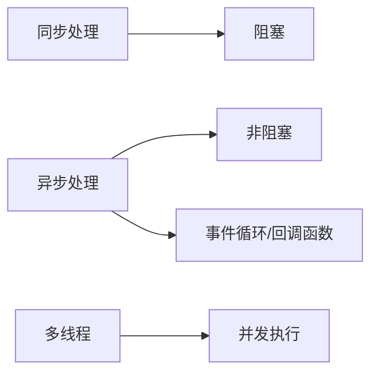

# 异步处理技术的最佳实践

## 1. 背景介绍

### 1.1 问题的由来

在当今互联网时代，用户对软件系统的性能和响应能力提出了越来越高的要求。传统的同步处理方式，在面对高并发、长耗时任务时，往往会造成系统资源的浪费，甚至导致系统崩溃。为了解决这些问题，异步处理技术应运而生，并逐渐成为构建高性能、高可扩展性应用系统的关键技术之一。

### 1.2 研究现状

目前，异步处理技术已经在各个领域得到了广泛应用，例如：

* **Web 开发**: 使用 AJAX 技术实现页面局部刷新，提升用户体验。
* **移动应用**: 使用异步任务处理网络请求、数据库操作等耗时操作，避免阻塞主线程。
* **云计算**: 使用消息队列、任务调度等技术实现分布式系统中的异步通信和任务处理。

### 1.3 研究意义

深入研究异步处理技术，掌握其最佳实践，对于构建高性能、高可扩展性、高可用的应用系统具有重要意义。

### 1.4 本文结构

本文将从以下几个方面对异步处理技术的最佳实践进行探讨：

* 核心概念与联系
* 核心算法原理 & 具体操作步骤
* 数学模型和公式 & 详细讲解 & 举例说明
* 项目实践：代码实例和详细解释说明
* 实际应用场景
* 工具和资源推荐
* 总结：未来发展趋势与挑战
* 附录：常见问题与解答

## 2. 核心概念与联系

### 2.1 同步处理与异步处理

* **同步处理**:  按照代码的编写顺序依次执行，每个操作必须等待上一个操作完成后才能开始执行。
* **异步处理**:  不阻塞当前线程，允许在等待耗时操作完成的同时执行其他任务，待耗时操作完成后再通知主线程进行处理。

### 2.2 阻塞与非阻塞

* **阻塞**:  当请求资源或执行操作时，线程会被挂起，直到资源准备就绪或操作完成。
* **非阻塞**:  当请求资源或执行操作时，线程不会被挂起，而是立即返回，可以继续执行其他任务。

### 2.3 多线程与异步

* **多线程**:  通过创建多个线程并发执行任务，以提高 CPU 利用率。
* **异步**:  不一定依赖多线程，可以通过事件循环、回调函数等机制实现。

**关系图:**



## 3. 核心算法原理 & 具体操作步骤

### 3.1 异步处理模型

常见的异步处理模型包括：

* **回调函数**:  将一个函数作为参数传递给另一个函数，当目标操作完成后，执行回调函数。
* **Promise**:  代表异步操作最终完成或失败的状态，可以链式调用 then() 和 catch() 方法处理结果。
* **async/await**:  使用同步的方式编写异步代码，提高代码可读性和可维护性。
* **响应式编程**:  基于数据流和事件驱动，通过观察者模式实现异步处理。

### 3.2 异步处理流程

以 Promise 为例，异步处理流程如下：

```mermaid
graph LR
    A[发起异步请求] --> B{Promise 对象}
    B -- 成功 --> C[then() 处理结果]
    B -- 失败 --> D[catch() 处理异常]
```

### 3.3 异步处理的优缺点

**优点:**

* 提高系统吞吐量和响应速度。
* 提升用户体验。
* 简化代码逻辑。

**缺点:**

* 调试难度增加。
* 代码可读性下降。
* 容易出现回调地狱问题。

### 3.4 异步处理的应用领域

* Web 前端开发
* 移动应用开发
* 后端服务开发
* 分布式系统
* 大数据处理

## 4. 数学模型和公式 & 详细讲解 & 举例说明

### 4.1 异步处理性能指标

* **吞吐量**:  单位时间内处理的请求数量。
* **响应时间**:  从发起请求到收到响应的时间间隔。
* **并发连接数**:  系统能够同时处理的请求数量。

### 4.2 异步处理性能优化方法

* **使用缓存**:  减少 I/O 操作，提高数据访问速度。
* **使用连接池**:  减少连接创建和销毁的开销。
* **使用异步日志**:  避免日志记录阻塞主线程。
* **使用消息队列**:  实现异步通信和任务处理。

### 4.3 案例分析

以电商网站为例，用户下单流程可以采用异步处理方式实现：

1. 用户提交订单后，系统立即返回成功信息。
2. 系统将订单信息发送到消息队列。
3. 后台服务监听消息队列，处理订单支付、库存扣减等操作。
4. 订单处理完成后，系统通过邮件或短信通知用户。

## 5. 项目实践：代码实例和详细解释说明

### 5.1 开发环境搭建

以 Node.js 为例，搭建异步处理开发环境：

1. 安装 Node.js
2. 创建项目目录
3. 初始化项目：`npm init -y`
4. 安装相关依赖：`npm install express axios`

### 5.2 源代码详细实现

```javascript
const express = require('express');
const axios = require('axios');

const app = express();

app.get('/api/data', async (req, res) => {
  try {
    // 模拟异步请求
    const response = await axios.get('https://example.com/api/data');
    res.json(response.data);
  } catch (error) {
    console.error(error);
    res.status(500).json({ message: 'Internal server error' });
  }
});

app.listen(3000, () => {
  console.log('Server listening on port 3000');
});
```

### 5.3 代码解读与分析

* 使用 `async/await` 语法实现异步处理。
* 使用 `axios` 库发送 HTTP 请求。
* 使用 `try...catch` 语句捕获异常。

### 5.4 运行结果展示

启动服务后，访问 `http://localhost:3000/api/data`，即可获取异步请求的数据。

## 6. 实际应用场景

* **电商平台**:  订单处理、支付、物流等。
* **社交网络**:  消息推送、好友动态更新等。
* **视频网站**:  视频上传、转码、播放等。
* **物联网**:  数据采集、设备控制等。

### 6.1 未来应用展望

* 随着 Serverless、边缘计算等技术的兴起，异步处理技术将在云计算领域发挥更重要的作用。
* 异步处理技术将与人工智能、大数据等技术深度融合，推动智能化应用的发展。

## 7. 工具和资源推荐

### 7.1 学习资源推荐

* [Async JavaScript](https://exploringjs.com/es2017-es2018/ch_async.html)
* [Promises/A+](https://promisesaplus.com/)

### 7.2 开发工具推荐

* **Node.js**:  JavaScript 运行环境。
* **Visual Studio Code**:  代码编辑器。
* **Postman**:  API 测试工具。

### 7.3 相关论文推荐

* [Asynchronous Programming in C# and .NET](https://docs.microsoft.com/en-us/dotnet/csharp/programming-guide/concepts/async/)

### 7.4 其他资源推荐

* [Awesome Asyncio](https://github.com/timofurrer/awesome-asyncio)

## 8. 总结：未来发展趋势与挑战

### 8.1 研究成果总结

异步处理技术是构建高性能、高可扩展性应用系统的关键技术之一。本文介绍了异步处理的核心概念、算法原理、最佳实践以及应用场景，并提供了代码实例和工具资源推荐。

### 8.2 未来发展趋势

* 异步处理技术将更加普及，应用场景更加广泛。
* 异步编程模型将更加简洁易用。
* 异步处理技术将与其他技术深度融合。

### 8.3 面临的挑战

* 异步处理的调试和测试难度较大。
* 异步编程模型的学习曲线较陡峭。
* 异步处理的性能优化需要不断探索。

### 8.4 研究展望

* 研究更加高效、易用的异步编程模型。
* 开发更加强大的异步处理工具和框架。
* 探索异步处理技术在人工智能、大数据等领域的应用。

## 9. 附录：常见问题与解答

### 9.1 什么是回调地狱？

回调地狱是指在异步编程中，由于多个回调函数嵌套调用，导致代码难以阅读和维护的问题。

### 9.2 如何避免回调地狱？

可以使用 Promise、async/await 等语法糖来避免回调地狱。

### 9.3 异步处理和多线程有什么区别？

异步处理不一定依赖多线程，可以通过事件循环、回调函数等机制实现。而多线程是通过创建多个线程并发执行任务，以提高 CPU 利用率。

作者：禅与计算机程序设计艺术 / Zen and the Art of Computer Programming 
