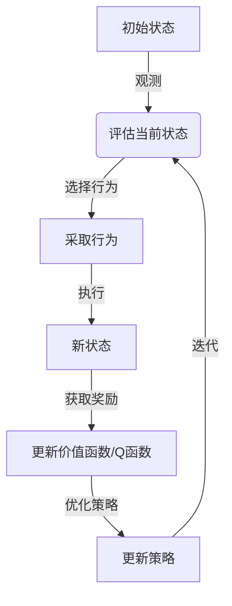

# 强化学习Reinforcement Learning在医疗健康领域的应用探索

## 1. 背景介绍

### 1.1 问题的由来

医疗健康领域一直是人类社会关注的重点领域之一。随着人口老龄化、生活方式改变以及新兴疾病的出现,医疗资源的合理分配和高效利用成为了一个亟待解决的问题。传统的医疗决策过程通常依赖于医生的经验和直觉,这种方式存在一定的主观性和局限性。因此,需要引入新的技术手段来优化医疗决策过程,提高医疗资源的利用效率。

强化学习(Reinforcement Learning,RL)作为机器学习的一个重要分支,在解决序列决策问题方面表现出了巨大的潜力。它通过与环境的交互来学习最优策略,不需要事先的标注数据,可以根据环境的反馈自主学习。这些特点使得强化学习在医疗健康领域具有广阔的应用前景。

### 1.2 研究现状

近年来,强化学习在医疗健康领域的应用研究日益活跃。研究人员将强化学习应用于多个医疗场景,如临床决策支持、医疗资源调度、智能辅助诊断等,取得了令人鼓舞的成果。例如,谷歌的DeepMind团队开发了一款基于强化学习的AI系统,能够根据患者的病史和症状推荐合理的治疗方案。另一项研究则利用强化学习优化了医院的床位分配策略,提高了资源利用率。

### 1.3 研究意义

将强化学习应用于医疗健康领域,可以带来以下潜在的积极影响:

1. **提高医疗决策质量**: 强化学习可以综合考虑多种因素,为医生提供科学、合理的决策建议,从而提高诊疗质量。

2. **优化医疗资源分配**: 通过建模和模拟,强化学习可以优化医疗资源(如医护人员、设备、病床等)的分配策略,提高资源利用效率。

3. **个性化治疗方案**: 强化学习可以根据患者的具体情况,制定个性化的治疗方案,实现精准医疗。

4. **降低医疗成本**: 优化的医疗决策和资源分配策略有助于降低不必要的医疗支出,从而降低整体医疗成本。

5. **促进医疗创新**: 强化学习为医疗领域带来了新的思路和方法,有助于推动医疗模式的创新。

### 1.4 本文结构

本文将全面探讨强化学习在医疗健康领域的应用。首先介绍强化学习的核心概念和基本原理,然后详细阐述其在医疗领域的具体应用场景,包括临床决策支持、医疗资源调度、智能辅助诊断等。接下来,我们将深入分析强化学习算法的数学模型和公式推导,并通过实例说明其实现过程。最后,我们将总结强化学习在医疗领域的发展趋势和面临的挑战,并给出相关的工具和资源推荐。

## 2. 核心概念与联系

强化学习(Reinforcement Learning,RL)是机器学习的一个重要分支,它致力于研究智能体(Agent)如何通过与环境(Environment)的交互来学习采取最优策略(Policy),以最大化累积奖励(Cumulative Reward)。

强化学习的核心概念包括:

1. **智能体(Agent)**: 指能够感知环境、采取行动并获得奖励的决策实体。在医疗场景中,智能体可以是一个软件系统或机器人。

2. **环境(Environment)**: 指智能体所处的外部世界,智能体通过与环境交互来获取信息和反馈。在医疗场景中,环境可以是病人的病史、症状、检查结果等信息。

3. **状态(State)**: 描述环境在某个时间点的具体情况。在医疗场景中,状态可以是患者的病情、生理指标等。

4. **行为(Action)**: 智能体在某个状态下采取的操作,如给予某种治疗方案。

5. **奖励(Reward)**: 环境对智能体行为的反馈,用于指导智能体学习。在医疗场景中,奖励可以是患者的康复程度、治疗费用等。

6. **策略(Policy)**: 智能体在每个状态下选择行为的规则或函数映射。强化学习的目标是找到一个最优策略,使得累积奖励最大化。

7. **价值函数(Value Function)**: 评估在某个状态下采取某个策略所能获得的长期累积奖励的函数。

8. **Q函数(Q-Function)**: 评估在某个状态下采取某个行为,之后按照某个策略继续执行所能获得的长期累积奖励的函数。

强化学习算法通过不断与环境交互、获取反馈奖励,来更新价值函数或Q函数,从而不断优化策略,最终找到最优策略。这个过程可以通过以下流程图来描述:



在医疗健康领域,强化学习可以应用于多个场景,如临床决策支持、医疗资源调度、智能辅助诊断等。通过构建合理的状态、行为、奖励函数,并采用适当的强化学习算法,智能体可以学习到最优的医疗决策策略,从而提高医疗质量和资源利用效率。

## 3. 核心算法原理 & 具体操作步骤

### 3.1 算法原理概述

强化学习算法的核心思想是通过与环境的交互,不断优化策略,使得长期累积奖励最大化。根据是否需要构建环境的模型,强化学习算法可以分为基于模型(Model-Based)和无模型(Model-Free)两大类。

#### 3.1.1 基于模型的强化学习算法

基于模型的强化学习算法首先需要构建环境的转移概率模型和奖励模型,然后利用这些模型进行规划和决策。常见的基于模型算法包括:

1. **动态规划(Dynamic Programming,DP)**: 适用于已知环境模型的情况,可以通过价值迭代或策略迭代等方法求解最优策略。

2. **蒙特卡罗树搜索(Monte Carlo Tree Search,MCTS)**: 通过构建搜索树,根据模拟结果评估每个节点的价值,从而选择最优行为。

基于模型的算法具有收敛性好、样本利用率高的优点,但需要事先构建精确的环境模型,在复杂环境中可能面临困难。

#### 3.1.2 无模型的强化学习算法

无模型的强化学习算法直接从与环境的交互中学习,不需要构建环境模型。常见的无模型算法包括:

1. **时序差分学习(Temporal Difference Learning,TD)**: 基于价值函数的更新,包括Q-Learning、Sarsa等算法。

2. **策略梯度(Policy Gradient)**: 直接对策略函数进行优化,包括REINFORCE、Actor-Critic等算法。

3. **深度强化学习(Deep Reinforcement Learning,DRL)**: 结合深度神经网络,用于近似价值函数或策略函数,包括DQN、A3C等算法。

无模型算法适用于复杂环境,但收敛性较差,需要大量的样本数据。

在医疗健康领域,由于环境的复杂性和不确定性,无模型算法(尤其是深度强化学习)被广泛采用。下面我们将重点介绍深度Q网络(Deep Q-Network,DQN)算法的具体原理和步骤。

### 3.2 算法步骤详解

DQN算法是将Q-Learning与深度神经网络相结合的无模型强化学习算法,可以有效解决传统Q-Learning在处理连续状态和高维行为空间时的困难。DQN算法的主要步骤如下:

#### 3.2.1 构建Q网络

DQN算法使用一个深度神经网络来近似Q函数,即$Q(s,a;\theta) \approx Q^*(s,a)$,其中$\theta$为网络参数。网络的输入为当前状态$s$,输出为每个可能行为$a$对应的Q值。

#### 3.2.2 经验回放(Experience Replay)

为了提高样本利用率和算法稳定性,DQN采用经验回放机制。具体做法是将智能体与环境的交互过程(状态、行为、奖励、下一状态)存储在经验回放池中,然后从中随机采样出一个批次的数据,用于训练Q网络。

#### 3.2.3 目标Q网络(Target Q-Network)

为了增加训练的稳定性,DQN使用了一个目标Q网络,用于计算目标Q值。目标Q网络的参数$\theta^-$是主Q网络参数$\theta$的拷贝,但更新频率较低。

#### 3.2.4 损失函数和优化

DQN的损失函数定义为:

$$J(\theta) = \mathbb{E}_{(s,a,r,s')\sim U(D)}\left[(r + \gamma\max_{a'}Q(s',a';\theta^-) - Q(s,a;\theta))^2\right]$$

其中,$U(D)$表示从经验回放池$D$中均匀采样,$\gamma$是折现因子。

通过梯度下降法优化损失函数,更新主Q网络的参数$\theta$:

$$\theta \leftarrow \theta - \alpha\nabla_\theta J(\theta)$$

其中,$\alpha$是学习率。

#### 3.2.5 目标Q网络更新

为了保持目标Q网络的相对稳定性,DQN算法每隔一定步数才会用主Q网络的参数$\theta$更新目标Q网络的参数$\theta^-$。

#### 3.2.6 $\epsilon$-贪婪策略(Epsilon-Greedy Policy)

在训练过程中,DQN采用$\epsilon$-贪婪策略来平衡探索和利用。具体来说,以$\epsilon$的概率随机选择一个行为(探索),以$1-\epsilon$的概率选择当前Q值最大的行为(利用)。$\epsilon$的值会随着训练的进行而逐渐减小。

以上就是DQN算法的主要步骤,可以用以下伪代码来总结:

```python
初始化主Q网络参数θ和目标Q网络参数θ^-
初始化经验回放池D
for episode in range(num_episodes):
    初始化状态s
    while not终止:
        选择行为a,根据ε-贪婪策略
        执行行为a,获得奖励r和新状态s'
        存储(s,a,r,s')到经验回放池D
        从D中采样一个批次的数据
        计算损失函数J(θ)
        通过梯度下降法优化θ
        每隔一定步数更新θ^-
    重置环境
```

### 3.3 算法优缺点

DQN算法相较于传统的Q-Learning算法,具有以下优点:

1. **处理高维状态和行为空间**: 通过深度神经网络近似Q函数,可以有效处理连续状态和高维行为空间。

2. **提高样本利用率和稳定性**: 采用经验回放和目标Q网络机制,提高了样本利用率和算法稳定性。

3. **无需构建环境模型**: 作为无模型算法,DQN不需要事先构建环境模型,可以直接从与环境的交互中学习。

4. **端到端学习**: DQN实现了从原始状态到最优行为的端到端学习,不需要人工设计特征。

然而,DQN算法也存在一些缺点和局限性:

1. **收敛性差**: 作为无模型算法,DQN的收敛性较差,需要大量的样本数据和训练时间。

2. **过估计问题**: Q值的过估计会导致算法不稳定,需要采取双Q学习等方法来缓解。

3. **离散行为空间**: DQN只能处理离散的行为空间,对于连续行为空间需要进行离散化处理。

4. **奖励函数设计**: 合理设计奖励函数对算法的性能有很大影响,需要一定的领域知识和经验。

5. **样本效率低下**: 虽然采用了经验回放,但DQN的样本效率仍然较低