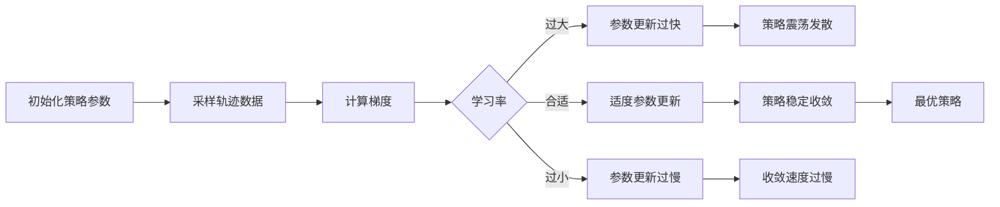

# 强化学习Reinforcement Learning学习率调整机制详解与应用

关键词：强化学习，学习率，自适应学习率，学习率衰减，学习率调整机制

## 1. 背景介绍
### 1.1  问题的由来
强化学习作为一种重要的机器学习范式，在智能决策、自动控制、机器人等领域有广泛的应用。然而，强化学习算法的性能和收敛速度很大程度上取决于学习率的选择。学习率过大会导致算法不稳定甚至发散，而学习率过小又会导致收敛速度过慢。因此，如何合理地设置和调整学习率是强化学习领域一个重要的研究问题。

### 1.2  研究现状
目前，强化学习中常用的学习率调整方法主要有以下几类：
1. 固定学习率：在整个训练过程中使用固定的学习率，简单但不够灵活。
2. 学习率衰减：随着训练的进行，按照一定的策略逐渐降低学习率，如指数衰减、阶梯衰减等。
3. 自适应学习率：根据训练过程中的反馈信息动态调整学习率，如AdaGrad、RMSProp、Adam等优化算法。
4. 元学习方法：通过元学习的方式自动学习适合当前任务的学习率。

### 1.3  研究意义
合理的学习率调整机制可以显著提升强化学习算法的性能和效率。通过自适应地调整学习率，可以加速算法收敛，提高稳定性，避免参数更新过大或过小的问题。这对于解决实际应用中的复杂决策问题具有重要意义。

### 1.4  本文结构 
本文将从以下几个方面对强化学习中的学习率调整机制进行详细阐述：
- 第2部分介绍强化学习中学习率的核心概念与作用机理。 
- 第3部分重点介绍几种典型的学习率调整算法，包括其原理、步骤和优缺点分析。
- 第4部分建立学习率调整的数学模型，并给出详细的公式推导与案例分析。
- 第5部分通过代码实例演示如何在强化学习项目中实现学习率调整。
- 第6部分讨论学习率调整在实际应用场景中的作用。
- 第7部分推荐学习率调整相关的学习资源、开发工具和文献。
- 第8部分总结全文，并对学习率调整的未来发展趋势与挑战进行展望。

## 2. 核心概念与联系
在强化学习中，学习率(Learning Rate)是一个控制每次参数更新幅度的超参数。学习率决定了每次迭代中，策略梯度或值函数等参数向目标函数负梯度方向更新的步长。学习率的取值通常在0到1之间，太大会导致参数更新过快而错过最优解，太小又会导致收敛速度过慢。

学习率与强化学习的其他核心概念密切相关：
- 探索与利用(Exploration and Exploitation)：学习率影响agent在探索新策略和利用已有策略之间的权衡。较大的学习率鼓励探索，较小的学习率倾向于利用。
- 值函数近似(Value Function Approximation)：在值函数近似中，学习率决定了每次参数更新的幅度，直接影响值函数的逼近效果和收敛速度。
- 策略梯度(Policy Gradient)：学习率控制每次策略参数沿着梯度方向更新的步长，过大的学习率会导致策略参数震荡。
- 经验回放(Experience Replay)：学习率影响从经验池中采样的数据对参数更新的贡献程度。

下图展示了学习率在强化学习训练过程中的作用：

## 3. 核心算法原理 & 具体操作步骤
本节重点介绍几种典型的强化学习学习率调整算法，包括固定学习率、学习率衰减和自适应学习率方法。

### 3.1  算法原理概述
#### 3.1.1 固定学习率
固定学习率是最简单的学习率设置方式，即在整个训练过程中学习率保持不变。尽管简单，但在实践中往往难以取得理想的效果，需要反复调试以寻找最优学习率。

#### 3.1.2 学习率衰减
学习率衰减是一种随着训练进程逐渐降低学习率的方法。其核心思想是，在训练初期使用较大的学习率以加速收敛，而在训练后期使用较小的学习率以实现精细调优并避免震荡。常见的衰减策略有：
- 指数衰减：$\alpha_t=\alpha_0 \cdot \gamma^t$，其中$\alpha_t$为第$t$步的学习率，$\alpha_0$为初始学习率，$\gamma$为衰减率。
- 阶梯衰减：每经过固定的步数，学习率乘以一个衰减因子。
- 余弦退火衰减：学习率按照余弦函数周期性变化。

#### 3.1.3 自适应学习率
自适应学习率方法根据训练过程中的梯度信息自动调整学习率，能够针对不同参数以不同速率进行自适应更新。代表性算法有：
- AdaGrad：根据历史梯度的平方和调整学习率，适合处理稀疏数据。
- RMSProp：结合AdaGrad和动量思想，对梯度进行指数加权平均。
- Adam：自适应矩估计，结合动量和自适应学习率的优点。

### 3.2  算法步骤详解
以下详细介绍几种典型算法的具体步骤。

#### 3.2.1 指数衰减
1. 设置初始学习率$\alpha_0$和衰减率$\gamma$。
2. 对于第$t$步迭代，计算当前学习率：$\alpha_t=\alpha_0 \cdot \gamma^t$。
3. 使用学习率$\alpha_t$更新模型参数。
4. 重复步骤2-3直到训练结束。

#### 3.2.2 AdaGrad
1. 设置初始学习率$\alpha$和小常数$\epsilon$。
2. 初始化梯度累积变量$r=0$。
3. 对于第$t$步迭代：
   - 计算梯度$g_t$。 
   - 更新梯度累积变量：$r_t=r_{t-1}+g_t^2$。
   - 计算自适应学习率：$\alpha_t=\frac{\alpha}{\sqrt{r_t+\epsilon}}$。
   - 使用学习率$\alpha_t$更新模型参数。
4. 重复步骤3直到训练结束。

#### 3.2.3 RMSProp
1. 设置初始学习率$\alpha$，衰减率$\rho$和小常数$\epsilon$。
2. 初始化梯度累积变量$r=0$。
3. 对于第$t$步迭代：
   - 计算梯度$g_t$。
   - 更新梯度累积变量：$r_t=\rho \cdot r_{t-1}+(1-\rho) \cdot g_t^2$。
   - 计算自适应学习率：$\alpha_t=\frac{\alpha}{\sqrt{r_t+\epsilon}}$。
   - 使用学习率$\alpha_t$更新模型参数。
4. 重复步骤3直到训练结束。

#### 3.2.4 Adam
1. 设置初始学习率$\alpha$，一阶矩估计衰减率$\beta_1$，二阶矩估计衰减率$\beta_2$和小常数$\epsilon$。
2. 初始化一阶矩估计$m=0$，二阶矩估计$v=0$，时间步$t=0$。
3. 对于第$t$步迭代：
   - 计算梯度$g_t$。
   - 更新一阶矩估计：$m_t=\beta_1 \cdot m_{t-1}+(1-\beta_1) \cdot g_t$。
   - 更新二阶矩估计：$v_t=\beta_2 \cdot v_{t-1}+(1-\beta_2) \cdot g_t^2$。
   - 修正一阶矩估计：$\hat{m}_t=\frac{m_t}{1-\beta_1^t}$。
   - 修正二阶矩估计：$\hat{v}_t=\frac{v_t}{1-\beta_2^t}$。
   - 计算自适应学习率：$\alpha_t=\frac{\alpha}{\sqrt{\hat{v}_t}+\epsilon} \cdot \hat{m}_t$。
   - 使用学习率$\alpha_t$更新模型参数。
4. 重复步骤3直到训练结束。

### 3.3  算法优缺点
- 固定学习率：
  - 优点：简单易实现，无需调参。
  - 缺点：难以适应不同阶段的训练需求，容易陷入局部最优或震荡。
- 学习率衰减：
  - 优点：通过逐渐降低学习率，在保证收敛的同时提高训练稳定性。
  - 缺点：需要手动设置衰减策略的超参数，如衰减率、衰减步长等。
- 自适应学习率：
  - 优点：根据梯度自动调整学习率，减少手动调参的需求，加速收敛。
  - 缺点：引入了额外的计算开销，部分算法对超参数较为敏感。

### 3.4  算法应用领域
学习率调整算法在强化学习的各个领域都有广泛应用，如：
- 值函数近似：使用自适应学习率算法，如Adam，可以加速值函数的收敛。
- 策略梯度：通过学习率衰减和自适应学习率，可以稳定策略梯度的训练过程。
- 深度强化学习：在处理高维状态空间时，自适应学习率算法有助于缓解梯度消失和梯度爆炸问题。
- 多智能体强化学习：通过为每个智能体设置独立的学习率，可以实现个性化的学习过程。

## 4. 数学模型和公式 & 详细讲解 & 举例说明
本节建立学习率调整的数学模型，并通过公式推导和案例分析加深理解。

### 4.1  数学模型构建
考虑一个标准的强化学习设置，智能体(agent)与环境(environment)交互，目标是最大化累积奖励。假设策略参数为$\theta$，值函数参数为$\phi$，则学习过程可以表示为：

$$
\begin{aligned}
\theta_{t+1} &= \theta_t + \alpha_t \cdot \nabla_\theta J(\theta_t) \\
\phi_{t+1} &= \phi_t + \alpha_t \cdot \nabla_\phi L(\phi_t)
\end{aligned}
$$

其中，$J(\theta)$为策略的目标函数，$L(\phi)$为值函数的损失函数，$\alpha_t$为第$t$步的学习率。学习率调整的目标是找到最优的学习率序列$\{\alpha_t\}$，使得参数能够快速、稳定地收敛到最优解。

### 4.2  公式推导过程
以下推导几种典型学习率调整算法的核心公式。

#### 4.2.1 指数衰减
指数衰减的学习率计算公式为：

$$
\alpha_t=\alpha_0 \cdot \gamma^t
$$

其中，$\alpha_0$为初始学习率，$\gamma$为衰减率，通常取值在0到1之间。当$\gamma=1$时，退化为固定学习率；当$\gamma$接近0时，学习率衰减速度加快。

#### 4.2.2 AdaGrad
AdaGrad的核心思想是为每个参数维度设置独立的学习率。其学习率更新公式为：

$$
\alpha_{t,i}=\frac{\alpha}{\sqrt{r_{t,i}+\epsilon}}
$$

其中，$\alpha$为初始学习率，$r_{t,i}$为第$i$维参数在前$t$步的梯度平方和：

$$
r_{t,i}=\sum_{\tau=1}^t g_{\tau,i}^2
$$

$\epsilon$为一个小常数，用于防止分母为零。A