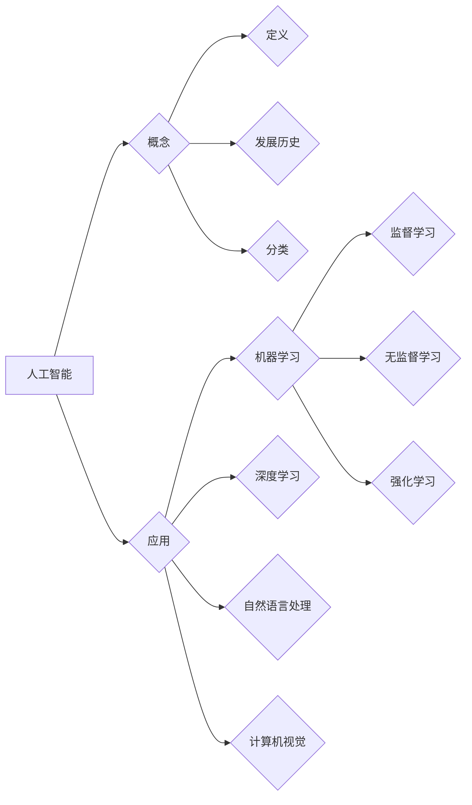

# 思维与表达：结构化的内在联系

作者：禅与计算机程序设计艺术 / Zen and the Art of Computer Programming 

## 1. 背景介绍

### 1.1 问题的由来

在当今信息爆炸的时代，清晰、有效地表达思想变得尤为重要。无论是撰写技术文档、进行学术研究，还是日常沟通，我们都需要将复杂的信息转化为易于理解的结构化表达。然而，思维与表达之间往往存在着一道难以逾越的鸿沟，许多人难以将脑海中的想法清晰地表达出来，导致信息传递效率低下，甚至造成误解。

### 1.2 研究现状

近年来，随着人工智能技术的快速发展，自然语言处理 (NLP) 领域取得了显著进展，例如机器翻译、文本摘要、问答系统等。然而，这些技术主要关注的是语言的处理和理解，而对思维与表达之间的深层联系研究不足。

### 1.3 研究意义

深入研究思维与表达之间的结构化联系，能够帮助我们更好地理解人类思维的运作机制，并开发出更有效的表达工具和方法。这将对提升信息传递效率、促进知识共享、推动科学进步具有重要意义。

### 1.4 本文结构

本文将从以下几个方面探讨思维与表达之间的结构化联系：

* **核心概念与联系：** 阐述思维与表达的本质，以及它们之间的相互影响关系。
* **结构化思维模型：** 介绍一种基于树形结构的思维模型，用于将复杂信息分解为易于理解的层次结构。
* **表达技巧与方法：** 总结一些常用的表达技巧和方法，帮助读者将思维转化为清晰、有效的表达。
* **案例分析与实践：** 通过实际案例分析，展示如何将结构化思维模型应用于不同的表达场景。
* **未来发展趋势：** 探讨思维与表达领域未来的发展方向和挑战。

## 2. 核心概念与联系

### 2.1 思维的本质

思维是指人类对客观事物的认识和理解过程，是人类大脑对信息的加工、处理和整合的过程。思维的本质是抽象、概括、推理和判断，它能够帮助我们理解世界、解决问题、做出决策。

### 2.2 表达的本质

表达是指将思维转化为语言、文字、图像等形式的过程，是将内在的思想传递给外部世界的过程。表达的本质是将抽象的思维转化为具体的符号，以便于他人理解和接受。

### 2.3 思维与表达的相互影响

思维与表达之间存在着密切的相互影响关系：

* **思维影响表达：** 思维决定了表达的内容和形式。清晰的思维能够产生清晰的表达，而混乱的思维则会导致表达含糊不清。
* **表达影响思维：** 表达的过程能够反过来促进思维的发展。通过将思维转化为表达，我们可以更清晰地认识到自己的想法，并进行更深入的思考和分析。

## 3. 结构化思维模型

### 3.1 算法原理概述

结构化思维模型是一种将复杂信息分解为易于理解的层次结构的方法。它通常采用树形结构，将信息按照逻辑关系进行分类和组织，使信息更加清晰、易于理解和记忆。

### 3.2 算法步骤详解

结构化思维模型的构建过程可以分为以下几个步骤：

1. **确定主题：** 明确要表达的主题或问题。
2. **分解主题：** 将主题分解为多个子主题或子问题。
3. **构建层次结构：** 将子主题或子问题按逻辑关系进行分类和组织，形成树形结构。
4. **添加细节：** 在每个节点上添加详细的信息，例如解释、例子、数据等。
5. **完善结构：** 检查整个结构是否清晰、完整、逻辑合理。

### 3.3 算法优缺点

**优点：**

* **清晰易懂：** 将复杂信息分解为层次结构，使信息更加清晰易懂。
* **逻辑合理：** 按照逻辑关系进行分类和组织，使信息更加有条理。
* **易于记忆：** 层次结构便于记忆和理解，提高信息吸收效率。

**缺点：**

* **构建过程可能比较复杂：** 需要对信息进行深入思考和分析。
* **可能存在冗余：** 某些信息可能在多个节点上重复出现。

### 3.4 算法应用领域

结构化思维模型可以应用于许多领域，例如：

* **技术文档写作：** 将复杂的技术概念分解为易于理解的层次结构。
* **学术研究：** 将研究问题分解为多个子问题，并构建研究框架。
* **项目管理：** 将项目目标分解为多个任务，并制定计划。
* **演讲和报告：** 将演讲内容组织成逻辑清晰的结构，提高演讲效果。

## 4. 数学模型和公式 & 详细讲解 & 举例说明

### 4.1 数学模型构建

结构化思维模型可以抽象为一个树形结构，每个节点代表一个子主题或子问题。我们可以使用树形结构的数学模型来描述结构化思维模型：

$$
T = (N, E)
$$

其中：

* $T$ 代表树形结构
* $N$ 代表节点集合
* $E$ 代表边集合

每个节点 $n \in N$ 可以表示为：

$$
n = (id, label, children)
$$

其中：

* $id$ 代表节点的唯一标识符
* $label$ 代表节点的标签，即子主题或子问题
* $children$ 代表该节点的子节点集合

### 4.2 公式推导过程

我们可以使用递归的方式来遍历树形结构，并获取每个节点的信息：

```python
def traverse(node):
  print(node.label)
  for child in node.children:
    traverse(child)
```

### 4.3 案例分析与讲解

**案例：** 假设我们要撰写一篇关于人工智能的科普文章，我们可以使用结构化思维模型来组织文章内容：



**讲解：**

* 主题：人工智能
* 子主题：概念、应用
* 子子主题：定义、发展历史、分类、机器学习、深度学习、自然语言处理、计算机视觉、监督学习、无监督学习、强化学习

### 4.4 常见问题解答

**问：** 如何选择合适的结构化思维模型？

**答：** 选择合适的结构化思维模型取决于要表达的主题和目标。例如，如果要表达一个复杂的概念，可以使用树形结构模型；如果要表达一个时间序列事件，可以使用时间线模型。

**问：** 如何构建一个有效的结构化思维模型？

**答：** 构建一个有效的结构化思维模型需要深入思考和分析信息，并按照逻辑关系进行分类和组织。

## 5. 项目实践：代码实例和详细解释说明

### 5.1 开发环境搭建

为了方便演示，我们将使用 Python 语言来实现结构化思维模型。首先，我们需要安装必要的库：

```bash
pip install graphviz
pip install pydotplus
```

### 5.2 源代码详细实现

```python
from graphviz import Digraph

class Node:
  def __init__(self, id, label, children=[]):
    self.id = id
    self.label = label
    self.children = children

def build_tree(root_id, root_label, nodes):
  root = Node(root_id, root_label)
  for node in nodes:
    if node.id == root_id:
      root.children.append(node)
  for child in root.children:
    build_tree(child.id, child.label, nodes)
  return root

def generate_graph(root):
  dot = Digraph(comment='Structure Tree')
  dot.node(root.id, root.label)
  for child in root.children:
    dot.node(child.id, child.label)
    dot.edge(root.id, child.id)
    generate_graph(child)
  return dot

if __name__ == '__main__':
  nodes = [
    Node('A', '人工智能'),
    Node('B', '概念', ['D', 'E', 'F']),
    Node('C', '应用', ['G', 'H', 'I', 'J']),
    Node('D', '定义'),
    Node('E', '发展历史'),
    Node('F', '分类'),
    Node('G', '机器学习', ['K', 'L', 'M']),
    Node('H', '深度学习'),
    Node('I', '自然语言处理'),
    Node('J', '计算机视觉'),
    Node('K', '监督学习'),
    Node('L', '无监督学习'),
    Node('M', '强化学习'),
  ]

  root = build_tree('A', '人工智能', nodes)
  dot = generate_graph(root)
  dot.render('structure_tree.gv', view=True)
```

### 5.3 代码解读与分析

* 代码首先定义了一个 `Node` 类，用于表示树形结构中的节点。
* `build_tree` 函数用于构建树形结构，它接收根节点的 ID、标签和所有节点的列表作为参数，并返回根节点。
* `generate_graph` 函数用于生成图形，它接收根节点作为参数，并使用 `graphviz` 库生成一个 `Digraph` 对象。
* 最后，代码创建了一个节点列表，并使用 `build_tree` 函数构建树形结构，然后使用 `generate_graph` 函数生成图形并显示。

### 5.4 运行结果展示

运行代码后，会生成一个名为 `structure_tree.gv` 的图形文件，该文件可以使用 `graphviz` 工具进行查看。图形文件展示了人工智能主题的树形结构，每个节点代表一个子主题或子问题。

## 6. 实际应用场景

### 6.1 技术文档写作

结构化思维模型可以帮助我们将复杂的技术概念分解为易于理解的层次结构，提高技术文档的可读性和易用性。

**例如：** 在撰写关于机器学习算法的文档时，我们可以使用结构化思维模型将算法的原理、步骤、优缺点、应用场景等信息进行分类和组织，使读者更容易理解和掌握算法知识。

### 6.2 学术研究

结构化思维模型可以帮助我们构建研究框架，将研究问题分解为多个子问题，并制定研究计划。

**例如：** 在进行一项关于深度学习的学术研究时，我们可以使用结构化思维模型将研究问题分解为多个子问题，例如深度学习的理论基础、模型架构、训练方法、应用场景等，并制定相应的研究计划。

### 6.3 项目管理

结构化思维模型可以帮助我们将项目目标分解为多个任务，并制定计划。

**例如：** 在进行一个软件开发项目时，我们可以使用结构化思维模型将项目目标分解为多个任务，例如需求分析、设计、编码、测试、部署等，并制定相应的计划和进度表。

### 6.4 未来应用展望

结构化思维模型在未来将会有更广泛的应用，例如：

* **人工智能辅助写作：** 人工智能可以帮助我们自动生成结构化思维模型，并根据模型自动生成文章内容。
* **知识图谱构建：** 结构化思维模型可以用于构建知识图谱，将知识按照逻辑关系进行组织和管理。
* **教育领域：** 结构化思维模型可以帮助学生更好地理解和记忆知识，提高学习效率。

## 7. 工具和资源推荐

### 7.1 学习资源推荐

* **书籍：**
    * 《结构化思维：如何像专家一样思考》
    * 《金字塔原理：如何构建清晰的逻辑思维》
    * 《思维导图：开启高效学习的秘密武器》
* **网站：**
    * [MindNode](https://www.mindnode.com/)
    * [XMind](https://www.xmind.net/)
    * [FreeMind](https://freemind.sourceforge.net/)

### 7.2 开发工具推荐

* **Python 库：**
    * `graphviz`
    * `pydotplus`
* **在线工具：**
    * [Mermaid](https://mermaid.js.org/)
    * [Draw.io](https://app.diagrams.net/)

### 7.3 相关论文推荐

* **结构化思维模型的应用：**
    * "A Structured Thinking Model for Software Development"
    * "Applying Structured Thinking to Business Problem Solving"
* **人工智能辅助写作：**
    * "AI-Assisted Writing: A Survey"
    * "Generative Pre-trained Transformer 3 for Text Generation"

### 7.4 其他资源推荐

* **思维导图软件：**
    * [MindManager](https://www.mindmanager.com/)
    * [MindMeister](https://www.mindmeister.com/)
* **在线思维导图工具：**
    * [Coggle](https://coggle.it/)
    * [Bubbl.us](https://bubbl.us/)

## 8. 总结：未来发展趋势与挑战

### 8.1 研究成果总结

本文探讨了思维与表达之间的结构化联系，介绍了一种基于树形结构的思维模型，并总结了一些常用的表达技巧和方法。通过案例分析和实践，展示了如何将结构化思维模型应用于不同的表达场景。

### 8.2 未来发展趋势

未来，思维与表达领域将继续朝着以下方向发展：

* **人工智能辅助思维：** 人工智能可以帮助我们分析信息、构建思维模型、生成表达内容。
* **个性化表达：** 不同的用户拥有不同的思维模式和表达习惯，未来将出现更加个性化的表达工具和方法。
* **跨语言表达：** 随着全球化进程的加快，跨语言表达将变得越来越重要，未来将出现更加智能的机器翻译系统，帮助人们进行跨语言沟通。

### 8.3 面临的挑战

思维与表达领域也面临着一些挑战：

* **思维的复杂性：** 人类思维是一个复杂的系统，难以完全用数学模型和算法来描述。
* **表达的歧义性：** 语言本身存在着歧义性，不同的理解可能导致不同的表达。
* **情感的表达：** 人类的情感是复杂的，难以用语言完全表达出来。

### 8.4 研究展望

未来，我们需要继续深入研究思维与表达之间的结构化联系，开发出更有效的表达工具和方法，帮助人们更好地理解世界、表达思想、传递信息。

## 9. 附录：常见问题与解答

**问：** 结构化思维模型是否适用于所有表达场景？

**答：** 结构化思维模型并非适用于所有表达场景，它更适合于表达复杂的信息和逻辑关系。对于一些简单的信息或情感表达，可能并不需要使用结构化思维模型。

**问：** 如何提高思维的清晰度？

**答：** 提高思维的清晰度需要多思考、多练习，并不断学习新的知识和技能。

**问：** 如何提高表达的效率？

**答：** 提高表达的效率需要掌握一些表达技巧和方法，例如：

* 使用简洁明了的语言
* 避免使用专业术语
* 运用例子和数据
* 组织逻辑清晰的结构

**问：** 如何克服表达障碍？

**答：** 克服表达障碍需要克服心理障碍，增强自信，并不断练习表达。

**问：** 如何学习结构化思维模型？

**答：** 学习结构化思维模型可以阅读相关书籍、参加培训课程，并通过实践进行练习。

**问：** 结构化思维模型与思维导图有什么区别？

**答：** 结构化思维模型和思维导图都是用于组织信息的方法，但它们侧重点不同。结构化思维模型更注重逻辑关系，而思维导图更注重视觉效果。

**问：** 如何使用结构化思维模型进行写作？

**答：** 使用结构化思维模型进行写作可以先构建一个思维模型，然后根据模型进行写作，确保文章结构清晰、逻辑合理。

**问：** 如何使用结构化思维模型进行演讲？

**答：** 使用结构化思维模型进行演讲可以先构建一个思维模型，然后根据模型进行演讲，确保演讲内容逻辑清晰、条理分明。

**问：** 结构化思维模型是否可以帮助我提高工作效率？

**答：** 结构化思维模型可以帮助你更好地理解问题、制定计划、组织信息，从而提高工作效率。

**问：** 结构化思维模型是否可以帮助我进行创新？

**答：** 结构化思维模型可以帮助你更好地分析问题、寻找解决方案，从而促进创新。

**问：** 结构化思维模型是否可以帮助我进行决策？

**答：** 结构化思维模型可以帮助你更好地分析信息、权衡利弊，从而做出更明智的决策。

**问：** 结构化思维模型是否可以帮助我进行学习？

**答：** 结构化思维模型可以帮助你更好地理解知识、构建知识体系，从而提高学习效率。

**问：** 结构化思维模型是否可以帮助我进行沟通？

**答：** 结构化思维模型可以帮助你更好地组织信息、表达观点，从而提高沟通效率。

**问：** 结构化思维模型是否可以帮助我进行生活？

**答：** 结构化思维模型可以帮助你更好地规划生活、解决问题，从而提高生活质量。

**问：** 结构化思维模型是否可以帮助我进行人生？

**答：** 结构化思维模型可以帮助你更好地思考人生、制定目标、实现梦想，从而过上更有意义的人生。

**作者：禅与计算机程序设计艺术 / Zen and the Art of Computer Programming** 
