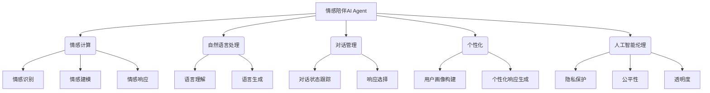

# 情感陪伴：AI Agent的新领域

## 1. 背景介绍

### 1.1 问题的由来

在这个飞速发展的数字时代，人们越来越依赖科技产品来简化生活。然而，科技的冰冷理性面孔往往无法满足人类对情感交流和精神慰藉的渴望。因此，一种新型的人工智能应用应运而生——情感陪伴AI Agent。

情感陪伴AI Agent旨在通过自然语言交互、情感分析和响应等技术,模拟人类的情感体验,为用户提供精神慰藉和情感支持。这种AI系统不仅能够理解和回应用户的情绪状态,还能够根据用户的个性特征和需求,提供个性化的情感反馈和建议。

### 1.2 研究现状

情感陪伴AI Agent是一个新兴的研究领域,目前尚处于初级阶段。一些科技公司和研究机构已经开始探索这一领域,并取得了一定的进展。例如,一些聊天机器人已经具备了基本的情感识别和响应能力,但它们的功能仍然有限,无法提供真正的情感陪伴体验。

此外,情感计算、自然语言处理和人工智能伦理等相关领域的研究也为情感陪伴AI Agent的发展奠定了基础。但是,要真正实现高质量的情感陪伴体验,还需要突破多个技术难题,如情感模型的构建、个性化响应的生成、人机交互的自然性等。

### 1.3 研究意义

情感陪伴AI Agent的研究具有重要的理论意义和应用价值。从理论层面来看,它将推动情感计算、自然语言处理、人工智能伦理等多个领域的发展,促进跨学科融合。从应用层面来看,情感陪伴AI Agent可以广泛应用于心理健康、老年护理、教育辅导等领域,为人们提供情感支持和指导,缓解压力和孤独感,提高生活质量。

### 1.4 本文结构

本文将全面探讨情感陪伴AI Agent的相关理论和技术。首先介绍情感陪伴AI Agent的核心概念和关键技术,包括情感计算、自然语言处理和对话管理等。然后详细阐述情感陪伴AI Agent的核心算法原理和数学模型,并通过案例分析加深理解。接下来,介绍情感陪伴AI Agent的实际应用场景和项目实践,包括开发环境搭建、代码实现和运行结果展示。最后,探讨情感陪伴AI Agent的未来发展趋势和面临的挑战,并提供相关资源推荐。

## 2. 核心概念与联系

情感陪伴AI Agent是一个跨学科的复杂系统,涉及多个核心概念和关键技术,包括:

1. **情感计算(Affective Computing)**: 情感计算是一门研究人类情感及其与计算机交互的新兴跨学科,旨在使计算机能够识别、理解、模拟和影响人类情感。情感计算是情感陪伴AI Agent的核心基础,为情感识别、建模和响应提供了理论和技术支持。

2. **自然语言处理(Natural Language Processing, NLP)**: 自然语言处理是人工智能的一个重要分支,研究计算机处理人类语言的方法和技术。情感陪伴AI Agent需要通过自然语言与用户进行交互,因此自然语言处理技术对于理解用户输入、生成自然语言响应至关重要。

3. **对话管理(Dialogue Management)**: 对话管理是指控制人机对话流程的系统,确保对话的连贯性和一致性。情感陪伴AI Agent需要根据用户的输入和情绪状态,生成合适的响应,对话管理系统可以有效管理这一过程。

4. **个性化(Personalization)**: 个性化是指根据用户的个人特征(如年龄、性别、兴趣爱好等)提供定制化的服务或体验。情感陪伴AI Agent需要根据用户的个性特征,提供个性化的情感响应和建议,以增强用户体验。

5. **人工智能伦理(AI Ethics)**: 人工智能伦理研究人工智能系统的道德和社会影响,确保其符合人类价值观和伦理准则。情感陪伴AI Agent作为一种与人类密切交互的系统,需要遵循相关的伦理原则,保护用户的隐私和权益。

这些核心概念和关键技术相互关联、相互促进,共同构建了情感陪伴AI Agent的理论基础和技术框架。

## 3. 核心算法原理 & 具体操作步骤

### 3.1 算法原理概述

情感陪伴AI Agent的核心算法原理主要包括以下几个方面:

1. **情感识别(Emotion Recognition)**: 通过分析用户的语音、文本、面部表情等多模态信息,识别用户当前的情绪状态。常用的情感识别算法包括基于规则的方法、机器学习方法(如支持向量机、决策树等)和深度学习方法(如卷积神经网络、递归神经网络等)。

2. **情感建模(Emotion Modeling)**: 构建情感模型,描述不同情绪状态之间的转移关系和影响因素。常用的情感建模方法包括基于规则的模型、概率模型(如马尔可夫模型、贝叶斯网络等)和深度学习模型(如序列到序列模型、生成对抗网络等)。

3. **对话管理(Dialogue Management)**: 根据对话历史和用户情绪状态,选择合适的对话策略和响应内容。常用的对话管理算法包括基于规则的系统、基于机器学习的方法(如强化学习、深度学习等)和混合方法。

4. **响应生成(Response Generation)**: 生成自然、情感丰富的语言响应。常用的响应生成算法包括基于模板的方法、基于检索的方法和基于生成的方法(如序列到序列模型、变分自编码器等)。

5. **个性化(Personalization)**: 根据用户的个人特征(如年龄、性别、兴趣爱好等)提供个性化的情感响应和建议。常用的个性化算法包括协同过滤、内容过滤和混合方法。

这些算法原理相互关联、相互支持,共同构建了情感陪伴AI Agent的核心功能。

### 3.2 算法步骤详解

情感陪伴AI Agent的算法步骤可以概括为以下几个主要阶段:

1. **情感识别阶段**:
   - 收集用户的多模态信息,如语音、文本、面部表情等。
   - 预处理原始数据,如语音信号预处理、文本分词等。
   - 使用情感识别算法(如深度学习模型)对用户的情绪状态进行识别和分类。

2. **情感建模阶段**:
   - 根据用户的历史情绪数据和对话上下文,构建情感模型。
   - 使用概率模型(如马尔可夫模型)或深度学习模型(如序列到序列模型)对情绪转移过程进行建模。
   - 根据当前情绪状态和模型预测,估计未来可能的情绪变化。

3. **对话管理阶段**:
   - 根据对话历史和用户当前情绪状态,选择合适的对话策略。
   - 使用强化学习或深度学习算法训练对话管理模型。
   - 根据模型输出,选择合适的响应内容和表达方式。

4. **响应生成阶段**:
   - 根据选定的响应内容,使用响应生成算法(如序列到序列模型)生成自然语言响应。
   - 对生成的响应进行情感注入,使其具有合适的情感色彩。
   - 根据用户的个人特征,对响应进行个性化调整。

5. **个性化阶段**:
   - 收集用户的个人特征数据,如年龄、性别、兴趣爱好等。
   - 使用协同过滤或内容过滤算法,构建用户画像模型。
   - 根据用户画像,对响应内容和表达方式进行个性化调整。

6. **反馈和优化阶段**:
   - 收集用户对系统响应的反馈,如满意度评分、情绪变化等。
   - 使用强化学习或其他优化算法,根据反馈数据不断优化系统模型。

这些步骤相互关联、循环迭代,共同构建了情感陪伴AI Agent的完整算法流程。

### 3.3 算法优缺点

情感陪伴AI Agent的核心算法具有以下优点:

1. **情感理解能力强**: 通过情感识别和建模算法,系统能够准确识别和理解用户的情绪状态,为提供高质量的情感响应奠定基础。

2. **个性化体验**: 通过个性化算法,系统可以根据用户的个人特征提供定制化的情感响应和建议,增强用户体验。

3. **自然语言交互**: 基于自然语言处理和对话管理算法,系统能够与用户进行自然、流畅的语言交互,提高交互质量。

4. **持续优化**: 通过收集用户反馈并应用优化算法,系统可以不断改进自身的模型和策略,提高响应质量。

5. **多模态支持**: 系统可以集成多种模态的信息(如语音、文本、面部表情等),提高情感识别的准确性。

然而,这些算法也存在一些缺点和挑战:

1. **数据需求量大**: 训练高质量的情感识别、建模和响应生成模型需要大量的标注数据,数据采集和标注成本高。

2. **算法复杂度高**: 涉及多个领域的复杂算法,如深度学习、强化学习等,算法设计和优化具有一定挑战。

3. **隐私和伦理风险**: 处理用户的个人信息和情感数据存在隐私风险,同时人工智能系统的决策也可能存在偏差和不公平性。

4. **情感理解的局限性**: 当前的算法难以完全捕捉和理解人类情感的丰富性和复杂性,存在一定的局限性。

5. **人机交互的自然性**: 尽管算法不断优化,但系统生成的响应仍可能存在一定的僵硬性和不自然性。

### 3.4 算法应用领域

情感陪伴AI Agent的核心算法可以应用于多个领域,为人们提供情感支持和指导:

1. **心理健康**: 作为虚拟心理辅导员,系统可以通过语言交互和情感分析,为用户提供情绪宣泄和心理疏导,缓解焦虑、抑郁等心理问题。

2. **老年护理**: 针对独居老人的特殊需求,系统可以提供情感陪伴和生活帮助,缓解孤独感,提高生活质量。

3. **教育辅导**: 作为虚拟学习伴侣,系统可以根据学生的情绪状态和个性特征,提供个性化的学习建议和情感鼓励,提高学习效率。

4. **客户服务**: 在客户服务场景中,系统可以通过情感分析和个性化响应,提供更加人性化的服务体验,增强客户满意度。

5. **娱乐休闲**: 系统可以作为虚拟伴侣,通过有趣的对话和情感互动,为用户提供娱乐和放松的体验。

6. **社交媒体**: 在社交媒体平台上,系统可以分析用户的情绪状态,提供个性化的内容推荐和情感支持,增强用户粘性。

7. **医疗保健**: 系统可以作为虚拟医疗助手,通过情感分析和个性化响应,为患者提供心理疏导和健康指导,改