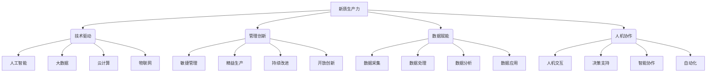
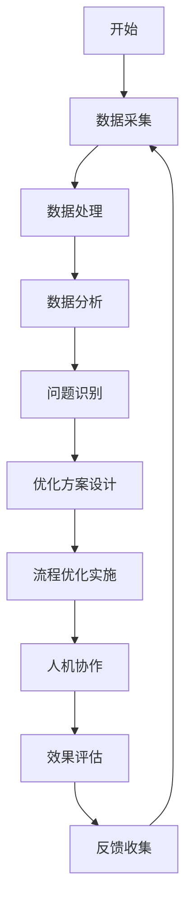

# 提升核心竞争力的新质生产力策略

## 1. 背景介绍

### 1.1 问题的由来

在当今瞬息万变的商业环境中,企业要想保持持续的竞争优势,仅仅依赖于传统的生产要素和生产方式是远远不够的。随着信息技术的飞速发展和知识经济的兴起,企业面临着前所未有的挑战和机遇。因此,如何提升企业的核心竞争力,实现高质量发展,成为了企业家和管理者亟需解决的重大课题。

### 1.2 研究现状  

目前,学术界和实践界对于提升企业核心竞争力的研究主要集中在以下几个方面:

1. 人力资本管理
2. 技术创新管理
3. 知识管理
4. 供应链管理
5. 企业文化建设

这些研究为企业提升核心竞争力提供了有益的理论指导和实践经验,但也存在一些不足,如缺乏系统性、整体性和前瞻性等。

### 1.3 研究意义

本文提出了"新质生产力"的概念,旨在从全新的视角来探讨提升企业核心竞争力的途径。"新质生产力"强调通过深度融合先进技术与管理创新,实现企业生产力的全面提升,从而获得持续的竞争优势。这一理念不仅具有重要的理论价值,而且对于指导企业实践具有重大的现实意义。

### 1.4 本文结构

本文共分为八个部分:

1. 背景介绍
2. 新质生产力的核心概念
3. 新质生产力的算法原理与步骤
4. 新质生产力的数学模型与公式推导
5. 新质生产力的项目实践与代码解析
6. 新质生产力的应用场景
7. 新质生产力的工具与资源推荐
8. 新质生产力的发展趋势与挑战

## 2. 核心概念与联系

新质生产力(New Quality Productivity)是一个集成了多个领域的综合性概念,它将先进技术(如人工智能、大数据、云计算等)与管理创新(如敏捷管理、精益生产等)深度融合,旨在实现企业生产力的全面提升。

新质生产力的核心要素包括:

新质生产力的核心理念是通过将先进技术与管理创新相结合,充分利用数据赋能,实现人机高效协作,从而全面提升企业的生产效率、产品质量、创新能力和决策水平,进而获得持续的竞争优势。

## 3. 核心算法原理与具体操作步骤

### 3.1 算法原理概述

新质生产力的算法原理基于系统思维和循环理论,旨在构建一个闭环的生产力提升体系。该体系由数据采集、处理、分析、应用和反馈五个环节组成,通过不断的迭代优化,实现生产力的持续提升。

算法的核心思想是:

1. 利用先进技术(如人工智能、大数据等)实现对生产过程的全面数据采集和处理;
2. 基于数据分析,发现生产过程中的问题和潜在机会;
3. 应用管理创新(如敏捷管理、精益生产等)优化生产流程,提高效率;
4. 通过人机协作,充分发挥人的创造力和机器的计算能力;
5. 收集优化后的数据,形成反馈,为下一轮迭代提供依据。

### 3.2 算法步骤详解

新质生产力算法的具体步骤如下:

1. **数据采集**: 利用物联网、传感器等技术,全面采集生产过程中的各种数据,包括设备运行状态、环境参数、人员行为等。
2. **数据处理**: 对采集的原始数据进行清洗、转换和集成,构建统一的数据平台。
3. **数据分析**: 基于大数据分析技术(如机器学习、深度学习等),对处理后的数据进行多维度分析,发现潜在的问题和机会。
4. **问题识别**: 根据数据分析结果,识别生产过程中存在的效率低下、质量问题、浪费等问题。
5. **优化方案设计**: 应用敏捷管理、精益生产等管理创新方法,设计针对性的优化方案。
6. **流程优化实施**: 在生产现场实施优化方案,优化生产流程。
7. **人机协作**: 发挥人的创造力和机器的计算能力,实现高效的人机协作,提高生产效率和质量。
8. **效果评估**: 评估优化方案的实施效果,并与预期目标进行对比。
9. **反馈收集**: 收集优化后的数据,形成反馈,为下一轮迭代提供依据。
10. **迭代优化**: 重复上述步骤,不断优化生产过程,实现生产力的持续提升。

### 3.3 算法优缺点

新质生产力算法的优点包括:

1. 系统性:将先进技术与管理创新有机结合,形成闭环体系,实现全面优化。
2. 持续性:通过不断迭代,实现生产力的持续提升。
3. 前瞻性:利用大数据分析,能够预测潜在问题并提前采取措施。
4. 灵活性:可根据具体情况调整优化方案,具有较强的适应性。

缺点包括:

1. 实施复杂度高:需要同时部署多种先进技术和管理创新方法,对企业的综合能力要求较高。
2. 数据质量依赖:算法的效果在很大程度上依赖于数据的质量和完整性。
3. 人力资源投入大:需要大量的数据分析人员和管理人员,人力成本较高。
4. 初期投入较大:建设数据平台、引入先进技术等需要大量的前期投入。

### 3.4 算法应用领域

新质生产力算法可以广泛应用于各个行业和领域,包括但不限于:

1. 制造业:优化生产流程,提高效率和质量。
2. 服务业:改进服务流程,提升客户体验。
3. 供应链管理:优化供应链运作,降低成本。
4. 项目管理:提高项目执行效率,控制风险。
5. 医疗健康:优化医疗流程,提高诊疗质量。
6. 教育培训:改进教学方式,提高教学效果。
7. 政府管理:优化政务流程,提高管理水平。

## 4. 数学模型和公式详细讲解与举例说明

### 4.1 数学模型构建

为了量化评估新质生产力的效果,我们构建了一个数学模型。该模型基于生产力的经典公式:

$$生产力 = \frac{产出}{投入}$$

在新质生产力模型中,我们将产出和投入分解为多个维度,并引入了一些新的变量,从而更准确地反映新质生产力的影响。

具体模型如下:

$$NQP = \frac{Q \times V}{C_m + C_l + C_e + C_r}$$

其中:

- $NQP$: 新质生产力指数
- $Q$: 产品质量指数
- $V$: 创新价值指数
- $C_m$: 原材料成本
- $C_l$: 人工成本
- $C_e$: 能源成本
- $C_r$: 其他资源成本

上述各个变量的计算方法如下:

1. 产品质量指数 $Q$:

   $$Q = \frac{1}{n}\sum_{i=1}^{n}q_i$$
   
   其中 $q_i$ 表示第 $i$ 个质量指标的得分,共有 $n$ 个质量指标,通过对各个指标进行加权求和得到综合质量指数。

2. 创新价值指数 $V$:

   $$V = \alpha_1 v_1 + \alpha_2 v_2 + \alpha_3 v_3$$
   
   其中 $v_1$ 表示技术创新指数, $v_2$ 表示管理创新指数, $v_3$ 表示商业模式创新指数,分别由相应的评分体系计算得到。$\alpha_1$、$\alpha_2$、$\alpha_3$ 为对应的权重系数,且 $\alpha_1 + \alpha_2 + \alpha_3 = 1$。

3. 各项成本 $C_m$、$C_l$、$C_e$、$C_r$ 按照企业的实际数据计算得到。

通过上述模型,我们可以综合考虑产品质量、创新能力和各项成本,从而全面评估新质生产力的效果。

### 4.2 公式推导过程

下面我们来推导上述模型中的一些重要公式:

1. 产品质量指数 $Q$ 的推导:

   设有 $n$ 个质量指标,分别记为 $q_1,q_2,...,q_n$,每个指标的权重为 $w_1,w_2,...,w_n$,且 $\sum_{i=1}^{n}w_i=1$。

   则综合质量指数可以表示为:

   $$Q = w_1q_1 + w_2q_2 + ... + w_nq_n = \sum_{i=1}^{n}w_iq_i$$

   为了简化计算,我们假设每个指标的权重相等,即 $w_i = \frac{1}{n}$,则上式可以化简为:

   $$Q = \frac{1}{n}\sum_{i=1}^{n}q_i$$

2. 创新价值指数 $V$ 的推导:

   创新价值指数包括技术创新、管理创新和商业模式创新三个方面,我们用 $v_1$、$v_2$、$v_3$ 分别表示它们的指数,则综合创新价值指数可以表示为:

   $$V = \alpha_1 v_1 + \alpha_2 v_2 + \alpha_3 v_3$$

   其中 $\alpha_1$、$\alpha_2$、$\alpha_3$ 为对应的权重系数,且 $\alpha_1 + \alpha_2 + \alpha_3 = 1$。

   权重系数的确定可以根据企业的战略重点和发展阶段来调整,例如对于科技型企业,可以适当提高 $\alpha_1$ 的权重;对于服务型企业,可以适当提高 $\alpha_2$ 的权重。

通过上述公式推导,我们可以更好地理解新质生产力模型中各个变量的含义和计算方法,为模型的应用奠定基础。

### 4.3 案例分析与讲解

为了更好地理解新质生产力模型的应用,我们以一家制造企业为例进行案例分析。

假设该企业生产某种电子产品,共有 5 个质量指标,分别为:

- 性能指标 $q_1 = 90$
- 可靠性指标 $q_2 = 85$
- 易用性指标 $q_3 = 92$
- 外观指标 $q_4 = 88$
- 环保指标 $q_5 = 94$

根据产品质量指数公式:

$$Q = \frac{1}{5}(90 + 85 + 92 + 88 + 94) = 89.8$$

该企业的创新价值指数评分如下:

- 技术创新指数 $v_1 = 80$
- 管理创新指数 $v_2 = 75$
- 商业模式创新指数 $v_3 = 