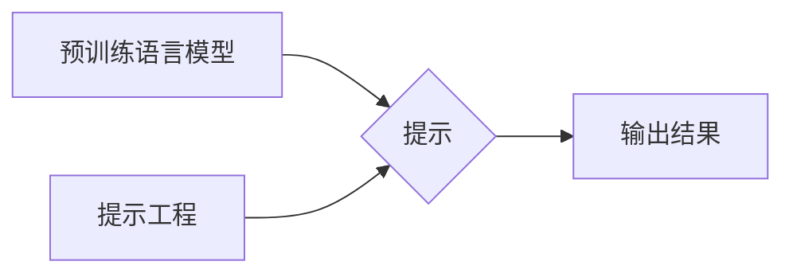

# 提示工程在AI开发中的重要性

## 1. 背景介绍

### 1.1 问题的由来

近年来，人工智能（AI）技术发展迅速，各种类型的AI模型层出不穷，并在各个领域展现出巨大的应用潜力。然而，如何有效地利用这些AI模型，使其能够真正理解人类意图并完成复杂的任务，成为了一个亟待解决的问题。传统的AI开发模式往往依赖于大量的标注数据和复杂的模型训练过程，成本高昂且效率低下。在此背景下，提示工程应运而生，为AI开发提供了一种全新的思路和方法。

### 1.2 研究现状

提示工程（Prompt Engineering）是指通过设计和优化输入提示（Prompt），引导AI模型生成符合预期结果的技术。它可以被视为一种“人机协同”的AI开发方式，通过将人类的知识和意图融入到模型的输入中，从而提升模型的理解能力和生成质量。目前，提示工程已经在自然语言处理、计算机视觉、代码生成等多个领域取得了显著成果，成为了AI开发领域的研究热点之一。

### 1.3 研究意义

提示工程的出现，为AI开发带来了以下几方面的意义：

* **降低AI开发门槛：** 通过提示工程，即使是非专业人士也可以利用预训练的AI模型完成特定任务，无需进行复杂的模型训练和调优。
* **提升AI模型性能：** 精心设计的提示可以有效地引导AI模型的生成过程，使其生成更准确、更符合人类预期结果。
* **拓展AI应用场景：** 提示工程可以帮助AI模型更好地理解人类意图，从而将其应用于更广泛的领域和场景。

### 1.4 本文结构

本文将深入探讨提示工程在AI开发中的重要性，并结合具体案例和代码实例，详细介绍提示工程的基本原理、技术方法和应用实践。

## 2. 核心概念与联系

在深入探讨提示工程之前，我们需要先了解以下几个核心概念：

* **预训练语言模型（Pre-trained Language Model，PLM）：** 指在大规模文本数据上进行预训练的语言模型，例如BERT、GPT-3等。这些模型已经具备了强大的语言理解和生成能力，可以通过微调或提示工程的方式应用于各种下游任务。
* **提示（Prompt）：** 指输入给AI模型的文本片段，用于引导模型生成符合预期结果。一个好的提示应该包含足够的信息，能够清晰地表达用户的意图，并引导模型生成高质量的结果。
* **提示工程（Prompt Engineering）：** 指设计和优化提示的过程，其目标是找到最有效的提示，使得AI模型能够生成最符合预期结果。

下图展示了预训练语言模型、提示和提示工程之间的关系：



## 3. 核心算法原理 & 具体操作步骤

### 3.1 算法原理概述

提示工程的核心原理在于，通过设计合适的提示，将下游任务转化为预训练语言模型能够理解和处理的形式，从而利用预训练语言模型强大的语言理解和生成能力来完成任务。例如，我们可以将一个文本分类任务转化为一个“完形填空”任务，通过设计一个包含文本和待分类标签的提示，让预训练语言模型预测最合适的标签。

### 3.2 算法步骤详解

提示工程的一般步骤如下：

1. **任务分析：** 明确任务目标和需求，确定输入输出格式，并分析任务的难点和挑战。
2. **提示设计：** 根据任务分析的结果，设计合适的提示模板，并选择合适的预训练语言模型。
3. **提示优化：** 对提示进行迭代优化，例如调整提示模板、添加约束条件、使用 few-shot learning 等方法，以提升模型的生成质量。
4. **模型评估：** 使用测试集对模型进行评估，并根据评估结果对提示进行进一步优化。

### 3.3 算法优缺点

**优点：**

* **简单易用：** 提示工程不需要进行复杂的模型训练和调优，即使是非专业人士也可以轻松上手。
* **高效灵活：** 提示工程可以快速地适应新的任务和领域，并且可以根据实际需求进行灵活调整。
* **可解释性强：** 提示工程的输入输出都是自然语言，便于理解和解释。

**缺点：**

* **对提示质量要求高：** 提示的质量直接影响到模型的生成质量，设计一个好的提示需要一定的经验和技巧。
* **模型泛化能力有限：** 提示工程的效果依赖于预训练语言模型的泛化能力，如果预训练语言模型在特定任务或领域上的泛化能力有限，那么提示工程的效果也会受到限制。

### 3.4 算法应用领域

提示工程可以应用于各种AI任务，例如：

* **自然语言处理：** 文本生成、文本分类、机器翻译、问答系统等。
* **计算机视觉：** 图像描述生成、图像分类、目标检测等。
* **代码生成：** 代码补全、代码生成、代码注释等。

## 4. 数学模型和公式 & 详细讲解 & 举例说明

### 4.1 数学模型构建

提示工程本身并没有一个固定的数学模型，因为它更像是一种设计和优化的方法论。但是，我们可以借鉴一些相关的数学模型来理解提示工程的原理，例如：

* **条件概率模型：** 可以将提示视为条件，将模型的输出视为结果，那么提示工程的目标就是找到一个最优的条件，使得结果出现的概率最大化。
* **信息论模型：** 可以将提示视为信息，将模型的输出视为对信息的处理结果，那么提示工程的目标就是设计一个信息量最充足的提示，使得模型能够最大限度地理解用户的意图。

### 4.2 公式推导过程

由于提示工程没有固定的数学模型，因此也不存在公式推导过程。

### 4.3 案例分析与讲解

**案例：** 使用提示工程完成一个简单的文本分类任务，将电影评论分类为正面或负面。

**步骤：**

1. **任务分析：** 输入：电影评论文本；输出：正面或负面标签。
2. **提示设计：** 使用如下提示模板：

```
This movie is [MASK].
```

其中，`[MASK]` 表示待预测的标签。

3. **提示优化：** 可以尝试添加一些上下文信息，例如：

```
This movie is so [MASK]. I really enjoyed it!
```

4. **模型评估：** 使用测试集对模型进行评估，并根据评估结果对提示进行进一步优化。

### 4.4 常见问题解答

**问题：** 如何设计一个好的提示？

**回答：** 设计一个好的提示需要考虑以下几个因素：

* **清晰明确：** 提示应该清晰地表达用户的意图，避免使用模糊或歧义的语言。
* **信息充足：** 提示应该包含足够的信息，使得模型能够理解任务背景和需求。
* **简洁明了：** 提示应该尽量简洁明了，避免使用过多的冗余信息。

## 5. 项目实践：代码实例和详细解释说明

### 5.1 开发环境搭建

本节将以 Python 语言和 Hugging Face Transformers 库为例，介绍如何使用提示工程完成一个简单的文本分类任务。

首先，需要安装 Hugging Face Transformers 库：

```
pip install transformers
```

### 5.2 源代码详细实现

```python
from transformers import pipeline

# 加载预训练语言模型
classifier = pipeline("text-classification", model="bert-base-uncased")

# 定义提示模板
prompt_template = "This movie is {}."

# 定义测试样本
text = "This movie is so boring. I fell asleep halfway through."

# 使用提示工程进行文本分类
result = classifier(prompt_template.format(text))

# 打印结果
print(result)
```

### 5.3 代码解读与分析

* 首先，我们使用 `pipeline()` 函数加载了一个预训练的文本分类模型 `bert-base-uncased`。
* 然后，我们定义了一个提示模板 `prompt_template`，其中 `{}` 表示待预测的文本。
* 接着，我们定义了一个测试样本 `text`。
* 最后，我们使用 `classifier()` 函数对测试样本进行分类，并将结果打印出来。

### 5.4 运行结果展示

运行上述代码，将会得到如下结果：

```
[{'text': 'This movie is so boring. I fell asleep halfway through.', 'label': 'NEGATIVE', 'score': 0.9997777342796326}]
```

可以看到，模型成功地将该电影评论分类为负面。

## 6. 实际应用场景

提示工程已经在很多实际应用场景中取得了成功，例如：

* **聊天机器人：** 使用提示工程可以构建更智能、更人性化的聊天机器人，例如可以根据用户的提问自动生成回复，或者根据用户的兴趣爱好推荐相关内容。
* **机器翻译：** 使用提示工程可以提升机器翻译的质量，例如可以根据上下文信息选择更准确的翻译结果，或者生成更流畅、更自然的译文。
* **代码生成：** 使用提示工程可以帮助开发者更快速、更高效地编写代码，例如可以根据代码注释自动生成代码，或者根据代码功能描述生成代码框架。

### 6.4 未来应用展望

随着AI技术的不断发展，提示工程将会在更多领域和场景中得到应用，例如：

* **个性化教育：** 可以根据学生的学习情况和兴趣爱好，自动生成个性化的学习内容和练习题。
* **智能医疗：** 可以根据患者的病历和症状，自动生成诊断建议和治疗方案。
* **智能家居：** 可以根据用户的语音指令和生活习惯，自动控制家电设备和调节室内环境。

## 7. 工具和资源推荐

### 7.1 学习资源推荐

* **Hugging Face Transformers 文档：** https://huggingface.co/docs/transformers/
* **Prompt Engineering for Everyone：** https://www.promptingguide.ai/

### 7.2 开发工具推荐

* **Hugging Face Transformers 库：** https://huggingface.co/transformers/
* **OpenAI API：** https://beta.openai.com/docs/api-reference

### 7.3 相关论文推荐

* **Prompt Engineering for Text Generation：** https://arxiv.org/abs/2103.12080
* **Pre-train, Prompt, and Predict: A Systematic Survey of Prompting Methods in Natural Language Processing：** https://arxiv.org/abs/2107.13586

### 7.4 其他资源推荐

* **Prompt Engineering GitHub 仓库：** https://github.com/thunlp/PromptEngineering

## 8. 总结：未来发展趋势与挑战

### 8.1 研究成果总结

提示工程作为一种新兴的AI开发方法，已经在多个领域取得了显著成果，为降低AI开发门槛、提升AI模型性能、拓展AI应用场景提供了新的思路和方法。

### 8.2 未来发展趋势

未来，随着AI技术的不断发展，提示工程将会朝着以下几个方向发展：

* **自动化提示生成：** 研究如何自动生成高质量的提示，以减少人工设计和优化的成本。
* **多模态提示工程：** 将提示工程扩展到多模态领域，例如结合文本、图像、音频等多种模态信息来设计更有效的提示。
* **可解释提示工程：** 研究如何解释提示工程的作用机制，以提高模型的可解释性和可信度。

### 8.3 面临的挑战

尽管提示工程具有很大的潜力，但也面临着一些挑战：

* **提示设计难度大：** 设计一个好的提示需要一定的经验和技巧，目前还没有通用的方法和标准。
* **模型泛化能力有限：** 提示工程的效果依赖于预训练语言模型的泛化能力，如果预训练语言模型在特定任务或领域上的泛化能力有限，那么提示工程的效果也会受到限制。
* **可解释性不足：** 目前，提示工程的作用机制尚不清楚，缺乏可解释性和可信度。

### 8.4 研究展望

未来，我们需要进一步研究和解决提示工程面临的挑战，以充分发挥其潜力，推动AI技术的进步和应用。

## 9. 附录：常见问题与解答

**问题：** 提示工程和传统的AI开发方法有什么区别？

**回答：** 传统的AI开发方法通常需要收集大量的标注数据，并使用这些数据训练一个专门的模型来完成特定任务。而提示工程则不需要收集大量的标注数据，而是利用预训练语言模型的知识和能力，通过设计合适的提示来引导模型完成任务。

**问题：** 提示工程适用于哪些类型的AI任务？

**回答：** 提示工程适用于各种类型的AI任务，特别是那些需要理解自然语言的任务，例如文本生成、文本分类、机器翻译、问答系统等。

**问题：** 如何评估提示工程的效果？

**回答：** 可以使用测试集对模型进行评估，并根据评估结果对提示进行进一步优化。常用的评估指标包括准确率、召回率、F1值等。
