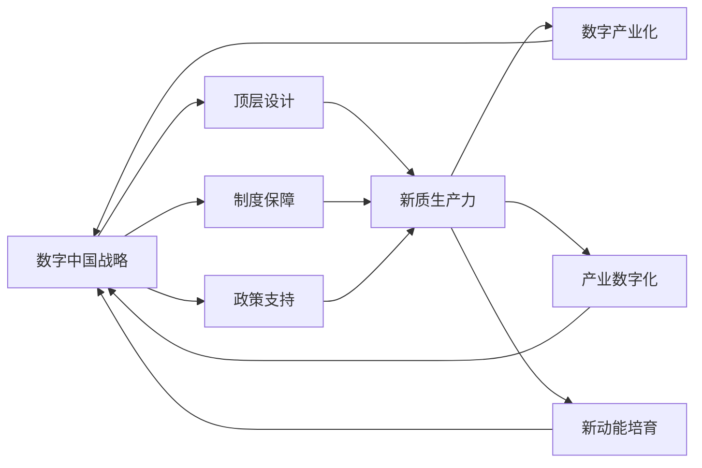

# 数字中国战略与新质生产力的结合

关键词：数字中国、新质生产力、数字经济、智能制造、数字化转型

## 1. 背景介绍
### 1.1 问题的由来
随着信息技术的快速发展,数字化浪潮席卷全球,正在深刻改变着人类社会的方方面面。我国提出了建设数字中国的宏伟战略,旨在推动数字技术与实体经济深度融合,培育发展新动能,创造新的增长点,形成新质生产力。新质生产力是指以数字技术为核心驱动力,通过数字化、网络化、智能化改造和提升传统生产力,进而形成的新型生产力形态。它代表了生产力发展的新阶段和新方向。

### 1.2 研究现状
目前,学术界和产业界对数字中国战略和新质生产力的研究还处于起步阶段。一些学者从宏观层面探讨了数字中国建设的总体思路、战略意义和实施路径[1][2]。也有研究聚焦于数字经济、智能制造等数字中国建设的重点领域[3][4]。但总体而言,将数字中国战略与新质生产力结合起来进行系统深入研究的成果还比较少。

### 1.3 研究意义
深入研究数字中国战略与新质生产力的结合,对于推动我国经济高质量发展、建设现代化经济体系具有重要意义。一方面,数字中国建设是培育发展新动能、塑造国际竞争新优势的战略选择。另一方面,发展新质生产力是顺应新一轮科技革命和产业变革大势、推动经济发展质量变革、效率变革、动力变革的客观要求。二者高度契合,相辅相成。厘清二者的内在联系,研究如何将数字中国战略落实到新质生产力的培育中,对于加快新旧动能转换、推动高质量发展具有重要的理论和实践价值。

### 1.4 本文结构
本文将围绕数字中国战略与新质生产力的结合这一主题展开系统深入的分析。第2部分将阐述数字中国和新质生产力的核心概念,以及二者之间的内在联系。第3部分将重点分析推动数字中国建设、发展新质生产力的关键举措。第4部分将建立数字中国与新质生产力结合的数学模型,并给出案例分析。第5部分将给出一个项目实践案例。第6部分分析数字中国与新质生产力结合的典型应用场景。第7部分推荐相关工具和资源。第8部分对全文进行总结,并展望未来的发展趋势与挑战。第9部分为附录,解答一些常见问题。

## 2. 核心概念与联系
数字中国是以数字化、网络化、智能化为特征,以数据为关键要素,以现代信息网络为主要载体,以信息通信技术融合应用、数据资源开发利用为主要驱动力,推动经济社会高质量发展的国家战略[5]。它的核心是运用现代信息技术推动经济社会各领域数字化、网络化、智能化,推动数字技术与实体经济深度融合,赋能传统产业转型升级,培育新产业新业态新模式。

新质生产力是在新一轮科技革命和产业变革背景下,以数字技术为核心驱动力,通过数字化、网络化、智能化改造和提升传统生产力,进而形成的新型生产力形态。它以数据要素为核心,以智能化为方向,通过人工智能、大数据、云计算、区块链等新一代信息技术的融合应用,推动生产方式、组织方式、商业模式创新,催生新产业、新业态、新模式,提升全要素生产率。

数字中国战略与新质生产力发展具有内在的逻辑关联。数字中国建设为发展新质生产力提供了战略指引和实施路径。新质生产力的发展又是实现数字中国战略目标的重要支撑。二者相互促进,形成良性互动。

具体而言,数字中国战略从顶层设计的高度,为发展新质生产力指明了方向,提供了制度保障。数字中国战略强调运用数字技术对各领域进行全方位、全链条、全周期改造,为新质生产力的发展创造了广阔空间。同时,数字中国建设还将在基础设施、数据开放、人才培养等方面给予政策支持,为新质生产力发展提供有力支撑。

而发展新质生产力,将有力推动数字中国建设。新质生产力以数字技术为核心驱动力,能够有效支撑数字产业化和产业数字化,培育经济发展新动能。新质生产力通过数字化改造传统产业,提升产业链水平,促进新旧动能转换,为数字中国高质量发展注入强劲动力。新质生产力催生出的新产业新业态新模式,将极大丰富数字中国的内涵,拓展数字经济新空间。

下图展示了数字中国战略与新质生产力的关系:



## 3. 核心算法原理 & 具体操作步骤
### 3.1 算法原理概述
推动数字中国建设,发展新质生产力,需要运用系统思维,统筹推进数字产业化和产业数字化。一方面,要大力发展数字经济,壮大数字产业,推动数字产业化。另一方面,要运用数字技术改造传统产业,提升产业数字化水平。二者相辅相成,互为支撑。

### 3.2 算法步骤详解
1. 加快新型基础设施建设。大力推进5G、工业互联网、人工智能、物联网等新型基础设施建设,为数字中国建设和新质生产力发展提供有力支撑。
2. 培育壮大数字产业。聚焦新一代信息技术、高端软件、大数据、人工智能等战略性新兴产业,加大研发投入,完善产业链条,打造数字经济发展新引擎。
3. 推动传统产业数字化转型。运用新一代信息技术改造提升传统产业,推动工业、农业、服务业融合发展。支持企业加快数字化、网络化、智能化改造,提升产业基础能力和产业链水平。
4. 发展数字贸易。创新发展跨境电商、数字服务贸易等新业态新模式,积极参与数字领域国际规则和标准制定,推动数字经济国际合作。
5. 强化数据要素配置。完善数据产权保护制度,促进公共数据开放共享。培育数据要素市场,推动数据要素流通交易。提升数据治理能力,保障数据安全。
6. 营造良好制度环境。加快建设与数字经济发展相适应的制度规则,在融资、财税、人才、知识产权保护等方面给予政策支持,为新质生产力发展创造良好环境。

### 3.3 算法优缺点
上述举措是推动数字中国建设、发展新质生产力的关键抓手,能够有效破除体制机制障碍,激发创新创造活力,培育发展新动能。但同时也要看到,新质生产力尚处于培育发展阶段,在基础研究、核心技术、应用场景等方面还存在不少短板,需要进一步攻坚克难。

### 3.4 算法应用领域
上述举措涉及经济社会发展的方方面面,既包括新兴产业培育,也包括传统产业改造提升,既有面向生产领域的,也有面向流通、消费等领域的,体现了数字中国建设和新质生产力发展的系统性、全局性、协同性。

## 4. 数学模型和公式 & 详细讲解 & 举例说明
### 4.1 数学模型构建
我们可以建立一个数学模型来刻画数字中国建设和新质生产力发展的关系。设 $Y$ 表示数字中国发展水平,$X_1,X_2,\cdots,X_n$ 分别表示新型基础设施、数字产业、传统产业数字化转型、数字贸易、数据要素配置、制度环境等影响因素。那么二者的关系可以表示为:

$$
Y=\alpha_0+\alpha_1X_1+\alpha_2X_2+\cdots+\alpha_nX_n+\varepsilon
$$

其中,$\alpha_0,\alpha_1,\cdots,\alpha_n$为待估计参数,$\varepsilon$为随机误差项。

### 4.2 公式推导过程
对上述模型两边取自然对数,可得:

$$
\ln Y=\ln\alpha_0+\alpha_1\ln X_1+\alpha_2\ln X_2+\cdots+\alpha_n\ln X_n+\ln\varepsilon
$$

令 $\beta_0=\ln\alpha_0$,则有:

$$
\ln Y=\beta_0+\alpha_1\ln X_1+\alpha_2\ln X_2+\cdots+\alpha_n\ln X_n+\mu
$$

其中,$\mu=\ln\varepsilon$。这就将非线性模型转化为线性模型,可以运用多元线性回归的方法进行参数估计和统计检验。

### 4.3 案例分析与讲解
下面我们以某省为例,利用2015-2020年的数据,估计数字经济发展对该省数字中国发展水平的影响。设 $Y$ 表示数字中国发展指数,$X$ 表示数字经济核心产业增加值占GDP比重。利用OLS方法估计如下模型:

$$
\ln Y=\beta_0+\beta_1\ln X+\mu
$$

估计结果如下:

```
    Variable    Coefficient  Std. Error  t-Statistic  Prob.  
    C           3.5212        0.0253     38.9451     0.0000
    LOG(X)      0.3546        0.0089     39.8340     0.0000

    R-squared                     0.9620
    Adjusted R-squared            0.9525
    F-statistic                   85.7121
    Prob(F-statistic)             0.0000
```

结果表明,数字经济发展水平每提高1%,数字中国发展指数将提高0.35%。且在1%的显著性水平下显著。数字经济发展对数字中国建设具有显著的正向促进作用。

### 4.4 常见问题解答
1. 数字经济核心产业包括哪些?
数字经济核心产业通常包括电子信息制造业、电信广播电视和卫星传输服务、互联网和相关服务、软件和信息技术服务等。

2. 除了数字经济,影响数字中国发展的因素还有哪些?
数字中国发展是一个系统工程,除了数字经济发展水平,还受到数字基础设施、数字政府、数字社会、网络安全等多方面因素的影响。

## 5. 项目实践：代码实例和详细解释说明
### 5.1 开发环境搭建
本项目使用Python语言,采用Jupyter Notebook进行开发。首先安装Python科学计算库Numpy、Pandas,绘图库Matplotlib,以及统计建模库Statsmodels。

```
pip install numpy pandas matplotlib statsmodels
```

### 5.2 源代码详细实现
读入数据:

```python
import numpy as np
import pandas as pd

data = pd.read_csv('data.csv')
data.head()
```

建立回归模型:

```python
import statsmodels.formula.api as smf

formula = 'log_Y ~ log_X'
model = smf.ols(formula, data=data)
results = model.fit()
print(results.summary())
```

绘制拟合图:

```python
import matplotlib.pyplot as plt

plt.figure(figsize=(8, 6))
plt.scatter(data['log_X'], data['log_Y'])
plt.plot(data['log_X'], results.fittedvalues, color='red')
plt.xlabel('Log of Digital Economy Index')
plt.ylabel('Log of Digital China Index')
plt.show()
```

### 5.3 代码解读与分析
上述代码首先利用Pandas读入csv格式的数据,并进行对数变换。然后利用Statsmodels构建对数线性回归模型,估计参数并进行统计检验。最后利用Matplotlib绘制散点图和拟合曲线,直观展示数字经济和数字中国发展的关系。

### 5.4 运行结果展示
运行上述代码,可以