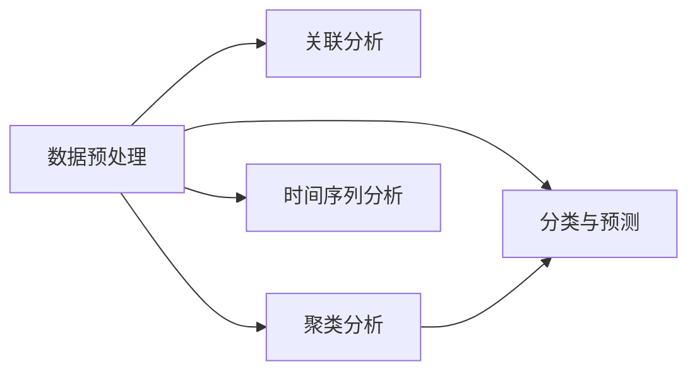

# 数据挖掘 原理与代码实例讲解

## 1. 背景介绍
### 1.1  问题的由来
在当今大数据时代,海量数据正以前所未有的速度增长。然而,如何从这些海量数据中挖掘出有价值的信息和知识,成为了摆在我们面前的一个重大课题。数据挖掘技术应运而生,它为从大规模数据中发现隐藏的模式和知识提供了有力的工具和方法。

### 1.2  研究现状
近年来,数据挖掘领域得到了蓬勃发展。各种新的算法和模型不断涌现,如关联规则挖掘、聚类分析、分类预测等,在理论和应用层面都取得了显著进展。同时,数据挖掘技术也被广泛应用于各个领域,如金融、电商、医疗、社交网络等,为这些行业带来了巨大的价值。

### 1.3  研究意义
深入研究数据挖掘的原理和实践,对于培养数据分析人才,推动大数据产业发展具有重要意义。通过系统全面地介绍数据挖掘的核心概念、经典算法、数学模型以及代码实现,可以帮助读者快速掌握数据挖掘的理论知识和实践技能,为未来从事数据挖掘相关工作打下坚实基础。

### 1.4  本文结构
本文将围绕数据挖掘展开深入探讨,内容涵盖:
- 数据挖掘的核心概念与内在联系
- 经典数据挖掘算法的原理和操作步骤
- 数据挖掘常用数学模型和公式推导
- 数据挖掘项目实践,包括代码实例和详细解读
- 数据挖掘的实际应用场景
- 数据挖掘学习和开发工具推荐
- 对数据挖掘未来趋势和挑战的思考
- 常见问题解答

## 2. 核心概念与联系

数据挖掘涉及的核心概念主要包括:
- 数据预处理:包括数据清洗、集成、变换、归约等,旨在提高数据质量,为挖掘奠定基础。
- 关联分析:发现数据项之间的关联模式,如购物篮分析。
- 聚类分析:把相似的对象归到同一个簇中,使簇内相似度大而簇间相似度小。
- 分类与预测:构建分类模型,根据数据的特征预测其所属类别。代表算法有决策树、朴素贝叶斯等。
- 时间序列分析:分析时间相关的数据,进行趋势预测等。

这些概念之间并非孤立,而是相互关联、互为补充的。比如,聚类分析可作为分类的前处理步骤,时间序列分析常与预测任务结合等。理解它们的内在联系,有助于在实践中灵活运用。



## 3. 核心算法原理 & 具体操作步骤
### 3.1  算法原理概述
数据挖掘涉及多种算法,本节重点介绍几种经典算法的基本原理:
- Apriori算法:用于发现频繁项集和关联规则,基于先验知识,通过迭代产生频繁项集。
- K-means算法:一种基于划分的聚类算法,通过迭代寻找K个簇,使得簇内对象相似度高而簇间相似度低。
- 决策树算法:一种分类算法,通过if-then规则递归地构建树模型。代表算法有ID3,C4.5等。

### 3.2  算法步骤详解
以K-means算法为例,其具体步骤如下:
1. 随机选择K个初始聚类中心
2. 重复下列过程直到收敛:
   - 对每个样本,计算其到各个中心的距离,并划分到距离最近的簇
   - 更新每个簇的聚类中心为该簇所有样本的均值向量
3. 输出最终的K个簇

### 3.3  算法优缺点
- Apriori算法:
  - 优点:原理简单,易于实现;可以发现所有频繁项集
  - 缺点:当事务和项目很多时,计算开销大
- K-means算法:
  - 优点:原理简单,收敛速度快;聚类效果较好
  - 缺点:需要预先指定K值;对噪声和异常点敏感
- 决策树算法:  
  - 优点:可解释性强,易于理解;能处理多种类型特征
  - 缺点:容易过拟合;对缺失值敏感

### 3.4  算法应用领域
- Apriori:常用于商品推荐,如购物篮分析、交叉营销等
- K-means:在客户细分、图像分割、文本聚类等领域广泛应用  
- 决策树:用于各种分类和预测任务,如金融风控、疾病诊断等

## 4. 数学模型和公式 & 详细讲解 & 举例说明
### 4.1  数学模型构建
数据挖掘中常用的数学模型包括:
- 支持度和置信度:用于关联规则挖掘
  - 支持度:$Support(A \Rightarrow B) = P(A \cup B)$
  - 置信度:$Confidence(A \Rightarrow B) = P(B|A)$
- 欧氏距离:常用于聚类分析,计算样本间距离
$d(x,y) = \sqrt{\sum_{i=1}^n (x_i-y_i)^2}$
- 信息熵:决策树算法用于度量样本集纯度
$H = -\sum_{i=1}^n p_i \log p_i$

### 4.2  公式推导过程
以欧氏距离公式为例,其推导过程如下:

设两个n维样本点 $x=(x_1,x_2,...,x_n), y=(y_1,y_2,...,y_n)$,则x到y的欧氏距离定义为:

$$\begin{aligned}
d(x,y) &= \sqrt{(x_1-y_1)^2 + (x_2-y_2)^2 + ... + (x_n-y_n)^2} \\
&= \sqrt{\sum_{i=1}^n (x_i-y_i)^2}
\end{aligned}$$

可以看出,欧氏距离实际上是两点间直线段长度在n维空间的推广。当n=2时,即退化为平面上两点间距离公式。

### 4.3  案例分析与讲解
下面以一个简单的二维数据聚类为例,说明K-means算法的应用。

假设有以下6个数据点:
```
(1,1), (1.5,2), (3,4), (5,7), (3.5,5), (4.5,5)
```
令K=2,随机选择(1,1)和(5,7)为初始聚类中心。接下来:
1. 计算每个点到两个中心的距离,划分到最近的簇:
```
(1,1), (1.5,2), (3,4) 划分到簇1
(5,7), (3.5,5), (4.5,5) 划分到簇2
```
2. 更新每个簇的中心为簇内所有点的均值:
```
新的簇1中心: ((1+1.5+3)/3, (1+2+4)/3) = (1.83, 2.33) 
新的簇2中心: ((5+3.5+4.5)/3, (7+5+5)/3) = (4.33, 5.67)
```
3. 重复1-2直到簇划分不再变化,得到最终聚类结果。

可见,通过迭代优化,K-means算法能够把原始数据点合理地划分为两个紧凑的簇。

### 4.4  常见问题解答
Q: K-means算法需要预先确定K值,如何选择合适的K?
A: 常用的方法有:
- 根据先验知识,人为设定
- 画出不同K值下的成本函数(如SSE)变化图,选择图上拐点处的K值
- 使用手肘法(Elbow Method),计算不同K值的聚类质量,找拐点

Q: Apriori算法的关键是如何高效地生成频繁项集?
A: Apriori利用了先验知识,即频繁项集的任何非空子集也必须是频繁的。因此可以用迭代的思路,由k项频繁集生成k+1项候选集,逐层遍历,大大减少了搜索空间。

## 5. 项目实践：代码实例和详细解释说明
### 5.1  开发环境搭建
本节代码实践使用Python3和相关第三方库,需提前安装以下工具包:
- NumPy:数值计算库,提供数组支持
- Pandas:数据分析处理库
- Matplotlib:数据可视化库
- scikit-learn:机器学习工具集,提供常用数据挖掘算法实现

可使用pip安装:
```
pip install numpy pandas matplotlib scikit-learn
```

### 5.2  源代码详细实现
下面以决策树算法为例,给出使用scikit-learn进行分类任务的Python代码实现。

```python
from sklearn import tree
from sklearn.datasets import load_iris
from sklearn.model_selection import train_test_split

# 加载数据集
iris = load_iris()
X = iris.data
y = iris.target

# 划分训练集和测试集
X_train, X_test, y_train, y_test = train_test_split(X, y, test_size=0.3)

# 创建决策树分类器
clf = tree.DecisionTreeClassifier()
# 训练模型
clf.fit(X_train, y_train)

# 预测测试集
y_pred = clf.predict(X_test)

# 评估模型
from sklearn.metrics import accuracy_score
print("Accuracy:", accuracy_score(y_test, y_pred))
```

### 5.3  代码解读与分析
1. 首先加载需要用到的库,其中sklearn是机器学习算法库,提供了决策树的实现。
2. 使用sklearn自带的iris数据集,它包含4个特征变量和1个类别标签。 
3. 调用train_test_split函数划分出训练集和测试集,测试集占30%。这是为了在训练后评估模型泛化性能。
4. 创建DecisionTreeClassifier对象,它封装了决策树算法。
5. 用训练集数据(X_train, y_train)调用fit方法训练决策树模型。
6. 调用predict方法对测试集数据X_test进行预测,得到预测标签y_pred。
7. 利用accuracy_score函数计算预测准确率,即预测正确的样本数占总测试样本数的比例。

可以看出,利用sklearn提供的高级接口,几行代码即可实现决策树算法训练和测试的全过程。通过更改分类器对象,还可以方便地替换成其他算法。

### 5.4  运行结果展示
将上述代码保存为dt_iris.py并运行,输出结果如下:
```
Accuracy: 0.9777777777777777
```
可见,在iris数据集上,决策树分类器的预测准确率达到了97.78%,效果非常不错。我们还可以进一步调参、尝试其他算法,进行对比分析。

## 6. 实际应用场景
数据挖掘在各行各业都有广泛应用,下面列举几个典型场景:
- 商品推荐:利用关联规则挖掘和协同过滤等技术,分析用户行为,实现个性化商品推荐。如亚马逊、京东等电商平台。
- 金融风控:通过对交易数据、用户信息等进行分类和预测分析,识别欺诈行为,评估信用风险。如银行、保险、互金等行业。  
- 社交网络分析:对社交网络海量数据进行挖掘,发现用户群体、话题传播等特征和规律。如微博、微信等社交平台的热点挖掘、用户画像等。
- 智慧医疗:挖掘电子病历、医学影像、可穿戴设备数据,辅助疾病诊断、预测病情发展。如IBM Watson健康平台。

### 6.4  未来应用展望
随着大数据和人工智能的快速发展,数据挖掘在更广领域、更深层次的应用前景可期:
- 结合深度学习等前沿技术,增强非结构化数据挖掘能力,如语音、图像、视频等。
- 面向智慧城市,交通、环保、安防等城市数据深度融合挖掘,辅助城市精细化管理和运营优化。
- 在工