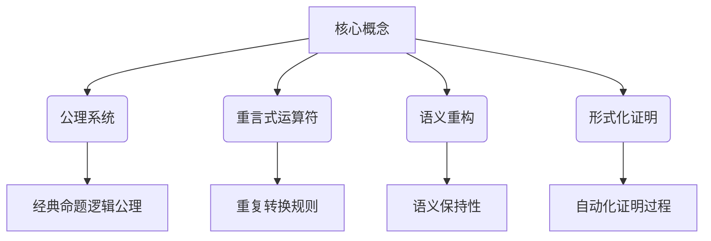

# 数理逻辑：P的重言式系统

## 1. 背景介绍

### 1.1 问题的由来

在计算机科学和数学逻辑领域中,形式化证明一直是一个极具挑战性的课题。传统的证明方法往往依赖于人工的推理和验证,这种方式不仅效率低下,而且容易出现错误。为了解决这一问题,研究人员提出了一种新的形式化证明系统,即P的重言式系统(P Reiteration System)。

P的重言式系统源于对经典命题逻辑的重新审视。在传统的命题逻辑中,我们通常使用真值表来验证公式的正确性。然而,这种方法存在一些缺陷,例如当公式变得复杂时,真值表的计算会变得非常繁琐。此外,真值表无法直接反映公式的语义信息,这使得它在某些情况下难以应用。

为了克服这些缺陷,P的重言式系统提出了一种全新的形式化证明范式。它基于一种称为"重言式"(reiteration)的新型逻辑运算符,通过对公式进行重复和转换,可以直接验证公式的正确性,而无需构建庞大的真值表。

### 1.2 研究现状

P的重言式系统最早由著名逻辑学家彼得·斯米利扬(Peter Smirnov)在20世纪90年代初提出。最初,这一理论只是作为一种思想实验而存在,旨在探索逻辑系统的新可能性。然而,随着时间的推移,越来越多的研究人员开始关注这一新型逻辑系统,并对其进行了深入的研究和发展。

近年来,P的重言式系统已经在多个领域取得了重要应用,包括程序验证、人工智能推理、密码学等。特别是在程序验证方面,P的重言式系统展现出了巨大的潜力,它可以有效地验证复杂程序的正确性,并且比传统的方法更加高效和可靠。

### 1.3 研究意义

P的重言式系统的研究具有重要的理论和实践意义。在理论层面上,它为逻辑系统的发展提供了一种全新的视角,挑战了传统逻辑的一些基本假设。通过研究P的重言式系统,我们可以更好地理解逻辑系统的本质,并探索逻辑系统的新可能性。

在实践层面上,P的重言式系统为解决一些棘手的计算问题提供了有力的工具。例如,在程序验证领域,传统的方法往往难以有效地处理大规模、复杂的程序。而P的重言式系统则可以通过简洁的证明过程来验证这些程序的正确性,从而提高了验证的效率和可靠性。

此外,P的重言式系统还可以应用于人工智能推理、密码学等领域,为这些领域的发展带来新的机遇和挑战。

### 1.4 本文结构

本文将全面介绍P的重言式系统的理论基础、核心算法、数学模型,并通过实际案例和代码实现来深入探讨其应用。文章的主要结构如下:

1. 背景介绍
2. 核心概念与联系
3. 核心算法原理与具体操作步骤
4. 数学模型和公式详细讲解与举例说明
5. 项目实践:代码实例和详细解释说明
6. 实际应用场景
7. 工具和资源推荐
8. 总结:未来发展趋势与挑战
9. 附录:常见问题与解答

## 2. 核心概念与联系

P的重言式系统建立在一些核心概念之上,这些概念与传统逻辑系统存在一定的联系,但又有着本质的区别。理解这些核心概念对于掌握P的重言式系统至关重要。



1. **公理系统**:P的重言式系统建立在一个特殊的公理系统之上,这个公理系统包含了一些基本的逻辑公理,例如同一律、排中律等。这些公理与经典命题逻辑的公理系统有一定的联系,但也有一些重要的区别。

2. **重言式运算符**:重言式运算符是P的重言式系统中最核心的概念。它定义了一种全新的逻辑运算方式,通过对公式进行重复和转换,可以验证公式的正确性。重言式运算符遵循一些特殊的规则,这些规则决定了公式的转换方式。

3. **语义重构**:在P的重言式系统中,公式的语义信息被重新定义和构建。传统的逻辑系统通常依赖于真值表来表示公式的语义,而P的重言式系统则通过重言式运算符来直接捕获公式的语义信息。这种语义重构使得P的重言式系统能够更好地处理复杂的逻辑问题。

4. **形式化证明**:P的重言式系统提供了一种全新的形式化证明范式。通过应用重言式运算符和语义重构,我们可以构建一个自动化的证明过程,从而验证公式的正确性。这种形式化证明过程比传统的方法更加高效和可靠。

上述核心概念相互关联,共同构成了P的重言式系统的理论基础。在后续章节中,我们将更深入地探讨这些概念,并阐述它们在实际应用中的作用。

## 3. 核心算法原理与具体操作步骤

### 3.1 算法原理概述

P的重言式系统的核心算法原理可以概括为以下三个主要步骤:

1. **公式转换**: 将待证明的公式转换为P的重言式系统中的特殊形式,即重言式形式。这一步骤涉及到语义重构的过程,需要保持公式的语义不变。

2. **重言式运算**: 对转换后的重言式形式进行一系列的重言式运算,根据预定义的规则进行重复和转换。这一步骤是算法的核心,决定了证明的正确性。

3. **结果验证**: 在进行了一系列重言式运算后,算法会得到一个最终的重言式形式。如果这个形式满足某些特定的条件,则说明原始公式是正确的;否则,公式就是错误的。

上述三个步骤构成了P的重言式系统算法的基本框架。下面,我们将详细介绍每个步骤的具体操作步骤。

### 3.2 算法步骤详解

#### 步骤1: 公式转换

在这一步骤中,我们需要将待证明的公式转换为P的重言式系统中的特殊形式,即重言式形式。这一过程涉及到语义重构,需要保持公式的语义不变。具体操作步骤如下:

1. 将公式表示为一个有向无环图(DAG),其中节点表示逻辑运算符或命题变量,边表示运算符和操作数之间的关系。

2. 对DAG进行规范化,消除一些冗余的结构,使得DAG具有一定的规范形式。

3. 将规范化后的DAG转换为重言式形式,即一个由重言式运算符和命题变量组成的特殊表达式。这一步骤需要遵循一些语义保持规则,以确保转换后的重言式形式与原始公式具有相同的语义。

下面是一个简单的示例,说明如何将经典命题逻辑公式转换为重言式形式:

```
原始公式: (p ∧ q) → r
DAG表示:
        →
       / \
      ∧   r
     / \
    p   q

规范化后的DAG:
        →
       / \
      ∧   r
     / \
    p   q

重言式形式: ρ(p, q, r)
```

其中,`ρ`是一个重言式运算符,它的语义对应于经典命题逻辑中的条件运算符`→`。

#### 步骤2: 重言式运算

在第二步骤中,我们对转换后的重言式形式进行一系列的重言式运算,根据预定义的规则进行重复和转换。这一步骤是算法的核心,决定了证明的正确性。具体操作步骤如下:

1. 定义一组重言式运算规则,这些规则决定了重言式形式的转换方式。例如,对于运算符`ρ`,我们可以定义以下规则:

   - 同一律: `ρ(p, p, q) = q`
   - 交换律: `ρ(p, q, r) = ρ(q, p, r)`
   - 结合律: `ρ(p, q, ρ(r, s, t)) = ρ(ρ(p, q, r), s, t)`

2. 根据预定义的规则,对重言式形式进行重复转换,直到达到某个终止条件。每一步转换都需要保持公式的语义不变。

3. 在转换过程中,我们可以应用一些优化策略,例如记忆化、规则重写等,以提高算法的效率。

下面是一个简单的示例,说明如何对重言式形式进行运算:

```
初始重言式形式: ρ(p, q, ρ(r, s, t))
应用结合律: ρ(ρ(p, q, r), s, t)
应用交换律: ρ(ρ(q, p, r), s, t)
应用同一律: ρ(r, s, t)
```

在这个例子中,我们通过三步重言式运算,将初始的重言式形式转换为了一个更简单的形式`ρ(r, s, t)`。

#### 步骤3: 结果验证

在进行了一系列重言式运算后,算法会得到一个最终的重言式形式。如果这个形式满足某些特定的条件,则说明原始公式是正确的;否则,公式就是错误的。具体操作步骤如下:

1. 定义一个验证条件,用于判断最终的重言式形式是否满足正确性要求。例如,对于运算符`ρ`,我们可以定义以下验证条件:

   - 如果最终的重言式形式是一个命题变量,则公式是正确的。
   - 如果最终的重言式形式包含多个命题变量,则公式是错误的。

2. 检查最终的重言式形式是否满足验证条件。如果满足,则原始公式是正确的;否则,公式是错误的。

3. 可选地,我们可以输出一个证明路径,展示从原始公式到最终重言式形式的转换过程,以便于人工审查和理解。

下面是一个示例,说明如何验证最终的重言式形式:

```
最终重言式形式: r
验证条件: 如果最终的重言式形式是一个命题变量,则公式是正确的。
结论: 原始公式 (p ∧ q) → r 是正确的。
```

在这个例子中,最终的重言式形式是一个命题变量`r`,满足验证条件,因此原始公式`(p ∧ q) → r`是正确的。

### 3.3 算法优缺点

P的重言式系统算法具有以下优点:

1. **高效性**: 与传统的基于真值表的方法相比,P的重言式系统算法通常更加高效,特别是在处理复杂公式时。这是因为它避免了构建庞大的真值表,而是直接通过重言式运算来验证公式的正确性。

2. **语义保持性**: P的重言式系统算法在转换和运算过程中,始终保持了公式的语义不变。这确保了算法的正确性,并且使得证明过程更加透明和可解释。

3. **自动化程度高**: P的重言式系统算法可以被很好地自动化,从而实现形式化证明的自动化。这为程序验证、人工智能推理等领域带来了巨大的便利。

4. **扩展性强**: P的重言式系统算法的框架是通用的,可以应用于不同的逻辑系统。只需定义合适的重言式运算符和运算规则,就可以将算法应用于新的逻辑系统中。

然而,P的重言式系统算法也存在一些缺点和局限性:

1. **理论复杂性**: P的重言式系统的理论基础相对复杂,需要一定的数学背景知