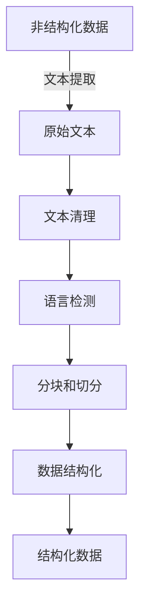

# 文档加载器（Document Loaders）

## 1. 背景介绍

### 1.1 问题的由来

在自然语言处理(NLP)和信息检索领域,通常需要处理大量的非结构化文本数据。这些文本数据可能来自于各种来源,如网页、PDF文件、Word文档、电子邮件等。然而,在对这些文本数据进行任何分析或处理之前,需要将它们转换为计算机可以理解的格式。这就是文档加载器(Document Loaders)发挥作用的地方。

文档加载器是一种软件工具或库,旨在从各种来源加载和解析非结构化文本数据,并将其转换为统一的内部表示形式,以便后续的NLP任务(如文本分类、情感分析、问答系统等)可以高效地处理这些数据。

### 1.2 研究现状

随着数字化时代的到来,非结构化文本数据的数量呈指数级增长。这些数据散布在各种来源中,格式也不尽相同。因此,开发高效、可扩展的文档加载器成为了一个重要的研究课题。

目前,已有多个开源项目和商业解决方案提供了文档加载器的功能,如Apache Tika、python的PyMuPDF库、Langchain等。这些工具支持从多种常见文件格式(如PDF、Word、HTML等)中提取文本内容。

然而,现有的文档加载器仍然存在一些局限性,例如:

1. 对于某些特殊格式的文件,解析效果可能不佳。
2. 对于包含多种语言的文件,语言检测和处理可能存在缺陷。
3. 对于大型文件或大量文件的并行处理,性能和可扩展性可能受到限制。
4. 缺乏统一的接口和标准,导致不同工具之间的集成和迁移成本较高。

因此,设计和开发更加通用、高效和可扩展的文档加载器仍然是一个值得关注的研究方向。

### 1.3 研究意义

高效的文档加载器对于NLP和信息检索任务至关重要,具有以下重要意义:

1. **数据准备**:文档加载器为后续的NLP任务提供了高质量的结构化文本数据,这是数据处理管道的关键第一步。
2. **提高效率**:通过自动化文本提取和转换过程,可以大大提高数据处理的效率,节省人力和时间成本。
3. **支持多种格式**:能够处理各种常见和不常见的文件格式,扩大了NLP应用的覆盖面。
4. **语言无关性**:优秀的文档加载器应该能够处理多种语言的文本,支持跨语言的NLP应用。
5. **可扩展性**:面对海量的非结构化数据,文档加载器需要具备良好的并行处理能力和可扩展性,以满足大规模应用的需求。

综上所述,研究和开发高性能、通用的文档加载器,对于推动NLP和信息检索技术的发展具有重要意义。

### 1.4 本文结构

本文将全面介绍文档加载器的相关概念、原理和实践。主要内容包括:

1. 核心概念与联系
2. 核心算法原理及具体操作步骤
3. 数学模型和公式详细讲解及举例说明
4. 项目实践:代码实例和详细解释说明
5. 实际应用场景
6. 工具和资源推荐
7. 总结:未来发展趋势与挑战
8. 附录:常见问题与解答

接下来,我们将逐一探讨这些内容。

## 2. 核心概念与联系

在深入讨论文档加载器的细节之前,我们需要先了解一些核心概念及它们之间的联系。

### 2.1 非结构化数据

非结构化数据(Unstructured Data)是指没有预定义数据模型或者是不遵循特定数据模型的数据。常见的非结构化数据包括文本文件、网页、电子邮件、社交媒体数据等。与结构化数据(如数据库中的表格数据)不同,非结构化数据缺乏固定的模式或模型,因此更加灵活和丰富,但同时也更加难以处理和分析。

### 2.2 文本提取

文本提取(Text Extraction)是指从各种来源(如PDF、Word、HTML等)中提取出纯文本内容的过程。这是文档加载器的核心功能之一。文本提取需要处理各种文件格式、编码方式、布局结构等,并过滤掉非文本元素(如图像、表格等)。

### 2.3 文本清理

文本清理(Text Cleaning)是指对提取出的原始文本进行预处理,去除无用的字符、标记、空格等,将文本转换为标准化的形式。这有助于后续的NLP任务更好地处理文本数据。

### 2.4 语言检测

语言检测(Language Detection)是指自动识别给定文本所使用的语言。对于多语言文件,准确的语言检测是进行后续处理(如分词、词性标注等)的前提。

### 2.5 分块和切分

分块(Chunking)是指将长文本按照某些规则(如段落、句子等)分割成多个短文本块。切分(Splitting)则是指将文本按照特定的模式(如换行符、标点符号等)切分成多个短语或句子。这些操作有助于后续的文本处理和分析。

### 2.6 数据结构化

数据结构化(Data Structuring)是指将提取和清理后的文本数据转换为计算机可以高效处理的内部表示形式,如树状结构、向量空间模型等。这是文档加载器的另一个重要功能。

上述概念相互关联,共同构成了文档加载器的核心功能。下图展示了它们之间的关系:

## 3. 核心算法原理及具体操作步骤

### 3.1 算法原理概述

文档加载器的核心算法原理可以概括为以下几个步骤:

1. **文件解析**: 根据文件类型和编码方式,使用相应的解析器(Parser)从文件中提取出原始文本内容。
2. **文本清理**: 对提取出的原始文本进行标准化处理,去除无用字符、标记、空格等。
3. **语言检测**: 自动识别文本所使用的语言,为后续的分词、词性标注等操作做准备。
4. **分块和切分**: 将长文本按照段落、句子等规则分割成多个短文本块,方便后续处理。
5. **数据结构化**: 将清理和切分后的文本数据转换为计算机可以高效处理的内部表示形式,如树状结构、向量空间模型等。

这些步骤可以组合在一起,形成一个完整的文档加载器流程。下面我们将详细介绍每个步骤的具体操作。

### 3.2 算法步骤详解

#### 3.2.1 文件解析

文件解析是文档加载器的第一步,也是最关键的一步。它需要根据文件类型和编码方式,使用相应的解析器从文件中提取出原始文本内容。

常见的文件解析器包括:

- **PDF解析器**: 用于从PDF文件中提取文本,如PyMuPDF、Apache PDFBox等。
- **Word解析器**: 用于从Word文档中提取文本,如python-docx、Apache POI等。
- **HTML/XML解析器**: 用于从网页、XML文件中提取文本,如lxml、BeautifulSoup等。
- **电子邮件解析器**: 用于从电子邮件中提取文本,如python-email等。

这些解析器通常会利用文件的内部结构和元数据信息来定位和提取文本内容。例如,PDF解析器会分析PDF文件的对象结构和字体信息;Word解析器会解析Word文档的XML结构;HTML/XML解析器会利用标记语言的树状结构等。

文件解析过程中还需要处理一些常见问题,如:

- **编码检测**: 自动检测文件的编码方式(如UTF-8、GBK等),以正确解码文本内容。
- **图像和表格处理**: 决定是否保留或忽略文件中的图像、表格等非文本元素。
- **布局分析**: 分析文本的布局结构(如段落、标题等),以保留原始格式信息。
- **嵌入文件处理**: 处理文件中嵌入的其他文件(如PDF中的附件等)。

通过上述步骤,我们可以从各种文件格式中成功提取出原始的文本内容,为后续的文本处理打下基础。

#### 3.2.2 文本清理

提取出的原始文本通常包含一些无用的字符、标记、空格等,需要进行清理和标准化处理。常见的文本清理操作包括:

- **去除控制字符**: 移除文本中的不可打印控制字符,如换行符、制表符等。
- **统一换行符**: 将不同的换行符(如\r\n、\n等)统一为单个换行符。
- **去除多余空白**: 移除文本中多余的空格、制表符等空白字符。
- **规范化字符**: 将特殊字符(如智能引号、连字符等)规范化为标准形式。
- **去除HTML/XML标记**: 移除文本中残留的HTML/XML标记。
- **大小写规范化**: 将文本转换为全部大写或小写(通常为小写)。
- **去除停用词**: 移除常见的无意义停用词(如the、is、at等)。

这些操作可以通过正则表达式、字符串操作、停用词列表等方式实现。清理后的文本将更加规范和标准化,有利于后续的语言处理任务。

#### 3.2.3 语言检测

对于多语言文件,准确的语言检测是进行后续处理(如分词、词性标注等)的前提。常见的语言检测方法包括:

- **基于n-gram统计**: 统计文本中不同n-gram(如单词、字符n元组等)的出现频率,并与预先构建的语言模型进行匹配,确定最可能的语言。
- **基于词典匹配**: 将文本中的词条与不同语言的词典进行匹配,统计匹配度最高的语言。
- **基于机器学习**: 使用训练好的机器学习模型(如朴素贝叶斯、SVM等)对文本进行语言分类。

这些方法可以单独使用,也可以组合使用,以提高语言检测的准确性。除了检测语言种类外,某些工具还能够检测文本中的多语言混合情况,并对不同语言的文本块进行分离。

准确的语言检测可以避免后续处理过程中出现错误,确保对不同语言的文本应用正确的语言模型和处理流程。

#### 3.2.4 分块和切分

长文本通常需要被分割成多个短文本块,以方便后续的处理和分析。常见的分块和切分方法包括:

- **段落分块**: 根据段落分隔符(如换行符、缩进等)将文本分割成多个段落块。
- **句子切分**: 根据句子结束标点符号(如句号、问号、感叹号等)将段落进一步切分成句子。
- **词切分**: 将句子按照空格或其他分隔符切分成单词序列。
- **基于规则的切分**: 根据预定义的规则(如标题级别、特殊标记等)对文本进行切分。
- **基于机器学习的切分**: 使用训练好的序列标注模型(如CRF、LSTM等)自动识别文本中的语义边界进行切分。

不同的切分方法适用于不同的场景。例如,对于新闻文本,段落分块和句子切分就很有用;而对于社交媒体数据,基于规则或机器学习的切分可能更加合适。

切分后的短文本块更容易被后续的NLP任务处理,同时也保留了文本的结构信息(如段落、句子等)。

#### 3.2.5 数据结构化

最后一步是将清理和切分后的文本数据转换为计算机可以高效处理的内部表示形式,即数据结构化。常见的数据结构化方法包括:

- **树状结构**: 将文本按照层次结构(如标题、段落、句子等)组织成树状结构,方便查询和导航。
- **向