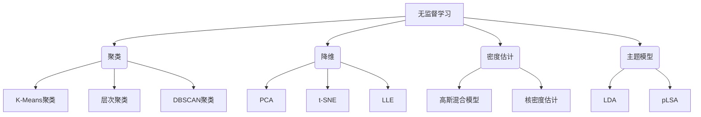
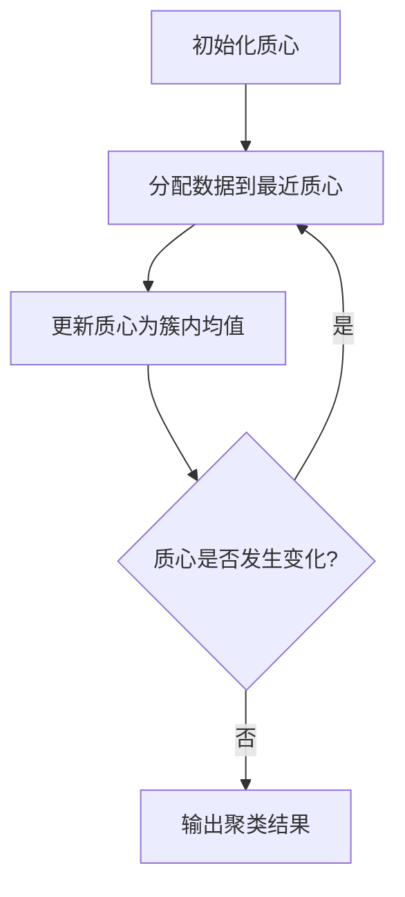
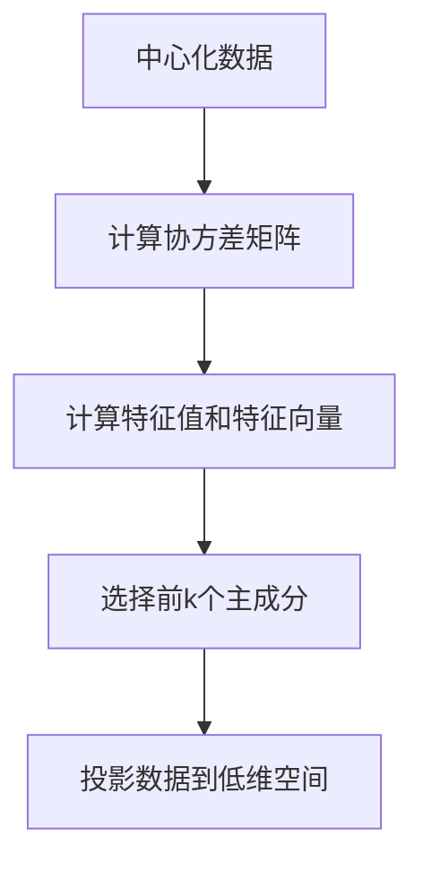

# 无监督学习 (Unsupervised Learning)

## 1. 背景介绍

### 1.1 问题的由来

在机器学习和人工智能领域中,监督学习一直是研究的重点和主流。然而,在现实世界中,我们面临着大量未标记的原始数据,如图像、文本、语音等。对这些数据进行手动标注是一项艰巨的任务,不仅耗时耗力,而且容易引入人为偏差。因此,如何有效利用未标记数据,从中发现潜在的模式和结构,成为了一个迫切的需求。这就催生了无监督学习的研究和应用。

### 1.2 研究现状

无监督学习作为机器学习的一个重要分支,近年来受到了广泛关注。研究人员提出了多种无监督学习算法,如聚类(Clustering)、降维(Dimensionality Reduction)、密度估计(Density Estimation)、主题模型(Topic Modeling)等。这些算法已经在图像处理、自然语言处理、推荐系统等多个领域取得了卓越的成就。

然而,无监督学习也面临着一些挑战,例如:

- 算法性能评估困难,缺乏统一的评价标准
- 对异常值和噪声数据敏感
- 算法参数选择依赖经验,缺乏理论指导

### 1.3 研究意义

无监督学习能够从海量未标记数据中挖掘隐藏的知识,为人工智能系统提供有价值的输入,具有重要的理论意义和应用价值。它可以:

- 减轻人工标注的负担,降低成本
- 发现数据内在的结构和模式
- 为监督学习提供有益的先验知识

无监督学习的研究不仅可以推动机器学习算法的发展,也将促进人工智能技术在更多领域的应用。

### 1.4 本文结构

本文将全面介绍无监督学习的核心概念、算法原理、数学模型,并通过实例代码和应用场景,为读者提供深入的理解。文章最后将对无监督学习的发展趋势和挑战进行展望和讨论。

## 2. 核心概念与联系

无监督学习的核心思想是从未标记的原始数据中发现内在的模式和结构,而无需任何人工标注或监督信号。它可以分为以下几个主要任务:



1. **聚类(Clustering)**: 将数据划分为多个簇,使得同一簇内的数据相似度高,不同簇之间的相似度低。常见算法有K-Means、层次聚类、DBSCAN等。
2. **降维(Dimensionality Reduction)**: 将高维数据映射到低维空间,降低数据复杂度,提高可解释性。常见算法有PCA、t-SNE、LLE等。
3. **密度估计(Density Estimation)**: 估计样本数据的概率分布,常用于异常检测、数据生成等。常见算法有高斯混合模型、核密度估计等。
4. **主题模型(Topic Modeling)**: 从文本语料中自动发现潜在的主题或模式。常见算法有LDA、pLSA等。

这些任务相互关联,往往会结合使用。例如,可以先对数据进行降维,然后再进行聚类;或者通过密度估计发现异常数据,再对正常数据进行聚类等。无监督学习算法的选择取决于具体的应用场景和数据特征。

## 3. 核心算法原理 & 具体操作步骤

在无监督学习中,有许多经典的算法,其核心原理和具体操作步骤值得深入探讨。本节将重点介绍两种广为人知的算法:K-Means聚类算法和主成分分析(PCA)降维算法。

### 3.1 算法原理概述

#### K-Means聚类算法

K-Means是一种简单而有效的聚类算法,其基本思想是将n个数据对象划分为k个聚类,使得聚类内部的数据点之间的距离和最小。算法的目标函数为:

$$J = \sum_{i=1}^{k}\sum_{x \in C_i} \left \| x - \mu_i \right \|^2$$

其中,$C_i$表示第i个簇,$\mu_i$表示第i个簇的质心。算法通过迭代优化目标函数,最终将数据划分为k个聚类。

#### 主成分分析(PCA)

PCA是一种常用的无监督降维算法。它通过正交变换,将原始的高维数据投影到一个低维的空间上,同时尽可能保留数据的方差信息。PCA的核心思想是找到数据的主成分方向,即方差最大的方向,并将数据投影到这些主成分上。

### 3.2 算法步骤详解

#### K-Means聚类算法步骤

1. **初始化**:随机选择k个初始质心。
2. **分配数据**:将每个数据点分配到最近的质心所属的簇。
3. **更新质心**:重新计算每个簇的质心,即簇内所有数据点的均值。
4. **重复分配**:重复步骤2和3,直到质心不再发生变化或达到最大迭代次数。



#### 主成分分析(PCA)步骤

1. **中心化**:将原始数据矩阵X的每一列减去其均值,得到中心化矩阵。
2. **计算协方差矩阵**:计算中心化矩阵的协方差矩阵$\Sigma$。
3. **计算特征值和特征向量**:对协方差矩阵$\Sigma$进行特征值分解,得到特征值和对应的特征向量。
4. **选择主成分**:选择前k个最大的特征值对应的特征向量作为主成分。
5. **投影数据**:将原始数据投影到由主成分构成的低维空间中。



### 3.3 算法优缺点

#### K-Means聚类算法

**优点**:
- 算法简单,易于理解和实现
- 计算复杂度较低,可以处理大规模数据
- 对球形的簇分布效果较好

**缺点**:
- 需要预先指定簇的数量k
-对初始质心的选择敏感
-对非凸形状的簇效果较差
- 对噪声和异常值敏感

#### 主成分分析(PCA)

**优点**:
- 可以有效降低数据维度,减少计算复杂度
- 提高了数据的可解释性和可视化能力
- 去除了数据中的噪声和冗余信息

**缺点**:
- 只能发现线性关系,对非线性结构不敏感
- 主成分的解释性可能不明确
- 数据标准化对结果有较大影响

### 3.4 算法应用领域

K-Means聚类和PCA降维算法在众多领域都有广泛的应用,包括但不限于:

- **图像处理**:图像分割、图像压缩、特征提取等
- **自然语言处理**:文本聚类、主题发现、词向量降维等
- **推荐系统**:用户群体划分、协同过滤等
- **生物信息学**:基因表达数据分析、蛋白质结构预测等
- **金融风险管理**:异常检测、客户分类等
- **计算机视觉**:目标检测、人脸识别等

总的来说,无监督学习算法能够从原始数据中发现隐藏的模式和结构,为人工智能系统提供有价值的输入,在各个领域发挥着重要作用。

## 4. 数学模型和公式 & 详细讲解 & 举例说明

无监督学习算法背后往往有着严谨的数学模型和公式支撑。本节将重点介绍K-Means聚类算法和主成分分析(PCA)的数学模型,并通过案例进行详细讲解。

### 4.1 数学模型构建

#### K-Means聚类算法

K-Means聚类算法的目标是将n个数据对象$\{x_1, x_2, \dots, x_n\}$划分为k个互不相交的簇$\{C_1, C_2, \dots, C_k\}$,使得簇内数据点之间的距离和最小。具体来说,算法需要最小化目标函数:

$$J = \sum_{i=1}^{k}\sum_{x \in C_i} \left \| x - \mu_i \right \|^2$$

其中,$\mu_i$表示第i个簇的质心,定义为:

$$\mu_i = \frac{1}{|C_i|}\sum_{x \in C_i}x$$

通过不断迭代更新簇分配和质心位置,算法最终会收敛到一个局部最优解。

#### 主成分分析(PCA)

PCA的目标是找到一组正交基向量$\{v_1, v_2, \dots, v_d\}$,使得原始数据在这组基向量上的投影方差最大。具体来说,需要最大化目标函数:

$$\max \sum_{i=1}^{d} \text{Var}(X^Tv_i)$$

其中,X是中心化后的数据矩阵。

通过对数据矩阵的协方差矩阵进行特征值分解,可以得到这组最优的正交基向量,它们就是协方差矩阵的特征向量。

### 4.2 公式推导过程

#### K-Means聚类算法

为了最小化目标函数J,我们可以对每个数据点x进行迭代更新,将其分配到距离最近的质心所属的簇:

$$c^{(t)}(x) = \arg\min_{j} \left \| x - \mu_j^{(t)} \right \|^2$$

其中,$c^{(t)}(x)$表示第t次迭代时,数据点x所属的簇标号。

然后,根据新的簇分配,重新计算每个簇的质心:

$$\mu_j^{(t+1)} = \frac{1}{|C_j^{(t)}|}\sum_{x \in C_j^{(t)}}x$$

重复上述过程,直到算法收敛或达到最大迭代次数。可以证明,每次迭代都会使目标函数J的值下降,最终收敛到一个局部最小值。

#### 主成分分析(PCA)

我们定义数据矩阵X的协方差矩阵为:

$$\Sigma = \frac{1}{n}\sum_{i=1}^{n}(x_i - \mu)(x_i - \mu)^T$$

其中,$\mu$是数据的均值向量。

则目标函数可以改写为:

$$\max \sum_{i=1}^{d} v_i^T\Sigma v_i$$

subject to:
$$v_i^Tv_i = 1 \quad \text{and} \quad v_i^Tv_j = 0 \quad (i \neq j)$$

利用拉格朗日乘数法,可以证明最优的基向量$\{v_1, v_2, \dots, v_d\}$就是协方差矩阵$\Sigma$的前d个最大特征值对应的特征向量。

### 4.3 案例分析与讲解

#### K-Means聚类案例

我们以一个简单的二维数据集为例,说明K-Means聚类算法的工作过程。假设数据集包含6个数据点,我们希望将它们划分为2个簇。

1. 初始化:随机选择两个质心,如下图所示。

```mermaid
scatter
    xScale:5
    yScale:5
    xMin:-1
    xMax:6
    yMin:-1
    yMax:6
    style scatter [stroke:"red",marker:"square",markerSize:20]
    scatter data:
        "2,4"
        "5,3"
    style scatter [stroke:"black",marker:"circle",markerSize