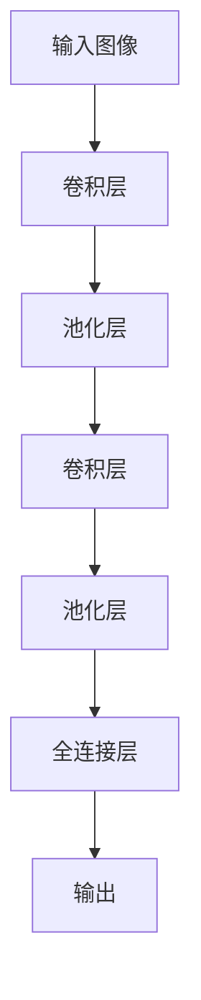
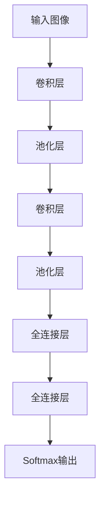
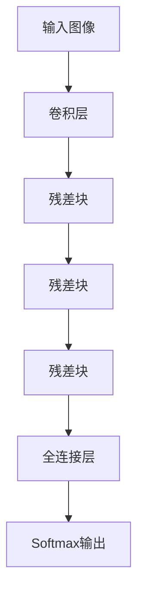

# 李飞飞与AI图像识别的未来

## 1. 背景介绍

### 1.1 问题的由来

在当今数字时代,图像数据无处不在。从社交媒体上的自拍照片,到医疗影像诊断,再到无人驾驶汽车的路况感知,图像识别技术都扮演着至关重要的角色。随着人工智能(AI)技术的不断进步,基于深度学习的图像识别算法取得了令人瞩目的成就,极大推动了计算机视觉领域的发展。

### 1.2 研究现状  

传统的图像识别方法主要依赖手工设计的特征提取和分类器,但这种方法往往因为缺乏足够的先验知识而无法很好地泛化到复杂的真实场景中。深度学习则通过数据驱动的方式自动学习图像的层次表示,大幅提升了图像识别的性能和泛化能力。代表性的深度学习模型包括卷积神经网络(CNN)、递归神经网络(RNN)、生成对抗网络(GAN)等,已广泛应用于图像分类、目标检测、语义分割、图像生成等任务中。

### 1.3 研究意义

高效准确的图像识别技术对于提升人工智能系统的感知能力至关重要。它不仅可以显著改善人机交互体验,还能为智能驾驶、智能监控、医疗影像辅助诊断等诸多领域带来革命性变革。随着5G、物联网、边缘计算等新兴技术的兴起,对图像识别算法的实时性、轻量级和鲁棒性也提出了更高的要求。因此,持续推进图像识别领域的创新研究具有重要的理论意义和应用价值。

### 1.4 本文结构

本文将全面介绍图像识别领域的最新进展,重点关注李飞飞教授团队在该领域的卓越成就。文章首先阐述图像识别的核心概念及其与其他AI技术的关联,接着深入探讨经典算法的原理、优缺点和应用场景。然后介绍李飞飞团队提出的创新模型及数学理论,并通过实例分析其实现细节。最后,本文将总结图像识别技术的发展趋势和面临的挑战,并为读者提供相关的学习资源和开发工具推荐。

## 2. 核心概念与联系

图像识别是计算机视觉和模式识别领域的核心任务之一,旨在从数字图像或视频序列中自动检测、识别和跟踪感兴趣的目标。它与其他人工智能技术存在密切联系:

- **计算机视觉**:图像识别是计算机视觉的基础,为高层次视觉任务(如场景理解、活动识别等)提供支撑。
- **机器学习**:现代图像识别系统大多采用机器学习方法(如深度学习)从数据中自动学习视觉模型。
- **自然语言处理**:结合自然语言处理技术可实现图像描述和视觉问答等任务。
- **决策与规划**:图像识别为智能系统(如机器人、自动驾驶汽车)提供视觉感知,支持决策和规划。

图像识别技术与多个领域交叉融合,是构建通用人工智能(AGI)不可或缺的关键组成部分。

## 3. 核心算法原理 & 具体操作步骤

### 3.1 算法原理概述

现代图像识别系统主要基于深度学习框架,以卷积神经网络(CNN)为代表。CNN由多个卷积层、池化层和全连接层组成,能够自动从图像中学习层次化的特征表示。具体来说:

1. **卷积层**通过滑动卷积核在图像上进行特征提取,获取低级特征(如边缘、纹理等)。
2. **池化层**对卷积层输出进行下采样,实现平移不变性并降低特征维度。
3. **全连接层**将低级特征组合并编码为高级语义特征,最终用于分类或回归任务。

CNN中还广泛采用了诸如跳跃连接、注意力机制等创新技术,以提升模型的表达能力和优化效率。

### 3.2 算法步骤详解

以图像分类为例,CNN模型的典型训练和预测流程如下:

1. **数据预处理**:将输入图像缩放到固定尺寸,并进行标准化等预处理,以满足模型输入要求。
2. **模型初始化**:根据设计好的网络结构随机初始化卷积核和权重参数。
3. **模型训练**:
    - 前向传播,计算输出预测值
    - 计算损失函数(如交叉熵损失)
    - 反向传播,基于损失函数计算梯度
    - 基于梯度更新模型参数(通常采用随机梯度下降等优化算法)
4. **模型评估**:在验证集或测试集上评估模型性能,计算指标如准确率、精确率、召回率等。
5. **模型微调**:根据评估结果对模型进行微调,如调整超参数、增加正则化等。
6. **模型部署**:将训练好的模型集成到实际系统中,用于图像分类等预测任务。

### 3.3 算法优缺点

CNN等深度学习模型在图像识别任务上取得了卓越表现,但也存在一些不足:

**优点**:
- 端到端训练,无需手工设计特征
- 具有强大的模式提取和表达能力
- 可以通过数据和模型扩展来持续改进

**缺点**:
- 需要大量标注数据进行有效训练
- 模型往往存在黑盒操作,缺乏可解释性
- 对噪声和对抗样本敏感,鲁棒性较差
- 存在较高的计算和存储开销

### 3.4 算法应用领域

图像识别技术已在诸多领域得到广泛应用,主要包括但不限于:

- **计算机视觉**:图像分类、目标检测、语义分割、实例分割等基础视觉任务
- **自动驾驶**:车道线检测、交通标志识别、行人检测等
- **人脸识别**:面部检测、面部识别、面部属性分析等
- **医疗影像**:病理扫描图像分析、CT/MRI影像诊断等
- **工业检测**:缺陷检测、产品质量检测等
- **机器人视觉**:场景理解、目标识别与定位等

## 4. 数学模型和公式 & 详细讲解 & 举例说明

### 4.1 数学模型构建

我们以卷积神经网络为例,介绍其基本数学模型。假设输入图像为$I$,卷积核为$K$,卷积步长为$s$,则卷积运算可表示为:

$$
O(m,n)=(I*K)(m,n)=\sum_{i=-\infty}^{\infty}\sum_{j=-\infty}^{\infty}I(m+i,n+j)K(i,j)
$$

其中$O$是输出特征图。通过在图像$I$上滑动卷积核$K$并进行点积操作,可提取出局部特征。

对于单个卷积层,其前向传播过程可表示为:

$$
X^{l+1}=f(W^l*X^l+b^l)
$$

其中$X^l$和$X^{l+1}$分别为第$l$层和第$l+1$层的输入输出,符号$*$表示卷积操作,$W^l$和$b^l$分别为当前层的卷积核权重和偏置参数,$f$为激活函数(如ReLU)。

CNN的损失函数通常采用交叉熵损失,对于分类任务可表示为:

$$
L=-\sum_{i=1}^{N}y_i\log\hat{y_i}
$$

其中$N$为样本数量,$y_i$为真实标签,$\hat{y_i}$为模型预测概率。在训练过程中,我们需要最小化损失函数$L$,以学习最优参数$W$和$b$。

### 4.2 公式推导过程

我们以卷积层的反向传播过程为例,推导核心公式。假设卷积层的输入为$X$,输出为$Y$,卷积核权重为$W$,损失函数为$L$,则根据链式法则:

$$
\frac{\partial L}{\partial W}=\frac{\partial L}{\partial Y}\frac{\partial Y}{\partial W}
$$

其中$\frac{\partial L}{\partial Y}$为上层反向传播的误差项,$\frac{\partial Y}{\partial W}$需要计算。由于卷积运算的线性特性,我们有:

$$
\frac{\partial Y}{\partial W}=X^T
$$

将其代入原式,得到卷积核权重$W$的梯度为:

$$
\frac{\partial L}{\partial W}=\frac{\partial L}{\partial Y}\cdot X^T
$$

通过类似的推导过程,我们还可以获得偏置$b$的梯度:

$$
\frac{\partial L}{\partial b}=\sum_i\frac{\partial L}{\partial Y_i}
$$

利用上述公式,我们就可以通过反向传播算法有效地优化CNN模型的参数。

### 4.3 案例分析与讲解

我们以ImageNet图像分类任务为例,分析一下AlexNet和ResNet等经典CNN模型。AlexNet在2012年的ImageNet竞赛中获得冠军,它采用了8层卷积神经网络结构,并创新性地引入了ReLU激活函数、Dropout正则化和数据增强等技术,大幅提升了分类性能。

几年后,ResNet通过引入残差连接(Residual Connection)解决了深度网络的梯度消失问题,使得训练更加深层的网络成为可能,在ImageNet上取得了新的最佳成绩。

ResNet的核心思想是在神经网络中引入"捷径"连接,使得输入不仅可以通过层层传递,还可以直接传递到后面的层,从而避免信息在传播过程中的丢失。这种设计大大提高了网络的优化效率,使得训练更加深层的网络成为可能。

### 4.4 常见问题解答

**Q:** CNN为什么要使用卷积核而不是全连接层?

**A:** 卷积核的主要优势在于两个方面:

1. 参数共享:同一个卷积核可以在图像的不同位置进行滑动操作,从而大幅减少参数数量,降低模型复杂度。
2. 等变表示:卷积操作对于输入的平移具有等变性,即对于相同的图像特征,无论其出现在图像中的什么位置,卷积层的响应都是一致的。这使得CNN能够有效地学习平移不变的特征表示。

**Q:** 为什么要使用池化层?

**A:** 池化层主要有两个作用:

1. 特征映射:通过对卷积层输出的下采样,可以获得更加鲁棒的特征映射,提高模型的平移和形变不变性。
2. 降低计算量:下采样操作可以减小特征图的尺寸,从而降低后续层的计算开销。

常见的池化操作包括最大池化(Max Pooling)和平均池化(Average Pooling)。

**Q:** 如何解决过拟合问题?

**A:** 针对过拟合问题,常用的方法包括:

1. 数据增强:通过各种变换(如旋转、平移、翻转等)生成更多训练样本,增加数据的多样性。
2. 正则化:在损失函数中加入正则化项,如L1/L2正则,或使用Dropout等方法,限制模型复杂度。
3. 提早停止:在验证集上监控模型性能,当过拟合时提前终止训练。
4. 模型集成:将多个模型的预测结果进行集成(如voting或平