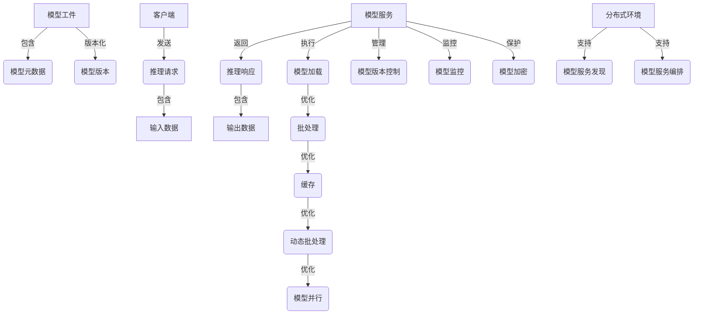

# 模型部署与服务化原理与代码实战案例讲解

## 1. 背景介绍

### 1.1 问题的由来

在当今的数据驱动时代,机器学习模型已经广泛应用于各个领域,如计算机视觉、自然语言处理、推荐系统等。然而,仅仅训练出一个高质量的模型是远远不够的,如何将这些模型高效、可靠、安全地部署到生产环境中,并为终端用户提供服务,是一个亟待解决的问题。

传统的模型部署方式通常是将模型打包成库或可执行文件,集成到应用程序中。但这种方式存在诸多缺陷:

1. **可移植性差**: 模型与应用程序耦合在一起,难以跨平台、跨语言复用。
2. **扩展性低**: 单机部署模式无法满足大规模访问需求,扩展性能成为瓶颈。
3. **维护困难**: 模型更新需要重新发布整个应用,维护成本高。
4. **安全隐患**: 模型代码暴露在客户端,存在被反向工程的风险。

因此,我们需要一种全新的模型部署范式,将模型独立于应用,提供统一的服务接口,实现"一处训练,到处部署"。这种新范式被称为**模型服务化(Model Serving)**。

### 1.2 研究现状

近年来,模型服务化受到了业界广泛关注,出现了多种开源解决方案,如TensorFlow Serving、Triton Inference Server、KFServing、Seldon Core等。这些系统提供了标准化的模型服务框架,支持多种机器学习框架,并具备诸多特性:

- **高性能**: 优化的模型加载、缓存和执行策略,确保低延迟、高吞吐。
- **可扩展**: 支持水平扩展,满足大规模访问需求。
- **版本控制**: 支持模型版本管理,实现无缝升级。
- **监控和告警**: 提供监控指标和告警机制,保证服务可靠性。
- **安全性**: 模型代码在服务端运行,避免泄露风险。

但这些系统也存在一些不足,如配置复杂、生态不完善、与机器学习工作流程割裂等,给用户带来了一定的学习和使用成本。

### 1.3 研究意义 

模型服务化是将机器学习模型真正落地的关键一环,对于提高模型在生产环境中的可用性、可靠性和安全性至关重要。本文将深入探讨模型服务化的原理和实践,为读者提供以下价值:

1. **理解模型服务化的必要性和优势**,掌握其核心思想和架构。
2. **掌握主流开源模型服务框架的使用方法**,了解它们的优缺点。
3. **学习如何自建高性能、可扩展的模型服务系统**,实现定制化需求。
4. **了解模型服务化在工业界的实际应用案例**,获取实战经验。

通过本文的学习,读者将全面掌握模型服务化的理论基础和实践技能,为机器学习模型的工业落地铺平道路。

### 1.4 本文结构

本文共分为9个章节,内容安排如下:

1. **背景介绍**: 阐述模型服务化的背景、现状和意义。
2. **核心概念与联系**: 介绍模型服务化的核心概念及其关联。
3. **核心算法原理与操作步骤**: 剖析模型服务系统的核心算法原理和具体实现步骤。
4. **数学模型和公式**: 构建模型服务系统的数学模型,并推导关键公式。
5. **项目实践**: 通过代码实例详细讲解模型服务系统的实现。
6. **实际应用场景**: 介绍模型服务化在工业界的实际应用案例。
7. **工具和资源推荐**: 推荐有用的学习资源、开发工具和相关论文。
8. **总结**: 总结研究成果,展望模型服务化的发展趋势和面临的挑战。
9. **附录**: 列出常见问题及解答。

## 2. 核心概念与联系

在深入探讨模型服务化之前,我们需要先理解以下几个核心概念:

1. **模型工件(Model Artifact)**: 指经过训练并序列化的机器学习模型文件,如TensorFlow的`.pb`文件、PyTorch的`.pth`文件等。

2. **模型元数据(Model Metadata)**: 描述模型的相关信息,如输入/输出张量形状、数据类型、版本号等。

3. **模型版本(Model Version)**: 对同一模型的不同迭代版本进行标识和管理。

4. **推理请求(Inference Request)**: 客户端发送给模型服务的请求,包含需要推理的数据。

5. **推理响应(Inference Response)**: 模型服务对推理请求的响应,包含推理结果。

6. **模型加载(Model Loading)**: 将模型工件从存储加载到内存中的过程。

7. **批处理(Batching)**: 将多个推理请求合并为一个批次进行处理,以提高吞吐量。

8. **缓存(Caching)**: 将推理结果临时缓存,避免重复计算,提高响应速度。

9. **动态批处理(Dynamic Batching)**: 根据实时负载动态调整批处理大小。

10. **模型并行(Model Parallelism)**: 在多个GPU或TPU上并行执行同一模型。

11. **模型版本控制(Model Versioning)**: 管理和跟踪模型的不同版本。

12. **模型监控(Model Monitoring)**: 监控模型服务的性能指标和健康状况。

13. **模型加密(Model Encryption)**: 对模型工件进行加密,防止模型泄露。

14. **模型服务发现(Model Service Discovery)**: 在分布式环境中发现和路由模型服务。

15. **模型服务编排(Model Service Orchestration)**: 自动化管理模型服务的生命周期。

这些概念相互关联,共同构建了模型服务化的完整体系。下面我们将使用一个流程图来直观地展示它们之间的联系:

在上图中,我们可以清晰地看到各个概念之间的关系。模型工件和元数据是模型服务化的基础,版本控制则是管理模型演进的关键。客户端发送推理请求,模型服务返回推理响应,中间涉及多种优化策略,如批处理、缓存等。此外,还需要支持分布式环境下的服务发现和编排,以及监控、加密等功能,确保模型服务的高性能、可靠性和安全性。

掌握了这些核心概念,我们就可以更好地理解模型服务化的整体架构和实现原理。

## 3. 核心算法原理与具体操作步骤

### 3.1 算法原理概述

模型服务系统的核心算法主要包括以下几个方面:

1. **模型管理算法**: 负责模型的加载、卸载、版本控制等,确保模型可用性。
2. **请求调度算法**: 将传入的推理请求合理分配给不同的模型实例,平衡负载。
3. **批处理算法**: 将多个推理请求组合成批次进行处理,提高吞吐量。
4. **缓存算法**: 缓存常见的推理请求和结果,加速响应速度。
5. **负载均衡算法**: 在分布式环境下,将请求均匀分发到多个模型服务实例。
6. **自动扩缩容算法**: 根据实时负载,动态调整模型服务实例的数量。
7. **故障恢复算法**: 在模型服务实例发生故障时,进行自动failover。

这些算法相互协作,共同实现了高性能、可扩展、高可用的模型服务能力。我们将在后续章节中详细介绍它们的具体实现原理和步骤。

### 3.2 算法步骤详解

#### 3.2.1 模型管理算法

模型管理算法负责加载、卸载和版本控制模型,其核心步骤如下:

1. **模型发现**: 扫描模型存储路径,发现所有可用的模型版本。
2. **模型解析**: 解析模型元数据,获取输入/输出张量形状、数据类型等信息。
3. **模型加载**: 根据配置,选择性地加载指定版本的模型到内存中。
4. **模型卸载**: 当模型不再使用时,将其从内存中卸载,释放资源。
5. **版本控制**: 支持模型的创建、更新、删除等版本操作。
6. **元数据存储**: 将模型元数据持久化存储,供后续使用。

该算法的核心数据结构是一个模型元数据缓存,用于高效查找和访问已加载的模型信息。

#### 3.2.2 请求调度算法  

请求调度算法将传入的推理请求分发到不同的模型实例,其步骤如下:

1. **请求分类**: 根据请求的模型名称和版本,将请求分类到对应的请求队列。
2. **队列调度**: 遍历所有请求队列,按某种策略(如轮询、优先级等)选择一个队列。
3. **实例选择**: 从选中队列对应的模型实例集群中,选择一个实例处理该请求。
4. **负载评估**: 评估每个模型实例的负载情况,作为调度策略的参考。
5. **故障转移**: 如果选中实例发生故障,则重新调度到其他实例。

该算法的关键点在于请求队列的维护和实例选择策略的设计,需要权衡公平性、优先级和负载均衡等因素。

#### 3.2.3 批处理算法

批处理算法将多个推理请求组合成批次进行处理,提高吞吐量,其步骤如下:

1. **请求缓存**: 将传入的推理请求临时缓存到内存队列中。
2. **批次形成**: 当队列积累到一定数量的请求时,将它们组合成一个批次。
3. **张量拼接**: 将批次中每个请求的输入数据拼接成一个大张量。
4. **批量推理**: 使用模型的批量推理接口,一次性对拼接后的张量进行推理。
5. **结果分割**: 将推理结果的大张量按批次中每个请求的shape分割开。
6. **响应返回**: 将分割后的结果分别返回给每个推理请求。

该算法的关键是确定合理的批次大小,需要权衡延迟和吞吐量。我们可以采用动态批处理策略,根据实时负载动态调整批次大小。

#### 3.2.4 缓存算法

缓存算法将常见的推理请求和结果缓存起来,避免重复计算,其步骤如下:

1. **请求哈希**: 对每个推理请求的输入数据计算一个哈希值,作为缓存键。
2. **缓存查询**: 在缓存中查询该请求对应的结果是否存在。
3. **缓存命中**: 如果命中缓存,则直接返回缓存结果,避免重复推理。
4. **缓存未命中**: 如果未命中,则执行推理并将结果缓存起来。
5. **缓存更新**: 定期清理和更新缓存,避免内存占用过高。

该算法的关键是设计高效的哈希函数和缓存数据结构,并合理控制缓存大小。我们可以采用最近最少使用(LRU)或其他缓存替换策略。

#### 3.2.5 负载均衡算法

在分布式环境下,负载均衡算法将推理请求均匀分发到多个模型服务实例,其步