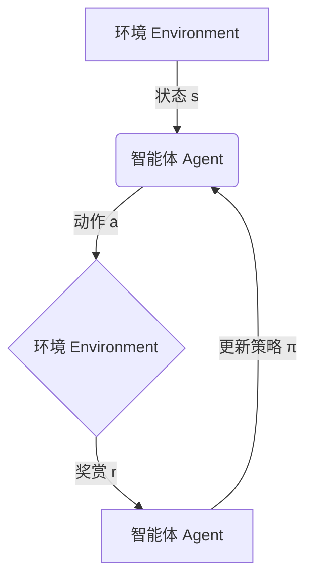
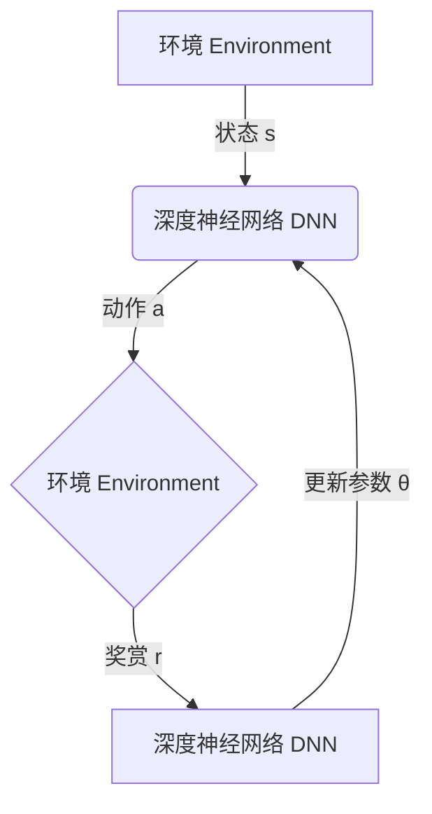

好的,我明白了您的要求。以下是标题为《深度强化学习(Deep Reinforcement Learning)原理与代码实例讲解》的技术博客文章正文内容:

# 深度强化学习 (Deep Reinforcement Learning) 原理与代码实例讲解

## 1. 背景介绍

### 1.1 问题的由来

在传统的机器学习领域中,监督学习和非监督学习长期占据主导地位。监督学习需要大量标注好的训练数据,而获取这些数据的代价往往是昂贵的;非监督学习虽然不需要标注数据,但其应用场景相对有限。相比之下,强化学习则提供了一种全新的范式,它让智能体(agent)通过与环境(environment)的互动,自主学习如何完成特定任务,从而绕开了数据标注的限制。

传统的强化学习算法主要基于查表(tabular)方法,如Q-Learning、Sarsa等,但这类算法在解决问题的能力和可扩展性方面都存在局限性。例如在解决连续状态和动作空间的问题时,查表方法将变得低效且不实用。

### 1.2 研究现状  

为了解决传统强化学习算法的局限,研究人员开始将深度学习(deep learning)的思想引入到强化学习中,从而催生了深度强化学习(Deep Reinforcement Learning,简称DRL)这一新兴热点领域。深度强化学习利用深度神经网络来逼近策略(policy)或者值函数(value function),使得强化学习算法能够直接从原始的高维环境状态中学习,大大提高了算法的泛化能力和处理复杂问题的能力。

自2013年以来,深度强化学习取得了令人瞩目的进展,在多个领域创造了人类水平的表现,如Atari视频游戏、国际象棋、围棋、星际争霸等。2016年,DeepMind的AlphaGo战胜了世界顶尖职业围棋手李世石,成为人工智能发展的里程碑事件。同年,DeepMind的深度强化学习算法在Atari视频游戏中超过了人类表现。2019年,AlphaStar在星际争霸II中战胜了顶级职业选手,进一步展现了深度强化学习在复杂决策领域的卓越能力。

### 1.3 研究意义

深度强化学习作为机器学习的一个全新范式,其重要意义主要体现在以下几个方面:

1. **自主学习能力**:传统的监督学习和非监督学习都需要预先准备好数据集,而深度强化学习则让智能体能够通过与环境的互动自主获取经验并学习,这种自主学习能力更加贴近真实世界场景。

2. **泛化能力强**:深度神经网络的优势在于能够从原始的高维输入中提取有用的特征,因此深度强化学习算法具有很强的泛化能力,能够应对复杂的环境状态。

3. **连续控制**:深度强化学习能够直接对连续的状态空间和动作空间建模,从而可以解决诸如机器人控制、自动驾驶等实际的连续控制问题。

4. **多领域应用**:深度强化学习展现出了强大的通用性,它已经在视频游戏、机器人控制、自然语言处理、计算机系统优化等多个领域取得了卓越的成绩,未来还有更广阔的应用前景。

### 1.4 本文结构

本文将全面介绍深度强化学习的核心原理、关键算法、数学模型以及实际应用。具体来说,文章主要包括以下几个部分:

- 核心概念与联系
- 核心算法原理及具体操作步骤
- 数学模型和公式详细推导及案例分析
- 项目实践:代码实例和详细解释说明  
- 实际应用场景分析
- 工具和学习资源推荐
- 总结:未来发展趋势与挑战

## 2. 核心概念与联系

要理解深度强化学习,首先需要了解强化学习(Reinforcement Learning)的核心概念。强化学习是一种基于奖赏机制的学习方法,其核心思想是让智能体(agent)通过与环境(environment)的交互作用,从环境中获得反馈奖赏(reward),并据此不断调整自身的行为策略(policy),最终学习到一个在该环境中表现良好的最优策略。

强化学习问题通常建模为马尔可夫决策过程(Markov Decision Process,MDP),其中包含以下几个关键要素:

- 状态(State) $s$:描述环境的当前状态
- 动作(Action) $a$:智能体在当前状态下可执行的动作
- 奖赏(Reward) $r$:智能体执行动作后,环境给出的反馈奖赏值
- 策略(Policy) $\pi$:智能体根据当前状态选择动作的策略映射
- 值函数(Value Function):评估当前状态的长期回报价值

强化学习算法的目标是找到一个最优策略$\pi^*$,使得在该策略指导下,智能体能够获得最大化的长期累积奖赏。



传统的强化学习算法通常采用查表(tabular)方法,使用Q表(Q-table)或者价值表(Value table)来存储状态-动作对应的Q值或价值估计。但这种方法在解决高维、连续的状态和动作空间时,将变得低效且不实用。

深度强化学习(Deep Reinforcement Learning)的核心思想,就是利用深度神经网络来逼近策略函数$\pi(a|s)$或者值函数$V(s)$,使得强化学习算法能够直接从原始的高维环境状态中学习,从而绕开了查表方法的限制,大大提高了算法的泛化能力和处理复杂问题的能力。



深度强化学习算法主要分为两大类:基于值函数的算法(Value-based)和基于策略的算法(Policy-based)。前者利用深度神经网络来逼近状态值函数或者动作值函数,后者则直接使用深度神经网络来逼近策略函数。此外,还有一类Actor-Critic算法,它结合了两者的优点。

## 3. 核心算法原理及具体操作步骤

在深度强化学习领域中,有多种经典算法,每种算法都有其独特的原理和优缺点。本节将介绍几种核心算法的基本原理、具体操作步骤以及适用场景。

### 3.1 算法原理概述

#### 3.1.1 深度Q网络(Deep Q-Network, DQN)

DQN是第一个将深度学习成功应用于强化学习的算法,它利用深度神经网络来逼近Q函数(动作值函数)。DQN算法的核心思想包括:

1. 使用经验回放池(Experience Replay)来缓解数据相关性问题
2. 目标网络(Target Network)的引入,使训练更加稳定
3. 终止状态双重估计(Double DQN)避免了值估计的偏差

DQN适用于离散动作空间的任务,在Atari视频游戏等领域取得了卓越的表现。

#### 3.1.2 深度确定性策略梯度(Deep Deterministic Policy Gradient, DDPG)

DDPG是一种基于Actor-Critic架构的算法,它结合了基于值函数(DQN)和基于策略的优点,可以应用于连续动作空间的问题。DDPG算法包含以下关键部分:

1. Actor网络:确定性策略网络,输出连续的动作
2. Critic网络:评估当前状态-动作对的Q值
3. 经验回放池和软更新目标网络的方法与DQN类似

DDPG在机器人控制、自动驾驶等连续控制任务中表现出色。

#### 3.1.3 异步优势Actor-Critic (Asynchronous Advantage Actor-Critic, A3C)

A3C是一种基于Actor-Critic架构的异步并行算法,它可以在多个环境实例上同时学习,从而提高了数据利用效率。A3C包含以下关键部分:

1. 多个Actor-Learner线程,分别与环境实例交互获取数据
2. 一个中央的Critic网络,汇总所有Actor的梯度更新参数
3. 使用优势函数(Advantage Function)来估计每个动作的优势值

A3C具有较好的数据利用效率和稳定性,适用于并行加速训练。

#### 3.1.4 深度Q网络进化(Deep Q-Network Evolution, DQN Evolution)

DQN Evolution算法将深度Q网络与进化策略(Evolution Strategies)相结合,通过对神经网络权重进行高效的黑盒优化,从而提高了DQN在Atari游戏中的表现。该算法的关键在于:

1. 使用进化策略对神经网络权重进行高效优化
2. 引入一种基于差异种群的新型突变方法
3. 并行评估多个神经网络种群以提高效率

DQN Evolution展现了将深度强化学习与其他优化技术相结合的巨大潜力。

### 3.2 算法步骤详解

下面将以DQN算法为例,详细阐述其核心步骤。

DQN算法的伪代码如下:

```python
初始化经验回放池D
初始化Q网络参数θ
初始化目标Q网络参数θ' = θ  

for episode:
    初始化环境状态s
    while not terminal:
        使用ϵ-贪婪策略从Q网络选择动作a = max_a Q(s,a;θ)
        执行动作a,观测奖励r和新状态s'
        将(s,a,r,s')存入经验回放池D
        从D中随机采样一个批次的转移(s,a,r,s')
        计算目标Q值: y = r + γ * max_a' Q(s',a';θ') (终止状态时y=r)
        优化损失: L = E[(y - Q(s,a;θ))^2]
        每隔一定步数将θ'=θ (软更新目标网络参数)
        s = s'
        
until 达到终止条件
```

算法的核心步骤包括:

1. **初始化**: 初始化经验回放池D、Q网络参数θ和目标Q网络参数θ'。

2. **与环境交互获取数据**:
    - 根据当前状态s和ϵ-贪婪策略从Q网络中选择动作a
    - 在环境中执行动作a,获得奖励r和新状态s'
    - 将(s,a,r,s')转移存入经验回放池D

3. **从经验回放池采样数据**:
    - 从经验回放池D中随机采样一个批次的转移(s,a,r,s')

4. **计算目标Q值**:
    - 对于非终止状态,目标Q值为: $y = r + \gamma \max_{a'} Q(s', a'; \theta')$
    - 对于终止状态,目标Q值为: $y = r$

5. **优化Q网络**:
    - 使用均方差损失函数: $L = \mathbb{E}_{(s,a,r,s')\sim D}\left[(y - Q(s, a; \theta))^2\right]$
    - 通过梯度下降优化Q网络参数θ

6. **软更新目标Q网络**:
    - 每隔一定步数,使用$\theta' = \alpha\theta' + (1 - \alpha)\theta$的方式软更新目标Q网络参数θ'

7. **循环直至终止**:重复上述步骤,直至达到终止条件(如最大回合数)。

DQN算法的关键创新点在于引入了经验回放池、目标Q网络和终止状态双重估计,从而使得Q网络的训练更加稳定,避免了Q值估计的偏差。

### 3.3 算法优缺点

#### 优点:

- 突破了传统强化学习算法处理高维状态和连续动作空间的瓶颈
- 利用深度神经网络的泛化能力,可以学习复杂的状态-动作映射
- 经验回放池和目标网络等技巧提高了训练稳定性
- 算法具有较强的通用性,可应用于多个