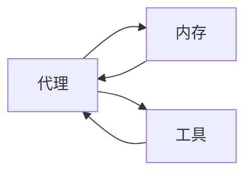

# 由 LangChain 框架接手大模型管理

## 1. 背景介绍

### 1.1 问题的由来

随着人工智能技术的不断发展,大型语言模型(Large Language Models, LLMs)的应用越来越广泛。这些模型通过从海量文本数据中学习,能够生成看似人类写作的自然语言输出。但是,管理和利用这些庞大的模型并非一件轻而易举的事情。

传统的软件开发方法很难满足大模型的需求,主要原因有以下几点:

1. **计算资源需求巨大**: 大型语言模型通常包含数十亿甚至数万亿个参数,推理时需要大量的计算资源,这对于普通的软件系统来说是一个巨大的挑战。

2. **模型复杂性高**: 这些模型的内部结构和工作原理非常复杂,需要专门的知识和技能来理解和操作它们。

3. **缺乏标准化接口**: 不同的大模型提供商和框架之间缺乏统一的接口规范,这增加了集成和部署的难度。

4. **安全和隐私问题**: 大模型可能会生成有害或不当的内容,同时也可能泄露隐私数据,因此需要采取适当的安全措施。

为了解决这些挑战,需要一种新的软件架构和开发范式来管理和利用大型语言模型。

### 1.2 研究现状

目前,已经出现了一些解决方案,旨在简化大模型的管理和应用。其中,LangChain 是一个值得关注的开源框架。

LangChain 是一个用于构建大型语言模型应用程序的框架。它提供了一种模块化和可组合的方式来构建语言模型应用程序,并且支持多种大模型提供商和框架。LangChain 的目标是使开发人员能够更轻松地集成和利用大型语言模型,同时提供了一些内置的功能,如代理、内存和工具集成。

### 1.3 研究意义

随着大型语言模型在各个领域的应用不断增加,有效管理和利用这些模型将变得越来越重要。LangChain 作为一个专门为大模型设计的框架,可以帮助开发人员更高效地构建和部署基于大模型的应用程序。

本文将深入探讨 LangChain 框架的核心概念、原理和实现细节,旨在为读者提供一个全面的理解,并展示如何使用 LangChain 来构建实际的大模型应用程序。

### 1.4 本文结构

本文的结构如下:

1. **背景介绍**: 介绍大型语言模型带来的挑战,以及 LangChain 框架的研究现状和意义。
2. **核心概念与联系**: 解释 LangChain 框架中的核心概念,如代理、内存、工具等,以及它们之间的关系。
3. **核心算法原理与具体操作步骤**: 详细阐述 LangChain 框架中的核心算法原理,如序列到序列模型、注意力机制等,并介绍具体的操作步骤。
4. **数学模型和公式详细讲解与举例说明**: 深入探讨 LangChain 框架中使用的数学模型和公式,如transformer模型、损失函数等,并通过具体案例进行讲解和说明。
5. **项目实践:代码实例和详细解释说明**: 提供一个基于 LangChain 框架的实际项目案例,包括开发环境搭建、源代码实现、代码解读和运行结果展示。
6. **实际应用场景**: 介绍 LangChain 框架在不同领域的实际应用场景,如自然语言处理、问答系统、内容生成等。
7. **工具和资源推荐**: 推荐一些学习 LangChain 框架的资源、开发工具、相关论文和其他有用资源。
8. **总结:未来发展趋势与挑战**: 总结 LangChain 框架的研究成果,探讨其未来发展趋势,并分析可能面临的挑战和研究展望。
9. **附录:常见问题与解答**: 列出一些关于 LangChain 框架的常见问题,并给出解答。

## 2. 核心概念与联系

LangChain 框架中有几个核心概念,它们相互关联,共同构建了一个强大的大模型管理和应用程序开发平台。

### 2.1 代理 (Agents)

代理是 LangChain 框架中的核心概念之一。代理是一个智能实体,它可以根据用户的输入和目标,自主地计划和执行一系列操作,以完成特定的任务。

代理的工作原理如下:

1. 接收用户的输入和目标。
2. 根据目标,规划一系列操作步骤。
3. 执行每个操作步骤,可能涉及调用工具、查询知识库或与人交互。
4. 根据操作结果,更新状态并决定下一步操作。
5. 重复步骤 3 和 4,直到完成目标任务。
6. 将最终结果返回给用户。

代理可以是单一的,也可以是由多个子代理组成的分层结构。分层代理可以更好地处理复杂的任务,每个子代理负责不同的子任务。

LangChain 提供了多种预定义的代理类型,如序列化代理、反思代理、对话代理等,开发人员也可以定制自己的代理类型。

### 2.2 内存 (Memory)

内存是代理用于存储和检索信息的组件。在执行任务的过程中,代理可以将中间结果和相关信息存储在内存中,以供后续使用。

LangChain 支持多种内存类型,如简单内存、对话内存、向量存储内存等。不同的内存类型适用于不同的场景,开发人员可以根据需求选择合适的内存类型。

内存与代理紧密相连,代理可以读写内存,内存则为代理提供了信息存储和检索的能力。通过内存,代理可以维护任务执行的状态和上下文,从而更好地完成复杂的任务。

### 2.3 工具 (Tools)

工具是代理可以调用的外部功能或服务。工具可以执行各种任务,如查询知识库、进行数学计算、调用 API、与人交互等。

LangChain 提供了许多预定义的工具,如 Wikipedia 查询工具、Python REPL 工具、Wolfram Alpha 工具等。开发人员也可以定制自己的工具,将任何外部功能或服务封装为工具。

代理可以在执行任务的过程中调用一个或多个工具,将工具的输出作为信息源,并将结果存储在内存中。通过组合不同的工具,代理可以完成复杂的任务。

### 2.4 代理-内存-工具的关系

代理、内存和工具是 LangChain 框架的三大核心概念,它们之间存在着紧密的关联。

代理是智能实体,负责规划和执行任务。内存为代理提供了信息存储和检索的能力,代理可以在执行任务的过程中读写内存。工具是代理可以调用的外部功能或服务,代理可以利用工具的输出作为信息源,完成复杂的任务。

这三个概念相互依赖,共同构建了 LangChain 框架的核心功能。代理依赖内存和工具来完成任务,内存和工具则为代理提供了必要的支持。

下图展示了代理、内存和工具之间的关系:

在这个关系图中,代理可以读写内存,并调用工具。内存和工具的输出都会反馈给代理,代理根据这些信息规划和执行下一步操作。

通过这种模块化和可组合的设计,LangChain 框架为开发人员提供了构建大型语言模型应用程序的强大能力。

## 3. 核心算法原理与具体操作步骤

LangChain 框架的核心算法原理主要基于序列到序列模型(Sequence-to-Sequence Model)和注意力机制(Attention Mechanism)。这些算法原理为大型语言模型的生成和理解提供了坚实的理论基础。

### 3.1 算法原理概述

#### 3.1.1 序列到序列模型

序列到序列模型是一种端到端的神经网络模型,它可以将一个序列(如自然语言文本)映射到另一个序列(如目标语言文本或任务输出)。

序列到序列模型通常由两个主要组件组成:编码器(Encoder)和解码器(Decoder)。编码器将输入序列编码为一个向量表示,而解码器则根据这个向量表示生成目标序列。

在 LangChain 框架中,序列到序列模型被用于各种自然语言处理任务,如机器翻译、文本摘要、问答系统等。大型语言模型通常采用基于transformer的序列到序列模型架构,如 GPT、BERT 等。

#### 3.1.2 注意力机制

注意力机制是序列到序列模型中的一种关键技术,它允许模型在生成序列时,selectively关注输入序列的不同部分。

传统的序列模型通常使用固定长度的向量来表示整个输入序列,这可能会导致信息丢失。注意力机制则通过计算输入序列中每个元素与当前生成的元素之间的相关性分数,从而动态地捕获输入序列中的重要信息。

注意力机制大大提高了序列到序列模型的性能,特别是在处理长序列时。它使模型能够更好地捕获长距离依赖关系,并生成更准确、更连贯的输出序列。

在 LangChain 框架中,注意力机制被广泛应用于各种大型语言模型,如 GPT、BERT 等。它是这些模型实现出色性能的关键技术之一。

### 3.2 算法步骤详解

在 LangChain 框架中,序列到序列模型和注意力机制的具体实现步骤如下:

1. **输入编码**:将输入序列(如自然语言文本)转换为一系列向量表示,通常使用词嵌入(Word Embedding)或子词嵌入(Subword Embedding)技术。

2. **位置编码**:由于序列模型需要捕获序列中元素的位置信息,因此需要在输入向量中添加位置编码(Position Encoding)。

3. **多头注意力**:输入向量通过多头注意力(Multi-Head Attention)层,计算每个输入元素与其他元素之间的注意力分数,从而捕获长距离依赖关系。

4. **前馈神经网络**:注意力层的输出通过前馈神经网络(Feed-Forward Neural Network)进行进一步处理,生成更高级的特征表示。

5. **编码器-解码器架构**:编码器将输入序列编码为一个向量表示,解码器则根据这个向量表示生成目标序列。解码器也使用注意力机制,selectively关注输入序列中的不同部分。

6. **梯度下降优化**:使用监督学习方法,通过梯度下降算法优化模型参数,最小化预定义的损失函数(如交叉熵损失)。

7. **生成输出**:在推理阶段,解码器根据输入序列和已生成的部分序列,逐步生成目标序列的每个元素,直到达到终止条件(如生成特殊的结束标记)。

这些步骤通过神经网络的端到端训练,使模型能够自动学习将输入序列映射到目标序列的最优方式。注意力机制在整个过程中发挥着关键作用,它使模型能够更好地捕获长距离依赖关系,从而生成更准确、更连贯的输出序列。

### 3.3 算法优缺点

序列到序列模型和注意力机制在自然语言处理任务中表现出色,但也存在一些优缺点:

**优点**:

1. **端到端训练**:这些模型可以通过端到端的方式直接从数据中学习,无需手工设计特征或规则。

2. **长距离依赖捕获**:注意力机制使模型能够更好地捕获长距离依赖关系,提高了模型在处理长序列时的性能。

3. **可解释性**:注意力分数可以视为模型对输入序列中不同部分的重要性评估,提供了一定程度的可解释性。

4. **泛化能力强**:这些模型具有很强的泛化能力,可以