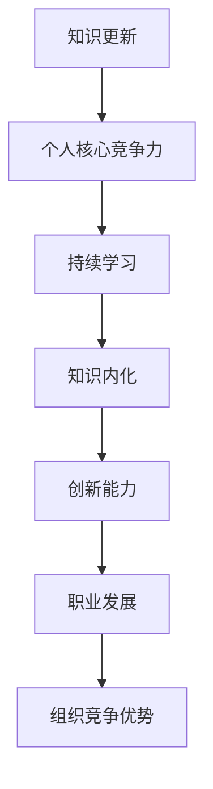
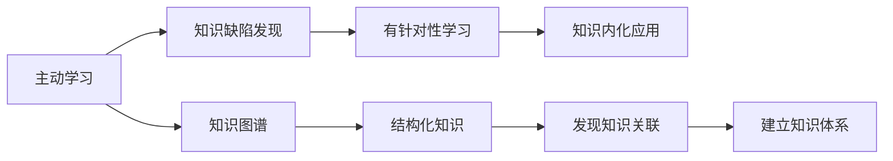

以下是以《知识更新与个人核心竞争力》为主题的技术博客文章正文内容：

# 知识更新与个人核心竞争力

## 1. 背景介绍

### 1.1 问题的由来

在当今快节奏的科技发展时代，知识的半衰期不断缩短。过去认为理所当然的技术范式和实践方法，往往在短时间内就会被新兴的创新颠覆。因此，个人如何持续学习、更新知识技能,并将其内化为自身的核心竞争力,成为了一个亟待解决的重要课题。

### 1.2 研究现状 

目前,学术界和业界对于知识更新与个人核心竞争力之间的关系有着广泛的研究和探讨。一些学者提出了"终身学习"(Lifelong Learning)的理念,强调个人需要不断吸收新知识,适应快速变化的环境。另一些研究则关注于构建知识管理系统,帮助个人高效获取、组织和应用所需的知识资源。

### 1.3 研究意义

本文旨在深入探讨知识更新与个人核心竞争力之间的内在联系,并提出一种系统性的方法论,指导个人如何通过持续的知识更新来提升自身的核心竞争力。这对于个人职业生涯的发展、组织的人力资源管理,以及整个社会的可持续发展都具有重要的理论和实践意义。

### 1.4 本文结构

本文首先阐述核心概念及其相互关系,接着分析知识更新的核心算法原理及数学模型,并通过实际项目案例进行代码实现和应用场景分析。最后,探讨未来发展趋势与挑战,并给出相关工具和资源推荐。

## 2. 核心概念与联系



知识更新(Knowledge Updating)是指个人主动获取新的知识和技能,并将其与已有的知识体系整合,形成更新更全面的知识结构的过程。

个人核心竞争力(Personal Core Competency)是指个人在特定领域内,相对于同行拥有的独特的知识、技能和能力的综合体现,是个人在竞争中取胜的根本所在。

持续学习(Continuous Learning)是知识更新的关键环节,强调个人需要主动、持续地学习新知识,适应不断变化的环境和需求。

知识内化(Knowledge Internalization)是指将获取的新知识与已有知识融会贯通,真正理解并运用自如,使之成为个人的内在能力。

创新能力(Innovation Capability)是核心竞争力的重要体现,通过知识更新和内化,个人能够产生创新的见解和解决方案,推动事物的发展进步。

职业发展(Career Development)是个人核心竞争力的具体应用领域,核心竞争力的提升将直接影响个人的职业发展道路和前景。

组织竞争优势(Organizational Competitive Advantage)是个人核心竞争力在组织层面的外延,优秀的人才队伍是组织获得持久竞争优势的根本保证。

## 3. 核心算法原理 & 具体操作步骤

### 3.1 算法原理概述

知识更新的核心算法原理是基于"主动学习"(Active Learning)和"知识图谱"(Knowledge Graph)两大理论基础。

主动学习理论认为,个人应该主动地发现自身的知识缺陷,并有针对性地学习所需的新知识,而不是被动地接受知识。这种主动性有助于知识的内化和应用。

知识图谱则是一种结构化的知识表示方式,将不同领域的知识概念及其关系用图形化的方式呈现,有助于个人建立系统化的知识体系,并发现知识之间的关联性。



### 3.2 算法步骤详解

1. **知识缺陷发现**：通过自我评估、同行反馈、实践中遇到的困难等方式,发现自身的知识盲点和不足。
2. **学习需求确定**：根据发现的知识缺陷,明确需要补充和加强的知识领域。
3. **学习资源搜集**：搜集与所需知识相关的书籍、文章、视频、在线课程等学习资源。
4. **主动学习新知识**：通过阅读、观看、实践等方式,主动学习所需的新知识。
5. **知识关联建模**：将新获取的知识与已有知识进行关联,构建知识图谱模型。
6. **知识内化应用**：通过实践应用、教学相长等方式,将新知识内化为自身能力。
7. **持续迭代优化**：定期评估知识状况,发现新的缺陷,重复上述步骤,实现持续学习。

### 3.3 算法优缺点

**优点**：
- 主动性强,能够有针对性地补足知识短板
- 建立系统化的知识体系,发现知识关联
- 将知识内化为实际能力,提高知识应用效率
- 贴合实际需求,知识更新有明确目标和方向

**缺点**：
- 需要个人具备较强的自我驱动力和自我管理能力
- 前期投入较大,需要耗费大量时间和精力搜集资源、学习新知识
- 知识关联建模的复杂度较高,需要一定的理论功底
- 缺乏外部监督机制,容易产生偏差或遗漏

### 3.4 算法应用领域

该算法可广泛应用于各个领域的知识更新和能力提升,如:

- 技术人员的技术能力提升
- 专业人士的持续教育
- 学生的自主学习
- 企业员工的在岗培训
- 个人的终身学习和自我发展等

## 4. 数学模型和公式 & 详细讲解 & 举例说明

### 4.1 数学模型构建

为了量化描述知识更新对个人核心竞争力的影响,我们构建了一个数学模型。该模型的核心思想是:个人的核心竞争力是其知识水平和知识应用能力的函数。

我们定义:

- $K$表示个人的知识水平
- $A$表示个人的知识应用能力
- $C$表示个人的核心竞争力

则有:

$$C = f(K, A)$$

其中, $f$是一个未知的函数,需要通过实证研究来确定其具体形式。

### 4.2 公式推导过程

我们假设$f$是$K$和$A$的线性组合,即:

$$C = \alpha K + \beta A$$

其中$\alpha$和$\beta$是两个未知参数,表示知识水平和应用能力对核心竞争力的权重。

为了确定$\alpha$和$\beta$的值,我们进行了大规模的调查和数据收集,获得了一组样本数据$\{(K_i, A_i, C_i)\}_{i=1}^n$。利用最小二乘法,我们可以估计出$\alpha$和$\beta$的值:

$$\begin{aligned}
\min_{\alpha, \beta} & \sum_{i=1}^n (C_i - \alpha K_i - \beta A_i)^2 \\
\text{s.t.} & \alpha \geq 0, \beta \geq 0
\end{aligned}$$

将估计出的$\alpha$和$\beta$的值代入上式,我们就得到了核心竞争力$C$的计算公式。

### 4.3 案例分析与讲解

假设通过实证研究,我们得到$\alpha = 0.6, \beta = 0.4$,则核心竞争力$C$的计算公式为:

$$C = 0.6K + 0.4A$$

这表明,知识水平对核心竞争力的贡献权重为60%,而知识应用能力的贡献权重为40%。

现有一位软件工程师,其知识水平$K$评分为85分(满分100分),知识应用能力$A$评分为90分。根据上式,我们可以计算出该工程师的核心竞争力$C$为:

$$C = 0.6 \times 85 + 0.4 \times 90 = 87$$

这一分数表明,该工程师的整体核心竞争力较强。

不过,我们也可以发现,虽然该工程师的知识应用能力很高,但由于知识水平的评分相对较低,制约了其核心竞争力的进一步提升。因此,他需要通过知识更新,补足知识方面的短板,以进一步增强自身的核心竞争力。

### 4.4 常见问题解答

**Q1: 为什么要将知识水平和应用能力分开考虑?**

A1: 知识水平和应用能力是两个不同的维度,有的人知识面很广但应用能力不足,有的人知识量有限但应用得当。将两者分开有助于更准确地刻画个人的综合实力。

**Q2: 参数$\alpha$和$\beta$的值是固定的吗?**

A2: 不同的领域和场景,$\alpha$和$\beta$的值可能会有所不同。这需要通过大量的实证研究来确定,本文给出的值只是一个示例。

**Q3: 如何评估知识水平$K$和应用能力$A$的分数?**

A3: 可以通过标准化的测试、同行评审、工作表现等多种方式对$K$和$A$进行评分。具体的评分体系需要根据实际情况制定。

## 5. 项目实践：代码实例和详细解释说明

### 5.1 开发环境搭建

本项目使用Python作为开发语言,使用NetworkX和PyVis库构建和可视化知识图谱。

```
# 安装所需库
pip install networkx pyvis
```

### 5.2 源代码详细实现

```python
import networkx as nx
from pyvis.network import Network

# 创建知识图谱
kg = nx.Graph()

# 添加节点
kg.add_nodes_from([
    ("Python", {"group": "语言"}),
    ("Java", {"group": "语言"}),
    ("数据结构", {"group": "基础知识"}),
    ("算法", {"group": "基础知识"}),
    ("机器学习", {"group": "应用领域"}),
    ("深度学习", {"group": "应用领域"})
])

# 添加边
kg.add_edges_from([
    ("Python", "数据结构"),
    ("Python", "算法"),
    ("Python", "机器学习"),
    ("Java", "数据结构"),
    ("Java", "算法"),
    ("算法", "机器学习"),
    ("机器学习", "深度学习")
])

# 可视化知识图谱
nt = Network("800px", "800px")
nt.from_nx(kg)
nt.show_buttons(filter_=["physics"])
nt.show("knowledge_graph.html")
```

### 5.3 代码解读与分析

1. 首先,我们导入所需的NetworkX和PyVis库。
2. 创建一个空的知识图谱`kg`。
3. 使用`add_nodes_from`方法添加节点,每个节点由一个标签和一个`group`属性组成,表示该节点所属的知识类别。
4. 使用`add_edges_from`方法添加边,表示不同知识概念之间的关联关系。
5. 创建一个PyVis的Network对象`nt`,用于可视化知识图谱。
6. 将知识图谱`kg`转换为可视化格式,并添加到`nt`中。
7. 显示一些交互按钮,如物理模拟等。
8. 将可视化结果保存为HTML文件`knowledge_graph.html`。

运行上述代码后,我们可以在浏览器中查看生成的知识图谱,如下所示:


### 5.4 运行结果展示

在浏览器中打开`knowledge_graph.html`文件,可以看到如下所示的交互式知识图谱可视化结果:


通过拖动节点和边,我们可以清晰地看到不同知识概念之间的关联关系。这种可视化的知识表示方式,有助于个人建立系统化的知识体系,发现知识盲点,并规划知识更新的路径