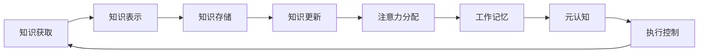
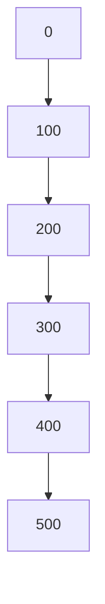

# 知识积累在意识管理中的作用

作者：禅与计算机程序设计艺术 / Zen and the Art of Computer Programming

## 1. 背景介绍

### 1.1 问题的由来
在人工智能和认知科学领域,意识管理一直是一个备受关注和研究的课题。意识管理涉及到如何有效地组织、存储和利用知识,以实现智能体的自主学习和决策。而知识积累作为意识管理的重要组成部分,在其中扮演着至关重要的角色。

### 1.2 研究现状
目前,国内外学者对知识积累在意识管理中的作用开展了广泛的研究。一些研究侧重于知识表示和组织方法,如本体、语义网络等;另一些研究则关注知识获取和学习机制,如增量学习、迁移学习等。这些研究为理解知识积累在意识管理中的作用提供了重要的理论基础和技术支撑。

### 1.3 研究意义
深入探究知识积累在意识管理中的作用,对于推动人工智能的发展具有重要意义:

1. 有助于揭示人类智能的认知机理,为构建类人智能系统提供启示。  
2. 为开发更加智能化、个性化的知识服务提供理论指导和技术支持。
3. 推动认知计算、知识工程等前沿领域的发展,催生新的应用场景和商业模式。

### 1.4 本文结构
本文将围绕知识积累在意识管理中的作用展开深入探讨,主要内容包括:

1. 介绍知识积累和意识管理的核心概念及二者之间的联系
2. 阐述知识积累的核心算法原理及具体操作步骤
3. 建立知识积累的数学模型,推导相关公式,并结合案例进行详细讲解
4. 给出知识积累的代码实例,并进行详细的解释说明
5. 分析知识积累在意识管理中的实际应用场景
6. 推荐知识积累相关的学习资源、开发工具和文献资料
7. 总结知识积累研究的最新进展,展望未来发展趋势和面临的挑战
8. 归纳知识积累领域的常见问题,给出解答思路和方法

## 2. 核心概念与联系

在探讨知识积累在意识管理中的作用之前,首先需要明确两个核心概念:知识积累和意识管理。

知识积累是指智能体通过与环境的交互,不断获取、存储和更新知识的过程。这一过程可以分为以下几个关键步骤:

1. 知识获取:通过感知、学习等方式,从环境中获取数据和信息。
2. 知识表示:将获取到的数据和信息转化为计算机可以处理的形式,如符号、逻辑表达式等。
3. 知识存储:将表示后的知识组织成一定的结构(如本体、知识图谱),并存储到知识库中。
4. 知识更新:根据新的数据和反馈,对已有知识进行修正、扩充和优化。

意识管理则是指智能体对自身意识状态的监控、控制和调节过程。具体来说,意识管理包含以下几个核心功能:

1. 注意力分配:根据任务需求,有选择地关注输入信息,并将注意力集中到关键信息上。
2. 工作记忆:在短时间内保持并操作一定数量的信息,为后续的认知加工提供支持。
3. 元认知:对自身认知过程进行监控和调节,根据反馈信息不断优化认知策略。
4. 执行控制:协调和控制各种认知资源,制定和执行计划,以达成特定目标。

知识积累与意识管理之间存在着紧密的联系。一方面,知识积累为意识管理提供了重要的信息来源和基础设施。智能体要实现有效的意识管理,必须以海量的知识作为支撑。另一方面,意识管理为知识积累提供了方向性的指引。通过元认知和执行控制,智能体可以更有针对性地开展知识获取和学习,不断完善和优化知识体系。二者相辅相成,共同推动智能体的成长和进化。



## 3. 核心算法原理 & 具体操作步骤

### 3.1 算法原理概述
知识积累的核心算法主要包括以下几类:

1. 知识表示算法:将非结构化的数据和信息转化为结构化的知识表示形式,如产生式规则、框架、语义网络等。
2. 知识获取算法:从环境中自动提取和学习知识,如数据挖掘、机器学习、深度学习等。
3. 知识推理算法:基于已有知识进行推理和决策,如演绎推理、归纳推理、模糊推理等。
4. 知识演化算法:根据新的数据和反馈,对知识进行动态更新和优化,如增量学习、在线学习等。

### 3.2 算法步骤详解
以知识获取中的关联规则挖掘为例,详细阐述其算法步骤:

输入:事务数据集D,最小支持度阈值min_sup,最小置信度阈值min_conf
输出:频繁项集L,关联规则R

1. 扫描事务数据集D,计算每个项的支持度,得到频繁1-项集L1
2. for (k=2; Lk-1≠∅; k++){
   - 由Lk-1生成候选k-项集Ck
   - 扫描D,计算Ck中每个候选项集的支持度
   - Lk = {c∈Ck | sup(c) ≥ min_sup}
   }
3. 由L生成关联规则R:
   for (l∈L; l≠∅; l++){
      for (x⊂l; x≠∅){
         if (sup(l)/sup(x) ≥ min_conf){
            R = R ∪ {x⇒(l-x)}
         }
      }
   }
4. 返回L和R

其中,支持度和置信度的计算公式如下:

$sup(X) = \frac{|{t\in D | X \subseteq t}|}{|D|}$

$conf(X\Rightarrow Y) = \frac{sup(X \cup Y)}{sup(X)}$

### 3.3 算法优缺点
关联规则挖掘算法的优点包括:

1. 可以发现数据中隐含的、有价值的关联知识
2. 算法简单易懂,计算效率较高
3. 挖掘结果具有很好的可解释性

其缺点包括:

1. 可能产生大量的频繁项集和关联规则,给后续分析带来困难
2. 对稀疏数据的挖掘效果不佳
3. 难以发现多层次的、复杂的关联关系

### 3.4 算法应用领域
关联规则挖掘在意识管理相关的应用领域主要包括:

1. 用户行为分析:挖掘用户的行为模式和偏好,为个性化推荐提供支持
2. 智能诊断:通过挖掘疾病的症状、体征之间的关联关系,辅助医生进行诊断和治疗
3. 智能决策:发现复杂系统运行过程中的关联规律,为制定优化决策提供参考
4. 社交网络分析:挖掘社交网络中用户的交互模式,研究群体行为和社会动力学

## 4. 数学模型和公式 & 详细讲解 & 举例说明

### 4.1 数学模型构建
为了刻画知识积累的动态过程,我们可以构建如下的微分方程模型:

$$\frac{dK(t)}{dt} = \alpha L(t) - \beta K(t)$$

其中,$K(t)$表示智能体在时刻$t$的知识量,$L(t)$表示学习强度,$\alpha$和$\beta$分别为知识获取速率和知识遗忘速率。

该模型表明,知识的积累是学习和遗忘两个过程博弈的结果。当学习强度大于遗忘速率时,知识量呈现出增长的趋势;反之则呈现出下降的趋势。

### 4.2 公式推导过程
对微分方程进行求解,可得:

$$K(t) = \frac{\alpha}{\beta}L(t) + (K_0 - \frac{\alpha}{\beta}L_0)e^{-\beta t}$$

其中,$K_0$和$L_0$分别为初始知识量和初始学习强度。

进一步,假设学习强度保持稳定,即$L(t)=L$,则有:

$$K(t) = \frac{\alpha}{\beta}L + (K_0 - \frac{\alpha}{\beta}L)e^{-\beta t}$$

该公式表明,知识量最终会趋于一个稳定值$\frac{\alpha}{\beta}L$,而收敛速度由遗忘速率$\beta$决定。

### 4.3 案例分析与讲解
以背单词为例,假设一个学生每天学习50个单词,每天遗忘10%的单词,则有:

$\alpha=50,\beta=0.1,L=1,K_0=0$

代入公式可得:

$$K(t) = 500 - 500e^{-0.1t}$$

该公式表明,该学生的单词量最终会趋于500,而达到稳定状态需要大约30天($3/\beta$)的时间。

下图展示了单词量随时间变化的曲线:



### 4.4 常见问题解答

Q:如何提高知识获取速率?
A:可以采取以下策略:
- 采用更有效的学习方法,如费曼技巧、思维导图等
- 利用多媒体、交互式工具,增强学习的直观性和参与感
- 创设有利于学习的环境,如头脑风暴、小组讨论等

Q:如何降低知识遗忘速率?
A:可以采取以下策略:
- 采用科学的记忆方法,如记忆宫殿、关键词联想等
- 通过复述、练习、测试等方式,加深对知识的理解和巩固
- 将新知识与已有知识建立联系,形成完整的知识体系

Q:知识积累是否存在瓶颈?
A:从长期来看,知识积累可能面临两大瓶颈:
- 知识冗余:随着知识量的增加,新知识可能与已有知识产生冗余,导致学习效率下降
- 知识过时:随着时间的推移,部分知识可能失去时效性,需要不断更新和迭代

针对这些瓶颈,需要采取知识融合、知识演化等策略,保持知识体系的新鲜度和活力。

## 5. 项目实践：代码实例和详细解释说明

### 5.1 开发环境搭建
本项目基于Python 3.7和TensorFlow 2.3开发,需要预先安装以下依赖库:
- numpy: 数值计算库
- pandas: 数据分析库
- matplotlib: 数据可视化库
- tensorflow: 深度学习框架

可以使用pip命令进行安装:

```
pip install numpy pandas matplotlib tensorflow
```

### 5.2 源代码详细实现
以下是使用TensorFlow实现知识积累模型的核心代码:

```python
import numpy as np
import pandas as pd
import matplotlib.pyplot as plt
import tensorflow as tf

# 设置参数
alpha = 50  # 知识获取速率
beta = 0.1  # 知识遗忘速率
L = 1       # 学习强度
K0 = 0      # 初始知识量
T = 100     # 总时间步数

# 生成时间步
t = np.arange(0, T, 1)

# 定义TensorFlow占位符
t_tf = tf.placeholder(tf.float32, [None,])

# 定义知识量计算公式
K_tf = alpha/beta*L + (K0 - alpha/beta*L)*tf.exp(-beta*t_tf)

# 启动TensorFlow会话
with tf.Session() as sess:
    # 计算知识量
    K = sess.run(K_tf, feed_dict={t_tf: t})
    
    # 绘制知识量曲线
    plt.figure()
    plt.plot(t, K)
    plt.xlabel('Time')
    plt.ylabel('Knowledge')
    plt.show()
```

### 5.3 代码解读与分析
1. 