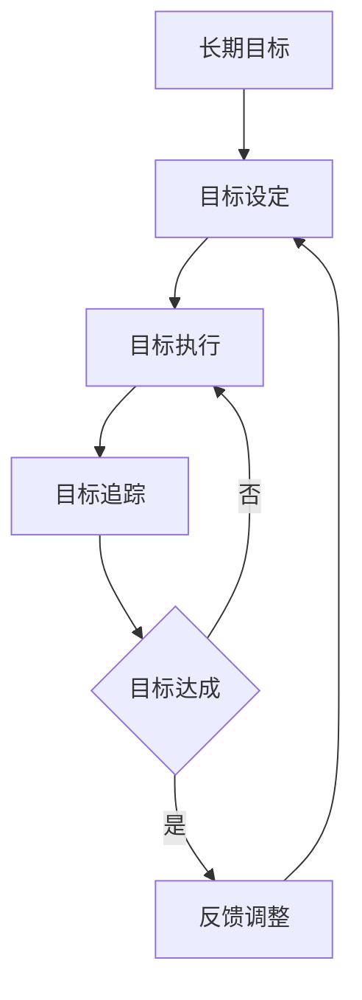

# 短期目标管理的意识功能

关键词：短期目标管理、意识功能、目标设定、目标执行、目标追踪、反馈调整

## 1. 背景介绍
### 1.1 问题的由来
在人工智能系统中,短期目标管理是一个关键的能力。它涉及到如何在复杂动态的环境中,自主地设定、执行和追踪短期目标,以实现更高层次的长期目标。这需要人工智能系统具备类似人类意识的功能,能够对内外部环境进行感知、理解、推理、决策和控制。然而,目前的人工智能系统在短期目标管理方面还存在很多局限性和挑战。

### 1.2 研究现状
近年来,短期目标管理在人工智能领域受到越来越多的关注。一些研究尝试从认知科学、神经科学的角度,借鉴人脑意识的机制,来设计人工智能系统的短期目标管理模块。比如基于工作记忆、注意力机制、执行控制等理论构建计算模型。另一些研究则从强化学习、自主学习的角度,让人工智能系统通过不断与环境交互,自主学习目标管理策略。还有研究利用逻辑推理、因果推断等方法,赋予人工智能因果思维和目的性行为的能力。

### 1.3 研究意义
短期目标管理对于提升人工智能系统的自主性、适应性、鲁棒性具有重要意义。一方面,它是实现类人的灵活智能行为的基础。在开放环境下,人工智能需要能够根据环境变化动态调整自己的目标和行为,而不是简单执行预定程序。另一方面,短期目标管理有助于人工智能在长时间尺度上的学习和进化。通过对短期目标的累积优化,可以实现对长期目标的渐进达成。此外,意识功能为元认知、自我意识、主观体验等更高级智能奠定了基础。

### 1.4 本文结构
本文将重点探讨短期目标管理中的意识功能及其实现机制。第2部分介绍相关的核心概念。第3部分讨论短期目标管理的核心算法原理和步骤。第4部分提出意识功能的数学模型和公式。第5部分给出意识功能的代码实例。第6部分分析意识功能在实际应用中的场景。第7部分推荐相关的工具和资源。第8部分总结全文并展望未来。第9部分是附录。

## 2. 核心概念与联系
短期目标管理涉及以下核心概念:
- 短期目标:指在当前环境条件下,人工智能系统需要在近期内达成的具体目标,具有明确的时间限制和可衡量的完成标准。
- 意识功能:泛指人工智能系统中类似人类意识的信息加工功能,包括感知、注意、记忆、思维、规划、决策、执行控制等。
- 目标设定:根据当前环境状态和长期目标,自主生成或选择出短期目标的过程。
- 目标执行:根据设定的短期目标,规划和执行一系列的动作与操作,以达成目标的过程。
- 目标追踪:持续监测短期目标的完成进度,判断目标状态是否达成的过程。
- 反馈调整:根据目标追踪的结果,动态修正目标设定和执行策略的过程,形成闭环控制。

这些概念环环相扣,形成短期目标管理的整体闭环,如下图所示:

## 3. 核心算法原理 & 具体操作步骤
### 3.1 算法原理概述
短期目标管理可以看作一个层次化的决策优化问题。其核心是在长期目标约束下,根据当前的环境观测,以一定的优化目标(如累积奖赏最大化),求解出最优的短期目标序列和相应的执行策略。这可以用马尔可夫决策过程(MDP)来建模,即在每个决策步,根据当前状态采取一个动作,并获得即时奖赏,同时环境转移到下一个状态,最终目标是获得长期累积奖赏的最大化。

求解最优策略的主流方法包括动态规划、蒙特卡洛树搜索、梯度策略优化等。动态规划适用于环境模型已知的情况,通过值迭代或策略迭代来计算最优状态值函数或策略。蒙特卡洛树搜索适用于环境模型未知但可以采样的情况,通过不断试错来逼近最优决策路径。梯度策略优化适用于环境模型和奖赏函数可导的情况,通过梯度上升来更新策略参数。

### 3.2 算法步骤详解
以蒙特卡洛树搜索(MCTS)为例,短期目标管理可以分为以下步骤:
1. 根据长期目标和当前环境观测,在目标空间中采样出一组可能的短期目标。
2. 对每个短期目标,基于当前的执行策略,在有限的搜索深度内对环境进行模拟试错。
3. 根据模拟结果,估计每个短期目标的长期累积奖赏,并计算其不确定性。
4. 选择具有最大置信上界(UCB)的短期目标,在实际环境中执行相应动作。 
5. 根据环境反馈,更新短期目标的模拟统计量,并扩展新的搜索节点。
6. 重复步骤2-5,直到当前短期目标完成或达到预设的搜索预算。
7. 根据多次搜索的综合结果,选择长期累积奖赏最高的短期目标序列作为最优解。

### 3.3 算法优缺点
MCTS算法的优点是:
- 不需要事先知道环境转移概率和奖赏函数,仅依靠试错搜索就可以找到近似最优解。
- 能够权衡探索和利用,在有限的搜索预算内,自适应地选择最有潜力的决策路径。
- 搜索树可以增量式扩展和复用,支持连续多步决策。

但MCTS算法也有一些局限性:
- 需要能够对环境进行快速的模拟采样,当环境复杂度高或采样成本大时,将影响搜索效率。
- 需要设计合适的探索策略和置信上界函数,平衡探索和利用的比例。
- 容易陷入局部最优,对初始采样质量敏感。可能错过全局最优解。

### 3.4 算法应用领域 
MCTS算法及其变体被广泛应用于以下领域:
- 博弈游戏:如围棋、国际象棋、德州扑克等,通过自我对弈来寻找最优策略。
- 组合优化:如旅行商问题、车间调度等,通过随机采样来逼近全局最优解。
- 机器人控制:如自动驾驶、机械臂操作等,通过试错模拟来规划最优行动序列。
- 推荐系统:如广告投放、个性化推荐等,通过探索新的用户-物品匹配来提升累积奖赏。

## 4. 数学模型和公式 & 详细讲解 & 举例说明
### 4.1 数学模型构建
我们可以用马尔可夫决策过程(MDP)来形式化地描述短期目标管理问题。一个MDP由以下元素组成:
- 状态空间 $\mathcal{S}$:所有可能的环境状态的集合。
- 动作空间 $\mathcal{A}$:在每个状态下,所有可能的动作选择的集合。
- 转移概率 $\mathcal{P}(s'|s,a)$:在状态 $s$ 下采取动作 $a$ 后,环境转移到状态 $s'$ 的概率。
- 奖赏函数 $\mathcal{R}(s,a)$:在状态 $s$ 下采取动作 $a$ 后,获得的即时奖赏值。
- 折扣因子 $\gamma$:未来奖赏相对于当前奖赏的衰减率,取值范围 $[0,1]$。

MDP的目标是寻找一个最优策略 $\pi^*:\mathcal{S}\rightarrow\mathcal{A}$,使得从任意初始状态 $s_0$ 出发,采取该策略所获得的期望累积奖赏最大化:

$$\pi^*=\arg\max_{\pi}\mathbb{E}\left[\sum_{t=0}^{\infty}\gamma^t\mathcal{R}(s_t,\pi(s_t))\right]$$

其中, $s_t$ 表示在时刻 $t$ 的状态, $\pi(s_t)$ 表示策略 $\pi$ 在状态 $s_t$ 下选择的动作。

### 4.2 公式推导过程
求解最优策略 $\pi^*$ 的核心是计算最优状态值函数 $V^*(s)$ 或最优动作值函数 $Q^*(s,a)$。它们分别表示从状态 $s$ 出发、采取最优策略能获得的期望累积奖赏,以及在状态 $s$ 下采取动作 $a$ 再采取最优策略能获得的期望累积奖赏:

$$V^*(s)=\max_{a\in\mathcal{A}}\left\{\mathcal{R}(s,a)+\gamma\sum_{s'\in\mathcal{S}}\mathcal{P}(s'|s,a)V^*(s')\right\}$$

$$Q^*(s,a)=\mathcal{R}(s,a)+\gamma\sum_{s'\in\mathcal{S}}\mathcal{P}(s'|s,a)\max_{a'\in\mathcal{A}}Q^*(s',a')$$

这两个方程被称为贝尔曼最优方程(Bellman Optimality Equation),刻画了最优值函数的递归性质。求解这两个方程的过程,就是马尔可夫决策过程的动态规划解法。

对于蒙特卡洛树搜索,我们通过反复模拟采样来估计动作值函数。定义 $N(s,a)$ 为状态动作对 $(s,a)$ 被访问的次数, $W(s,a)$ 为其累积奖赏。则平均奖赏可以估计为:

$$\bar{Q}(s,a)=\frac{W(s,a)}{N(s,a)}$$

为了权衡探索和利用,我们选择具有最大置信上界(UCB)的动作:

$$a^*=\arg\max_{a\in\mathcal{A}}\left\{\bar{Q}(s,a)+c\sqrt{\frac{\ln N(s)}{N(s,a)}}\right\}$$

其中, $c$ 是探索系数,控制探索的程度。 $\sqrt{\frac{\ln N(s)}{N(s,a)}}$ 项表示动作 $a$ 的不确定性,访问次数越少,不确定性越大,越倾向于探索。

### 4.3 案例分析与讲解
我们以一个简单的迷宫寻路问题为例,说明如何用蒙特卡洛树搜索来实现短期目标管理。假设一个智能体处在一个 $N\times N$ 的网格迷宫中,目标是在最短步数内到达迷宫的出口。迷宫中有一些障碍物,智能体无法通过。智能体在每个位置有4个可选动作:上、下、左、右,每走一步获得 $-1$ 的即时奖赏。到达出口后,获得 $+10$ 的即时奖赏,游戏结束。

我们可以将智能体当前的位置坐标 $(x,y)$ 表示为MDP的状态,将移动方向表示为MDP的动作。蒙特卡洛树搜索的过程如下:
1. 在当前状态 $(x,y)$,随机采样一个可行的移动方向 $a$,生成新的状态 $(x',y')$。 
2. 如果 $(x',y')$ 是一个新的状态,则将其加入到搜索树中,并初始化 $N(s,a)=0,W(s,a)=0$。
3. 如果 $(x',y')$ 不是出口,则递归地对其进行模拟搜索,得到一条从当前节点到游戏结束的路径,并计算累积奖赏 $R$。
4. 将 $R$ 反向传播到路径上的所有节