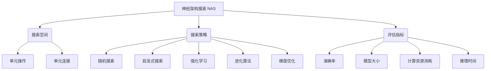

# 神经架构搜索 原理与代码实例讲解

## 1. 背景介绍

### 1.1 问题的由来

在深度学习时代,神经网络模型的性能在很大程度上取决于其架构的设计。传统上,神经网络架构是由人工手动设计的,这需要大量的专业知识和经验。然而,随着神经网络模型变得越来越复杂,手动设计高效的架构变得越来越具有挑战性。

为了解决这一问题,神经架构搜索(Neural Architecture Search, NAS)应运而生。NAS旨在自动探索优化的神经网络架构,从而减轻人工设计的负担,提高模型性能。

### 1.2 研究现状 

早期的NAS方法主要基于进化算法或强化学习,通过在搜索空间中反复训练和评估不同的架构来找到最优解。这些方法虽然有效,但计算成本非常高昂,需要数千个GPU天的计算资源。

为了提高搜索效率,研究人员提出了一些基于梯度的NAS方法,如DARTS、GDAS等。这些方法将架构搜索问题转化为连续优化问题,使用梯度下降算法进行高效搜索。然而,这些方法存在不稳定性和性能下降等问题。

最新的NAS研究侧重于设计更加高效和可扩展的搜索算法,例如基于权重共享的方法、基于单路径的方法、基于梯度的超网方法等,以期在合理的计算资源下获得更优的神经网络架构。

### 1.3 研究意义

神经架构搜索技术在以下几个方面具有重要意义:

1. **自动化设计**: NAS可以自动探索优化的神经网络架构,减轻人工设计的负担,提高效率。

2. **性能提升**: NAS能够发现人工难以设计的高效架构,从而提升模型的性能表现。

3. **泛化能力**: NAS发现的架构通常具有更好的泛化能力,在不同的数据集和任务上表现更加出色。

4. **资源节约**: NAS可以根据硬件资源约束自动搜索合适的高效架构,从而节约计算资源。

5. **新架构发现**: NAS有助于发现新颖的神经网络架构,推动深度学习理论和方法的发展。

### 1.4 本文结构

本文将全面介绍神经架构搜索的原理、算法和实践。具体内容安排如下:

- 第2部分阐述NAS的核心概念和搜索空间表示方法。
- 第3部分详细讲解NAS中常用的搜索算法原理和具体操作步骤。  
- 第4部分构建NAS的数学模型,推导关键公式,并通过案例分析加深理解。
- 第5部分提供NAS的代码实例,包括环境搭建、源代码实现、代码解读和运行结果展示。
- 第6部分探讨NAS在不同领域的实际应用场景。
- 第7部分推荐相关的学习资源、开发工具和论文等。
- 第8部分总结NAS的研究成果、未来发展趋势和面临的挑战。
- 第9部分列举NAS中常见的问题并给出解答。

## 2. 核心概念与联系  

神经架构搜索(NAS)是一种自动化设计神经网络架构的方法,旨在发现高效的网络架构以优化特定任务的性能表现。NAS包含三个核心要素:

1. **搜索空间(Search Space)**: 定义了可能的神经网络架构集合,通常由单元操作(如卷积、池化等)和单元连接方式(如残差连接、密集连接等)构成。搜索空间越大,可探索的架构就越多,但搜索难度也越高。

2. **搜索策略(Search Strategy)**: 指定如何在搜索空间中高效地探索最优架构。常用的搜索策略包括随机搜索、启发式搜索、强化学习、进化算法和梯度优化等。不同的策略具有不同的优缺点,需要根据具体情况选择合适的方法。

3. **评估指标(Evaluation Metric)**: 用于衡量架构性能的指标,如准确率、模型大小、计算资源消耗和推理时间等。评估指标的选择需要考虑具体的应用场景和需求。

这三个要素相互关联,共同决定了NAS的搜索效率和性能。合理设计搜索空间、选择高效的搜索策略,并根据评估指标对架构进行优化,是NAS算法的关键。

## 3. 核心算法原理 & 具体操作步骤

### 3.1 算法原理概述

神经架构搜索算法的核心思想是在预定义的搜索空间中智能地探索最优的神经网络架构。这通常是一个复杂的组合优化问题,需要在大量可能的架构中进行高效搜索。

根据搜索策略的不同,NAS算法可以分为以下几类:

1. **基于进化算法的NAS**: 借鉴生物进化理论,通过模拟"遗传"、"变异"和"选择"等过程,逐步演化出性能优异的架构。典型算法包括遗传算法、进化策略等。

2. **基于强化学习的NAS**: 将架构搜索建模为强化学习问题,使用代理网络(Agent)在搜索空间中探索,并根据架构性能调整搜索策略。常用的算法有策略梯度算法等。

3. **基于梯度优化的NAS**: 将离散的架构搜索问题连续化,使用梯度下降等优化算法高效搜索最优架构。代表算法包括DARTS、GDAS等。

4. **基于进化策略的NAS**: 结合进化算法和梯度优化的思想,通过进化更新权重和架构,实现高效且可扩展的搜索。例如REA、CARS等算法。

5. **基于超网络的NAS**: 构建包含所有可能架构的超级网络,并通过掩码或者权重继承等方式从中派生出子网络。代表算法有ENAS、GDAS等。

不同的算法具有不同的优缺点,需要根据具体的应用场景和计算资源进行权衡选择。

### 3.2 算法步骤详解

以基于梯度优化的DARTS算法为例,介绍NAS算法的具体步骤:

1. **定义搜索空间**

   DARTS将神经网络架构表示为一个有向无环图(DAG),其中节点表示特征张量,边表示不同的操作(如卷积、池化等)。搜索空间由一组候选操作和边的连接方式构成。

2. **构建连续可微架构参数**

   为了使用梯度优化方法,DARTS将离散的架构搜索问题连续化。具体做法是为每条边引入一个连续的架构参数$\alpha$,表示该边对应操作的重要性。

3. **定义混合操作**

   在每个节点,DARTS根据归一化的架构参数对所有候选操作进行加权求和,得到一个混合操作。这使得网络架构可以被视为操作的连续组合。

4. **双路径优化**

   DARTS同时优化网络权重参数$w$和架构参数$\alpha$。在每个训练步骤,先用当前架构参数$\alpha$计算混合操作,然后优化网络权重$w$;接着反向传播梯度,优化架构参数$\alpha$。

5. **架构派生**

   在搜索结束后,DARTS根据最终的架构参数$\alpha$,选择每条边上权重最大的操作,从而得到最终的离散神经网络架构。

6. **从头训练**

   使用派生的架构从头开始训练网络,以获得最佳性能。

DARTS算法通过连续化和双路径优化的技巧,将离散的架构搜索问题转化为连续优化问题,从而可以使用高效的梯度下降方法进行搜索。这大大提高了搜索效率,但也存在一些不稳定性和性能下降等问题。

### 3.3 算法优缺点

神经架构搜索算法具有以下优缺点:

**优点**:

1. **自动化设计**: 可以自动发现高效的神经网络架构,减轻人工设计的负担。

2. **性能提升**: 搜索得到的架构通常比手工设计的架构性能更优。

3. **泛化能力强**: NAS发现的架构具有更好的泛化能力,可应用于不同的数据集和任务。

4. **资源节省**: 可以根据硬件资源约束自动搜索高效的轻量级架构。

5. **新架构发现**: 有助于发现新颖的神经网络架构,推动深度学习理论发展。

**缺点**:

1. **计算资源消耗大**: 尤其是基于强化学习和进化算法的NAS方法,需要大量的计算资源。

2. **搜索空间设计困难**: 合理设计搜索空间对搜索效率和性能至关重要,但缺乏理论指导。

3. **不稳定性**: 部分算法存在不稳定性,多次运行可能得到不同的结果。

4. **评估指标选择困难**: 评估指标的选择需要权衡多个因素,对最终结果有重大影响。

5. **可解释性差**: 搜索得到的架构通常难以解释,缺乏理论支持。

6. **过拟合风险**: 在特定数据集上表现良好,但泛化能力可能不佳。

总的来说,NAS算法能够自动发现高效的神经网络架构,但仍存在一些需要解决的挑战和局限性。

### 3.4 算法应用领域

神经架构搜索算法可以广泛应用于各种需要设计高效神经网络的领域,包括但不限于:

1. **计算机视觉**
   - 图像分类
   - 目标检测
   - 语义分割
   - 实例分割
   - 视频理解

2. **自然语言处理**
   - 机器翻译
   - 文本分类
   - 文本生成
   - 问答系统
   - 情感分析

3. **语音识别**
   - 自动语音识别
   - 语音合成
   - 说话人识别

4. **推荐系统**
   - 个性化推荐
   - 广告推荐
   - 内容推荐

5. **金融领域**
   - 金融风险管理
   - 交易策略优化
   - 欺诈检测

6. **医疗健康**
   - 医学图像分析
   - 基因组学
   - 药物设计

7. **物联网**
   - 边缘计算
   - 设备识别
   - 异常检测

8. **其他领域**
   - 游戏AI
   - 机器人控制
   - 交通预测
   - 天气预报

无论是在资源受限的移动端还是在大规模的云端系统中,NAS都可以发挥作用,为特定任务和硬件约束自动设计高效的神经网络架构,从而提高模型性能和计算效率。

## 4. 数学模型和公式 & 详细讲解 & 举例说明

### 4.1 数学模型构建

为了使用梯度优化等连续优化方法进行神经架构搜索,我们需要将离散的架构搜索问题连续化。DARTS算法提出了一种有效的连续化建模方法。

设计一个有向无环图(DAG)来表示神经网络架构,其中节点表示特征张量,边表示不同的操作(如卷积、池化等)。我们将搜索空间定义为一组候选操作$\mathcal{O}=\{o^{(1)}, o^{(2)}, \dots, o^{(N)}\}$和边的连接方式。

对于每条边$(i, j)$,我们引入一个连续的架构参数$\alpha_{i,j}^{(k)}$,表示从节点$i$到节点$j$的第$k$个操作的重要性。所有操作的重要性之和为1,即: