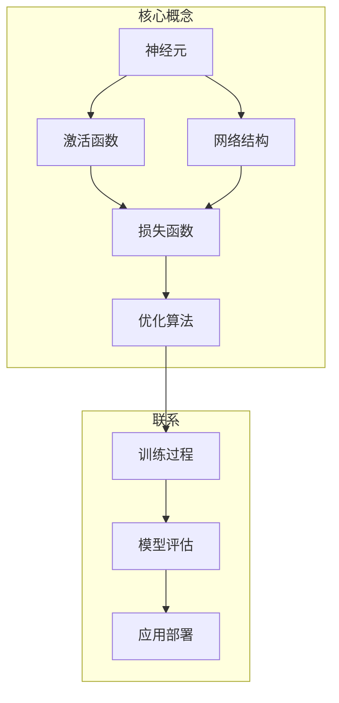

好的,我会按照您的要求,以《神经网络(Neural Networks) - 原理与代码实例讲解》为主题,撰写一篇专业的技术博客文章。文章将遵循您提供的结构模板,确保逻辑清晰、内容深入,并包含核心概念原理、数学模型推导、算法步骤解析、代码实例讲解等内容。同时,我会尽量使用简洁明了的语言,配合适当的实例和图示,让读者能够轻松理解这一领域的知识。本文约8000字左右,请留意阅读。

# 神经网络(Neural Networks) - 原理与代码实例讲解

## 1. 背景介绍

### 1.1 问题的由来

在过去的几十年里,人工智能领域取得了长足的进步,各种智能系统在多个领域得到了广泛应用。其中,神经网络作为一种有效的机器学习模型,在语音识别、图像识别、自然语言处理等任务中发挥着重要作用。

神经网络的发展可以追溯到20世纪40年代,当时的神经网络模型主要是对生物神经元网络的粗糙模拟。直到20世纪80年代,随着反向传播算法的提出,神经网络才获得了实际的计算能力,并在语音识别、图像处理等领域取得了一些成果。进入21世纪以来,benefited from 受益于大数据、高性能计算和新算法的推动,神经网络模型得到了进一步发展,深度学习应运而生,在计算机视觉、自然语言处理等领域取得了突破性进展。

### 1.2 研究现状  

当前,神经网络已成为机器学习和人工智能领域中最活跃和最具影响力的研究方向之一。不同类型的神经网络模型层出不穷,如前馈神经网络、卷积神经网络、递归神经网络、生成对抗网络等,它们在不同的应用场景下发挥着重要作用。

此外,神经网络的理论研究也在不断深入,人们对神经网络的工作原理有了更深入的理解,新的训练技巧和优化方法不断涌现。值得一提的是,可解释的人工智能(Explainable AI)是神经网络研究的一个重要方向,旨在提高神经网络模型的可解释性和透明度。

### 1.3 研究意义

神经网络在实际应用中展现出了强大的能力,但其内在机理并不完全清晰,这给神经网络的可靠性和安全性带来了挑战。因此,深入理解神经网络的工作原理,掌握其核心算法和数学基础,对于更好地应用和发展神经网络技术至关重要。

本文将系统地介绍神经网络的基本原理、核心算法、数学模型以及实现细节,旨在为读者提供一个全面而深入的视角,帮助读者掌握神经网络的本质,并能够在实践中熟练地应用和开发神经网络模型。

### 1.4 本文结构

本文共分为9个部分:

1. 背景介绍
2. 核心概念与联系
3. 核心算法原理与具体操作步骤
4. 数学模型和公式详细讲解与举例说明  
5. 项目实践:代码实例和详细解释说明
6. 实际应用场景
7. 工具和资源推荐
8. 总结:未来发展趋势与挑战
9. 附录:常见问题与解答

接下来,我们将从核心概念出发,逐步深入探讨神经网络的本质。

## 2. 核心概念与联系

神经网络的核心概念包括神经元、激活函数、网络结构、损失函数和优化算法等。

- **神经元(Neuron)** 是神经网络的基本计算单元,类似于生物神经元,它接收来自其他神经元或输入数据的加权输入信号,并通过激活函数产生输出信号。

- **激活函数(Activation Function)** 赋予神经网络非线性特征,常用的激活函数有Sigmoid、Tanh、ReLU等。不同的激活函数会影响神经网络的表达能力和收敛性能。

- **网络结构(Network Architecture)** 描述了神经元之间的连接方式和层次关系,常见的网络结构有前馈神经网络、卷积神经网络和递归神经网络等。

- **损失函数(Loss Function)** 用于衡量模型的预测输出与真实值之间的差异,是优化算法的驱动力。常用的损失函数有均方误差、交叉熵等。

- **优化算法(Optimization Algorithm)** 通过迭代调整神经网络的参数(权重和偏置),使损失函数的值最小化,从而获得最优模型。常用的优化算法有梯度下降、随机梯度下降等。

上述核心概念相互关联、环环相扣。在训练过程中,输入数据经过网络层层传递计算,产生预测输出;将预测输出与真实值计算损失函数,优化算法根据损失函数的梯度,不断调整网络参数,使模型逐步收敛。训练完成后,对模型进行评估,若满足要求则可应用于实际场景。

## 3. 核心算法原理与具体操作步骤  

神经网络的核心算法主要包括前向传播算法和反向传播算法。前向传播用于计算网络输出,反向传播用于计算误差梯度并更新网络参数。我们将详细介绍这两个算法的原理和操作步骤。

### 3.1 算法原理概述

#### 前向传播算法

前向传播算法模拟了神经网络从输入层向输出层传递信号的过程。在这个过程中,每个神经元根据上一层的输出和连接权重,计算出自身的加权输入,再通过激活函数得到输出,传递给下一层。最终,输出层的神经元输出即为网络的预测结果。

#### 反向传播算法  

反向传播算法是在前向传播的基础上,计算每个神经元对最终损失函数的贡献程度(梯度),并沿着与前向传播相反的方向,从输出层向输入层逐层更新网络参数。

具体来说,算法首先计算输出层神经元的误差梯度,然后依次向前层传播,计算每个隐藏层神经元的误差梯度。根据链式法则,每个神经元的梯度可以表示为其加权输入的梯度与激活函数导数的乘积。最终,输入层的梯度可用于更新输入权重和偏置。

通过不断迭代这个过程,网络参数会朝着使损失函数最小化的方向调整,从而获得最优模型。

### 3.2 算法步骤详解

#### 前向传播步骤

假设一个全连接神经网络有 $L$ 层,输入层为第0层,隐藏层为第 $1 \sim L-2$ 层,输出层为第 $L-1$ 层。我们用 $a^l$ 表示第 $l$ 层的激活值向量, $W^l$ 和 $b^l$ 分别表示该层的权重矩阵和偏置向量。前向传播算法可描述为:

1) 输入层: $a^0 = x$ (输入数据)

2) 对于隐藏层 $l=1,2,...,L-2$:
    
    $$z^l = W^l a^{l-1} + b^l \\ 
    a^l = \sigma(z^l)$$

    其中 $\sigma$ 为激活函数,如Sigmoid、ReLU等。

3) 输出层 $l=L-1$:

    $$z^{L-1} = W^{L-1} a^{L-2} + b^{L-1} \\
    a^{L-1} = \hat{y} $$
    
    $\hat{y}$ 为网络的预测输出。

通过上述步骤,我们可以得到给定输入 $x$ 对应的网络输出 $\hat{y}$。

#### 反向传播步骤  

设损失函数为 $J(W,b;x,y)$,其中 $y$ 为真实标签。反向传播算法的目标是计算 $\frac{\partial J}{\partial W^l}$ 和 $\frac{\partial J}{\partial b^l}$,以便更新网络参数。算法步骤如下:

1) 输出层误差 $\delta^{L-1}$:

    $$\delta^{L-1} = \nabla_a J(W,b;x,y) \odot \sigma'(z^{L-1})$$

    其中 $\nabla_a J$ 为损失函数关于输出激活值的梯度, $\odot$ 表示按元素相乘, $\sigma'$ 为激活函数的导数。

2) 隐藏层误差 $\delta^l$ (自第 $L-2$ 层至第1层反向计算):

    $$\delta^l = ((W^{l+1})^T \delta^{l+1}) \odot \sigma'(z^l)$$

3) 计算梯度:

    $$\frac{\partial J}{\partial W^l} = \delta^{l+1} (a^l)^T\\
    \frac{\partial J}{\partial b^l} = \delta^{l+1}$$

4) 使用优化算法(如梯度下降)更新权重和偏置:

    $$W^l \leftarrow W^l - \alpha \frac{\partial J}{\partial W^l}\\
    b^l \leftarrow b^l - \alpha \frac{\partial J}{\partial b^l}$$
    
    其中 $\alpha$ 为学习率。
    
通过多次迭代上述过程,直到损失函数收敛或达到停止条件。

### 3.3 算法优缺点

#### 优点

- 强大的拟合能力:神经网络具有非线性映射能力,可以很好地拟合复杂的函数关系。
- 端到端学习:神经网络能够直接从原始数据中自动学习特征表示,无需人工设计特征。
- 高度并行化:神经网络的计算过程可以高度并行化,利用GPU等加速硬件大幅提高训练效率。

#### 缺点  

- 黑盒性质:神经网络的内部机制往往难以解释,存在"黑盒"问题。
- 需要大量数据:训练一个有效的神经网络通常需要大量的标注数据。
- 过拟合风险:神经网络具有强大的拟合能力,但也容易过拟合训练数据而失去泛化能力。
- 参数调优困难:神经网络涉及诸多超参数,如网络结构、学习率等,调参过程往往是耗时且困难的。

### 3.4 算法应用领域

神经网络在诸多领域展现出卓越的性能,主要应用领域包括但不限于:

- 计算机视觉:图像分类、目标检测、语义分割等
- 自然语言处理:机器翻译、文本生成、情感分析等
- 语音识别与合成
- 推荐系统
- 金融风险控制
- 医疗诊断与药物发现
- 机器人控制
- ...

总的来说,凭借强大的非线性映射能力,神经网络在涉及复杂模式识别和函数拟合的领域都有广阔的应用前景。

## 4. 数学模型和公式详细讲解与举例说明

在上一节中,我们介绍了神经网络的核心算法原理。这一节将进一步深入探讨神经网络的数学模型,并推导相关公式,辅以案例分析加深理解。

### 4.1 数学模型构建

神经网络本质上是一种函数逼近器,它将输入数据 $\boldsymbol{x}$ 映射到输出 $\boldsymbol{y}$,即 $\boldsymbol{y}=f(\boldsymbol{x};\boldsymbol{\theta})$。其中, $\boldsymbol{\theta}$ 为网络参数(权重和偏置)的集合。

具体来说,对于一个有 $L$ 层的全连接神经网络,其数学表达式为:

$$\begin{aligned}
\boldsymbol{z}^{(0)} &= \boldsymbol{x} \\
\boldsymbol{a}^{(0)} &= \boldsymbol{x} \\
\boldsymbol{z}^{(l)} &= \boldsymbol{W}^{(l)}\boldsymbol{a}^{(