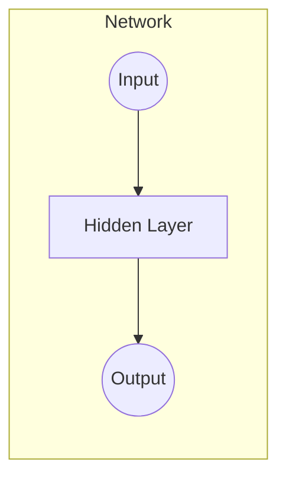

# 神经网络与深度强化学习：一切皆是映射

## 1. 背景介绍

### 1.1 问题的由来

在过去几十年中,人工智能(AI)领域取得了长足的进步。从早期的专家系统和机器学习算法,到近年来的深度学习和强化学习技术的兴起,AI已经渗透到我们生活的方方面面。然而,这些技术进步的核心驱动力是什么?答案就是:映射(mapping)。

人工智能系统的本质是从输入到输出的映射过程。无论是监督学习、非监督学习还是强化学习,它们都试图从数据中学习一个映射函数,以将输入(如图像、文本或状态)映射到相应的输出(如分类、标签或行为)。神经网络和深度强化学习算法就是用于学习这种映射的有效工具。

### 1.2 研究现状

近年来,深度神经网络在计算机视觉、自然语言处理和语音识别等领域取得了突破性的成就。卷积神经网络(CNN)、循环神经网络(RNN)和transformer等模型架构已成为这些领域的主导模型。同时,结合强化学习的深度神经网络也在决策控制、机器人技术和游戏领域取得了令人瞩目的成绩。

尽管取得了巨大进展,但神经网络和深度强化学习仍然面临着一些挑战,如可解释性、鲁棒性、数据效率和可扩展性等问题。研究人员正在努力解决这些问题,以推动AI技术向前发展。

### 1.3 研究意义

理解神经网络和深度强化学习的本质及其映射能力,对于我们更好地设计和应用这些技术至关重要。通过深入探讨它们的工作原理、数学基础和实现细节,我们可以更好地把握AI系统的优缺点,并为未来的技术发展提供指导。

此外,将神经网络和深度强化学习视为映射过程,可以帮助我们更好地理解它们在不同领域的应用,并探索新的应用场景。这种通用的视角可以激发创新思维,推动AI技术在更广泛的领域发挥作用。

### 1.4 本文结构

本文将全面探讨神经网络和深度强化学习作为映射过程的本质。我们将从以下几个方面进行阐述:

1. 核心概念与联系:介绍神经网络和深度强化学习的基本概念,并探讨它们之间的联系。

2. 核心算法原理与具体操作步骤:深入解释神经网络和深度强化学习算法的原理,并详细阐述它们的实现步骤。

3. 数学模型和公式推导:建立神经网络和深度强化学习的数学模型,并推导相关公式。

4. 项目实践:提供代码实例和详细解释,帮助读者更好地掌握实现细节。

5. 实际应用场景:介绍神经网络和深度强化学习在各个领域的应用,并展望未来的发展方向。

6. 工具和资源推荐:推荐一些有用的学习资源、开发工具和相关论文,方便读者进一步探索。

7. 总结和展望:总结研究成果,讨论未来发展趋势和面临的挑战。

通过全面而深入的探讨,我们希望读者能够对神经网络和深度强化学习的映射本质有更深刻的理解,并为未来的研究和应用提供启发。

## 2. 核心概念与联系

在深入探讨神经网络和深度强化学习的映射本质之前,我们需要先介绍一些基本概念。

### 2.1 神经网络

神经网络是一种受生物神经系统启发的计算模型,由大量互连的节点(神经元)组成。每个节点接收来自其他节点的输入,并通过激活函数产生输出。神经网络通过调整连接权重来学习输入和输出之间的映射关系。

常见的神经网络类型包括:

- 前馈神经网络(Feed-Forward Neural Network, FNN):信息只在一个方向传播,没有循环或反馈连接。
- 卷积神经网络(Convolutional Neural Network, CNN):专门用于处理网格数据(如图像和视频)的神经网络。
- 循环神经网络(Recurrent Neural Network, RNN):适用于序列数据(如文本和语音)的神经网络,具有内部状态和循环连接。
- 长短期记忆网络(Long Short-Term Memory, LSTM):一种特殊的RNN,旨在解决传统RNN中的梯度消失/爆炸问题。
- 门控循环单元(Gated Recurrent Unit, GRU):另一种改进的RNN变体,与LSTM类似但结构更简单。

神经网络通过反向传播算法进行训练,以最小化损失函数(如交叉熵或均方误差)。通过大量的训练数据和足够的计算资源,神经网络可以学习复杂的映射关系,并在各种任务中取得出色的性能。

### 2.2 深度强化学习

强化学习是一种基于环境交互的机器学习范式,其目标是通过试错和奖惩机制,学习一个策略(policy)来最大化长期累积奖励。深度强化学习将深度神经网络与强化学习相结合,使用神经网络来近似策略或值函数。

在深度强化学习中,智能体(agent)通过与环境(environment)交互来学习一个映射,将环境状态映射到相应的行为。这个映射过程通常由一个或多个神经网络来实现,例如:

- 策略网络(Policy Network):将环境状态映射到行为概率分布。
- 值函数网络(Value Function Network):将环境状态映射到预期的长期回报。
- 双网络(Dual Network):同时学习策略网络和值函数网络。

深度强化学习算法通过优化神经网络的参数来提高策略或值函数的性能,从而使智能体能够在复杂的环境中做出最优决策。常见的算法包括深度Q网络(Deep Q-Network, DQN)、策略梯度(Policy Gradient)、Actor-Critic算法等。

### 2.3 神经网络与深度强化学习的联系

神经网络和深度强化学习虽然来自不同的研究领域,但它们有着内在的联系。两者都利用了神经网络作为映射函数的近似器,从而实现了从输入到输出的映射过程。

在神经网络中,我们通过训练数据来学习一个映射函数,将输入(如图像或文本)映射到期望的输出(如分类标签或回归值)。而在深度强化学习中,我们通过与环境交互来学习一个映射函数,将环境状态映射到最优行为或长期回报。

尽管应用场景不同,但两者的核心思想是相通的:利用神经网络的强大近似能力来学习复杂的映射关系。因此,我们可以将神经网络和深度强化学习统一地视为一种映射过程,并探索它们在不同领域的应用。

此外,神经网络和深度强化学习也存在一些技术上的交叉和融合。例如,一些深度强化学习算法(如DQN)借鉴了神经网络中的技术(如经验回放和目标网络),以提高训练稳定性和数据利用率。另一方面,一些神经网络模型(如注意力机制)也被应用于深度强化学习中,以提高决策质量。

总的来说,神经网络和深度强化学习虽然起源不同,但它们都旨在学习从输入到输出的映射关系,并且在技术上存在密切的联系和相互借鉴。将它们统一地视为映射过程,可以帮助我们更好地理解和应用这些强大的AI技术。

## 3. 核心算法原理与具体操作步骤

在本节中,我们将深入探讨神经网络和深度强化学习算法的核心原理,并详细阐述它们的具体操作步骤。

### 3.1 神经网络算法原理概述

神经网络算法的核心思想是通过调整网络权重来学习输入和输出之间的映射关系。这个过程通常包括以下几个关键步骤:

1. **前向传播(Forward Propagation)**: 将输入数据传递through神经网络,计算每一层的激活值,直到得到最终的输出。

2. **损失计算(Loss Computation)**: 将网络输出与期望输出进行比较,计算损失函数(如交叉熵或均方误差)。

3. **反向传播(Backpropagation)**: 利用链式法则,计算损失函数相对于每个权重的梯度,这个过程从输出层向后传播到输入层。

4. **权重更新(Weight Update)**: 使用优化算法(如梯度下降或Adam)根据计算出的梯度来更新网络权重,以最小化损失函数。

通过反复执行上述步骤,神经网络可以逐步调整权重,从而学习到输入和输出之间的映射关系。

### 3.2 神经网络算法步骤详解

现在,我们将详细解释神经网络算法的具体操作步骤。为了便于说明,我们以一个简单的前馈神经网络为例进行讨论。

#### 3.2.1 网络架构

假设我们有一个包含一个隐藏层的前馈神经网络,其架构如下:

其中,输入层有$n$个神经元,隐藏层有$m$个神经元,输出层有$k$个神经元。我们使用$\mathbf{W}^{(1)}$表示输入层到隐藏层的权重矩阵(大小为$m \times n$),$\mathbf{b}^{(1)}$表示隐藏层的偏置向量(大小为$m$)。同样,$\mathbf{W}^{(2)}$和$\mathbf{b}^{(2)}$分别表示隐藏层到输出层的权重矩阵(大小为$k \times m$)和输出层的偏置向量(大小为$k$)。

#### 3.2.2 前向传播

给定输入$\mathbf{x}$,前向传播的过程如下:

1. 计算隐藏层的激活值:
   $$\mathbf{h} = \sigma(\mathbf{W}^{(1)}\mathbf{x} + \mathbf{b}^{(1)})$$
   其中,$\sigma$是激活函数(如ReLU或Sigmoid)。

2. 计算输出层的激活值(即网络输出):
   $$\hat{\mathbf{y}} = \mathbf{W}^{(2)}\mathbf{h} + \mathbf{b}^{(2)}$$

#### 3.2.3 损失计算

假设我们有一个训练数据集$\mathcal{D} = \{(\mathbf{x}^{(i)}, \mathbf{y}^{(i)})\}_{i=1}^N$,其中$\mathbf{x}^{(i)}$是输入,$\mathbf{y}^{(i)}$是期望输出。我们可以计算整个数据集上的损失函数,如均方误差:

$$J(\mathbf{W}^{(1)}, \mathbf{b}^{(1)}, \mathbf{W}^{(2)}, \mathbf{b}^{(2)}) = \frac{1}{N}\sum_{i=1}^N \left\lVert \hat{\mathbf{y}}^{(i)} - \mathbf{y}^{(i)} \right\rVert^2$$

其中,$\hat{\mathbf{y}}^{(i)}$是对于输入$\mathbf{x}^{(i)}$的网络输出。

#### 3.2.4 反向传播

为了最小化损失函数,我们需要计算损失函数相对于每个权重的梯度。这个过程通过反向传播算法实现,利用链式法则从输出层向后传播到输入层。

对于输出层权重$\mathbf{W}^{(2)}$和偏置$\mathbf{b}^{(2)}$,梯度计算如下:

$$\frac{\partial J}{\partial \mathbf{W}^{(2)}} = \frac{1}{N}\sum_{i=1}^N (\hat{\mathbf{y}}^{(i)} - \mathbf{y}^{(i)})(\mathbf{h}^{(i)})^\top$$
$$\frac{\partial J}{\partial \mathbf{b}^{(2)}} = \frac{1}{N}\sum_{i=1}^N (\hat{\mathbf{y}}^{(i)} - \mathbf{y}^{(i)})$$

对于隐藏层权重$\mathbf{W}^{(1)}$和