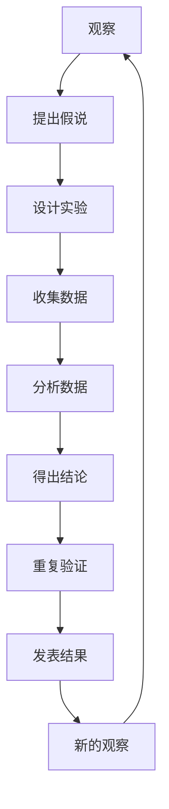
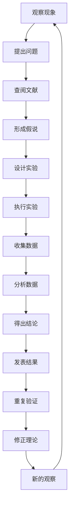

# 科学方法：从观察到实验

## 1. 背景介绍

### 1.1 问题的由来

自古以来，人类一直对周围的世界充满好奇。我们观察自然现象,探索未知领域,试图理解宇宙的奥秘。然而,仅仅依赖观察是远远不够的,因为许多现象背后隐藏着更深层次的规律和原理。为了揭开这些奥秘,我们需要一种系统化的方法——科学方法。

科学方法源于人类对认知世界的渴望。在漫长的历史进程中,人们逐渐意识到,单纯依赖主观经验和直觉是不够的。我们需要一种客观、可重复的方式来验证假说,排除偶然性,发现普遍规律。

### 1.2 研究现状

当代科学发展迅猛,科学方法在各个领域得到广泛应用。无论是自然科学、社会科学,还是工程技术,科学方法都扮演着关键角色。通过观察、提出假说、设计实验、收集数据、分析结果,我们不断拓展人类知识的边界。

然而,科学方法并非一蹴而就。它是一个不断发展、不断完善的过程。随着新理论、新技术的出现,科学方法也在不断演进,以适应新的挑战。例如,大数据时代的到来,使得数据采集和分析方式发生了翻天覆地的变化。机器学习和人工智能的兴起,也为科学研究注入了新的活力。

### 1.3 研究意义

科学方法的意义不言而喻。它是人类认识世界、改造世界的强大工具。通过科学方法,我们可以克服主观偏见,发现客观规律,推动科技进步。科学方法不仅适用于自然科学研究,也可以应用于社会科学、人文学科等领域,帮助我们更好地理解人类行为和社会现象。

此外,科学方法培养了人类批判性思维和求证精神。它教会我们怀疑一切,不轻易被权威说服,而是依赖事实和数据。这种精神不仅对科学研究至关重要,对于日常生活也有着深远影响。

### 1.4 本文结构

本文将从观察到实验,系统地介绍科学方法的各个环节。我们将探讨科学方法的基本原理、关键步骤,以及在不同领域的应用。通过具体案例和实践指导,读者可以掌握科学方法的精髓,并将其应用于自己的研究和工作中。

文章结构如下:

1. 背景介绍
2. 核心概念与联系
3. 核心算法原理与具体操作步骤
4. 数学模型和公式详细讲解与举例说明
5. 项目实践:代码实例和详细解释说明
6. 实际应用场景
7. 工具和资源推荐
8. 总结:未来发展趋势与挑战
9. 附录:常见问题与解答

## 2. 核心概念与联系

科学方法是一种系统的探索过程,包含了一系列相互关联的概念和步骤。下面我们将介绍科学方法的核心概念,并阐明它们之间的联系。

1. **观察(Observation)**: 科学方法的起点是观察。通过观察自然现象或社会现象,我们可以发现问题,激发好奇心。观察可以是主动的,也可以是被动的。

2. **提出假说(Hypothesis)**: 基于观察结果,我们提出一个初步的解释或预测,即假说。假说是一种暂时性的解释,需要经过进一步的验证。

3. **设计实验(Experiment Design)**: 为了验证假说,我们需要设计实验。实验设计需要考虑各种因素,如控制变量、样本选择、数据采集方式等。

4. **收集数据(Data Collection)**: 在实验过程中,我们收集相关数据。数据可以是定量的,也可以是定性的。收集准确、可靠的数据是科学研究的基础。

5. **分析数据(Data Analysis)**: 收集到数据后,我们需要进行分析和处理。这可能涉及统计分析、建模、可视化等方法。数据分析旨在发现隐藏的模式和规律。

6. **得出结论(Drawing Conclusions)**: 基于数据分析结果,我们得出关于假说的结论。结论可能支持或反驳最初的假说,也可能引发新的问题和假说。

7. **重复验证(Replication)**: 为了确保结论的可靠性,我们需要重复实验,验证结果的一致性。重复验证是科学方法的关键环节之一。

8. **发表结果(Publishing Results)**: 经过多次验证后,我们可以将研究结果发表,供同行评审和公众审视。发表结果有助于知识传播和科学进步。

9. **新的观察(New Observations)**: 发表结果后,可能会引发新的观察和问题,从而开启新一轮的科学探索过程。科学方法是一个循环往复的过程。

这些核心概念相互关联,构成了一个完整的科学方法框架。每个步骤都至关重要,缺一不可。只有严格遵循科学方法,我们才能获得可靠的科学知识。

## 3. 核心算法原理与具体操作步骤

科学方法虽然看似简单,但在实际操作中需要遵循一些核心原则和具体步骤。下面我们将详细介绍科学方法的算法原理和操作流程。

### 3.1 算法原理概述

科学方法的核心算法原理可以总结为以下几点:

1. **客观性(Objectivity)**: 科学研究必须建立在客观事实和数据之上,而不是主观臆断。我们必须排除个人偏见和先入为主的观念,以开放和中立的态度进行研究。

2. **可重复性(Reproducibility)**: 科学研究结果必须能够被其他研究者重复验证。这是确保研究结果可靠性的关键。实验设计和数据采集过程必须详细记录,以便他人复制。

3. **可测试性(Testability)**: 科学假说必须是可测试的,即可以通过实验或观察来验证或反驳。不可测试的假说无法进行科学探索。

4. **简单性(Simplicity)**: 在所有可能的解释中,我们应该选择最简单的那个,即著名的"奥卡姆剃刀"原则。简单的解释通常更容易被验证和重复。

5. **因果关系(Causality)**: 科学研究旨在发现事物之间的因果关联,而不是仅仅描述现象。我们需要设计实验来排除混杂变量,确定真正的因果关系。

6. **自我纠正(Self-Correction)**: 科学是一个不断发展和自我纠正的过程。新的观察和实验结果可能会推翻旧有理论,科学家必须保持开放和谦逊的态度。

遵循这些核心原则,我们可以确保科学研究的客观性、可靠性和有效性。

### 3.2 算法步骤详解

科学方法的具体操作步骤如下:

1. **观察现象(Observe Phenomena)**: 科学探索始于对自然或社会现象的观察。观察可以是有目标的,也可以是偶然的。关键是保持开放和好奇的心态。

2. **提出问题(Raise Questions)**: 基于观察结果,我们提出一些具体的问题。明确问题有助于确定研究方向和目标。

3. **查阅文献(Literature Review)**: 在提出假说之前,我们需要查阅相关领域的文献资料,了解前人的研究成果。这有助于避免重复工作,并为假说奠定理论基础。

4. **形成假说(Form Hypotheses)**: 根据观察结果和文献研究,我们提出一个或多个初步假说,试图解释所观察到的现象。

5. **设计实验(Design Experiments)**: 为了验证假说,我们需要设计实验。实验设计需要考虑各种因素,如控制变量、样本选择、数据采集方式等。

6. **执行实验(Conduct Experiments)**: 按照实验设计,我们执行实验,收集相关数据。实验过程需要严格控制,确保数据的准确性和可靠性。

7. **收集数据(Collect Data)**: 在实验过程中,我们收集定量和定性数据。数据采集方式需要事先规定,以确保一致性。

8. **分析数据(Analyze Data)**: 收集到数据后,我们需要进行分析和处理。这可能涉及统计分析、建模、可视化等方法,旨在发现隐藏的模式和规律。

9. **得出结论(Draw Conclusions)**: 基于数据分析结果,我们得出关于假说的结论。结论可能支持或反驳最初的假说,也可能引发新的问题和假说。

10. **发表结果(Publish Results)**: 经过多次验证后,我们可以将研究结果发表,供同行评审和公众审视。发表结果有助于知识传播和科学进步。

11. **重复验证(Replicate Studies)**: 为了确保结论的可靠性,我们需要重复实验,验证结果的一致性。重复验证是科学方法的关键环节之一。

12. **修正理论(Revise Theories)**: 如果新的实验结果与现有理论存在矛盾,我们需要修正或推翻旧有理论,提出新的解释模型。

13. **新的观察(New Observations)**: 发表结果后,可能会引发新的观察和问题,从而开启新一轮的科学探索过程。科学方法是一个循环往复的过程。

这些步骤相互关联,构成了一个完整的科学研究流程。严格遵循这些步骤,我们可以获得可靠的科学知识,推动人类认知的进步。

### 3.3 算法优缺点

科学方法作为一种探索未知的工具,具有以下优点:

1. **客观性**: 科学方法强调客观事实和数据,有助于克服主观偏见,获得可靠的知识。

2. **可重复性**: 科学研究结果可以被其他研究者重复验证,确保了结论的可靠性。

3. **自我纠正**: 科学方法是一个不断发展和自我纠正的过程,能够及时修正错误理论。

4. **普适性**: 科学方法可以应用于各个领域,包括自然科学、社会科学、工程技术等。

5. **严谨性**: 科学方法要求严格的实验设计和数据采集,确保研究的严谨性和准确性。

然而,科学方法也存在一些局限性:

1. **时间成本高**: 科学研究通常需要大量的时间和资源,从提出假说到最终发表结果可能需要数年甚至数十年。

2. **局限性**: 科学方法主要关注可观察和可测量的现象,对于一些抽象概念或主观体验,它可能无能为力。

3. **复杂性**: 随着研究领域的不断深入,科学方法也变得越来越复杂,需要更精细的实验设计和数据分析技术。

4. **伦理问题**: 某些实验可能会涉及伦理问题,如动物实验或人体试验,需要慎重考虑。

5. **主观影响**: 尽管科学方法强调客观性,但研究者的主观因素仍然可能影响实验设计和结果解释。

总的来说,科学方法是一种强大而有效的探索工具,但也存在一定局限性。我们需要权衡利弊,并不断完善和发展科学方法,以适应不断变化的研究需求。

### 3.4 算法应用领域

科学方法广泛应用于各个领域,包括自