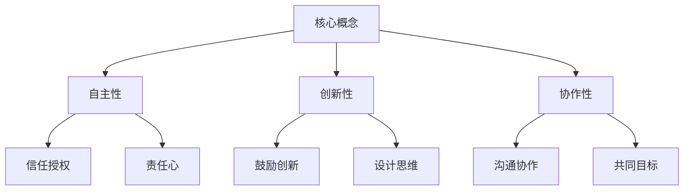
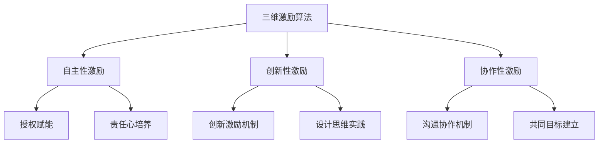

# 管理艺术：激发团队潜力

## 1. 背景介绍

### 1.1 问题的由来

在当今快节奏的商业环境中，组织面临着前所未有的挑战。不断变化的市场需求、激烈的竞争以及技术的快速迭代,都要求企业拥有敏捷高效的团队,以保持竞争优势。然而,如何有效管理和激发团队的潜力,是许多领导者和管理者所面临的一大难题。

传统的管理方式往往过于僵化和层级化,难以适应当前的动态环境。员工缺乏自主权和创造力,无法充分发挥潜能。此外,缺乏有效的沟通和协作机制,也阻碍了团队的高效运转。因此,探索新的管理理念和实践,以激发团队的活力和创造力,成为当务之急。

### 1.2 研究现状

近年来,一些先进的管理理念和方法开始在企业中得到应用,如敏捷管理、精益管理、设计思维等。这些理念强调以人为本、鼓励创新、重视协作,旨在打造高效、灵活的团队。同时,一些成功的企业也分享了他们的管理经验,如谷歌的"20%自由时间"、Netflix的"无等级制"等,为其他组织提供了借鉴。

然而,这些新兴管理理念和实践的应用还处于初级阶段,缺乏系统化的理论指导和实践经验总结。许多组织在实施过程中遇到了诸多挑战,如文化冲突、变革阻力等。因此,如何将这些先进理念与组织的实际情况相结合,形成行之有效的管理体系,是一个亟待解决的问题。

### 1.3 研究意义

探索有效的团队管理方式,对于提高组织效率、激发员工潜能、增强竞争力具有重要意义。通过本文的研究,我们希望能够:

1. 总结先进管理理念的核心思想和实践经验,为组织提供理论指导。
2. 建立一套系统的团队管理框架,帮助组织构建高效、创新的团队。
3. 分析不同管理实践在不同场景下的适用性,为组织量身定制管理方案。
4. 探讨管理变革中可能遇到的挑战,并提出相应的应对策略。

通过本研究,我们希望能够为企业和组织提供一种全新的管理视角和实践路径,助力他们激发团队的无限潜能,在激烈的市场竞争中取得持久的竞争优势。

### 1.4 本文结构

本文将从以下几个方面深入探讨团队管理的艺术:

1. 阐述先进管理理念的核心概念及其内在联系。
2. 介绍激发团队潜力的核心算法原理及具体操作步骤。
3. 建立相关的数学模型,并通过公式和案例进行详细说明。
4. 提供代码实例,并对其进行深入解释和分析。
5. 分析管理实践在不同场景下的应用,并展望未来发展趋势。
6. 总结研究成果,并指出面临的挑战和未来研究方向。

接下来,我们将逐一探讨上述内容,旨在为读者提供一个全面、系统的团队管理框架。

## 2. 核心概念与联系

在探讨激发团队潜力的具体方法之前,我们需要先了解一些核心概念及其内在联系。这些概念构成了先进管理理念的理论基础,对于指导实践具有重要意义。

1. **自主性(Autonomy)**: 赋予员工更多的自主权和决策权,让他们能够自主规划和执行工作,发挥主观能动性。这需要领导者建立起对员工的信任,并授予他们相应的权力和责任。

2. **创新性(Innovation)**: 鼓励员工提出新颖的想法和解决方案,培养创新思维。这可以通过建立包容失败的文化、提供创新激励机制等方式来实现。同时,设计思维也是激发创新的有力工具。

3. **协作性(Collaboration)**: 强调团队内部以及跨团队之间的协作与沟通。通过建立共同的目标和价值观,营造协作氛围,可以充分发挥团队的整体力量。

上述三个核心概念相互关联、相辅相成。自主性赋予员工主动性,创新性激发员工潜能,协作性汇聚团队力量。只有将这三者有机结合,才能真正激发团队的无限潜能。

接下来,我们将介绍如何通过一套系统的算法和模型,将这些核心理念转化为具体的管理实践。

## 3. 核心算法原理 & 具体操作步骤

### 3.1 算法原理概述

为了将上述核心理念转化为可操作的管理实践,我们提出了一种基于自主性、创新性和协作性的"三维激励算法"。该算法旨在通过系统化的步骤,激发团队的内在动力,释放其潜能。

算法的核心思想是:通过授予自主权、鼓励创新和促进协作,为员工创造一个充满活力和动力的工作环境。这种环境不仅能够满足员工的高层次需求(如自我实现),还能够激发他们的内在动机,从而提高工作效率和创造力。

算法的三个维度分别对应于上述三个核心概念:

1. **自主性激励**:通过授权赋能和责任心培养,让员工拥有更多的自主权和决策权。
2. **创新性激励**:建立创新激励机制,并应用设计思维方法,鼓励员工提出创新想法。
3. **协作性激励**:构建高效的沟通协作机制,并建立共同的目标和价值观,促进团队协作。

这三个维度相互作用、相得益彰,共同为员工营造一个积极向上的工作环境,激发他们的内在动机和潜能。

### 3.2 算法步骤详解

接下来,我们将详细介绍"三维激励算法"的具体操作步骤:

1. **自主性激励**
   - 授权赋能:逐步将决策权下放到团队和个人层面,赋予员工更多的自主权。
   - 责任心培养:与授权同步,培养员工的责任心,让他们为自己的决策和行为负责。
   - 信任机制:建立领导者与员工之间的信任关系,消除层级障碍。

2. **创新性激励**
   - 创新激励机制:建立创新激励机制,如创新奖励、时间保障等,鼓励员工大胆创新。
   - 设计思维实践:引入设计思维方法,如头脑风暴、原型设计等,激发创新思维。
   - 包容失败文化:营造包容失败的文化氛围,让员工在创新过程中大胆尝试。

3. **协作性激励**
   - 沟通协作机制:建立高效的沟通协作机制,如敏捷会议、协作工具等,促进信息流动。
   - 共同目标建立:与团队一起制定共同的目标和价值观,增强凝聚力。
   - 跨团队协作:打破部门壁垒,促进不同团队之间的协作与资源共享。

上述步骤需要循序渐进、持续推进,才能真正激发团队的潜能。同时,我们也需要建立相应的数学模型,对算法的效果进行量化分析和优化。

### 3.3 算法优缺点

**优点:**

1. 理论基础扎实,源于先进的管理理念,具有科学性。
2. 操作步骤清晰,易于在实践中执行和落地。
3. 全面考虑了自主性、创新性和协作性三个维度,有利于全面激发团队潜能。
4. 灵活性强,可根据具体情况对步骤进行调整和优化。

**缺点:**

1. 实施过程较为复杂,需要领导层的大力支持和持续推进。
2. 存在一定的文化冲突和变革阻力,需要做好变革管理。
3. 效果评估较为困难,需要建立相应的绩效考核体系。
4. 算法的参数设置需要根据具体情况进行调整和优化。

总的来说,该算法具有理论基础扎实、操作步骤清晰、全面性强等优点,但在实施过程中也面临一定的挑战。我们需要根据具体情况,对算法进行优化和改进,以最大限度发挥其效用。

### 3.4 算法应用领域

"三维激励算法"可以广泛应用于各行各业的团队管理实践中,包括但不限于:

1. **科技公司**:科技公司往往需要高度创新的产品和解决方案,该算法可以激发研发团队的创新潜能。
2. **咨询公司**:咨询公司的项目团队需要高度的自主性和协作性,算法可以优化团队的运作效率。
3. **制造业**:制造业的生产团队需要高效协作,算法可以促进跨部门协作,提高生产效率。
4. **服务业**:服务业的团队需要快速响应客户需求,算法可以赋予团队更大的自主权和创新空间。
5. **非营利组织**:非营利组织的团队往往具有共同的价值追求,算法可以增强团队的凝聚力和协作精神。

总之,任何需要团队协作的领域,都可以尝试应用该算法,激发团队的潜能,提高工作效率和创新能力。

## 4. 数学模型和公式 & 详细讲解 & 举例说明

为了量化分析"三维激励算法"的效果,并对其进行优化,我们需要建立相应的数学模型。在此,我们将引入一个基于多目标优化的数学模型,用于评估和优化算法的性能。

### 4.1 数学模型构建

我们将团队的自主性(A)、创新性(I)和协作性(C)作为三个目标函数,并将算法的各个步骤作为决策变量。我们的目标是最大化这三个目标函数的值,从而达到激发团队潜能的目的。

目标函数:
$$\max\limits_{x} f(x) = (f_A(x), f_I(x), f_C(x))$$

其中:
- $f_A(x)$表示自主性目标函数
- $f_I(x)$表示创新性目标函数
- $f_C(x)$表示协作性目标函数
- $x$为决策变量向量,包括算法的各个步骤

约束条件:
$$
\begin{aligned}
g_i(x) &\leq 0, \quad i=1,2,\ldots,m \\
h_j(x) &= 0, \quad j=1,2,\ldots,p
\end{aligned}
$$

其中$g_i(x)$和$h_j(x)$分别表示不等式和等式约束条件,用于描述算法实施过程中的各种限制,如资源限制、文化冲突等。

通过建立上述数学模型,我们可以将"三维激励算法"的实施过程数学化,并利用多目标优化算法(如遗传算法、粒子群优化算法等)来求解最优解,从而获得最佳的算法参数设置。

### 4.2 公式推导过程

接下来,我们将详细推导目标函数和约束条件的具体形式。

**自主性目标函数**:
自主性目标函数$f_A(x)$可以由授权赋能程度、责任心培养程度和信任机制建立程度等因素构成:

$$f_A(x) = w_1 \cdot \text{授权赋能程度} + w_2 \cdot \text{责任心培