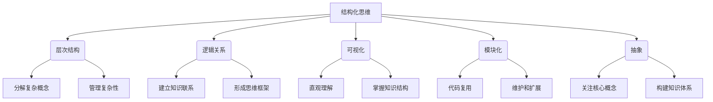

# 结构化思维原理与应用：思维有结构，表达才有结构。思维有结构，成长才有节奏

## 1. 背景介绍

### 1.1 问题的由来

在这个信息时代,我们每天都会接收大量的信息和知识。然而,如何有效地组织和理解这些信息,并将其转化为自己的思维和见解,是一个长期以来困扰着人们的问题。传统的思维方式往往是线性的、碎片化的,缺乏系统性和结构性,导致我们难以建立完整的知识体系,也无法真正掌握知识的内在逻辑和联系。

### 1.2 研究现状

为了解决这一问题,结构化思维(Structured Thinking)作为一种思维方法和工具,近年来受到了广泛关注。结构化思维强调将知识和思维过程系统化、模块化和可视化,通过明确的层次结构和逻辑关系,帮助人们更好地理解和掌握复杂的概念和问题。

### 1.3 研究意义

结构化思维不仅可以提高个人的学习效率和思维能力,还可以应用于各个领域,如软件开发、产品设计、战略规划等。通过结构化思维,我们可以更好地组织和表达自己的想法,提高沟通效率,并且更容易发现问题的本质和解决方案。

### 1.4 本文结构

本文将从以下几个方面深入探讨结构化思维的原理和应用:

1. 核心概念与联系
2. 核心算法原理与具体操作步骤
3. 数学模型和公式详细讲解与举例说明
4. 项目实践:代码实例和详细解释说明
5. 实际应用场景
6. 工具和资源推荐
7. 总结:未来发展趋势与挑战
8. 附录:常见问题与解答

## 2. 核心概念与联系

结构化思维的核心概念包括以下几个方面:

1. **层次结构(Hierarchy)**: 将复杂的概念或问题分解为不同的层次和模块,每一层次都包含相对独立的子概念或子问题。这种分层的方式有助于我们更好地理解和管理复杂性。

2. **逻辑关系(Logical Relationships)**: 在层次结构中,不同层次和模块之间存在着逻辑关系,如因果关系、前后依赖关系等。明确这些逻辑关系有助于我们建立知识之间的联系,形成完整的思维框架。

3. **可视化(Visualization)**: 将抽象的思维过程和知识结构用图形、图表等可视化的方式表示出来,有助于我们更直观地理解和掌握它们。常用的可视化工具包括思维导图、流程图、UML图等。

4. **模块化(Modularity)**: 将复杂的系统或问题划分为相对独立的模块,每个模块负责特定的功能或子问题。模块化的设计有利于代码复用、维护和扩展,也有助于我们更好地管理和理解复杂性。

5. **抽象(Abstraction)**: 抽象是结构化思维的核心,它允许我们忽略不相关的细节,关注问题的本质和核心概念。通过不同层次的抽象,我们可以构建出清晰的思维框架和知识体系。

这些核心概念相互关联、相互作用,共同构成了结构化思维的基础。掌握并应用这些概念,有助于我们更好地组织和表达自己的思维,提高学习和解决问题的能力。

## 3. 核心算法原理与具体操作步骤

### 3.1 算法原理概述

结构化思维的核心算法原理是将复杂的问题或概念分解为层次化的模块,并在模块之间建立逻辑关系,最终形成一个清晰的思维框架。这个过程可以概括为以下几个步骤:

1. **识别核心概念(Identify Core Concepts)**: 首先需要识别出问题或知识领域中的核心概念,这些概念构成了整个结构的基础。

2. **分层分解(Hierarchical Decomposition)**: 将核心概念进一步分解为不同的层次和模块,每一层次包含相对独立的子概念或子问题。

3. **建立逻辑关系(Establish Logical Relationships)**: 在分层的模块之间建立逻辑关系,如因果关系、前后依赖关系等,形成一个完整的思维框架。

4. **可视化表示(Visualize Representation)**: 将分层的结构和逻辑关系用图形、图表等可视化的方式表示出来,以便更直观地理解和掌握。

5. **迭代优化(Iterative Optimization)**: 根据实际情况和需求,不断优化和调整思维框架,保持其清晰性和完整性。

这个算法的核心思想是将复杂的问题或概念分解为可管理的模块,并通过层次结构和逻辑关系将它们组织起来,从而降低认知负担,提高理解和表达的能力。

### 3.2 算法步骤详解

下面我们将详细解释结构化思维算法的具体操作步骤:

1. **识别核心概念**

   - 明确问题或知识领域的核心概念,这些概念构成了整个结构的基础。
   - 可以通过头脑风暴、文献研究等方式收集和整理核心概念。
   - 对于复杂的问题或知识领域,可能需要多次迭代才能确定真正的核心概念。

2. **分层分解**

   - 将核心概念进一步分解为不同的层次和模块。
   - 每一层次包含相对独立的子概念或子问题,层次之间存在逻辑关系。
   - 分层的深度取决于问题或概念的复杂程度,通常2-5层即可。
   - 分层时要注意模块之间的独立性和内聚性,避免过度耦合。

3. **建立逻辑关系**

   - 在分层的模块之间建立逻辑关系,如因果关系、前后依赖关系等。
   - 逻辑关系可以是单向的或双向的,形成一个完整的思维框架。
   - 逻辑关系可以用箭头或其他符号表示,以增强可读性。

4. **可视化表示**

   - 将分层的结构和逻辑关系用图形、图表等可视化的方式表示出来。
   - 常用的可视化工具包括思维导图、流程图、UML图等。
   - 可视化有助于直观理解和掌握知识结构,也方便沟通和交流。

5. **迭代优化**

   - 根据实际情况和需求,不断优化和调整思维框架。
   - 可能需要调整层次结构、逻辑关系或可视化表示方式。
   - 保持思维框架的清晰性和完整性,确保能够有效地组织和表达思维。

通过这些步骤,我们可以将复杂的问题或概念系统化、模块化和可视化,从而更好地理解和掌握它们。同时,这个过程也培养了我们的结构化思维能力,有助于提高学习效率和解决问题的能力。

### 3.3 算法优缺点

结构化思维算法具有以下优点:

1. **降低认知负担**: 通过分层和模块化,将复杂的问题或概念分解为可管理的部分,降低了人脑的认知负担。

2. **提高理解能力**: 明确的层次结构和逻辑关系有助于我们更好地理解和掌握知识的内在联系和逻辑。

3. **增强表达能力**: 可视化的表示方式使得我们可以更直观地表达和沟通自己的思维过程和结果。

4. **促进知识迁移**: 结构化的思维框架有助于我们将已有的知识应用到新的领域和问题中。

5. **提高学习效率**: 通过结构化的方式组织和理解知识,我们可以更高效地学习和掌握新的概念和技能。

然而,结构化思维算法也存在一些缺点和限制:

1. **过度简化**: 在分解和抽象的过程中,可能会过度简化或忽略一些重要的细节和边缘情况。

2. **固化思维**: 如果过于依赖已有的思维框架,可能会限制我们的创新思维和灵活性。

3. **初始投入大**: 构建一个完整的结构化思维框架需要大量的前期工作,包括收集和整理概念、分层分解等。

4. **维护成本高**: 随着知识和问题的不断变化和发展,需要持续地优化和调整思维框架,维护成本较高。

5. **个人差异**: 不同的人对结构化思维的偏好和能力存在差异,可能需要一定的训练和适应过程。

因此,在实际应用中,我们需要权衡结构化思维算法的优缺点,根据具体情况选择合适的方法和工具,并保持一定的灵活性和开放性,以充分发挥其优势,避免其局限性。

### 3.4 算法应用领域

结构化思维算法可以广泛应用于各个领域,包括但不限于:

1. **软件开发**: 在软件开发过程中,结构化思维有助于设计清晰的系统架构、模块化的代码结构,以及可维护和可扩展的软件系统。

2. **产品设计**: 结构化思维可以帮助产品设计师更好地理解用户需求,构建合理的产品结构和功能模块,提高产品的可用性和用户体验。

3. **战略规划**: 在制定企业或组织的战略规划时,结构化思维有助于明确目标、识别关键因素,并制定有效的实施策略和行动计划。

4. **知识管理**: 结构化思维是组织和管理知识的有效方式,可以帮助企业或个人构建知识库、培训体系等知识管理系统。

5. **学习和教育**: 结构化思维有助于学生更好地理解和掌握知识,教师也可以使用结构化的方式来设计课程和教学内容。

6. **研究和科学**: 在科学研究中,结构化思维可以帮助研究人员梳理研究问题、构建理论框架,并更好地组织和呈现研究成果。

7. **决策分析**: 结构化思维有助于识别决策问题的关键因素,构建决策树或其他决策模型,从而做出更加明智的决策。

8. **创意思维**: 虽然结构化思维强调逻辑和组织,但它也可以作为创意思维的基础,通过明确的框架和关系,激发新的想法和联系。

总的来说,结构化思维算法为我们提供了一种有效的思维工具,可以应用于各个领域,帮助我们更好地理解、表达和解决复杂的问题。

## 4. 数学模型和公式详细讲解与举例说明

### 4.1 数学模型构建

在结构化思维中,我们可以使用数学模型来表示和分析思维过程和知识结构。一个常用的数学模型是**层次分析模型(Analytic Hierarchy Process, AHP)**,它可以帮助我们将复杂的问题或概念分解为层次结构,并量化每个层次和因素的相对重要性。

AHP模型的基本步骤如下:

1. **构建层次结构模型**

   将问题或概念分解为目标层、准则层和方案层,每一层包含相关的元素。

2. **构造判断矩阵**

   通过两两比较每一层次中元素的相对重要性,构造判断矩阵。

3. **计算权重向量**

   对判断矩阵进行一致性检验,计算每个元素的权重向量。

4. **层次综合分析**

   按照层次结构,对各层次的权重进行综合计算,得到总体权重。

5. **一致性检验**

   检验判断矩阵的一致性,确保结果的可