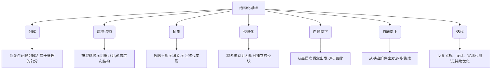

# 结构化思维原理与应用：掌握结构化思维内核，呈现宏大且清澈的美，实现高效达成

## 1. 背景介绍

### 1.1 问题的由来

在当今快节奏的数字时代，我们面临着大量的信息和复杂的问题。无论是在工作、学习还是日常生活中，我们都需要处理海量的数据、解决棘手的难题。然而，传统的思维方式往往难以应对这些挑战。因此，结构化思维作为一种高效的思考方法备受推崇。

结构化思维的概念源于20世纪60年代，当时计算机科学家为了解决复杂的编程问题而发明了这种思维模式。随着时间的推移，结构化思维不仅在计算机科学领域发挥着重要作用，而且逐渐渗透到各个领域,成为解决复杂问题的有力工具。

### 1.2 研究现状

近年来,结构化思维在学术界和商业领域受到广泛关注。许多顶尖大学开设了相关课程,培养学生的结构化思维能力。同时,众多公司也将结构化思维作为员工培训的重点内容,以提高团队的问题解决能力和工作效率。

然而,尽管结构化思维的重要性日益凸显,但仍然存在一些挑战和困难。首先,结构化思维涉及多个领域的知识,需要系统性的学习和训练。其次,将结构化思维应用于实际问题解决过程中,需要具备一定的经验和技巧。最后,结构化思维的理论和实践之间存在一定差距,需要进一步的研究和探索。

### 1.3 研究意义

掌握结构化思维原理并将其应用于实践,对于个人和组织都有重大意义:

1. 提高问题解决能力:结构化思维可以帮助我们将复杂的问题分解为可管理的部分,从而更好地理解问题的本质,找到有效的解决方案。

2. 增强沟通效率:结构化思维强调清晰的逻辑和层次结构,有助于提高沟通效率,避免信息混乱和理解偏差。

3. 提升决策质量:通过结构化思维,我们可以全面考虑各种因素,权衡利弊,从而做出更加明智的决策。

4. 优化工作流程:将结构化思维应用于工作流程中,可以帮助我们合理安排任务,提高工作效率。

5. 培养创新思维:结构化思维不仅强调逻辑性,还需要发散性思维,有助于激发创新灵感和想象力。

综上所述,结构化思维是一种强大的思考工具,值得我们深入探索和掌握。

### 1.4 本文结构

本文将全面介绍结构化思维的理论基础、核心概念、算法原理、数学模型、实践应用等内容。文章分为以下几个部分:

1. 核心概念与联系
2. 核心算法原理与具体操作步骤
3. 数学模型和公式详细讲解与案例分析
4. 项目实践:代码实例和详细解释
5. 实际应用场景
6. 工具和资源推荐
7. 总结:未来发展趋势与挑战
8. 附录:常见问题与解答

接下来,我们将逐一探讨这些内容,帮助读者全面掌握结构化思维的精髓。

## 2. 核心概念与联系

结构化思维是一种系统性的思考方式,它将复杂的问题分解为易于管理的部分,并通过逻辑推理和层次结构来组织和解决这些部分。它包含了以下几个核心概念:

1. **分解(Decomposition)**: 将复杂的问题或系统分解为更小、更易于管理的部分。这有助于降低认知负担,并更好地理解问题的本质。

2. **层次结构(Hierarchy)**: 将分解后的部分按照一定的逻辑顺序组织起来,形成一个层次分明的结构。这有助于清晰地展示各个部分之间的关系和依赖性。

3. **抽象(Abstraction)**: 忽略不相关的细节,只关注问题的核心本质。这有助于我们集中注意力,避免被无关紧要的细节分散注意力。

4. **模块化(Modularity)**: 将系统或问题划分为相对独立的模块,每个模块负责特定的功能或任务。这有助于提高代码的可重用性和可维护性,也有利于并行工作和分工协作。

5. **自顶向下(Top-down)**: 从高层次的概念和目标出发,逐步细化和分解,直到达到可执行的低层次细节。这有助于保持整体视角,并确保各个部分都符合预期目标。

6. **自底向上(Bottom-up)**: 从基础的组件和细节出发,逐步组合和集成,最终形成完整的系统或解决方案。这有助于确保基础部分的正确性和可靠性。

7. **迭代(Iteration)**: 通过反复的分析、设计、实现和测试,不断优化和完善系统或解决方案。这有助于持续改进,满足不断变化的需求。

这些核心概念相互关联、相辅相成,共同构成了结构化思维的基础框架。掌握这些概念有助于我们更好地理解和应用结构化思维,从而提高问题解决能力和工作效率。

## 3. 核心算法原理与具体操作步骤

### 3.1 算法原理概述

结构化思维的核心算法原理是将复杂的问题或系统分解为更小、更易于管理的部分,然后按照一定的逻辑顺序组织这些部分,形成一个层次分明的结构。这个过程涉及以下几个关键步骤:

1. **问题识别**: 清晰地定义和描述待解决的问题,确定问题的范围和目标。

2. **分解**: 将问题分解为更小、更易于管理的子问题或模块。分解的granularity取决于问题的复杂程度和个人的认知能力。

3. **组织**: 根据各个模块之间的逻辑关系和依赖性,将它们组织成一个层次分明的结构。

4. **抽象**: 在每个层次上,忽略不相关的细节,只关注核心本质。这有助于降低认知负担,集中注意力。

5. **实现**: 针对每个模块,设计和实现具体的解决方案或功能。

6. **集成**: 将各个模块按照预定的结构集成在一起,形成完整的系统或解决方案。

7. **测试和优化**: 对集成后的系统进行全面测试,发现并修复缺陷,不断优化和完善。

8. **迭代**: 根据反馈和新需求,重复上述步骤,持续改进系统或解决方案。

这个算法强调分而治之的思想,将复杂的问题分解为可管理的部分,从而降低认知负担,提高问题解决效率。同时,它也强调逻辑性和层次结构,确保各个部分之间的关系和依赖性得到恰当的处理。

### 3.2 算法步骤详解

接下来,我们将详细解释结构化思维算法的每个步骤:

#### 3.2.1 问题识别

问题识别是整个算法的起点。在这个阶段,我们需要清晰地定义和描述待解决的问题,确定问题的范围和目标。这可以通过提出以下问题来实现:

- 我们试图解决什么问题?
- 这个问题的范围是什么?
- 我们期望达到什么目标?
- 有哪些约束条件和限制?

明确问题的定义和目标对于后续步骤至关重要。如果问题定义不清晰,可能会导致解决方案偏离预期目标。

#### 3.2.2 分解

分解是将复杂问题划分为更小、更易于管理的子问题或模块的过程。分解的granularity取决于问题的复杂程度和个人的认知能力。一般来说,分解的粒度应该既不太粗糙(难以管理),也不太细致(过于繁琐)。

在分解过程中,我们可以遵循以下原则:

- 功能分解:根据不同的功能或职责将问题划分为多个模块。
- 数据分解:根据不同的数据类型或数据来源将问题划分为多个模块。
- 时序分解:根据时间顺序或流程步骤将问题划分为多个模块。

分解的结果应该是一组相对独立、职责单一的模块,每个模块都有明确的输入和输出。

#### 3.2.3 组织

组织是将分解后的模块按照一定的逻辑顺序组合成一个层次分明的结构的过程。这个过程需要考虑各个模块之间的关系和依赖性,确保整个结构的逻辑性和一致性。

在组织过程中,我们可以遵循以下原则:

- 自顶向下:从高层次的概念和目标出发,逐步细化和分解,直到达到可执行的低层次细节。
- 自底向上:从基础的组件和细节出发,逐步组合和集成,最终形成完整的系统或解决方案。
- 层次化:将模块组织成多个层次,每个层次负责特定的职责或抽象级别。
- 模块化:将相关的模块组合成更大的模块,形成更高层次的抽象。

组织的结果应该是一个层次分明、逻辑清晰的结构,每个层次都有明确的职责和输入输出。

#### 3.2.4 抽象

抽象是在每个层次上忽略不相关的细节,只关注核心本质的过程。它有助于降低认知负担,集中注意力,提高问题解决效率。

在抽象过程中,我们可以遵循以下原则:

- 隐藏实现细节:只暴露模块的接口和功能,隐藏内部实现细节。
- 提取共性:识别不同模块之间的共同特征,提取出通用的抽象层。
- 层次抽象:在不同的层次上进行适当的抽象,每个层次关注不同的抽象级别。

抽象的结果应该是一组清晰、简洁的概念和接口,能够准确反映问题的核心本质。

#### 3.2.5 实现

实现是针对每个模块设计和实现具体的解决方案或功能的过程。这个过程需要将抽象的概念和接口转化为可执行的代码或具体的操作步骤。

在实现过程中,我们可以遵循以下原则:

- 模块化设计:将每个模块设计为相对独立的单元,具有明确的接口和职责。
- 封装:将模块的数据和行为封装在一起,隐藏内部实现细节。
- 可重用性:设计通用的、可重用的模块,以便在不同的上下文中复用。
- 可测试性:确保每个模块都可以单独进行测试,以验证其正确性和可靠性。

实现的结果应该是一组可执行的代码或操作步骤,能够实现预期的功能和行为。

#### 3.2.6 集成

集成是将各个模块按照预定的结构集成在一起,形成完整的系统或解决方案的过程。这个过程需要确保各个模块之间的接口和依赖关系正确无误。

在集成过程中,我们可以遵循以下原则:

- 增量集成:逐步将模块集成到系统中,而不是一次性集成所有模块。
- 接口验证:验证每个模块之间的接口是否正确,确保数据和控制流的一致性。
- 依赖管理:确保模块之间的依赖关系得到正确处理,避