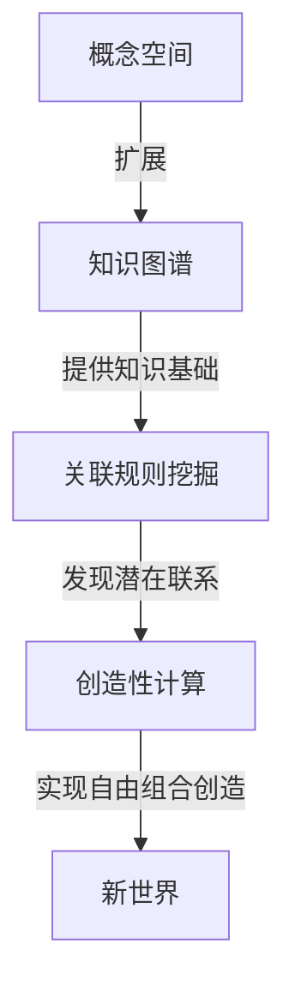
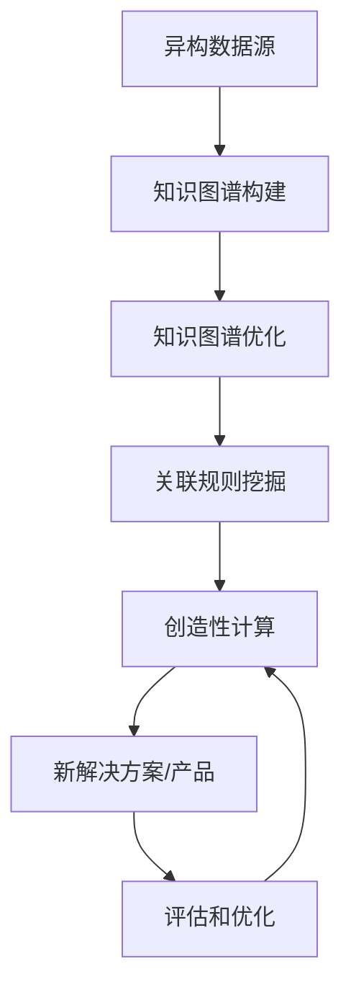

# 自由组合创造新世界的能力

## 1. 背景介绍

### 1.1 问题的由来

在当今快节奏的数字时代,创新和灵活性已成为企业和个人取得成功的关键因素。传统的线性思维和固步自封的方法已经无法满足不断变化的需求。相反,我们需要一种全新的思维模式,一种能够自由组合各种元素,创造出前所未有的解决方案和产品的能力。

这种"自由组合创造新世界"的能力源于人工智能(AI)和计算机科学的最新突破。通过将不同领域的知识、技术和资源进行无约束的组合,我们可以打破常规思维的束缚,开辟全新的可能性空间。

### 1.2 研究现状

目前,各个领域的专家和研究人员都在探索如何利用AI和计算机科学的力量来实现自由组合创造。例如,在生物医学领域,科学家们正在尝试将基因组学、蛋白质组学和系统生物学等不同领域的知识进行组合,以期望发现治疗疾病的新方法。在材料科学领域,研究人员正在利用机器学习算法来预测新材料的性能,从而加快新材料的设计和发现过程。

然而,实现真正的自由组合创造仍然面临着诸多挑战。首先,不同领域的知识和数据通常存在着巨大的异构性,使得它们难以直接进行组合和融合。其次,组合创造需要对各个领域都有深入的了解,这对于单个研究人员或团队来说是一个巨大的挑战。最后,由于组合创造所产生的解决方案和产品可能是全新的,因此很难预测它们的潜在影响和风险。

### 1.3 研究意义

自由组合创造新世界的能力具有重大的理论和实际意义。从理论上讲,它代表了人类认知能力的一次飞跃,打破了传统思维的局限性,开辟了全新的知识发现和创新的途径。从实际应用的角度来看,自由组合创造可以为各个领域带来革命性的变革,解决长期以来困扰着人类的一些顽疾,推动科技的飞速发展。

### 1.4 本文结构

本文将全面探讨自由组合创造新世界的能力。我们将首先介绍自由组合创造的核心概念和原理,阐述它与传统思维方式的根本区别。接下来,我们将详细讲解实现自由组合创造所需的核心算法和数学模型,并通过具体的案例和代码示例来加深读者的理解。然后,我们将探讨自由组合创造在各个领域的实际应用场景,并对未来的发展趋势和挑战进行展望。最后,我们将提供一些有用的工具和资源,以帮助读者进一步学习和实践自由组合创造。

## 2. 核心概念与联系

自由组合创造新世界的能力建立在几个核心概念之上,包括:

1. **概念空间(Conceptual Space)**:概念空间是指所有可能的概念、想法和解决方案的集合。在传统的思维模式下,我们往往被限制在一个狭窄的概念空间内,难以跳出既有的框架。而自由组合创造则旨在打破这些界限,探索更广阔的概念空间。

2. **知识图谱(Knowledge Graph)**:知识图谱是一种结构化的知识表示形式,它将不同领域的知识以图的形式进行组织和存储。知识图谱为自由组合创造提供了基础知识库,使得不同领域的知识可以被有效地整合和利用。

3. **关联规则挖掘(Association Rule Mining)**:关联规则挖掘是一种数据挖掘技术,用于发现数据集中隐藏的关联模式和规则。在自由组合创造中,关联规则挖掘可以帮助我们发现不同概念和知识之间的潜在联系,从而实现有意义的组合。

4. **创造性计算(Creative Computing)**:创造性计算是一种新兴的计算范式,旨在利用计算机的强大能力来模拟和增强人类的创造力。它融合了人工智能、认知科学和计算机科学等多个领域的理论和方法,为实现自由组合创造提供了强大的工具和技术支持。

这些核心概念相互关联、相辅相成,共同构建了自由组合创造新世界的理论基础和技术框架。下面是一个简单的Mermaid流程图,展示了它们之间的关系:

## 3. 核心算法原理 & 具体操作步骤

### 3.1 算法原理概述

实现自由组合创造新世界的核心算法是一种基于知识图谱和关联规则挖掘的创造性计算算法。它的基本思想是:首先构建一个包含多个领域知识的大规模知识图谱;然后在知识图谱上运行关联规则挖掘算法,发现不同概念和知识之间的潜在联系;最后,利用创造性计算技术,根据发现的关联规则进行自由组合,生成新颖的解决方案和产品。

该算法的优点在于,它能够充分利用已有的知识资源,并通过智能计算发现隐藏的关联模式,从而大大扩展了人类的创造力。同时,由于算法的高度自动化和智能化,它可以快速探索海量的组合可能性,节省了大量的人力和时间成本。

### 3.2 算法步骤详解

自由组合创造新世界的算法可以分为以下几个主要步骤:

1. **知识图谱构建**:从多个异构数据源(如数据库、文本文件、网页等)中提取相关知识,并将其表示为一个统一的知识图谱。这个过程涉及到信息抽取、实体链接、知识融合等多个子任务。

2. **知识图谱优化**:对构建的知识图谱进行优化,包括去噪、去重、补全等操作,以提高知识图谱的质量和完整性。

3. **关联规则挖掘**:在优化后的知识图谱上运行关联规则挖掘算法,发现不同概念和知识之间的潜在关联模式。常用的算法包括Apriori算法、FP-Growth算法等。

4. **创造性计算**:根据挖掘出的关联规则,利用创造性计算技术(如概念混合、类比推理等)进行自由组合,生成新颖的解决方案和产品。这个过程需要综合考虑组合的新颖性、有效性和可行性等多个因素。

5. **评估和优化**:对生成的解决方案和产品进行评估,包括新颖性、有效性、可行性等多个维度。根据评估结果,对算法进行优化和改进,以提高自由组合创造的效果。

下面是一个简单的Mermaid流程图,展示了算法的主要步骤:

### 3.3 算法优缺点

自由组合创造新世界的算法具有以下优点:

- 能够充分利用已有的知识资源,发现隐藏的关联模式。
- 通过智能计算实现自动化的创造过程,节省人力和时间成本。
- 可以探索海量的组合可能性,大大扩展了人类的创造力。
- 生成的解决方案和产品具有新颖性和创新性。

同时,该算法也存在一些缺点和挑战:

- 构建高质量的知识图谱是一个艰巨的任务,需要解决异构数据融合、知识表示等多个难题。
- 关联规则挖掘算法可能会产生大量无意义的规则,需要有效的筛选和评估机制。
- 创造性计算过程涉及到多个复杂的认知过程,如何有效地模拟和计算这些过程仍然是一个挑战。
- 生成的解决方案和产品可能存在潜在的风险和负面影响,需要进行严格的评估和控制。

### 3.4 算法应用领域

自由组合创造新世界的算法可以应用于多个领域,包括但不限于:

- **生物医学**:通过组合基因组学、蛋白质组学、系统生物学等不同领域的知识,发现新的疾病机理和治疗方法。
- **材料科学**:利用算法预测新材料的性能,加快新材料的设计和发现过程。
- **产品设计**:将不同领域的技术和概念进行创新组合,设计出具有新功能和新形态的产品。
- **艺术创作**:通过组合不同的艺术元素和风格,创造出独特的艺术作品。
- **科学发现**:探索不同学科之间的联系,发现新的科学原理和理论。

总的来说,自由组合创造新世界的算法为各个领域带来了无限的可能性,有望推动人类知识和创造力的飞跃发展。

## 4. 数学模型和公式 & 详细讲解 & 举例说明

### 4.1 数学模型构建

为了量化和优化自由组合创造新世界的过程,我们需要构建一个合适的数学模型。该模型的核心思想是将知识图谱表示为一个加权图,其中节点表示概念或实体,边表示概念之间的关联强度。然后,我们可以将关联规则挖掘问题转化为在加权图上发现频繁子图的问题。

具体来说,假设知识图谱包含 $n$ 个节点 $V=\{v_1, v_2, \ldots, v_n\}$,边的权重表示为 $w_{ij}$,表示节点 $v_i$ 和 $v_j$ 之间的关联强度。我们定义一个子图 $G'=(V', E')$ 是频繁的,如果它满足以下条件:

$$
\sum_{(v_i, v_j) \in E'} w_{ij} \geq \min\_sup
$$

其中 $\min\_sup$ 是一个预先设定的最小支持度阈值。也就是说,如果子图中所有边的权重之和大于等于 $\min\_sup$,那么这个子图就被认为是频繁的,代表了一个潜在的关联模式。

我们的目标是找到所有频繁子图,作为自由组合创造的候选模式。为了解决这个问题,我们可以借鉴图挖掘领域的一些经典算法,如 gSpan 算法、FSPM 算法等。这些算法通常采用基于模式增长的策略,从小模式开始,逐步扩展到更大的模式,并利用一些剪枝技术来提高效率。

### 4.2 公式推导过程

现在,我们来推导一下如何计算一个子图的支持度(即所有边的权重之和)。假设子图 $G'=(V', E')$ 包含 $m$ 个节点和 $l$ 条边,即 $V'=\{v'_1, v'_2, \ldots, v'_m\}$,  $E'=\{e'_1, e'_2, \ldots, e'_l\}$。我们定义子图的支持度为:

$$
\begin{aligned}
\operatorname{sup}(G') &= \sum_{e'_k \in E'} w(e'_k) \\
&= \sum_{(v'_i, v'_j) \in E'} w_{ij}
\end{aligned}
$$

其中 $w(e'_k)$ 表示边 $e'_k$ 的权重,即节点 $v'_i$ 和 $v'_j$ 之间的关联强度 $w_{ij}$。

进一步,我们可以将支持度公式写成矩阵形式:

$$
\operatorname{sup}(G') = \sum_{i=1}^m \sum_{j=1}^m A_{ij} W_{ij}
$$

其中 $A$ 是子图的邻接矩阵,即:

$$
A_{ij} = \begin{cases}
1, & \text{if } (v'_i, v'_j) \in E' \\
0, & \text{