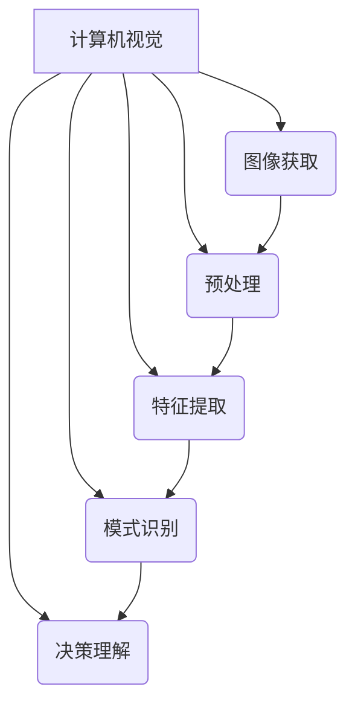
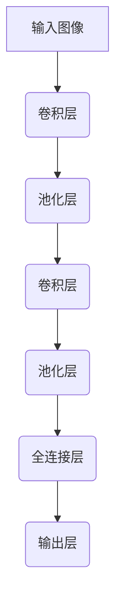

# 计算机视觉(Computer Vision) - 原理与代码实例讲解

## 1. 背景介绍

### 1.1 问题的由来

计算机视觉(Computer Vision)是一个跨学科的研究领域,旨在使计算机能够从数字图像或视频中获取有意义的高层次信息。它涉及多个领域,包括人工智能、图像处理、模式识别和机器学习等。随着科技的快速发展,计算机视觉技术在各个领域得到了广泛的应用,如自动驾驶、人脸识别、机器人视觉等。

传统的图像处理方法主要依赖于手工设计的特征提取和分类算法,这些算法需要大量的领域知识和人工调参。而随着深度学习技术的兴起,计算机视觉领域发生了革命性的变化。深度神经网络能够自动从大量数据中学习特征表示,极大地提高了视觉任务的性能。

### 1.2 研究现状

近年来,计算机视觉领域取得了长足的进步,尤其是在图像分类、目标检测、语义分割等任务上,深度学习模型已经超越了人类的水平。例如,在ImageNet图像分类任务中,最新的神经网络模型的Top-5错误率已经低于3%,而人类的错误率约为5%。

然而,尽管取得了巨大的成就,但计算机视觉仍然面临着诸多挑战。例如,现有模型对噪声、遮挡、变形等情况的鲁棒性还不够强;对小样本数据的泛化能力有待提高;视觉推理和视觉理解等高层次任务仍然是一个巨大的挑战。

### 1.3 研究意义

计算机视觉技术的发展对于推动人工智能的进步具有重要意义。视觉是人类获取外界信息的主要途径之一,计算机视觉技术的突破将使机器能够更好地理解和感知世界。同时,计算机视觉技术在诸多领域都有广泛的应用前景,如自动驾驶、医疗影像诊断、智能监控等,对于提高生产效率、降低人力成本、保障公共安全等方面具有重要价值。

### 1.4 本文结构

本文将全面介绍计算机视觉的核心概念、算法原理、数学模型以及代码实现细节。首先,我们将概述计算机视觉的基本概念和理论基础;然后详细阐述主流算法的原理和具体操作步骤;接着推导和讲解相关的数学模型和公式;之后通过实际代码示例,展示算法的具体实现过程;最后探讨计算机视觉在实际应用中的场景,并对未来的发展趋势和挑战进行展望。

## 2. 核心概念与联系

计算机视觉主要包括以下几个核心概念和流程:

1. **图像获取**:获取数字图像或视频数据,可以来自相机、扫描仪或者文件等。
2. **预处理**:对原始图像数据进行预处理,如降噪、增强对比度、几何变换等,以提高后续处理的效果。
3. **特征提取**:从预处理后的图像中提取有意义的特征,如边缘、角点、纹理等低级特征,或者更高级的语义特征。
4. **模式识别**:基于提取的特征,使用机器学习或深度学习等算法对图像中的模式进行识别和分类。
5. **决策理解**:根据模式识别的结果,对图像进行高层次的理解和决策,如目标检测、语义分割等。

这些概念和流程相互关联、环环相扣,共同构建了完整的计算机视觉系统。图像获取和预处理为后续处理奠定基础;特征提取是模式识别的关键;而模式识别和决策理解则是计算机视觉的核心目标。

## 3. 核心算法原理 & 具体操作步骤  

### 3.1 算法原理概述

计算机视觉领域存在多种经典算法,它们基于不同的原理和思路来解决视觉任务。以下是一些核心算法的简要概述:

1. **特征提取算法**:如SIFT、HOG等,通过设计手工特征来描述图像的局部特征。
2. **模板匹配算法**:将输入图像与预定义的模板进行匹配,常用于目标检测等任务。
3. **基于机器学习的分类算法**:如支持向量机(SVM)、随机森林等,通过学习训练数据,构建分类器对图像进行分类。
4. **基于深度学习的卷积神经网络(CNN)**:自动从数据中学习特征表示,在图像分类、目标检测等任务上取得了卓越的成绩。
5. **生成对抗网络(GAN)**:通过生成器和判别器的对抗训练,能够生成逼真的图像数据。
6. **注意力机制**:引入注意力机制,使神经网络能够专注于图像的关键区域,提高性能。

这些算法各有特点,需要根据具体的任务和数据选择合适的算法。

### 3.2 算法步骤详解

以卷积神经网络(CNN)为例,我们详细介绍其算法原理和具体步骤:

1. **输入层**:将输入图像数据馈送到网络的第一层。
2. **卷积层**:通过设计多个卷积核(滤波器),对输入图像进行卷积操作,提取不同的特征。
3. **池化层**:对卷积层的输出进行下采样,减小特征图的尺寸,提高模型的泛化能力。
4. **激活层**:引入非线性激活函数,如ReLU,增加网络的表达能力。
5. **重复卷积和池化**:堆叠多个卷积层和池化层,逐层提取更高级、更抽象的特征。
6. **全连接层**:将前面层的特征展开,经过全连接层的处理,得到最终的特征向量。
7. **输出层**:根据任务的不同,输出层可以是分类器(Softmax)、回归器等。
8. **反向传播**:通过计算损失函数,利用反向传播算法更新网络的权重参数。

通过上述步骤,CNN能够自动从数据中学习特征表示,并对图像进行分类或其他视觉任务。

### 3.3 算法优缺点

CNN算法具有以下优缺点:

**优点**:
- 自动学习特征表示,无需人工设计特征。
- 具有平移不变性,能够有效处理图像的平移。
- 参数共享机制大大减少了网络参数量。
- 通过深层网络结构,能够提取高层次的语义特征。

**缺点**:
- 需要大量的训练数据,否则容易过拟合。
- 对于旋转、缩放等变换,鲁棒性较差。
- 训练过程计算量大,需要强大的硬件支持。
- 网络结构和超参数的选择需要大量的实践经验。

### 3.4 算法应用领域

CNN算法在计算机视觉领域有着广泛的应用,包括但不限于:

- **图像分类**:将图像划分到预定义的类别中,如场景分类、物体分类等。
- **目标检测**:在图像中定位并识别出感兴趣的目标,如人脸检测、行人检测等。
- **语义分割**:对图像中的每个像素点进行分类,得到图像的语义分割结果。
- **实例分割**:在语义分割的基础上,进一步区分同类目标的不同实例。
- **图像生成**:利用GAN等生成模型,生成逼真的图像数据。
- **图像超分辨率**:从低分辨率图像生成高分辨率图像。
- **图像去噪**:从含噪图像中去除噪声,提高图像质量。

除了上述应用,CNN还在医疗影像分析、遥感图像处理、工业缺陷检测等领域发挥着重要作用。

## 4. 数学模型和公式 & 详细讲解 & 举例说明

### 4.1 数学模型构建

在介绍具体的公式之前,我们先构建一个简单的卷积神经网络模型,用于图像分类任务。该模型包含以下几个主要组件:

- 输入层:接收 $W \times H \times C$ 维的图像数据,其中 $W$、$H$ 分别表示图像的宽度和高度, $C$ 表示通道数(如RGB彩色图像,则 $C=3$)。
- 卷积层:通过设计 $K$ 个 $k \times k \times C$ 维的卷积核,对输入图像进行卷积操作,得到 $K$ 个特征图。
- 池化层:对特征图进行下采样,减小特征图的尺寸。
- 全连接层:将前面层的特征展开,经过全连接层的处理,得到最终的特征向量。
- 输出层:基于最终的特征向量,通过Softmax分类器输出图像所属的类别概率。

### 4.2 公式推导过程

**卷积运算**

卷积运算是CNN中最关键的运算之一,它的数学表达式如下:

$$
V_{ij}^{k} = \sum_{m=0}^{k_h-1}\sum_{n=0}^{k_w-1}\sum_{c=0}^{C-1}W_{mnc}^{k}I_{i+m,j+n,c} + b^k
$$

其中:
- $V_{ij}^{k}$ 表示第 $k$ 个特征图在位置 $(i,j)$ 处的值。
- $W_{mnc}^{k}$ 表示第 $k$ 个卷积核在位置 $(m,n,c)$ 处的权重值。
- $I_{i+m,j+n,c}$ 表示输入图像在位置 $(i+m,j+n,c)$ 处的像素值。
- $b^k$ 表示第 $k$ 个特征图的偏置项。
- $k_h$、$k_w$ 分别表示卷积核在高度和宽度上的大小。

通过上式,我们可以计算出每个特征图在不同位置的值,从而得到卷积层的输出。

**池化运算**

池化运算用于下采样特征图,常见的池化方法有最大池化和平均池化。以最大池化为例,其数学表达式如下:

$$
V_{ij}^{k} = \max_{(m,n) \in R_{ij}}U_{m,n}^{k}
$$

其中:
- $V_{ij}^{k}$ 表示第 $k$ 个特征图在位置 $(i,j)$ 处的池化后的值。
- $U_{m,n}^{k}$ 表示第 $k$ 个特征图在位置 $(m,n)$ 处的原始值。
- $R_{ij}$ 表示以 $(i,j)$ 为中心的池化区域。

通过取池化区域内的最大值,我们可以得到下采样后的特征图。

**全连接层**

全连接层将前面层的特征展开,并通过权重矩阵和偏置向量进行仿射变换,得到最终的特征向量。其数学表达式如下:

$$
\vec{y} = W\vec{x} + \vec{b}
$$

其中:
- $\vec{x}$ 表示输入的特征向量。
- $\vec{y}$ 表示全连接层的输出向量。
- $W$ 表示权重矩阵。
- $\vec{b}$ 表示偏置向量。

**Softmax分类器**

在图像分类任务中,我们通常使用Softmax分类器将特征向量映射到类别概率分布。其数学表达式如下:

$$
P(y=j|\vec{x}) = \frac{e^{\vec{w}_j^T\vec{x} + b_j}}{\sum_{k=1}^{K}e^{\vec{w}_k^T\vec{x} + b_k}}
$$

其中:
- $P(y=j|\vec{x})$ 表示输入特征向量 $\vec{x}$ 属于第 $j$ 类的概率。
- $K$ 表示总的类别数。
- $\vec{w