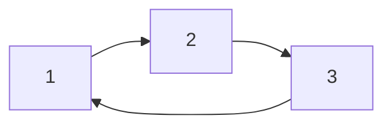
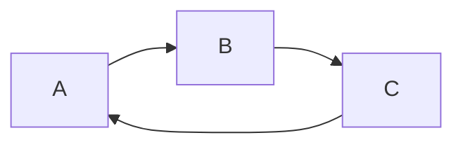

# 计算：第二部分 计算的数学基础 第 4 章 数学的基础

## 1. 背景介绍

### 1.1 问题的由来

数学，作为一门研究数量、结构、变化以及空间模型等概念的学科，是计算机科学的基石。从早期的计算机设计到如今的人工智能，无不依赖于深刻的数学原理和方法。然而，对于许多计算机专业的学生和从业者来说，数学往往成为学习和应用过程中的拦路虎。究其原因，一方面是传统的数学教育模式过于注重形式化推导和抽象概念，缺乏与实际应用场景的结合；另一方面，计算机科学发展日新月异，新的算法和模型层出不穷，需要不断学习和掌握新的数学工具。

因此，如何将抽象的数学概念与具体的计算机应用相结合，如何以一种更直观、更易懂的方式讲解复杂的数学原理，成为了摆在我们面前的重要课题。

### 1.2 研究现状

目前，市面上已经涌现出许多优秀的计算机数学教材和课程，例如《离散数学及其应用》、《具体数学》等。这些教材和课程在内容的深度和广度上都取得了很大的进步，但仍然存在一些不足之处：

* **过于注重理论推导，缺乏直观的解释和示例。** 很多教材在讲解数学概念时，往往直接给出定义、定理和证明，缺乏对概念的直观解释和形象化的示例，导致读者难以理解其本质。
* **与实际应用脱节，难以激发学习兴趣。** 很多教材在内容安排上，往往按照数学知识体系的逻辑顺序进行编排，缺乏与实际应用场景的结合，导致读者难以将所学知识应用到实际问题中。
* **内容更新速度慢，难以跟上计算机科学的发展步伐。** 随着计算机科学的快速发展，新的算法和模型层出不穷，而很多教材的内容更新速度较慢，难以涵盖最新的研究成果。

### 1.3 研究意义

为了解决上述问题，本书将以一种全新的方式来讲解计算的数学基础，力求做到以下几点：

* **以直观易懂的方式讲解抽象的数学概念。** 本书将尽量避免复杂的数学公式和证明，而是通过大量的图表、示例和类比来解释抽象的数学概念，帮助读者建立对数学的直观理解。
* **紧密结合实际应用场景，激发学习兴趣。** 本书将以实际的计算机应用问题为导向，讲解相关的数学知识，并通过代码示例展示如何将数学知识应用到实际问题中。
* **及时更新内容，涵盖最新的研究成果。** 本书将密切关注计算机科学的发展趋势，及时更新内容，涵盖最新的算法、模型和应用。

### 1.4 本文结构

本文作为《计算：第二部分 计算的数学基础》的第四章，将重点介绍数学的基础知识，为后续章节的学习奠定基础。本章主要内容包括：

* 集合论基础
* 逻辑与证明
* 函数与关系
* 图论基础

## 2. 核心概念与联系

本章将介绍的数学基础知识，彼此之间有着密切的联系，共同构成了计算机科学的理论基础。

**集合论** 是研究集合的数学分支，为我们提供了一种描述和操作对象集合的语言。在计算机科学中，集合被广泛用于表示数据结构、算法和程序的行为。

**逻辑** 是研究推理的数学分支，为我们提供了一种判断命题真假的工具。在计算机科学中，逻辑被广泛用于程序设计、软件验证和人工智能等领域。

**函数** 是一种特殊的映射关系，将一个集合中的每个元素映射到另一个集合中的唯一元素。在计算机科学中，函数被广泛用于表示算法、数据结构和程序模块。

**关系** 是集合中元素之间的一种联系，例如父子关系、朋友关系等。在计算机科学中，关系被广泛用于表示数据库、知识图谱和社会网络等。

**图论** 是研究图的数学分支，图是由节点和边组成的抽象结构，可以用来表示各种现实世界中的关系和结构。在计算机科学中，图论被广泛用于网络分析、算法设计和数据挖掘等领域。

## 3. 核心算法原理 & 具体操作步骤

本章不涉及具体的算法，因此省略此部分内容。

## 4. 数学模型和公式 & 详细讲解 & 举例说明

### 4.1 集合论基础

#### 4.1.1 集合的概念

**定义：** 集合是由一些确定的、不同的对象组成的整体，这些对象称为集合的元素。

**表示方法：**

* 列举法：将集合中的所有元素一一列举出来，例如：A = {1, 2, 3}。
* 描述法：用一个描述性的语句来描述集合中的元素，例如：B = {x | x 是偶数}。

**常见集合：**

* 自然数集：N = {0, 1, 2, ...}
* 整数集：Z = {..., -2, -1, 0, 1, 2, ...}
* 有理数集：Q = {p/q | p, q ∈ Z, q ≠ 0}
* 实数集：R

#### 4.1.2 集合的关系

**子集：** 如果集合 A 的所有元素都属于集合 B，则称 A 是 B 的子集，记作 A ⊆ B。

**真子集：** 如果 A ⊆ B 且 A ≠ B，则称 A 是 B 的真子集，记作 A ⊂ B。

**空集：** 不包含任何元素的集合称为空集，记作 ∅。

**并集：** 由属于集合 A 或属于集合 B 的所有元素组成的集合，称为 A 和 B 的并集，记作 A ∪ B。

**交集：** 由既属于集合 A 又属于集合 B 的所有元素组成的集合，称为 A 和 B 的交集，记作 A ∩ B。

**差集：** 由属于集合 A 但不属于集合 B 的所有元素组成的集合，称为 A 与 B 的差集，记作 A - B。

**补集：** 设 U 是一个全集，A 是 U 的一个子集，则由属于 U 但不属于 A 的所有元素组成的集合，称为 A 在 U 中的补集，记作 A^c。

#### 4.1.3 集合的运算律

集合的运算满足以下运算律：

* 交换律：A ∪ B = B ∪ A，A ∩ B = B ∩ A
* 结合律：(A ∪ B) ∪ C = A ∪ (B ∪ C)，(A ∩ B) ∩ C = A ∩ (B ∩ C)
* 分配律：A ∪ (B ∩ C) = (A ∪ B) ∩ (A ∪ C)，A ∩ (B ∪ C) = (A ∩ B) ∪ (A ∩ C)
* 吸收律：A ∪ (A ∩ B) = A，A ∩ (A ∪ B) = A
* 德摩根律：(A ∪ B)^c = A^c ∩ B^c，(A ∩ B)^c = A^c ∪ B^c

#### 4.1.4 举例说明

**例 1：** 设 A = {1, 2, 3}，B = {2, 3, 4}，求 A ∪ B，A ∩ B，A - B。

**解：**

* A ∪ B = {1, 2, 3, 4}
* A ∩ B = {2, 3}
* A - B = {1}

**例 2：** 设全集 U = {1, 2, 3, 4, 5}，A = {1, 3, 5}，求 A^c。

**解：** A^c = {2, 4}

### 4.2 逻辑与证明

#### 4.2.1 命题与逻辑联结词

**命题：** 可以判断真假的陈述句称为命题。

**逻辑联结词：** 用于连接命题的词语，例如：

* **非（¬）：** ¬p 表示 p 的否定。
* **与（∧）：** p ∧ q 表示 p 和 q 都为真。
* **或（∨）：** p ∨ q 表示 p 或 q 为真（或者两者都为真）。
* **蕴含（→）：** p → q 表示如果 p 为真，则 q 也为真。
* **等价（↔）：** p ↔ q 表示 p 为真当且仅当 q 为真。

#### 4.2.2 真值表

真值表是一种列出所有可能情况下命题真假值的表格。

| p | q | ¬p | p ∧ q | p ∨ q | p → q | p ↔ q |
|---|---|---|---|---|---|---|
| T | T | F | T | T | T | T |
| T | F | F | F | T | F | F |
| F | T | T | F | T | T | F |
| F | F | T | F | F | T | T |

#### 4.2.3 逻辑等价

如果两个命题的真值表相同，则称这两个命题逻辑等价。

**常用逻辑等价式：**

* 双重否定律：¬(¬p) ≡ p
* 德摩根律：¬(p ∧ q) ≡ ¬p ∨ ¬q，¬(p ∨ q) ≡ ¬p ∧ ¬q
* 交换律：p ∧ q ≡ q ∧ p，p ∨ q ≡ q ∨ p
* 结合律：(p ∧ q) ∧ r ≡ p ∧ (q ∧ r)，(p ∨ q) ∨ r ≡ p ∨ (q ∨ r)
* 分配律：p ∧ (q ∨ r) ≡ (p ∧ q) ∨ (p ∧ r)，p ∨ (q ∧ r) ≡ (p ∨ q) ∧ (p ∨ r)
* 蕴含等价式：p → q ≡ ¬p ∨ q
* 等价等价式：p ↔ q ≡ (p → q) ∧ (q → p)

#### 4.2.4 证明方法

* **直接证明：** 从已知条件出发，通过逻辑推理，直接推导出结论。
* **反证法：** 假设结论不成立，然后通过逻辑推理，导出矛盾，从而证明结论成立。
* **数学归纳法：** 用于证明关于自然数的命题。

#### 4.2.5 举例说明

**例 1：** 证明 ¬(p ∧ q) ≡ ¬p ∨ ¬q。

**证明：**

| p | q | p ∧ q | ¬(p ∧ q) | ¬p | ¬q | ¬p ∨ ¬q |
|---|---|---|---|---|---|---|
| T | T | T | F | F | F | F |
| T | F | F | T | F | T | T |
| F | T | F | T | T | F | T |
| F | F | F | T | T | T | T |

由真值表可知，¬(p ∧ q) 和 ¬p ∨ ¬q 的真值表相同，因此 ¬(p ∧ q) ≡ ¬p ∨ ¬q。

**例 2：** 证明对于任意自然数 n，1 + 2 + ... + n = n(n + 1) / 2。

**证明：**

* 基础步骤：当 n = 1 时，1 = 1(1 + 1) / 2，等式成立。
* 归纳假设：假设当 n = k 时，等式成立，即 1 + 2 + ... + k = k(k + 1) / 2。
* 归纳步骤：当 n = k + 1 时，
    ```
    1 + 2 + ... + k + (k + 1) = k(k + 1) / 2 + (k + 1)
                                  = (k^2 + k + 2k + 2) / 2
                                  = (k + 1)(k + 2) / 2
    ```
    等式成立。

因此，根据数学归纳法，对于任意自然数 n，1 + 2 + ... + n = n(n + 1) / 2。

### 4.3 函数与关系

#### 4.3.1 函数的概念

**定义：** 设 A 和 B 是两个非空集合，如果存在一个对应法则 f，使得对于 A 中的每一个元素 x，在 B 中都有唯一确定的元素 y 与之对应，则称 f 是从 A 到 B 的一个函数，记作 f: A → B。

**定义域、值域和对应法则：**

* 定义域：集合 A 称为函数 f 的定义域，记作 D(f)。
* 值域：集合 B 称为函数 f 的值域，记作 R(f)。
* 对应法则：函数 f 的对应法则通常用表达式表示，例如：f(x) = x^2。

#### 4.3.2 函数的类型

* **单射函数：** 如果对于定义域中不同的元素 x1 和 x2，都有 f(x1) ≠ f(x2)，则称 f 是单射函数。
* **满射函数：** 如果对于值域中的每一个元素 y，都存在定义域中的元素 x，使得 f(x) = y，则称 f 是满射函数。
* **双射函数：** 如果函数 f 既是单射函数，又是满射函数，则称 f 是双射函数。

#### 4.3.3 反函数

**定义：** 设 f: A → B 是一个双射函数，则存在一个函数 g: B → A，使得对于任意的 x ∈ A 和 y ∈ B，都有 g(f(x)) = x 且 f(g(y)) = y，则称 g 是 f 的反函数，记作 f^-1。

#### 4.3.4 关系的概念

**定义：** 设 A 和 B 是两个集合，A × B 的任意子集 R 称为从 A 到 B 的一个二元关系，简称关系。

**表示方法：**

* 集合表示法：例如：R = {(1, 2), (2, 3), (3, 1)}。
* 图示法：用图来表示关系，例如：



#### 4.3.5 关系的性质

* **自反性：** 如果对于集合 A 中的每一个元素 a，都有 (a, a) ∈ R，则称关系 R 是自反的。
* **对称性：** 如果对于集合 A 中的任意两个元素 a 和 b，如果 (a, b) ∈ R，则 (b, a) ∈ R，则称关系 R 是对称的。
* **传递性：** 如果对于集合 A 中的任意三个元素 a、b 和 c，如果 (a, b) ∈ R 且 (b, c) ∈ R，则 (a, c) ∈ R，则称关系 R 是传递的。

#### 4.3.6 举例说明

**例 1：** 判断函数 f(x) = x^2 是否为单射函数、满射函数或双射函数。

**解：**

* f(x) 不是单射函数，因为 f(-1) = f(1) = 1。
* f(x) 不是满射函数，因为对于任意的 x ∈ R，都有 f(x) ≥ 0，不存在 x 使得 f(x) = -1。
* 因此，f(x) 不是双射函数。

**例 2：** 设 A = {1, 2, 3}，B = {a, b, c}，R = {(1, a), (2, b), (3, c)}，判断关系 R 是否为函数。

**解：**

* 对于 A 中的每一个元素，在 R 中都有唯一确定的元素与之对应。
* 因此，关系 R 是函数。

### 4.4 图论基础

#### 4.4.1 图的概念

**定义：** 图 G 是一个有序二元组 (V, E)，其中：

* V 是一个非空集合，称为顶点集，其元素称为顶点。
* E 是 V × V 的一个子集，称为边集，其元素称为边。

**表示方法：**

* 图示法：用图来表示图，例如：



* 邻接矩阵：用矩阵来表示图，例如：

```
    A B C
A   0 1 1
B   1 0 1
C   1 1 0
```

#### 4.4.2 图的类型

* **无向图：** 如果边集 E 中的边都是无序对，则称 G 为无向图。
* **有向图：** 如果边集 E 中的边都是有序对，则称 G 为有向图。
* **赋权图：** 如果每条边都被赋予一个权值，则称 G 为赋权图。

#### 4.4.3 图的遍历

图的遍历是指从图的某个顶点出发，访问图中所有顶点的过程。

* **深度优先搜索 (DFS)：** 是一种递归的图遍历算法，从起始顶点开始，沿着一条路径尽可能深地访问顶点，直到无法继续为止，然后回溯到上一个顶点，继续访问其他未被访问的顶点。
* **广度优先搜索 (BFS)：** 是一种逐层遍历图的算法，从起始顶点开始，先访问与其距离为 1 的所有顶点，然后访问距离为 2 的所有顶点，以此类推，直到访问完所有顶点。

#### 4.4.4 举例说明

**例 1：** 给定一个图 G，判断 G 是否为连通图。

**解：**

可以使用 DFS 或 BFS 算法遍历图 G，如果能够从任意一个顶点出发访问到所有其他顶点，则 G 是连通图，否则 G 不是连通图。

**例 2：** 给定一个赋权图 G，求 G 的最小生成树。

**解：**

可以使用 Prim 算法或 Kruskal 算法求解最小生成树。

## 5. 项目实践：代码实例和详细解释说明

本章不涉及具体的项目实践，因此省略此部分内容。

## 6. 实际应用场景

### 6.1 集合论

* 数据库查询：数据库查询语言 SQL 中的集合运算符（UNION，INTERSECT，EXCEPT）就是基于集合论的。
* 数据挖掘：在数据挖掘中，经常需要对数据进行聚类分析，将具有相似特征的数据划分到同一个集合中。

### 6.2 逻辑与证明

* 程序设计：程序设计中的逻辑判断、循环控制等都离不开逻辑运算。
* 软件验证：软件验证的目标是证明程序的正确性，需要使用逻辑推理来证明程序满足特定的规范。
* 人工智能：人工智能中的知识表示、推理和学习等领域都依赖于逻辑。

### 6.3 函数与关系

* 算法设计：算法通常被定义为一系列的步骤，这些步骤可以用函数来表示。
* 数据结构：很多数据结构，例如数组、链表、树等，都可以看作是函数的应用。
* 程序模块化：函数可以将程序分解成多个模块，提高程序的可读性和可维护性。

### 6.4 图论

* 网络分析：社交网络、交通网络、通信网络等都可以用图来表示，图论可以用于分析网络的结构和特性。
* 算法设计：很多算法，例如最短路径算法、网络流算法等，都是基于图论的。
* 数据挖掘：图论可以用于分析数据之间的关系，例如推荐系统、社区发现等。

### 6.5 未来应用展望

随着计算机科学的不断发展，数学基础知识将在以下领域发挥越来越重要的作用：

* 大数据分析：大数据的规模和复杂性对数据分析方法提出了更高的要求，需要更加 sophisticated 的数学模型和算法。
* 人工智能：人工智能的发展需要更加强大的逻辑推理、知识表示和学习能力，这些都离不开数学基础知识的支持。
* 量子计算：量子计算是一种全新的计算模式，需要新的数学理论和方法来支持。

## 7. 工具和资源推荐

### 7.1 学习资源推荐

* **书籍：**
    * 《离散数学及其应用》
    * 《具体数学》
    * 《Introduction to Algorithms》
* **在线课程：**
    * Coursera: Discrete Mathematics
    * MIT OpenCourseWare: Mathematics for Computer Science

### 7.2 开发工具推荐

* **Python：** Python 是一种易学易用的编程语言，拥有丰富的数学库，例如 NumPy、SciPy 等，适合用于进行数学计算和算法实现。
* **Matlab：** Matlab 是一种专门用于数值计算的软件，拥有强大的矩阵运算和图形绘制功能，适合用于进行数学建模和数据分析。

### 7.3 相关论文推荐

* A. Turing, "On Computable Numbers, with an Application to the Entscheidungsproblem," Proceedings of the London Mathematical Society, vol. 42, no. 1, pp. 230-265, 1936.
* C. E. Shannon, "A Mathematical Theory of Communication," Bell System Technical Journal, vol. 27, no. 3, pp. 379-423, 1948.

### 7.4 其他资源推荐

* Khan Academy: Math
* Wolfram Alpha

## 8. 总结：未来发展趋势与挑战

### 8.1 研究成果总结

本章介绍了计算的数学基础知识，包括集合论、逻辑与证明、函数与关系以及图论。这些知识是计算机科学的基石，对于理解和应用计算机科学的各个领域都至关重要。

### 8.2 未来发展趋势

未来，随着计算机科学的不断发展，数学基础知识将在以下方面发挥越来越重要的作用：

* **更加抽象和形式化的数学工具将被应用于解决实际问题。** 例如，范畴论、拓扑学等数学分支的理论和方法将被用于解决计算机科学中的问题。
* **数学模型和算法将更加注重可解释性和可解释性。** 随着人工智能技术的普及，人们越来越关注算法的决策过程和结果的可解释性，这需要更加透明和可解释的数学模型和算法。
* **数学基础知识将与其他学科更加紧密地结合。** 例如，生物信息学、计算金融学等新兴学科的发展需要数学、计算机科学和其他学科的交叉融合。

### 8.3 面临的挑战

* **如何将抽象的数学概念与具体的计算机应用相结合，仍然是一个挑战。** 需要开发更加直观、更加易懂的教学方法和工具，帮助学生和从业者更好地理解和应用数学知识。
* **如何及时更新数学基础知识，以适应计算机科学的快速发展，也是一个挑战。** 需要不断跟踪最新的研究成果，并将其融入到教材和课程中。

### 8.4 研究展望

未来，我们将继续探索如何更好地教授和学习计算的数学基础知识，并将其应用于解决实际问题。我们相信，数学基础知识将在推动计算机科学的未来发展中发挥更加重要的作用。

## 9. 附录：常见问题与解答

**问题 1：** 学习计算的数学基础知识需要什么样的数学基础？

**回答：** 学习计算的数学基础知识需要具备高中数学的基础知识，包括代数、几何、函数等。

**问题 2：** 学习计算的数学基础知识有什么好的方法？

**回答：** 学习计算的数学基础知识，建议采用以下方法：

* **选择合适的教材和课程。** 选择内容深入浅出、讲解清晰易懂、示例丰富的教材和课程。
* **注重理解概念，不要死记硬背。** 对于每个数学概念，要理解其定义、性质和应用，不要只是死记硬背公式和定理。
* **多做练习，巩固所学知识。** 做练习可以帮助你更好地理解和掌握所学知识，并提高解决问题的能力。
* **结合实际应用，提高学习兴趣。** 将所学知识应用到实际问题中，可以帮助你更好地理解和记忆知识，并提高学习兴趣。

**问题 3：** 学习计算的数学基础知识有什么用处？

**回答：** 学习计算的数学基础知识，可以帮助你：

* **更好地理解计算机科学的各个领域。** 计算机科学的各个领域，例如算法设计、数据结构、数据库、人工智能等，都依赖于数学基础知识。
* **提高解决问题的能力。** 数学基础知识可以帮助你抽象问题、建立模型、分析问题和解决问题。
* **增强逻辑思维能力。** 数学是一门逻辑性很强的学科，学习数学可以帮助你增强逻辑思维能力。

作者：禅与计算机程序设计艺术 / Zen and the Art of Computer Programming 
