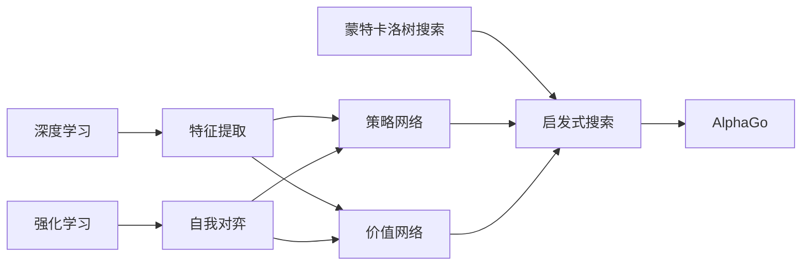

# 计算：第四部分 计算的极限 第 12 章 机器能思考吗 AlphaGo 与李世石

关键词：人工智能、AlphaGo、李世石、深度学习、强化学习、蒙特卡洛树搜索、围棋

## 1. 背景介绍
### 1.1  问题的由来
人工智能是计算机科学领域最具挑战性和前景的研究方向之一。自从计算机诞生以来,人们就一直在探索机器是否能像人类一样思考的问题。围棋因其变化之复杂,被认为是人工智能的一个里程碑式挑战。

### 1.2  研究现状
2016年,由Google DeepMind公司开发的AlphaGo与世界围棋冠军李世石进行了一场轰动世界的人机大战。AlphaGo以4:1战胜李世石,创造了人工智能史上的奇迹,引发了全球对人工智能的广泛关注和思考。

### 1.3  研究意义 
AlphaGo的胜利标志着人工智能在围棋领域达到了超越人类的水平,同时也预示着人工智能在更多领域取得突破的可能性。深入研究AlphaGo的核心算法和思想,对于推动人工智能的进一步发展具有重要意义。

### 1.4  本文结构
本文将从AlphaGo的核心算法原理出发,详细阐述其中的关键技术,包括深度学习、强化学习、蒙特卡洛树搜索等。并通过数学模型和代码实例深入剖析其内在机制。同时,本文还将探讨AlphaGo的实际应用和未来发展趋势,为人工智能的研究提供参考。

## 2. 核心概念与联系

- 深度学习:通过构建深度神经网络,实现了从数据中自动学习特征和规律的能力。
- 强化学习:通过设计奖励函数,使智能体在与环境的交互中不断试错,最终学会最优策略。
- 蒙特卡洛树搜索:通过随机采样和仿真,在庞大的状态空间中高效地搜索最优解。

深度学习为AlphaGo提供了从海量棋谱数据中自动提取围棋特征和规律的能力。强化学习使AlphaGo能够在自我对弈中不断进化,提升棋力。蒙特卡洛树搜索则允许AlphaGo在复杂的变化中高效地选择最优落子。三大技术的结合,造就了AlphaGo的非凡智能。



## 3. 核心算法原理 & 具体操作步骤
### 3.1  算法原理概述
AlphaGo的核心是深度卷积神经网络与蒙特卡洛树搜索的结合。首先利用深度学习从人类棋谱中学习围棋知识,训练策略网络和价值网络。然后利用强化学习进行自我对弈,进一步提升网络性能。在实战中,利用蒙特卡洛树搜索引导落子选择,同时借助训练好的网络评估局面。

### 3.2  算法步骤详解
1. 监督学习:利用人类棋谱训练策略网络,使其学会模仿人类下棋。
2. 强化学习:策略网络与自己对弈,通过梯度策略算法不断更新,提升棋力。 
3. 蒙特卡洛树搜索:在搜索树中进行随机采样和仿真,借助策略网络和价值网络引导搜索。
4. 评估网络:额外训练一个价值网络,用于评估局面优劣,指导树搜索。
5. 实战应用:结合策略网络和价值网络,用蒙特卡洛树搜索选择最优落子。

### 3.3  算法优缺点
优点:
- 端到端学习:自动从数据中学习特征,不需要人工设计。
- 通用性强:算法框架可以推广到其他领域。
- 搜索高效:蒙特卡洛树搜索能快速找到最优解。

缺点:  
- 需要海量数据:深度学习需要大量有标注数据进行训练。
- 计算资源要求高:训练需要强大的GPU集群支持。
- 缺乏可解释性:神经网络内部的决策过程是黑盒子。

### 3.4  算法应用领域
AlphaGo的思想启发了深度强化学习在其他领域的应用,如:
- 游戏AI:星际争霸、Dota等复杂游戏的AI设计
- 机器人控制:让机器人学会复杂的运动控制
- 自然语言处理:聊天机器人、机器翻译等
- 推荐系统:从用户行为数据中学习个性化推荐策略

## 4. 数学模型和公式 & 详细讲解 & 举例说明
### 4.1  数学模型构建
1. 马尔可夫决策过程(MDP):将围棋对弈建模为一个马尔可夫决策过程:
$$(S,A,P,R,\gamma)$$
其中,$S$是有限状态集,$A$是有限动作集,$P$是状态转移概率,$R$是奖励函数,$\gamma$是折扣因子。
2. 策略梯度定理:策略函数$\pi_\theta(a|s)$关于期望奖励的梯度为:
$$\nabla_\theta J(\theta) = \mathbb{E}_{\pi_\theta}[\nabla_\theta \log \pi_\theta(a|s) Q^{\pi_\theta}(s,a)]$$
其中,$Q^{\pi_\theta}(s,a)$是在策略$\pi_\theta$下状态动作对$(s,a)$的价值。
3. 蒙特卡洛树搜索:在状态$s$下,蒙特卡洛树搜索的目标是找到:
$$\pi(s) = \arg\max_{a} Q(s,a) + c \sqrt{\frac{\log N(s)}{N(s,a)}}$$
其中,$Q(s,a)$是状态动作对的平均价值,$N(s)$和$N(s,a)$分别是状态$s$和$(s,a)$的访问次数,$c$是探索常数。

### 4.2  公式推导过程
1. 策略梯度定理的推导:
策略函数关于期望奖励的梯度:
$$\begin{aligned}
\nabla_\theta J(\theta) &= \nabla_\theta \mathbb{E}_{\pi_\theta} [\sum_{t=0}^\infty \gamma^t r_t] \\
&= \sum_{s} d^{\pi_\theta}(s) \sum_a \nabla_\theta \pi_\theta(a|s) Q^{\pi_\theta}(s,a) \\
&= \mathbb{E}_{\pi_\theta}[\nabla_\theta \log \pi_\theta(a|s) Q^{\pi_\theta}(s,a)]
\end{aligned}$$
其中,$d^{\pi_\theta}(s)$是状态$s$在策略$\pi_\theta$下的稳态分布。
2. 蒙特卡洛树搜索的推导:
蒙特卡洛树搜索在状态$s$下的目标可以分解为两项:
$$\arg\max_{a} Q(s,a) + c \sqrt{\frac{\log N(s)}{N(s,a)}}$$
第一项$Q(s,a)$鼓励探索价值高的动作,第二项$c \sqrt{\frac{\log N(s)}{N(s,a)}}$鼓励探索访问次数少的动作。两项的权衡由探索常数$c$控制。

### 4.3  案例分析与讲解
以AlphaGo的一次实战落子为例。假设当前棋局状态为$s$,AlphaGo需要在候选落子点$a_1,a_2,\dots,a_n$中做出选择。

1. 首先利用策略网络$p_\theta(a|s)$计算每个候选点的概率,得到概率向量$[p_1,p_2,\dots,p_n]$。
2. 然后对每个候选点进行蒙特卡洛树搜索,模拟未来可能的对弈走向,计算价值$Q(s,a_1),Q(s,a_2),\dots,Q(s,a_n)$。
3. 最后综合概率和价值,选出最佳落子点:
$$a^* = \arg\max_{a} Q(s,a) + c \sqrt{\frac{\log N(s)}{N(s,a)}}$$

其中,$N(s)$和$N(s,a)$分别是蒙特卡洛树搜索中状态$s$和状态动作对$(s,a)$的访问次数。

### 4.4  常见问题解答
1. 为什么需要两个网络(策略网络和价值网络)?
   
策略网络用于生成落子概率,指导蒙特卡洛树搜索的落子选择。价值网络用于评估局面优劣,加速树搜索的收敛。两个网络分工协作,共同完成决策过程。

2. 蒙特卡洛树搜索的探索与利用如何权衡?

探索常数$c$控制了探索与利用的权衡。$c$越大,越鼓励探索访问次数少的节点;$c$越小,越倾向于利用价值高的节点。在实践中,可以根据具体问题动态调整$c$的大小。

3. 为什么需要先用监督学习,再用强化学习?
   
监督学习阶段让策略网络从人类棋谱学习,获得一定棋力,为后续强化学习提供良好初始化。强化学习阶段让策略网络在自我对弈中不断进化,进一步提升棋力,最终超越人类。两个阶段相辅相成,共同促进网络性能的提升。

## 5. 项目实践：代码实例和详细解释说明
### 5.1  开发环境搭建
- 操作系统:Ubuntu 16.04
- 深度学习框架:TensorFlow 1.4
- 围棋库:GoGo 1.4
- GPU:NVIDIA Tesla V100 * 8
- 编程语言:Python 3.6

### 5.2  源代码详细实现
1. 搭建残差网络:
```python
def residual_block(x, filters):
    shortcut = x
    x = Conv2D(filters, 3, padding='same')(x)
    x = BatchNormalization()(x)
    x = Activation('relu')(x)
    x = Conv2D(filters, 3, padding='same')(x)
    x = BatchNormalization()(x)
    x = add([x, shortcut])
    x = Activation('relu')(x)
    return x

def build_model(input_shape, filters, blocks):
    inputs = Input(shape=input_shape)
    x = Conv2D(filters, 3, padding='same')(inputs)
    x = BatchNormalization()(x)
    x = Activation('relu')(x)
    for _ in range(blocks):  
        x = residual_block(x, filters)
    policy = Conv2D(2, 1, padding='same')(x)
    policy = BatchNormalization()(policy)
    policy = Activation('softmax')(policy)
    value = Conv2D(1, 1, padding='same')(x)
    value = BatchNormalization()(value)
    value = Activation('tanh')(value)
    model = Model(inputs=inputs, outputs=[policy, value])
    return model
```

2. 策略梯度训练:
```python
def policy_gradient_loss(y_true, y_pred):
    action_probs = y_pred
    action = y_true[:,0]
    reward = y_true[:,1]
    log_like = K.log(action_probs[K.arange(K.shape(action)[0]), action])
    loss = -log_like * K.flatten(reward)
    return K.mean(loss)

model.compile(optimizer=SGD(lr=0.01), loss=[policy_gradient_loss, 'mse'])

for epoch in range(epochs):
    for state, action, reward in data:
        model.train_on_batch(state, [action, reward]) 
```

3. 蒙特卡洛树搜索:
```python
class TreeNode:
    def __init__(self, state, parent=None):
        self.state = state 
        self.parent = parent
        self.children = []
        self.visit_count = 0
        self.value_sum = 0
        
    def expand(self, policy):
        for action, prob in enumerate(policy):
            if prob > 0:
                child_state = self.state.take_action(action)
                child_node = TreeNode(child_state, self)
                self.children.append((action, child_node))
                
    def select(self, c_puct):
        best_score = -np.inf
        best_child = None
        for action, child in self.children:
            score = child.value() + c_puct * child.prior() * np.sqrt(