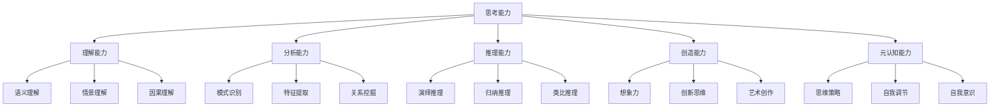
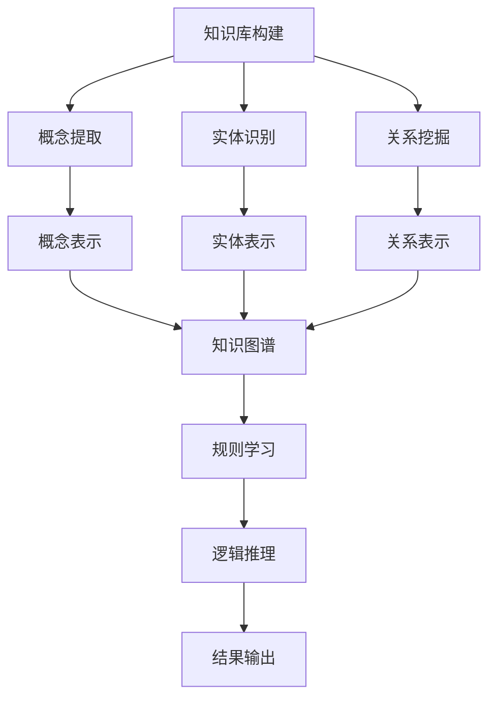
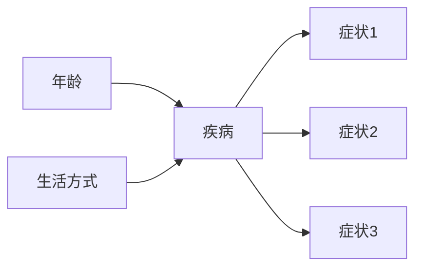

# 计算：第四部分 计算的极限 第 12 章 机器能思考吗 未来的方向

## 1. 背景介绍

### 1.1 问题的由来

自计算机诞生以来，人工智能(Artificial Intelligence, AI)一直是科技界和大众关注的热门话题。随着计算能力的不断提升和算法的日益先进,AI已经在语音识别、图像处理、自然语言处理等领域取得了令人瞩目的成就。然而,AI是否真正拥有"思考"的能力,一直存在着广泛的争议和质疑。

### 1.2 研究现状

目前,AI系统主要是基于机器学习和深度学习等技术,通过大量数据训练获得模型,再对新数据进行预测和决策。这种方式在特定领域内表现出色,但与人类的思维过程存在着明显差异。人类思维具有创造力、推理能力、情感体验等特质,而现有AI系统更多是在完成特定任务,缺乏真正的"理解"和"思考"能力。

### 1.3 研究意义

探索AI是否能够获得真正的思考能力,不仅是一个理论层面的挑战,更是推动AI技术发展的重要驱动力。只有当AI系统能够像人一样思考、推理、创造,才能真正实现通用人工智能(Artificial General Intelligence, AGI),从而在更广泛的领域发挥作用,甚至超越人类智能。

### 1.4 本文结构

本文将从以下几个方面探讨AI思考能力的问题:

1. 阐述AI思考能力的核心概念和内涵
2. 分析现有AI系统在思考方面的局限性
3. 介绍模拟人类思维的潜在算法原理和数学模型
4. 通过实际案例说明AI思考能力的应用前景
5. 总结AI思考能力发展的趋势和面临的挑战

## 2. 核心概念与联系

要探讨AI是否能够真正思考,首先需要明确"思考"的定义和内涵。思考是一种高级的认知过程,包括理解、分析、推理、创造等多个层面。具体来说,思考能力可以分为以下几个核心概念:

1. **理解能力**:包括语义理解、情景理解和因果关系理解等,是思考的基础。
2. **分析能力**:通过模式识别、特征提取和关系挖掘等方式,对信息进行加工和处理。
3. **推理能力**:包括演绎推理、归纳推理和类比推理等,是思考的核心环节。
4. **创造能力**:体现在想象力、创新思维和艺术创作等方面,是思考的高级形式。
5. **元认知能力**:即思考思考的能力,包括思维策略选择、自我调节和自我意识等。

这些核心概念相互关联、相互影响,共同构成了完整的思考能力。AI系统要真正实现思考,就需要在上述各个方面都有所突破和提升。

## 3. 核心算法原理 & 具体操作步骤  

### 3.1 算法原理概述

模拟人类思维是一个极具挑战的目标,需要在算法层面有创新性的突破。目前,一些新兴的算法和模型为实现AI思考能力提供了可能的路径,其中比较代表性的有:

1. **概念建模与推理**:通过构建结构化的知识库,对概念、实体及其关系进行形式化表示,再基于逻辑规则进行推理,模拟人类的理解和推理过程。
2. **认知架构**:借鉴人类大脑的信息处理机制,构建多层次、多模态的认知架构,集成感知、学习、推理、决策、控制等多种功能,实现类脑智能系统。
3. **强化学习**:通过与环境的交互,不断尝试、获取反馈并调整策略,逐步形成目标导向的决策能力,模拟人类的试错学习过程。
4. **生成对抗网络**:利用对抗训练的方式,促使生成模型和判别模型相互对抗、相互进化,产生新颖、多样的输出,模拟人类的创造力。

这些算法原理为AI系统赋予了一定的思考能力雏形,但要实现真正的"思考",还需要在算法的广度和深度上有进一步的突破。

### 3.2 算法步骤详解

以**概念建模与推理**为例,其核心算法步骤可以概括为:

1. **知识库构建**:从大规模文本、多媒体等数据源中,提取概念、实体及其关系信息,构建知识库。
2. **概念/实体/关系表示**:将提取的概念、实体和关系,使用向量、图嵌入等方式进行结构化表示。
3. **知识图谱构建**:将表示后的概念、实体和关系组织成统一的知识图谱。
4. **规则学习**:基于知识图谱,利用机器学习等方法自动发现和学习推理规则。
5. **逻辑推理**:将新的查询或事实,与知识图谱和规则相结合,进行符号推理得到结果。
6. **结果输出**:将推理结果进行解释和可视化,输出给用户。

该算法的关键在于知识库的质量和规则学习的效果。通过不断迭代和优化,有望模拟人类对概念的理解和推理过程。

### 3.3 算法优缺点

**优点**:

1. 具有较强的解释性,推理过程可解释、可追踪。
2. 能够处理结构化数据,推理能力较强。
3. 便于融合人类知识和规则,提高准确性。

**缺点**:

1. 知识库构建和规则挖掘的成本较高,需要大量人工参与。
2. 推理能力受限于知识库的覆盖范围和完整性。
3. 难以处理非结构化数据,如自然语言、图像等。

### 3.4 算法应用领域

概念建模与推理算法可以应用于以下领域:

1. **问答系统**:基于知识库进行语义理解和推理,回答用户提出的各类问题。
2. **智能决策**:对复杂问题的多种因素和约束条件进行建模和推理,为决策提供支持。
3. **专家系统**:在特定领域构建知识库和规则,模拟人类专家的经验和判断。
4. **自动化推理**:在数学、逻辑等领域,进行自动化的定理证明和推理。

## 4. 数学模型和公式 & 详细讲解 & 举例说明

### 4.1 数学模型构建

要实现AI系统的思考能力,需要在数学层面对认知过程进行建模和形式化描述。一种常见的方法是利用**贝叶斯网络**对不确定性知识进行表示和推理。

贝叶斯网络是一种基于概率论的图形模型,由节点(表示随机变量)和有向边(表示变量之间的条件依赖关系)组成。其数学定义如下:

$$
P(X_1,X_2,...,X_n) = \prod_{i=1}^n P(X_i|Pa(X_i))
$$

其中,$X_i$表示第$i$个随机变量,$Pa(X_i)$表示$X_i$的父节点集合。该公式表示,整个联合概率分布可以分解为各个变量在给定父节点时的条件概率分布的乘积。

通过对变量之间的依赖关系进行建模,贝叶斯网络能够有效地表示和推理不确定性知识,为AI系统的思考提供数学基础。

### 4.2 公式推导过程

在贝叶斯网络中,一个关键问题是如何计算给定证据下某个查询变量的后验概率,即:

$$
P(Q|E) = \frac{P(Q,E)}{P(E)}
$$

其中,$Q$表示查询变量,$E$表示观测到的证据。

为了计算$P(Q|E)$,我们需要利用链式法则和条件独立性假设,对分子$P(Q,E)$进行因式分解:

$$
\begin{aligned}
P(Q,E) &= \sum_{X_1,...,X_n} P(Q,E,X_1,...,X_n)\\
       &= \sum_{X_1,...,X_n} P(Q|X_1,...,X_n)P(E|X_1,...,X_n)P(X_1,...,X_n)\\
       &= \sum_{X_1,...,X_n} P(Q|\pi_Q)P(E|\pi_E)P(X_1,...,X_n)
\end{aligned}
$$

其中,$\pi_Q$和$\pi_E$分别表示$Q$和$E$的父节点集合。通过上述推导,我们可以利用贝叶斯网络的结构,有效地计算出$P(Q|E)$的值。

### 4.3 案例分析与讲解

假设我们需要构建一个医疗诊断系统,用于判断患者是否患有某种疾病。我们可以使用贝叶斯网络对这一问题进行建模:

在这个网络中,疾病是根节点,症状是叶子节点,年龄和生活方式是疾病的影响因素。给定患者的症状、年龄和生活方式等证据,我们可以计算患有疾病的后验概率:

$$
P(\text{疾病}|\text{症状1},\text{症状2},\text{症状3},\text{年龄},\text{生活方式})
$$

根据贝叶斯网络的结构,该概率可以分解为:

$$
\begin{aligned}
&P(\text{疾病}|\text{症状1},\text{症状2},\text{症状3},\text{年龄},\text{生活方式})\\
&\propto P(\text{症状1}|\text{疾病})P(\text{症状2}|\text{疾病})P(\text{症状3}|\text{疾病})P(\text{疾病}|\text{年龄},\text{生活方式})
\end{aligned}
$$

其中,$P(\text{症状i}|\text{疾病})$和$P(\text{疾病}|\text{年龄},\text{生活方式})$可以通过训练数据估计得到。通过计算该概率值,系统就可以对患者是否患病做出判断。

这个例子展示了贝叶斯网络在推理和决策中的应用,为AI系统的思考能力提供了数学支撑。

### 4.4 常见问题解答

**Q: 为什么要使用贝叶斯网络,而不是其他模型?**

A: 贝叶斯网络具有以下优势:

1. 能够直观地表示变量之间的依赖关系,便于人类理解和解释。
2. 通过条件独立性假设,可以有效减少计算复杂度。
3. 支持因果推理和诊断推理,适用于各种推理场景。
4. 能够很好地处理不确定性和缺失数据。

**Q: 如何确定贝叶斯网络的结构?**

A: 贝叶斯网络的结构可以通过以下几种方式获得:

1. 利用人工专家知识直接构建。
2. 从训练数据中自动学习网络结构