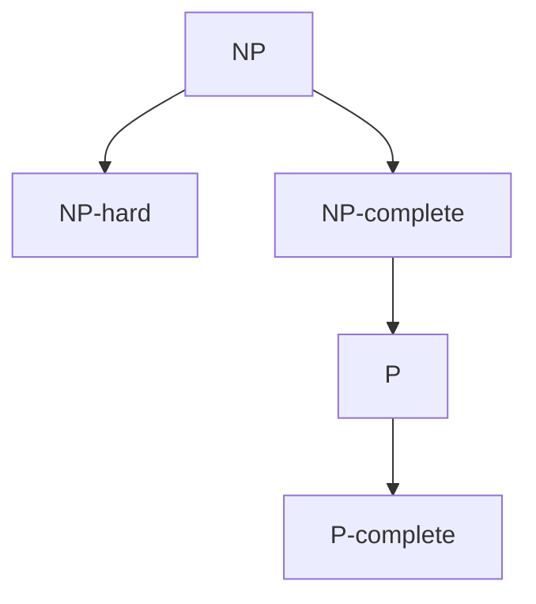

# 计算：第四部分 计算的极限 第 9 章 计算复杂性 P/NP 问题

作者：禅与计算机程序设计艺术 / Zen and the Art of Computer Programming

## 1. 背景介绍

### 1.1 问题的由来

计算复杂性理论是计算机科学的一个重要分支,研究计算问题的内在难度以及它们之间的相互关系。其中最著名也是最具挑战性的问题之一就是 P 与 NP 问题(P versus NP problem),它被列为千禧年大奖难题之一。这个问题的提出可以追溯到 20 世纪 70 年代,由计算机科学家 Stephen Cook 和 Leonid Levin 分别独立提出。

### 1.2 研究现状

尽管 P 与 NP 问题已经被研究了近半个世纪,但至今仍未得到解决。许多计算机科学家和数学家为此付出了巨大努力,提出了各种思路和方法,但都未能取得突破性进展。目前普遍认为 P ≠ NP,但谁也无法证明。这个问题的解决不仅具有重大的理论意义,对密码学、人工智能、生物信息学等众多领域也会产生深远影响。

### 1.3 研究意义 

P 与 NP 问题的重要性主要体现在以下几个方面:

1. 理论意义:它是计算复杂性理论的核心问题,其解决将极大地推动该领域的发展,并深化我们对计算本质的认识。

2. 实践价值:许多实际问题都可以归结为 NP 问题,例如旅行商问题、背包问题、图着色问题等。如果 P=NP,意味着对这些问题都能找到多项式时间的算法,将极大提升计算效率。

3. 密码学基础:现代密码体系的安全性很大程度上依赖于某些问题(如大整数分解)求解的困难性。如果 P=NP 成立,这些密码体系将不再安全。

4. 人工智能:机器学习和知识表示中的许多推理问题都是 NP 难度的。P 与 NP 问题的解决将从根本上影响人工智能的发展。

### 1.4 本文结构

本文将从以下几个方面来深入探讨 P 与 NP 问题:

- 介绍 P 类和 NP 类问题的定义和特点,以及它们之间的关系
- 阐述 NP 完全性理论,并举例说明几个典型的 NP 完全问题 
- 讨论主要的解决思路,包括规约方法和相对化方法
- 分析问题求解的数学模型,给出形式化定义
- 介绍求解 NP 问题的几类算法,并通过代码实例演示
- 探讨 P 与 NP 问题在密码学、人工智能等领域的应用
- 总结全文,展望 P 与 NP 问题的未来研究方向和挑战

## 2. 核心概念与联系

要理解 P 与 NP 问题,首先需要明确几个基本概念:
- 判定问题:对应一个语言,回答某个字符串是否属于这个语言。
- 多项式时间:算法的时间复杂度为输入规模 n 的多项式。 
- P 类:所有能在多项式时间内解决的判定问题。
- NP 类:所有能在多项式时间内验证其解的判定问题。
- NP 难问题:NP 类中至少与 NP 类中任何问题一样"难"的问题。
- NP 完全问题:NP 类中最难的问题,即所有的 NP 问题都可以在多项式时间内约化到它。

P 类和 NP 类的关系可以用下图直观地表示:



由定义可知,P 类是 NP 类的子集,因为 P 类问题的解不仅能多项式验证,也能多项式求解。而 NP 完全问题是 NP 类中最难的问题,P 类问题都可以多项式地约化到它。所以 P 与 NP 问题可以表述为:NP 完全问题是否属于 P 类?

## 3. 核心算法原理 & 具体操作步骤

### 3.1 算法原理概述

目前求解 NP 完全问题主要有两大类算法:精确算法和近似算法。

精确算法力求找到问题的最优解,代表性的有:
- 枚举搜索:列举所有可能解,找出最优者。
- 动态规划:将问题分解为互相重叠的子问题,避免重复计算。
- 回溯法:深度优先搜索,并在搜索过程中剪枝。
- 分支定界:广度优先搜索,用界限函数剪枝。

近似算法在多项式时间内找到近似最优解,代表性的有:
- 贪心法:每次做局部最优选择,但不保证全局最优。
- 局部搜索:从一个可行解出发,不断寻找邻域内的更优解。
- 遗传算法:模拟生物进化,不断选择、交叉、变异,找到适应度高的个体。

### 3.2 算法步骤详解

以旅行商问题(TSP)为例,介绍求解 NP 完全问题的几种算法。

TSP 问题描述:给定 n 个城市和城市间的距离,找到一条最短的路径,使得每个城市都经过一次且仅一次。

#### 3.2.1 枚举搜索算法

1. 列出所有可能的路径(即城市的全排列)
2. 计算每条路径的总距离
3. 选出总距离最小的路径

时间复杂度为 O(n!),空间复杂度为 O(n)。

#### 3.2.2 动态规划算法

1. 定义状态 dp[i][S],表示从城市 i 出发,经过集合 S 中所有城市再回到起点的最短路径长度。
2. 初始化 dp[i][{i}] = 0。
3. 遍历集合 S 的所有子集,对每个子集 S':
   - 遍历 S' 中的每个城市 j ≠ i
   - dp[i][S'] = min(dp[i][S'] , dp[j][S'-{j}] + dis[i][j]) 
4. 最终答案为 min(dp[i][{1,2,...,n}] + dis[i][0])

时间复杂度为 O(n^2 * 2^n),空间复杂度为 O(n * 2^n)。

#### 3.2.3 贪心算法

1. 任选一个城市作为起点
2. 从当前城市出发,每次选择最近的未访问城市,直到所有城市都被访问
3. 回到起点形成一个回路

时间复杂度为 O(n^2),空间复杂度为 O(n),但不能保证得到最优解。

### 3.3 算法优缺点

- 枚举搜索:保证最优解,但复杂度极高,只适合规模很小的问题。
- 动态规划:利用最优子结构,避免重复计算,但状态空间随问题规模指数增长。
- 贪心法:计算效率高,但无法保证解的质量,可能会陷入局部最优。

### 3.4 算法应用领域

- 枚举搜索常用于暴力破解密码等需要列举所有情况的场合。
- 动态规划在背包问题、最短路径、编辑距离等问题中有广泛应用。
- 贪心法可用于哈夫曼编码、最小生成树等问题的近似求解。

## 4. 数学模型和公式 & 详细讲解 & 举例说明

### 4.1 数学模型构建

P 与 NP 问题可以用语言和图灵机的形式化定义来刻画。

定义(P 类):语言 L 属于 P 类,当且仅当存在一个多项式时间的图灵机 M,对任意输入 x,若 x ∈ L,则 M 接受 x,否则 M 拒绝 x。

定义(NP 类):语言 L 属于 NP 类,当且仅当存在一个多项式时间的非确定性图灵机 M,对任意输入 x,若 x ∈ L,则 M 的某个分支接受 x,否则 M 的所有分支都拒绝 x。

直观地说,P 类问题是能在多项式时间内解决的判定问题,而 NP 类问题是解的正确性能在多项式时间验证的判定问题。

### 4.2 公式推导过程

为了研究 NP 问题之间的相互关系,引入了约化(reduction)的概念。直观地说,问题 A 可约化为问题 B,意味着 A 可以用 B 来解决。

定义(多项式时间约化):语言 A 多项式时间约化(简称 P 约化)到语言 B,记为 A ≤p B,当且仅当存在一个多项式时间的函数 f,对任意 x, x ∈ A 当且仅当 f(x) ∈ B。

基于此,可以定义 NP 难问题和 NP 完全问题:

定义(NP 难):语言 L 是 NP 难的,当且仅当对任意 NP 类语言 A,都有 A ≤p L。

定义(NP 完全):语言 L 是 NP 完全的,当且仅当 L 是 NP 难的,且 L 在 NP 类中。

Cook 定理:布尔可满足性问题(SAT)是 NP 完全的。

证明思路:先证 SAT 在 NP 类中,再证任意 NP 类语言都可以多项式时间约化到 SAT。

### 4.3 案例分析与讲解

以图着色问题为例,说明如何将其约化为布尔可满足性问题。

图着色问题:给定无向图 G 和 k 种颜色,判断是否可以用这 k 种颜色为 G 的每个顶点着色,使得相邻顶点颜色不同。

构造布尔公式 f:
- 对每个顶点 v 和颜色 c,设布尔变量 x_v_c 表示 v 是否被涂成 c 色
- 对每个顶点 v,至少被涂一种颜色:(x_v_1 ∨ x_v_2 ∨ ... ∨ x_v_k) 
- 对每个顶点 v,至多被涂一种颜色:(¬x_v_i ∨ ¬x_v_j),i ≠ j
- 对每条边 (u,v),端点颜色不同:(¬x_u_c ∨ ¬x_v_c)
- f 是以上所有子句的合取范式

不难验证,f 有解当且仅当 G 存在 k 着色,且 f 的规模是 G 规模的多项式。这就证明了图着色问题可以多项式时间约化到 SAT 问题。

### 4.4 常见问题解答

Q:P 类一定是 NP 类吗?
A:是的。由 P 类和 NP 类定义可知,P 类是 NP 类的子集。因为 P 类问题的解不仅能多项式验证,也能多项式求解。

Q:NP 完全问题是否都难于 P 类问题?
A:目前无法确定。如果 P ≠ NP,那么 NP 完全问题确实都比 P 类问题难。但如果 P = NP,那么 NP 完全问题实际上也属于 P 类。

Q:有哪些著名的 NP 完全问题?
A:除了本文提到的布尔可满足性问题、图着色问题和旅行商问题,还有背包问题、哈密顿回路问题、顶点覆盖问题等。它们在不同领域有广泛应用。

Q:近似算法能完全解决 NP 完全问题吗?
A:不能。近似算法虽然能在多项式时间内找到可接受的近似解,但无法保证找到最优解。而且对某些 NP 完全问题,目前还没有性能很好的近似算法。

## 5. 项目实践：代码实例和详细解释说明

### 5.1 开发环境搭建

本节代码使用 Python 3 实现,需要安装以下库:

- numpy:数值计算库
- matplotlib:绘图库

可以使用 pip 命令安装:

```bash
pip install numpy matplotlib
```

### 5.2 源代码详细实现

#### 5.2.