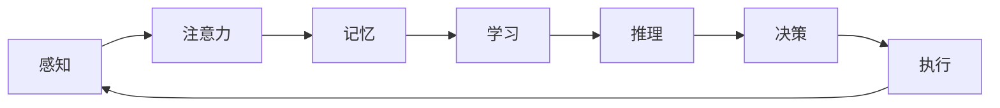

# 认知发展的阶段性路径模型

关键词：认知发展、阶段性、路径模型、神经网络、机器学习、人工智能

## 1. 背景介绍
### 1.1 问题的由来
认知发展是人工智能领域的一个核心问题。如何让机器像人一样具备认知能力,一直是AI研究者孜孜以求的目标。近年来,随着深度学习等技术的发展,我们对认知发展的理解不断加深。然而,当前的AI系统在认知能力上仍然与人类存在很大差距,亟需一种更加完善的认知发展模型来指导下一代智能系统的设计。
### 1.2 研究现状
目前,认知科学和人工智能领域已经提出了多种认知发展模型,如Piaget的认知发展阶段论、Vygotsky的社会文化理论等。这些理论从不同角度揭示了人类认知能力的发展规律。在计算机科学领域,一些学者尝试将这些理论与机器学习算法相结合,构建了一些初步的认知发展计算模型。但总的来说,当前的研究还处于起步阶段,缺乏一个统一、系统的认知发展路径模型。
### 1.3 研究意义 
认知发展路径模型对于推动人工智能的进一步发展具有重要意义。一方面,它可以帮助我们更好地理解人类智能的本质,揭示大脑认知功能形成的奥秘。另一方面,这种模型可以直接应用于智能系统的设计之中,使之具备类人的学习和认知能力,更好地服务于人类社会。因此,深入研究认知发展路径模型,对于人工智能理论和应用都有着重大价值。
### 1.4 本文结构
本文将系统阐述一种全新的认知发展阶段性路径模型。第2部分介绍模型涉及的核心概念;第3部分详细讲解模型的核心算法原理;第4部分给出模型背后的数学基础;第5部分通过代码实例演示模型的实现;第6部分分析模型的应用场景;第7部分推荐相关的工具和资源;第8部分总结全文,展望未来;第9部分附录,解答一些常见问题。

## 2. 核心概念与联系
认知发展阶段性路径模型的核心概念包括:
- 感知(Perception):通过感官接收外界信息,形成内部表征的过程。
- 注意力(Attention):有选择地处理感知到的信息,将认知资源集中于某一对象或任务。  
- 记忆(Memory):对认知活动和经验的保存与回忆。分为感觉记忆、短时记忆、长时记忆。
- 学习(Learning):通过经验或练习获得新的知识、技能或行为的过程。
- 推理(Reasoning):基于已有知识和规则,得出新的判断或结论的思维过程。
- 决策(Decision Making):根据推理结果,选择最优行动方案的过程。
- 执行(Execution):付诸行动,完成具体任务的过程。

这些认知功能环环相扣,共同构成了一个完整的认知系统。我们提出,认知发展是一个阶段性的过程,每个阶段都聚焦于某些核心认知能力的提升。随着个体与环境的交互,认知水平逐步提高,最终形成成熟的认知系统。下图展示了各认知功能之间的关系:

## 3. 核心算法原理 & 具体操作步骤
### 3.1 算法原理概述
认知发展阶段性路径模型采用了多层级递进的算法架构。在感知层,使用卷积神经网络(CNN)提取输入信息的特征表示。注意力机制用于动态调整特征的权重,突出关键信息。记忆系统包括三个部分:感觉记忆对应CNN的特征图,短时记忆使用循环神经网络(RNN)对特征序列进行编码,长时记忆则将知识表示为图网络并持久存储。学习过程通过端到端的反向传播实现参数优化。推理决策基于图网络的信息传播,执行则由强化学习的策略网络负责。
### 3.2 算法步骤详解
1. 感知阶段:原始输入信号首先经过CNN,提取出多尺度、多层次的特征表示。设输入为x,经L层CNN后得到特征图$\{F_1,F_2,...,F_L\}$。

2. 注意力调节:特征图通过注意力机制得到加权,突出关键特征。设第l层注意力权重为$A_l$,则调节后的特征图为$F'_l=A_l \odot F_l$。$A_l$通过上下文信息和任务需求自适应生成。

3. 记忆存储:感觉记忆直接对应$\{F'_l\}$。短时记忆使用RNN对特征图序列$\{F'_1,F'_2,...,F'_L\}$编码,得到最终隐状态$h_T$作为当前信息的摘要。长时记忆将$h_T$写入图网络,更新知识库。

4. 学习阶段:模型参数(包括CNN、RNN的权重,注意力网络和图网络等)通过反向传播算法优化,最小化预测损失,实现端到端学习。

5. 推理决策:基于长时记忆中的图网络,利用消息传递算法进行推理。设图的节点集合为$V$,边集合为$E$,节点$v_i$的隐状态为$h_i$。则推理过程为:

$$
h_i^{t+1} = f\left(h_i^t, \sum_{j\in N(i)} g(h_i^t, h_j^t)\right)
$$

其中$f$和$g$为更新和聚合函数,$N(i)$为节点$i$的邻居节点。重复执行上述过程,直到图网络收敛,得到最终的推理结果。

6. 执行阶段:强化学习的策略网络根据推理结果采取行动。设策略网络为$\pi_{\theta}$,状态为$s$,行动为$a$,则执行过程为:

$$
a = \pi_{\theta}(s)
$$

通过与环境交互,收集奖励信号,并使用策略梯度等算法优化策略网络,提高执行效率。

### 3.3 算法优缺点
优点:
- 算法采用了模块化设计,各个认知功能相对独立,便于理解和改进。
- 端到端学习使得感知、记忆、推理等认知能力可以协同优化,避免了人工设计的局限性。 
- 注意力机制和图网络分别刻画了认知过程中的选择性和关联性,与人类认知特点吻合。

缺点:
- 算法复杂度较高,对计算资源要求较大,实时性有待提高。
- 对于一些开放域问题,推理决策的准确性和泛化性还有待进一步验证。
- 尚缺乏大规模的多模态数据集,模型训练受限。

### 3.4 算法应用领域
认知发展阶段性路径模型可以应用于以下领域:
- 智能教育:根据学习者的认知发展水平,自适应地呈现学习内容和任务,实现因材施教。
- 智能助理:通过对用户行为和偏好的理解,提供个性化的服务和交互体验。
- 自主机器人:增强机器人的环境感知和任务规划能力,使其能够在复杂环境中自主决策和执行。
- 认知科学研究:为研究人类认知发展提供新的理论视角和实验工具,推动认知科学和人工智能的融合发展。

## 4. 数学模型和公式 & 详细讲解 & 举例说明
### 4.1 数学模型构建
认知发展阶段性路径模型可以用一个多层级的数学框架来刻画。设第$i$层的输入为$x_i$,输出为$y_i$,参数为$\theta_i$,则整个模型可以表示为:

$$
y_i = f_i(x_i, \theta_i), i=1,2,...,N
$$

其中$N$为模型的层数,$f_i$为第$i$层的映射函数。下面以感知和记忆两个阶段为例,详细说明其数学模型。

### 4.2 公式推导过程

**感知阶段**的核心是卷积神经网络(CNN)。设输入信号为$I\in \mathbb{R}^{H\times W\times C}$,第$l$层卷积核为$K_l \in \mathbb{R}^{k\times k\times C_l}$,则卷积运算为:

$$
F_l = I * K_l + b_l
$$

其中$*$表示卷积操作,$b_l$为偏置项。假设CNN共有$L$层,则感知阶段的输出为$\{F_1,F_2,...,F_L\}$。

**注意力机制**用于调节特征图的重要性。设第$l$层注意力权重为$A_l \in \mathbb{R}^{H_l\times W_l}$,则调节后的特征图为:

$$
F_l' = A_l \odot F_l
$$

其中$\odot$表示逐元素相乘。$A_l$可以通过一个注意力网络来生成,例如:

$$
A_l = \sigma(W_a * F_l + b_a)
$$

其中$W_a$和$b_a$为注意力网络的参数,$\sigma$为激活函数(如sigmoid)。

**记忆阶段**包括感觉记忆、短时记忆和长时记忆三个部分。感觉记忆直接对应调节后的特征图$\{F_l'\}$。短时记忆使用RNN对特征图序列进行编码:

$$
h_t = RNN(F_t', h_{t-1}), t=1,2,...,L
$$

其中$h_t$为第$t$步的隐状态,$h_0$为初始状态。长时记忆将最终隐状态$h_L$写入图网络。设图网络的节点集合为$V$,边集合为$E$,节点$i$的特征为$v_i$,边$(i,j)$的特征为$e_{ij}$,则图网络可以表示为:

$$
G = (V, E), V=\{v_i\}, E=\{e_{ij}\}
$$

图网络的更新规则为:

$$
v_i^{t+1} = f(v_i^t, \sum_{j\in N(i)} g(v_i^t, v_j^t, e_{ij}^t))
$$

其中$f$和$g$为更新和聚合函数,$N(i)$为节点$i$的邻居节点。

### 4.3 案例分析与讲解
下面以视觉目标检测任务为例,说明模型的工作流程。假设输入图像为$I\in \mathbb{R}^{H\times W\times 3}$,目标是检测图像中的物体并给出其类别和位置。

首先,图像通过一个$L$层的CNN提取特征,得到一组特征图$\{F_1,F_2,...,F_L\}$。然后,注意力机制根据任务需求(如检测特定物体)生成权重图$\{A_1,A_2,...,A_L\}$,对特征图进行加权,突出相关区域。调节后的特征图作为感觉记忆。

接下来,一个RNN逐层编码特征图序列,得到最终隐状态$h_L$,作为当前图像的语义表示,存入短时记忆。$h_L$进一步写入图网络,与先前的知识表示进行融合,形成更新后的长时记忆。

推理阶段,图网络通过消息传递算法进行推断。例如,通过节点之间的交互,可以判断出图像中存在"狗"和"球"两个物体,并推断出它们的空间关系(如"狗叼着球")。

最后,强化学习的策略网络根据推理结果,对图像进行标注(如在狗和球的位置绘制检测框)。策略网络的参数通过奖励信号进行优化,使得标注结果尽可能准确。

通过上述流程,模型实现了从感知到推理再到执行的端到端处理。在训练阶段,模型各部分通过反向传播联合优化,最小化检测误差。随着训练的进行,模型的感知、记忆、推理等认知能力不断提升,最终达到较高的检测性能。

### 4.4