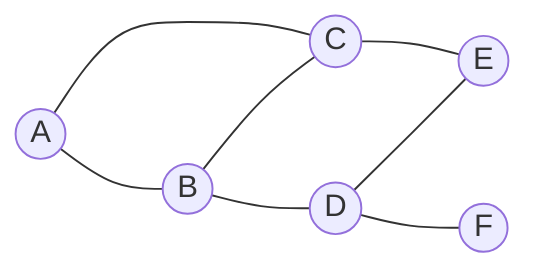

# 评估、优化、修订信息基础架构和运维流程

## 1. 背景介绍

### 1.1 问题的由来

在当今快节奏的数字化时代，信息技术(IT)已成为企业运营的核心支柱。有效的信息基础架构和运维流程对于确保IT系统的高可用性、可靠性和安全性至关重要。然而,随着业务需求的不断变化和技术的快速发展,现有的IT基础架构和运维流程往往难以跟上步伐,导致效率低下、成本高昂、风险加大等问题。

### 1.2 研究现状

许多组织都意识到了评估、优化和修订信息基础架构和运维流程的重要性。一些先进的方法和最佳实践已经被提出,如DevOps、敏捷运维、云计算、自动化等。但是,由于每个组织的具体情况不同,采用一种通用的解决方案往往难以完全满足特定需求。

### 1.3 研究意义

通过评估、优化和修订信息基础架构和运维流程,组织可以提高IT运营效率、降低成本、减少风险、加快创新步伐、提升客户体验等。这不仅有利于组织的可持续发展,也有助于推动整个行业的进步。

### 1.4 本文结构

本文将全面探讨评估、优化和修订信息基础架构和运维流程的方法和实践。首先介绍相关的核心概念和原理,然后详细阐述评估、优化和修订的具体步骤和技术,并通过实际案例进行说明。最后,本文将总结未来发展趋势和面临的挑战,为读者提供进一步的思路和建议。

## 2. 核心概念与联系

评估、优化和修订信息基础架构和运维流程涉及多个核心概念,包括但不限于:

- **信息基础架构**:指支持企业IT系统运行的硬件、软件、网络和数据中心等基础设施。
- **运维流程**:指维护和管理IT系统的一系列活动和程序,包括变更管理、事件管理、问题管理等。
- **DevOps**:一种将软件开发(Dev)和运维(Ops)过程无缝集成的理念和实践,旨在提高软件交付效率和质量。
- **敏捷运维**:将敏捷开发方法应用于运维领域,强调协作、自动化和持续改进。
- **云计算**:通过互联网按需提供可扩展的IT资源,如计算力、存储和应用程序。
- **自动化**:利用软件工具和脚本自动执行重复性任务,提高效率和一致性。

这些概念相互关联,共同构成了评估、优化和修订信息基础架构和运维流程的理论基础和实践框架。

## 3. 核心算法原理 & 具体操作步骤

### 3.1 算法原理概述

评估、优化和修订信息基础架构和运维流程的核心算法原理可以概括为以下几个方面:

1. **数据收集和分析**: 通过各种工具和技术(如监控、日志分析、用户反馈等)收集相关数据,并进行深入分析,发现问题和瓶颈。

2. **建模和模拟**: 基于收集的数据,构建信息基础架构和运维流程的数学模型和模拟环境,用于测试和评估不同的优化方案。

3. **优化算法**: 采用各种优化算法(如遗传算法、模拟退火算法等)来寻找最优解,平衡多个目标(如成本、性能、可靠性等)。

4. **自动化和持续集成**: 将优化方案自动化并集成到现有系统中,实现无缝过渡和持续改进。

5. **反馈和迭代**: 持续监控和收集优化后的系统数据,进行反馈和调整,形成闭环优化过程。

这些原理相互关联、环环相扣,构成了一个完整的评估、优化和修订的闭环流程。

### 3.2 算法步骤详解

具体操作步骤如下:

1. **现状评估**
   - 收集和分析当前信息基础架构和运维流程的数据,包括硬件、软件、网络、人力资源、成本等。
   - 识别瓶颈、风险点和改进空间。
   - 确定优化目标和约束条件。

2. **建模和模拟**
   - 构建信息基础架构和运维流程的数学模型。
   - 搭建模拟环境,模拟不同的优化方案。
   - 验证和调整模型,确保其准确性。

3. **优化方案设计**
   - 采用优化算法(如遗传算法、模拟退火算法等)生成多个优化方案。
   - 评估每个方案的性能、成本、风险等指标。
   - 选择最优方案,或进行多目标优化。

4. **实施和自动化**
   - 将优化方案逐步实施到现有系统中。
   - 开发自动化脚本和工具,提高效率和一致性。
   - 进行测试和验证,确保无缝过渡。

5. **持续改进**
   - 持续监控优化后的系统性能和运维效率。
   - 收集反馈,进行数据分析和模型调整。
   - 重复上述步骤,形成闭环优化过程。

### 3.3 算法优缺点

优点:

- 科学合理,基于数据和模型进行优化决策。
- 考虑多个目标和约束,实现全面优化。
- 自动化和持续改进,提高效率和质量。
- 可适用于各种规模和类型的组织。

缺点:

- 需要大量的数据收集和建模工作。
- 优化算法计算复杂,需要强大的计算能力。
- 实施过程可能会对现有系统造成干扰。
- 需要组织内部的协作和变革管理。

### 3.4 算法应用领域

该算法可应用于各种规模和行业的组织,评估和优化其信息基础架构和运维流程,包括但不限于:

- 金融机构
- 制造业
- 零售业
- 医疗卫生
- 政府机构
- 教育机构
- 科研单位

无论是中小企业还是大型跨国公司,都可以借助该算法来提高IT运营效率、降低成本、减少风险、加快创新步伐。

## 4. 数学模型和公式 & 详细讲解 & 举例说明

### 4.1 数学模型构建

为了对信息基础架构和运维流程进行量化分析和优化,我们需要构建相应的数学模型。一种常用的模型是将整个系统抽象为一个复杂网络,其中节点代表硬件、软件、人员等资源,边代表它们之间的依赖关系和交互。

我们可以使用图论和网络科学的相关理论和方法来描述和分析这个网络模型。例如,可以计算节点的中心性指标(如度中心性、介数中心性、特征向量中心性等)来识别关键资源,或者计算网络的聚类系数、平均最短路径长度等指标来评估网络的效率和鲁棒性。

此外,我们还可以引入其他数学工具,如队列理论、马尔可夫过程、随机过程等,来描述和分析系统的动态行为,如任务调度、故障传播、资源利用率等。

### 4.2 公式推导过程

以下是一个简单的例子,推导计算节点度中心性的公式:

设 $G=(V,E)$ 是一个无向图,表示信息基础架构和运维流程的网络模型。对于任意节点 $v \in V$,定义其度中心性 $C_D(v)$ 为:

$$C_D(v) = \frac{deg(v)}{n-1}$$

其中 $deg(v)$ 表示节点 $v$ 的度(即与其相连的边数),$n$ 表示图 $G$ 中节点的总数。

度中心性的取值范围是 $[0,1]$,值越大表示该节点在网络中越是重要和关键。

我们可以进一步推导,对于加权图(即边有不同的权重),节点 $v$ 的加权度中心性 $C_{WD}(v)$ 为:

$$C_{WD}(v) = \frac{\sum_{u \in N(v)}w(v,u)}{(n-1)\max\limits_{v \in V}\sum_{u \in N(v)}w(v,u)}$$

其中 $N(v)$ 表示与节点 $v$ 相邻的节点集合,$w(v,u)$ 表示节点 $v$ 和 $u$ 之间边的权重。

这些公式为我们量化评估信息基础架构和运维流程中各个资源的重要性提供了数学依据。

### 4.3 案例分析与讲解

假设我们有一个由 6 个节点组成的小型网络,代表一个组织的信息基础架构和运维流程。节点之间的连接关系如下图所示:



我们可以计算每个节点的度中心性:

- $C_D(A) = \frac{2}{6-1} = 0.4$
- $C_D(B) = \frac{3}{6-1} = 0.6$
- $C_D(C) = \frac{3}{6-1} = 0.6$
- $C_D(D) = \frac{3}{6-1} = 0.6$
- $C_D(E) = \frac{2}{6-1} = 0.4$
- $C_D(F) = \frac{1}{6-1} = 0.2$

从结果可以看出,节点 B、C 和 D 的度中心性最高,说明它们在整个网络中扮演着关键角色。如果这些节点出现故障或瓶颈,将对整个系统产生重大影响。

因此,在优化信息基础架构和运维流程时,我们需要重点关注这些关键节点,采取相应的措施(如增加冗余、提高性能、优化流程等)来提高系统的可靠性和效率。

### 4.4 常见问题解答

1. **为什么要构建数学模型?**

构建数学模型可以帮助我们更好地理解和量化信息基础架构和运维流程的复杂性,从而进行科学的分析和优化。模型提供了一种抽象和简化的视角,使我们能够关注核心问题,而不被细节所困扰。

2. **如何选择合适的数学模型?**

选择合适的数学模型需要考虑多个因素,如模型的准确性、计算复杂度、数据可用性等。通常需要根据具体情况进行权衡和折中。在实践中,我们可以先从简单的模型开始,逐步引入更复杂的模型,并根据实际效果进行调整和改进。

3. **数学模型是否足够准确?**

任何数学模型都是对现实世界的简化和近似,难免会存在一定的误差和偏差。因此,我们需要通过实际数据来验证和调整模型,确保其足够准确。同时,我们也要意识到模型的局限性,在决策过程中结合专家经验和实践智慧。

4. **如何处理模型中的不确定性?**

在信息基础架构和运维流程中,往往存在各种不确定因素,如硬件故障、人为错误、安全威胁等。我们可以引入概率论、随机过程等数学工具来描述和量化这些不确定性,并在模型和优化算法中加以考虑。

## 5. 项目实践:代码实例和详细解释说明

为了更好地理解和实践评估、优化和修订信息基础架构和运维流程的方法,我们将提供一个基于 Python 的代码示例。该示例包括以下几个部分:

### 5.1 开发环境搭建

首先,我们需要安装所需的 Python 库,如 NetworkX、NumPy、SciPy 等。可以使用 pip 或 conda 进行安装。

```bash
pip install networkx numpy scipy
```

### 5.2 源代码详细实现

以下是核心代码部分,实现了基于网络模型的度中心性计算和模拟退火算法优化:

```python
import networkx as nx
import numpy as np
from scipy.optimize import anneal

# 构建网络模型
G = nx.Graph()
G.add_nodes_from(['A', 'B', 'C', 'D', 'E', 'F'])
G.