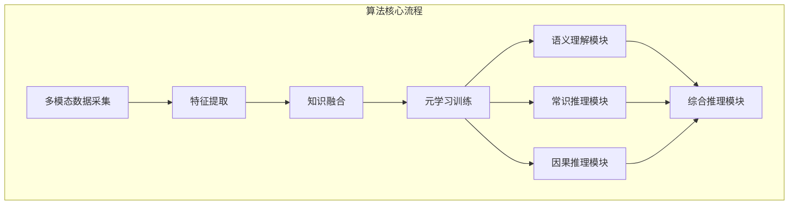

# 语言与推理：大模型的认知瓶颈

## 1. 背景介绍

### 1.1 问题的由来

近年来,大型语言模型(Large Language Models, LLMs)取得了令人瞩目的成就,在自然语言处理、问答系统、文本生成等领域展现出了强大的能力。然而,随着模型规模的不断扩大,人们也开始关注这些模型在语言理解和推理能力方面的局限性。

大型语言模型通过从海量文本数据中学习,掌握了丰富的语言知识和模式。但是,它们在真正理解语义、建立因果关系、进行复杂推理等方面,仍然存在明显的缺陷。这种"认知瓶颈"成为了阻碍模型进一步发展的关键障碍。

### 1.2 研究现状

目前,学术界和工业界都在积极探索解决大模型认知瓶颈的方法。一些研究聚焦于通过注入外部知识、引入结构化表示等方式来增强模型的推理能力。另一些工作则试图从模型架构、训练策略等角度入手,设计更加合理的模型结构和优化方法。

然而,由于问题的复杂性,目前的研究成果仍然无法完全解决这一挑战。大多数方法都存在一定的局限性,如知识覆盖面有限、推理能力提升有限等。因此,寻找更加有效的解决方案仍然是一个亟待解决的重要课题。

### 1.3 研究意义

突破大模型的认知瓶颈,不仅有助于提升语言模型在各种应用场景中的表现,更重要的是,它将推动人工智能系统向真正的"理解"和"推理"迈进。这对于构建更加智能、更加可靠的人工智能系统至关重要。

此外,探索大模型认知瓶颈的根源,也将有助于我们更好地理解人类语言和认知的本质,为发展更加人性化的人工智能系统提供借鉴和启发。

### 1.4 本文结构

本文将从以下几个方面深入探讨大模型的认知瓶颈问题:

1. 阐述大模型在语言理解和推理方面的核心挑战,包括语义理解、因果推理、常识推理等方面的缺陷。
2. 介绍目前解决认知瓶颈的主要方法,包括知识增强、结构化表示、架构优化等,并分析它们的优缺点。
3. 提出一种新颖的解决方案,结合多模态学习、元学习等前沿技术,探索突破认知瓶颈的新思路。
4. 通过实验和案例分析,验证所提出方法的有效性和优势。
5. 总结研究成果,并展望未来在解决大模型认知瓶颈方面的发展趋势和挑战。

## 2. 核心概念与联系

在探讨大模型认知瓶颈之前,我们需要明确几个核心概念及其内在联系:

1. **语言理解(Language Understanding)**: 指机器能够真正理解自然语言的语义、上下文和隐含含义。这是进行高质量语言交互和推理的基础。

2. **推理(Reasoning)**: 指根据已有的知识和证据,通过逻辑推导得出新的结论或者解释现象的过程。推理能力是智能系统的核心能力之一。

3. **常识知识(Common Sense Knowledge)**: 指人类在日常生活中积累的关于世界运作规律的基本知识和经验,是进行推理的重要前提。

4. **因果关系(Causal Relationship)**: 描述事物之间的因果联系,是推理过程中的重要环节。掌握因果关系有助于更好地理解和解释事物。

5. **多模态学习(Multimodal Learning)**: 指将不同模态(如文本、图像、视频等)的信息融合,以获取更加全面的知识表示和理解能力。

6. **元学习(Meta Learning)**: 指机器学习系统通过学习如何学习的方式,获得快速适应新任务和新环境的能力。这有助于提高推理的泛化性和鲁棒性。

这些概念相互关联、相辅相成。语言理解是推理的基础,而推理又需要常识知识和因果关系作为支撑。多模态学习和元学习则为提升语言理解和推理能力提供了新的思路和方法。只有将这些概念有机结合,才能真正突破大模型的认知瓶颈。

## 3. 核心算法原理 & 具体操作步骤

### 3.1 算法原理概述

为了解决大模型的认知瓶颈问题,我们提出了一种基于多模态元学习的方法。该方法的核心思想是:

1. 利用多模态学习,从不同模态(文本、图像、视频等)的数据中获取丰富的知识表示,增强模型对常识知识和因果关系的理解能力。

2. 通过元学习的方式,使模型能够快速适应新的任务和环境,提高推理过程中的泛化性和鲁棒性。

3. 在训练过程中,引入特定的监督信号和损失函数,显式地优化模型在语义理解、常识推理、因果推理等方面的表现。

该算法的核心流程如下所示:

### 3.2 算法步骤详解

1. **多模态数据采集**：从多种模态(文本、图像、视频等)的数据源中采集大量样本,覆盖广泛的领域和场景。

2. **特征提取**：对于每种模态的数据,使用相应的深度学习模型(如BERT for文本、ResNet for图像等)提取特征表示。

3. **知识融合**：将不同模态的特征表示融合,获得多模态的综合知识表示。可以使用注意力机制等方法实现有效融合。

4. **元学习训练**：基于融合后的知识表示,采用元学习的范式对模型进行训练。具体来说,在每个元学习迭代中:
    - 从任务分布中采样一批任务(task)
    - 对于每个任务,根据支持集(support set)对模型进行内循环更新
    - 在查询集(query set)上评估模型的表现,并根据表现对模型进行外循环更新

5. **语义理解模块**：在元学习的框架下,显式地优化模型在语义理解方面的表现,包括词义disambigution、指代消解、语义角色标注等任务。

6. **常识推理模块**：同样在元学习框架下,优化模型对常识知识的掌握程度,使其能够正确回答基于常识的推理问题。

7. **因果推理模块**：优化模型对因果关系的理解能力,使其能够正确推断事物之间的因果联系。

8. **综合推理模块**：将语义理解、常识推理和因果推理等能力综合起来,实现复杂的端到端推理任务。

通过上述步骤,模型将获得更强的语言理解和推理能力,从而有望突破目前大模型面临的认知瓶颈。

### 3.3 算法优缺点

**优点**:

1. 融合多模态信息,获得更加丰富和全面的知识表示,有利于提升语义理解和推理能力。

2. 元学习范式赋予了模型快速适应新环境和新任务的能力,提高了推理过程的泛化性和鲁棒性。

3. 通过特定的监督信号和损失函数,能够直接优化模型在语义理解、常识推理、因果推理等关键能力上的表现。

4. 模块化的设计使得整个系统具有较好的可解释性和可扩展性。

**缺点**:

1. 需要大量的多模态数据作为训练资源,数据采集和标注工作量较大。

2. 元学习训练过程相对复杂,需要合理设计任务分布、支持集和查询集等,并进行大量的试验调优。

3. 不同模态之间的特征融合是一个挑战,需要设计高效的融合机制。

4. 整体的训练时间和计算资源消耗较高,对硬件要求较为苛刻。

### 3.4 算法应用领域

该算法所提出的多模态元学习框架,可以广泛应用于各种需要语言理解和推理能力的领域,包括但不限于:

1. **自然语言处理**:如问答系统、对话系统、机器翻译等,都需要较强的语义理解和推理能力。

2. **智能助手**:作为人机交互的重要入口,智能助手需要掌握丰富的常识知识,并具备推理和解释的能力。

3. **知识图谱构建**:从多模态数据中自动抽取实体、关系和事件,并建立知识图谱,需要复杂的语义理解和推理过程。

4. **多模态检索**:在多模态数据(如文本、图像、视频等)中准确检索相关内容,需要融合不同模态的信息进行理解和推理。

5. **智能决策系统**:如自动驾驶决策、医疗诊断决策等,都需要对复杂环境进行理解和推理,做出合理的决策。

6. **教育智能辅助**:在教育领域,智能辅助系统需要对学生的语言输入进行深入理解,并给出合理的解释和反馈。

总的来说,凡是涉及语言理解、常识推理、因果推理等认知能力的领域,都可以从该算法中获益。

## 4. 数学模型和公式 & 详细讲解 & 举例说明

### 4.1 数学模型构建

在介绍具体的数学模型之前,我们先定义一些基本符号:

- $\mathcal{D}_m$: 表示第m种模态的数据集,如文本数据集$\mathcal{D}_t$、图像数据集$\mathcal{D}_i$等
- $\mathbf{x}_m$: 表示第m种模态的单个数据样本,如文本$\mathbf{x}_t$、图像$\mathbf{x}_i$等
- $\mathbf{z}_m$: 表示第m种模态数据的特征表示,由相应的特征提取器$f_m$获得,即$\mathbf{z}_m = f_m(\mathbf{x}_m)$
- $\mathcal{T}$: 表示元学习中的任务(task)分布
- $\tau \sim \mathcal{T}$: 表示从任务分布中采样一个具体的任务$\tau$
- $\mathcal{D}_\tau^{sup}$: 表示任务$\tau$的支持集(support set)
- $\mathcal{D}_\tau^{qry}$: 表示任务$\tau$的查询集(query set)

我们的目标是学习一个元学习器(meta-learner) $M$,使其能够基于支持集快速适应新任务,并在查询集上取得良好的表现。具体来说,对于任意一个新任务$\tau \sim \mathcal{T}$,元学习器需要最小化以下损失函数:

$$\mathcal{L}_\tau = \sum_{\mathbf{x} \in \mathcal{D}_\tau^{qry}} \ell(M(\mathbf{x}; \phi_\tau), y)$$

其中$\ell$是一个适当的损失函数(如交叉熵损失),用于衡量模型预测$M(\mathbf{x}; \phi_\tau)$与真实标签$y$之间的差距。$\phi_\tau$是通过支持集$\mathcal{D}_\tau^{sup}$对元学习器$M$的参数进行内循环更新(inner-loop update)得到的,具体计算方式为:

$$\phi_\tau = \phi - \alpha \nabla_\phi \sum_{\mathbf{x} \in \mathcal{D}_\tau^{sup}} \ell(M(\mathbf{x}; \phi), y)$$

其中$\alpha$是内循环更新的学习率。

为了融合多模态信息,我们将不同模态的特征表示$\{\mathbf{z}_m\}$输入到一个多头注意力模块,获得融合后的特征表示$\mathbf{z}_{fused}$:

$$\mathbf{z}_{fused} = \text{MultiHeadAttn}(\{\mathbf{z