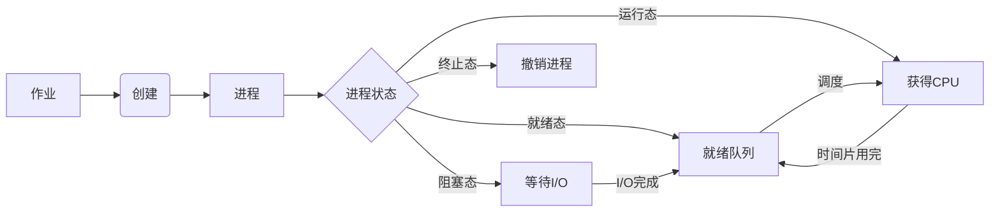

# 调度器 原理与代码实例讲解

## 1. 背景介绍
### 1.1 问题的由来
在现代操作系统和分布式系统中,调度器扮演着至关重要的角色。它负责决定如何分配有限的计算资源(如CPU时间、内存等)给不同的任务或进程,以实现最优的系统性能和资源利用率。然而,设计和实现一个高效、公平、可扩展的调度器并非易事,需要深入理解调度算法原理和实现技巧。
### 1.2 研究现状
目前,调度器的研究已经取得了长足的进展。各种经典调度算法如先来先服务(FCFS)、短作业优先(SJF)、时间片轮转(RR)等已被广泛应用。同时,针对不同系统的特点,研究者们还提出了许多新颖的调度算法,如多级反馈队列调度、公平共享调度(Fair-Share Scheduling)、延迟调度(Delay Scheduling)等。这些算法在特定场景下取得了不错的效果。
### 1.3 研究意义 
深入研究调度器原理和实现,对于优化系统性能、提高资源利用率、保障任务的QoS等具有重要意义。通过理解不同调度算法的优缺点和适用场景,我们可以针对性地选择和改进调度策略。此外,调度器的设计思想和优化技巧,也可以启发其他系统组件的设计和实现。
### 1.4 本文结构
本文将全面讲解调度器的原理和代码实例。第2节介绍调度器的核心概念和调度算法分类;第3节重点讲解几种经典调度算法的原理和具体步骤;第4节给出调度器性能分析的数学模型和公式;第5节提供调度器的代码实例和详细解释;第6节讨论调度器在实际系统中的应用场景;第7节推荐调度器相关的学习资源和工具;第8节总结全文,展望调度器技术的未来发展趋势和挑战。

## 2. 核心概念与联系
在讨论调度器原理之前,我们先明确几个核心概念:
- 作业(Job):用户提交的任务,包含要执行的程序和数据。
- 进程(Process):为作业创建的执行实体,是系统分配资源的基本单位。
- 线程(Thread):进程内部的执行路径,是CPU调度的基本单位。
- CPU burst:进程/线程使用CPU的一个连续时间段。
- I/O burst:进程/线程等待I/O完成的时间段。

调度器的主要功能是从就绪队列中选择进程/线程,分配CPU资源。根据调度时机,可分为三类:
1. 长期调度:决定添加到就绪队列的作业。
2. 中期调度:决定添加到内存的进程,又称内存调度。
3. 短期调度:决定立即获得CPU的进程,又称CPU调度。

本文主要关注短期调度,即如何从就绪进程中选出下一个执行的进程。调度算法的目标是优化系统性能指标,如周转时间、响应时间、CPU利用率、吞吐量等。



## 3. 核心算法原理 & 具体操作步骤
### 3.1 算法原理概述
调度算法根据不同原则,对就绪队列中的进程进行排序,选出优先执行的进程。常见原则有:
- 公平性:让每个进程获得"公平"的CPU时间。
- 效率:优先调度能提高系统吞吐量的进程。
- 响应时间:优先调度等待时间长的进程。
- 周转时间:优先调度执行时间短的进程。

下面介绍几种经典调度算法。
### 3.2 算法步骤详解
#### 3.2.1 先来先服务(FCFS)
- 原则:按作业到达时间排序,先来的作业先执行。
- 优点:公平、简单,无饥饿问题。
- 缺点:平均等待时间可能较长,对短作业不利。
- 步骤:
    1. 把新作业添加到就绪队列末尾。
    2. 队首作业出队,分配CPU直到完成。
    3. 重复步骤1和2,直到就绪队列为空。

#### 3.2.2 短作业优先(SJF)
- 原则:优先调度估计运行时间最短的作业。
- 优点:平均等待时间最优,平均周转时间最短。
- 缺点:对长作业不利,可能导致饥饿。需要预估作业执行时间。
- 步骤:
    1. 计算每个作业的估计执行时间。 
    2. 按估计执行时间排序就绪队列,最短作业在队首。
    3. 队首作业出队,分配CPU直到完成。
    4. 重复步骤1~3,直到就绪队列为空。

#### 3.2.3 时间片轮转(RR)
- 原则:为每个进程分配固定的CPU时间片,用完时间片就换下一个进程执行。
- 优点:公平,响应时间快。
- 缺点:平均周转时间可能较长。时间片太大退化为FCFS,太小上下文切换开销大。
- 步骤:
    1. 将新进程添加到就绪队列末尾。
    2. 队首进程出队,获得CPU一个时间片。
    3. 时间片用完,进程重新加入队尾;未完成,转步骤4。
    4. 重复步骤2和3,直到就绪队列为空。

#### 3.2.4 多级反馈队列(MLFQ)
- 原则:设置多个就绪队列,每个队列优先级不同,时间片不同。新进程进入最高优先级队列,随着占用CPU时间增多,逐级降低优先级。
- 优点:兼顾短作业和I/O繁忙型作业,获得较好的响应时间。
- 缺点:可能导致饥饿。参数(如队列数、时间片大小)难以配置最优。
- 步骤:
    1. 将新进程添加到最高优先级队列末尾。
    2. 最高优先级非空队列的队首进程出队,获得CPU一个时间片。
    3. 时间片用完,进程降低一级,加入下级队列的末尾;如已是最低级,则重新加入当前队列的末尾。
    4. 重复步骤2和3,直到所有队列为空。

### 3.3 算法优缺点
- FCFS:公平、简单,但平均等待时间较长。
- SJF:平均等待时间最短,但可能饥饿长作业。
- RR:公平,响应快,但周转时间较长。
- MLFQ:兼顾各种作业,但参数难以配置最优。

### 3.4 算法应用领域
- FCFS:批处理系统。
- SJF:偏重吞吐量的批处理系统,如科学计算。
- RR:偏重响应时间的交互式系统,如分时系统。
- MLFQ:通用的分时操作系统,如Unix、Linux。

## 4. 数学模型和公式 & 详细讲解 & 举例说明
### 4.1 数学模型构建
为分析调度算法的性能,我们引入以下数学符号:
- $n$:作业数量。
- $t_i$:作业$i$的到达时间。
- $e_i$:作业$i$的执行时间。
- $c_i$:作业$i$的完成时间。
- $w_i$:作业$i$的等待时间,即$w_i=c_i-t_i-e_i$。
- $\tau_i$:作业$i$的周转时间,即$\tau_i=c_i-t_i$。

调度算法的目标是优化平均周转时间$\overline{\tau}$和平均等待时间$\overline{w}$:

$$
\overline{\tau}=\frac{1}{n}\sum_{i=1}^n \tau_i=\frac{1}{n}\sum_{i=1}^n (c_i-t_i)
$$

$$
\overline{w}=\frac{1}{n}\sum_{i=1}^n w_i=\frac{1}{n}\sum_{i=1}^n (c_i-t_i-e_i) 
$$

### 4.2 公式推导过程
以FCFS算法为例,我们推导平均周转时间和平均等待时间的公式。假设作业按到达时间排序,即$t_1 \leq t_2 \leq \cdots \leq t_n$。

作业$i$的完成时间$c_i$满足:

$$
c_i=\max(c_{i-1},t_i)+e_i
$$

其中$c_0=0$。这个公式表示作业$i$的完成时间等于上一个作业完成时间和自身到达时间的较大值,再加上自身执行时间。

由此可得平均周转时间:

$$
\begin{aligned}
\overline{\tau} &= \frac{1}{n}\sum_{i=1}^n (c_i-t_i) \\
&= \frac{1}{n}\sum_{i=1}^n (\max(c_{i-1},t_i)+e_i-t_i) \\
&= \frac{1}{n}\sum_{i=1}^n (\max(c_{i-1}-t_i,0)+e_i)
\end{aligned}
$$

平均等待时间:

$$
\begin{aligned}
\overline{w} &= \frac{1}{n}\sum_{i=1}^n (c_i-t_i-e_i) \\
&= \frac{1}{n}\sum_{i=1}^n (\max(c_{i-1},t_i)+e_i-t_i-e_i) \\
&= \frac{1}{n}\sum_{i=1}^n \max(c_{i-1}-t_i,0)
\end{aligned}
$$

可见,平均等待时间仅依赖于作业的到达时间和上一个作业的完成时间。

### 4.3 案例分析与讲解
考虑3个作业的FCFS调度过程:

| 作业 | 到达时间 | 执行时间 |
|------|----------|----------|
| J1   | 0        | 3        |
| J2   | 1        | 6        |
| J3   | 3        | 2        |

根据FCFS算法,作业的完成时间为:
- $c_1=\max(0,0)+3=3$
- $c_2=\max(3,1)+6=9$
- $c_3=\max(9,3)+2=11$

平均周转时间:

$$
\overline{\tau}=\frac{1}{3}((3-0)+(9-1)+(11-3))=\frac{19}{3}
$$

平均等待时间:

$$
\overline{w}=\frac{1}{3}((3-0-3)+(9-1-6)+(11-3-2))=\frac{8}{3}
$$

可见,FCFS算法未考虑作业的执行时间差异,导致短作业J3等待时间较长。

### 4.4 常见问题解答
- Q:FCFS算法如何处理同时到达的作业?
- A:可按作业编号排序,或随机选择。

- Q:SJF算法如何预估作业执行时间?
- A:可以用过去的执行时间求平均值,或用机器学习模型预测。

- Q:RR算法的最佳时间片长度如何确定?
- A:时间片太长会导致响应时间变差,太短会导致频繁切换。一般可设为略大于一次典型CPU burst的时长。

## 5. 项目实践:代码实例和详细解释说明
### 5.1 开发环境搭建
我们用Python语言实现几种调度算法。需要安装Python 3.x解释器,以及numpy库用于数值计算。

```bash
pip install numpy
```

### 5.2 源代码详细实现
#### 5.2.1 先来先服务(FCFS)
```python
import numpy as np

def fcfs(arrival_times, burst_times):
    n = len(arrival_times)
    completion_times = np.zeros(n)
    
    for i in range(n):
        if i == 0:
            completion_times[i] = arrival_times[i] + burst_times[i]
        else:
            completion_times[i] = max(completion_times[i-1], arrival_times[i]) + burst_times[i]
    
    turnaround_times = completion_times - arrival_times
    waiting_times = turnaround_times - burst_times
    
    avg_turnaround_time = np.mean(