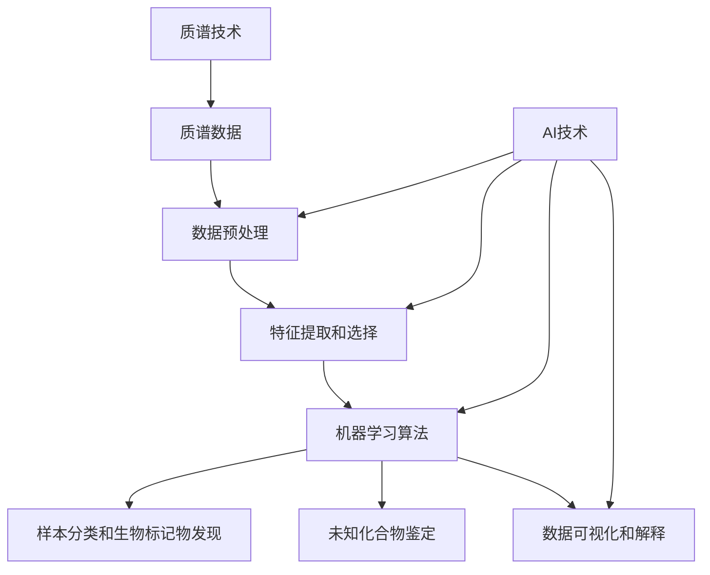

以下是关于"质谱技术在AI for Science中的角色"的技术博客文章正文内容：

# 质谱技术在AI for Science中的角色

## 1. 背景介绍

### 1.1 问题的由来

随着科学技术的不断发展,数据在科学研究中扮演着越来越重要的角色。大量实验数据的产生,使得传统的数据处理方式已经无法满足当前的需求。如何高效地从海量数据中提取有价值的信息,成为了当前科学研究面临的一大挑战。

质谱技术作为一种重要的分析技术,在生物医学、材料科学、环境科学等诸多领域发挥着关键作用。然而,质谱数据的复杂性和多样性,使得数据分析和解释成为了一个艰巨的任务。传统的数据处理方法往往需要大量的人工干预,效率低下且容易出现主观偏差。

### 1.2 研究现状

近年来,人工智能(AI)技术在科学数据分析领域取得了长足的进展。AI算法能够自动化地从海量数据中发现隐藏的模式和规律,为科学家提供新的见解和发现。在质谱数据分析领域,AI技术也开始得到广泛应用。

目前,AI在质谱数据分析中主要应用于以下几个方面:

1. 数据预处理:AI算法可以自动进行基线校正、峰值检测、同位素解卷积等预处理步骤,提高数据质量。

2. 特征提取和选择:AI算法能够从高维度的质谱数据中自动提取出最具有区分能力的特征,降低数据维度,提高分析效率。

3. 样本分类和生物标记物发现:通过机器学习算法,可以根据质谱数据对样本进行分类,并发现与疾病或生物过程相关的生物标记物。

4. 未知化合物鉴定:AI算法可以通过与数据库比对或者de novo序列解析的方式,鉴定未知化合物的结构。

5. 数据可视化和解释:AI技术可以帮助可视化高维数据,并提供直观的解释,为科学家提供新的见解。

### 1.3 研究意义

将AI技术引入质谱数据分析,可以极大地提高数据处理的效率和准确性,加速科学发现的步伐。具体来说,AI在质谱数据分析中的应用具有以下重要意义:

1. 自动化和高通量:AI算法可以自动化地处理大规模的质谱数据,实现高通量分析,节省人力和时间成本。

2. 客观性和可重复性:AI算法能够以一种客观和可重复的方式处理数据,避免人为主观偏差的影响。

3. 发现隐藏模式:AI算法能够从高维度的质谱数据中发现隐藏的模式和规律,为科学家提供新的见解和发现。

4. 提高分析精度:AI算法通常具有更高的分析精度,能够更准确地进行样本分类、生物标记物发现和未知化合物鉴定等任务。

5. 促进跨学科协作:AI技术为不同领域的科学家提供了一种共同的语言和工具,促进了跨学科的协作和交流。

### 1.4 本文结构  

本文将全面探讨质谱技术在AI for Science中的角色。首先,我们将介绍质谱技术和AI技术在科学数据分析中的重要性。接下来,我们将详细讨论AI在质谱数据分析中的应用,包括数据预处理、特征提取和选择、样本分类和生物标记物发现、未知化合物鉴定以及数据可视化和解释等方面。

此外,我们还将介绍AI在质谱数据分析中所采用的核心算法和数学模型,并通过具体的案例分析和代码实现,深入解释这些算法和模型的原理和应用。最后,我们将总结AI在质谱数据分析中的未来发展趋势和面临的挑战,并提供相关的学习资源和工具推荐。

## 2. 核心概念与联系

在探讨AI在质谱数据分析中的应用之前,我们需要先了解一些核心概念及其之间的联系。

1. **质谱技术**:质谱技术是一种能够测定化合物分子量和结构的分析技术,广泛应用于生物医学、材料科学、环境科学等领域。

2. **质谱数据**:质谱仪器产生的原始数据,通常包含大量的信息,如离子强度、质荷比、保留时间等。

3. **数据预处理**:对原始质谱数据进行处理,如基线校正、峰值检测、同位素解卷积等,以提高数据质量。

4. **特征提取和选择**:从高维度的质谱数据中提取出最具有区分能力的特征,降低数据维度,提高分析效率。

5. **机器学习算法**:包括监督学习和无监督学习算法,用于样本分类、生物标记物发现、未知化合物鉴定等任务。

6. **样本分类和生物标记物发现**:利用机器学习算法,根据质谱数据对样本进行分类,并发现与疾病或生物过程相关的生物标记物。

7. **未知化合物鉴定**:通过与数据库比对或者de novo序列解析的方式,鉴定未知化合物的结构。

8. **数据可视化和解释**:将高维度的质谱数据可视化,并提供直观的解释,为科学家提供新的见解。

9. **AI技术**:包括机器学习、深度学习、自然语言处理等技术,在质谱数据分析的各个环节发挥着重要作用。

上述概念相互关联,构成了AI在质谱数据分析中的完整流程。质谱技术产生原始数据,经过数据预处理和特征提取后,输入到机器学习算法中进行样本分类、生物标记物发现、未知化合物鉴定等任务。同时,AI技术还可以帮助可视化和解释高维度的质谱数据,为科学家提供新的见解。

## 3. 核心算法原理与具体操作步骤

在质谱数据分析中,AI技术采用了多种机器学习和深度学习算法,这些算法具有不同的原理和适用场景。本节将重点介绍几种核心算法的原理和具体操作步骤。

### 3.1 算法原理概述

1. **主成分分析(PCA)**:PCA是一种无监督学习算法,通过线性变换将高维数据投影到低维空间,实现数据降维和特征提取。在质谱数据分析中,PCA常用于探索性数据分析和可视化。

2. **支持向量机(SVM)**:SVM是一种监督学习算法,通过构建最优超平面将不同类别的样本分开。在质谱数据分析中,SVM常用于样本分类和生物标记物发现。

3. **随机森林(RF)**:RF是一种集成学习算法,由多个决策树组成。在质谱数据分析中,RF常用于样本分类和特征选择。

4. **深度学习网络**:深度学习网络,如卷积神经网络(CNN)和递归神经网络(RNN),能够自动从原始数据中提取特征,在质谱数据分析中常用于样本分类和未知化合物鉴定。

5. **谱图理论算法**:谱图理论算法利用图论和线性代数原理,可以有效地对质谱数据进行聚类和可视化。

### 3.2 算法步骤详解

以下将详细介绍PCA和SVM两种核心算法的具体操作步骤。

#### 3.2.1 主成分分析(PCA)

PCA算法的主要步骤如下:

1. **数据标准化**:对原始质谱数据进行标准化处理,使每个特征具有相同的尺度。

2. **计算协方差矩阵**:计算数据矩阵的协方差矩阵。

3. **计算特征值和特征向量**:对协方差矩阵进行特征值分解,得到对应的特征值和特征向量。

4. **选择主成分**:根据特征值的大小,选择前k个最大的特征值对应的特征向量作为主成分。

5. **数据投影**:将原始数据投影到由主成分构成的低维空间中,得到降维后的数据。

6. **可视化和分析**:对降维后的数据进行可视化和分析,发现潜在的模式和规律。

#### 3.2.2 支持向量机(SVM)

SVM算法的主要步骤如下:

1. **数据预处理**:对原始质谱数据进行标准化或归一化处理。

2. **选择核函数**:选择合适的核函数,如线性核、多项式核或高斯核。

3. **构建拉格朗日函数**:根据训练数据和核函数,构建SVM的拉格朗日函数。

4. **求解对偶问题**:通过求解拉格朗日函数的对偶问题,得到支持向量和对应的系数。

5. **构建分类器**:利用支持向量和对应的系数构建SVM分类器。

6. **预测和评估**:使用构建的分类器对新样本进行预测,并评估模型的性能。

### 3.3 算法优缺点

每种算法都有其优缺点,需要根据具体的应用场景和数据特征进行选择。

**PCA**:

- 优点:简单高效,可以有效降低数据维度,提高计算效率;无监督算法,不需要标签数据。
- 缺点:线性变换可能无法捕捉数据的非线性结构;对异常值敏感。

**SVM**:

- 优点:具有良好的泛化能力,可以处理高维数据;可以使用不同的核函数来捕捉数据的非线性结构。
- 缺点:对参数选择敏感,需要进行调参;对大规模数据集的训练效率较低。

**RF**:

- 优点:具有良好的鲁棒性,不易过拟合;可以处理高维数据和缺失值。
- 缺点:对于某些数据集,预测准确度可能不如其他算法;对于具有高相关特征的数据,性能可能下降。

**深度学习网络**:

- 优点:能够自动从原始数据中提取特征,避免了手工特征工程;在大规模数据集上表现出色。
- 缺点:需要大量的训练数据和计算资源;模型可解释性较差,存在"黑箱"问题。

### 3.4 算法应用领域

上述算法在质谱数据分析中有广泛的应用,包括但不限于以下几个方面:

- **样本分类**:利用监督学习算法(如SVM、RF、深度学习网络等)根据质谱数据对样本进行分类,如疾病诊断、品质控制等。

- **生物标记物发现**:通过机器学习算法发现与疾病或生物过程相关的生物标记物,为生物医学研究提供新的线索。

- **未知化合物鉴定**:利用深度学习网络或谱图理论算法,对未知化合物的结构进行鉴定和解析。

- **数据可视化和解释**:使用PCA、t-SNE等算法对高维数据进行降维和可视化,并提供直观的解释,帮助科学家发现隐藏的模式和规律。

- **质量控制和工艺优化**:在工业生产和制造过程中,利用机器学习算法对质谱数据进行分析,实现质量控制和工艺优化。

## 4. 数学模型和公式详细讲解与举例说明

质谱数据分析中涉及到多种数学模型和公式,本节将重点介绍PCA和SVM两种算法的数学原理和公式推导过程,并通过具体案例进行详细说明。

### 4.1 数学模型构建

#### 4.1.1 主成分分析(PCA)

PCA的数学模型基于线性代数原理,通过特征值分解将高维数据投影到低维空间。

设有n个样本,每个样本有