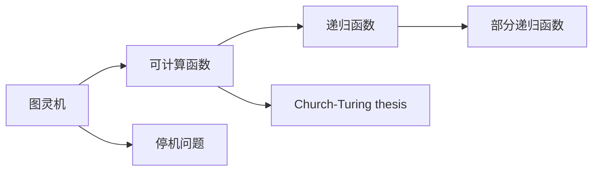

# 递归函数与可计算性理论

关键词：递归函数、可计算性理论、图灵机、停机问题、哥德尔不完备定理、Church-Turing thesis

## 1. 背景介绍
### 1.1  问题的由来
可计算性理论是计算机科学和数学逻辑的一个基础分支,它研究哪些问题是可以通过算法来解决的。而递归函数则是可计算性理论的核心概念之一,用来刻画可计算的函数。这一理论源于20世纪30年代,图灵、Church、Kleene等科学家开创性的工作奠定了可计算性理论的基础。他们提出了图灵机、λ演算、μ-递归函数等计算模型,证明了它们是等价的。这些工作回答了"什么是可计算的"这一根本问题。

### 1.2  研究现状
如今,可计算性理论已经成为计算机科学理论的重要基石。它不仅解决了可计算性的本质问题,而且还揭示了计算的内在局限性,如停机问题的不可判定性、哥德尔不完备定理等。同时,可计算性理论也是复杂性理论的基础。近年来,随着计算模型的拓展,可计算性理论也有了新的发展,如量子计算、生物计算、模拟物理系统的可计算性研究等。

### 1.3  研究意义 
深入理解可计算性理论,对于计算机科学的理论研究和应用实践都有重要意义:
1. 它揭示了计算的本质和内在局限,是计算机科学的理论基础。
2. 它为算法设计和复杂性分析提供了理论框架和工具。
3. 它激发了新的计算模型和计算范式的探索。
4. 它为理解人工智能的边界、机器能力与人脑能力的差异提供了视角。

### 1.4  本文结构
本文将分为以下几个部分:
- 介绍可计算性理论和递归函数的核心概念
- 阐述递归函数的定义、性质及其与图灵机等计算模型的关系 
- 系统讲解原始递归函数、部分递归函数等的数学定义,并给出典型函数的构造
- 介绍递归论中的基本定理,如S-m-n定理、递归定理、Rice定理等
- 论述可计算性理论的重要结论,包括停机问题、可计算性与逻辑的关系等
- 总结递归函数与可计算性理论的研究意义和未来展望

## 2. 核心概念与联系

可计算性理论的核心概念包括:
- 图灵机:刻画算法的数学模型,由有限控制、无限长纸带、读写头组成
- 可计算函数:直觉上,一个函数若能被图灵机计算,则称其为图灵可计算的
- 递归函数:通过一些简单函数和有限次复合、原始递归、最小化得到的函数
- 部分递归函数:定义域可以是自然数集的一个子集的递归函数
- 停机问题:判定图灵机是否会给定输入停机的问题,事实上不存在这样的算法
- Church-Turing thesis:图灵计算、λ可定义、递归函数是等价的,刻画了可计算的本质

这些概念环环相扣,构成了可计算性理论的核心内容:



## 3. 核心算法原理 & 具体操作步骤
### 3.1  算法原理概述
递归函数的核心思想是,通过一些简单的初始函数,用有限次复合、原始递归、最小化操作,来构造出任意的可计算函数。这实际上给出了一种构造性的算法来刻画可计算函数。具体地,递归函数由以下三类函数经过有限次运算而成:

1. 初始函数:常数函数、后继函数、投影函数
2. 由已有的递归函数经过复合(composition)构成的函数
3. 由已有的递归函数经过原始递归(primitive recursion)构成的函数
4. 由已有的递归函数经过最小化(minimization)构成的函数

部分递归函数则允许最后一步最小化的结果是部分函数。

### 3.2  算法步骤详解
1. 初始函数:
- 常数函数: $C_n^k(x_1,\dots,x_n) = k$
- 后继函数: $S(x) = x+1$
- 投影函数: $P_n^i(x_1,\dots,x_n) = x_i$ 
  
2. 复合:如果$f,g_1,\dots,g_m$都是递归函数,那么由下式定义的$h$也是递归函数:
   $$h(x_1,\dots,x_n) = f(g_1(x_1,\dots,x_n), \dots, g_m(x_1,\dots,x_n))$$
   
3. 原始递归:如果$f,g$是递归函数,那么由下式定义的$h$也是递归函数:
   $$\begin{aligned}
   h(0,x_1,\dots,x_n) &= f(x_1,\dots,x_n) \\
   h(y+1,x_1,\dots,x_n) &= g(y,h(y,x_1,\dots,x_n),x_1,\dots,x_n)
   \end{aligned}$$
   
4. 最小化:如果$f$是递归函数,那么由下式定义的$h$是部分递归函数:
   $$h(x_1,\dots,x_n) = \mu y[f(x_1,\dots,x_n,y)=0]$$
   其中$\mu y[P(y)]$表示使得性质$P(y)$成立的最小的$y$,如果不存在这样的$y$,则$h(x_1,\dots,x_n)$无定义。

### 3.3  算法优缺点
优点:
- 递归函数给出了可计算函数的构造性定义,便于分析函数的可计算性
- 初等运算的组合与直觉相符,容易理解
- 递归函数与其他计算模型等价,是研究可计算性理论的有力工具

缺点: 
- 有些可计算函数用递归函数刻画起来比较复杂,如Ackermann函数
- 递归函数属于构造性理论,某些结果的证明需要借助于逻辑方法

### 3.4  算法应用领域
递归函数作为可计算性理论的核心内容,在理论计算机科学中有广泛应用:
- 用于分析算法的可计算性,判断问题是否可解
- 作为编程语言理论的基础,许多程序语言的语义都是用递归论的方法定义的
- 在证明论和计算复杂性理论中,递归函数是重要的研究对象和工具

## 4. 数学模型和公式 & 详细讲解 & 举例说明
### 4.1  数学模型构建
递归函数的数学模型主要由以下三个部分组成:
1. 初始函数:包括常数函数、后继函数、投影函数
2. 构造运算:包括复合、原始递归、最小化
3. 递归函数类:由初始函数经过有限次构造运算而成的函数全体

形式化地,可以用如下的归纳定义来刻画原始递归函数:
1. 初始函数是原始递归函数
2. 若$f,g_1,\dots,g_m$是原始递归函数,则它们的复合$h$也是原始递归函数
3. 若$f,g$是原始递归函数,则由原始递归定义的$h$也是原始递归函数

部分递归函数则在此基础上加入最小化运算。

### 4.2  公式推导过程
下面我们来推导几个典型递归函数的构造过程。

(1) 加法函数$add(x,y)=x+y$:
   
首先定义$f(x)=x$为投影函数,$g(x)=x+1$为后继函数,它们都是初始函数。
   
然后用原始递归定义$add$:
$$\begin{aligned}
add(0,y) &= f(y) = y \\
add(x+1,y) &= g(add(x,y)) = add(x,y)+1
\end{aligned}$$
   
由原始递归的定义,$add$是一个原始递归函数。

(2) Ackermann函数$Ack(x,y)$:
$$\begin{aligned}
Ack(0,y) &= y+1 \\
Ack(x+1,0) &= Ack(x,1) \\
Ack(x+1,y+1) &= Ack(x,Ack(x+1,y))
\end{aligned}$$

首先,由加法函数的构造知$y+1$是原始递归函数。
然后,假设我们已经构造出了$Ack(x,y)$,那么可以用复合构造出$Ack(x+1,0)$和$Ack(x,Ack(x+1,y))$。
最后,再用原始递归将它们组合起来,就得到了$Ack(x+1,y+1)$的定义。
   
由此,Ackermann函数是一个原始递归函数。但它的增长速度极快,无法用初等函数表示。

### 4.3  案例分析与讲解
下面我们来分析几个具体的例子。

(1) 判断一个函数是否是递归函数:
   
考虑函数$f(x,y)=x-y$,我们来判断它是否是递归函数。
首先,它显然不是初始函数。
然后,我们可以用已知的加法递归函数$add$和修改后的后继函数$g(x)=x-1$来构造$f$:
$$\begin{aligned}
f(x,0) &= x \\
f(x,y+1) &= g(f(x,y)) = f(x,y)-1
\end{aligned}$$

这说明$f$可以由已知的递归函数经过复合和原始递归得到,因此$f$是一个原始递归函数。

(2) 证明一个函数不是原始递归函数:
   
考虑函数$f(x)=\mu y[Ack(x,y)=0]$,即求解方程$Ack(x,y)=0$的最小非负整数解。
用反证法,假设$f$是原始递归函数,那么$f$一定总定义,即对任意$x$,方程$Ack(x,y)=0$都有解。
但事实上,由于Ackermann函数的特殊性质,当$x\ge 4$时,$Ack(x,y)>0$对所有$y$都成立。
这就产生了矛盾,因此假设不成立,$f$不是原始递归函数。但$f$是部分递归函数。

### 4.4  常见问题解答
问题1:原始递归函数与部分递归函数有何区别?
答:部分递归函数是原始递归函数加上最小化得到的函数,它允许函数是部分的,即定义域可以是自然数集的一个真子集。原始递归函数则要求函数是全的。

问题2:Ackermann函数为何如此特殊?
答:Ackermann函数是一个增长速度极快的函数,它不能用初等函数表示。事实上,它的增长速度快于所有原始递归函数,因此它常被用作反例,说明存在递归函数但非原始递归的函数。

问题3:如何直观理解最小化运算?
答:最小化运算$\mu y[P(y)]$可以看作是在寻找一个最小的$y$使得性质$P(y)$成立,如果这样的$y$不存在,则函数在该点无定义。直观上,它对应着一个搜索的过程,但这个过程不一定总是能终止。

## 5. 项目实践：代码实例和详细解释说明
### 5.1  开发环境搭建
我们将使用Python语言来实现一些简单的递归函数,读者需要安装Python 3的开发环境。

### 5.2  源代码详细实现
下面是一些常见递归函数的Python实现:

(1) 加法函数
```python
def add(x, y):
    if x == 0:
        return y
    else:
        return add(x-1, y+1)
```

(2) 乘法函数
```python
def mult(x, y):
    if x == 0:
        return 0
    else:
        return add(mult(x-1, y), y)
```

(3) 幂函数
```python
def exp(x, y):
    if y == 0:
        return 1
    else:
        return mult(x, exp(x, y-1))
```

(4) Ackermann函数
```python
def ack(x, y