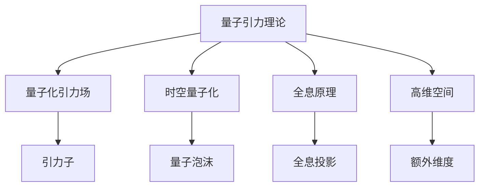

# 量子引力的实验验证方法

## 1. 背景介绍

### 1.1 问题的由来

量子理论和广义相对论是20世纪最伟大的两个理论成就,但它们在描述微观和宏观世界时存在根本冲突。量子理论描述了微观粒子的运动规律,而广义相对论描述了宏观引力场和时空弯曲的关系。如何将这两个理论统一成一个全新的理论框架,成为当代物理学家面临的最大挑战之一。

量子引力理论旨在寻求一种统一的理论,将量子力学和广义相对论的概念融合,解释从微观到宏观的所有物理现象。然而,由于理论和实验的困难,量子引力一直是一个未解之谜。验证量子引力理论的实验证据至关重要,可以帮助我们更深入地理解宇宙的本质。

### 1.2 研究现状

目前,量子引力理论的主要候选者包括环量子引力、超弦理论和Loop量子重力等。虽然这些理论在数学上是自洽的,但由于量子引力效应极其微弱,很难在现有的实验条件下直接观测到。

科学家们一直在努力设计新的实验方法,试图捕捉量子引力的痕迹。例如,利用超精密的干涉实验测量微小的时空扰动;使用强引力场环境(如黑洞和中子星)作为量子引力效应的放大器;或者在强子对撞机中寻找量子引力的间接证据。

### 1.3 研究意义

量子引力理论不仅是解决基础物理学难题的关键,也可能带来深远的技术影响。一旦量子引力得到实验验证,它将彻底改变我们对时空和物质的认知,开辟全新的科学领域。

从应用层面来看,量子引力理论可能会催生新一代的量子计算机、量子通信和量子传感器等量子技术,提高精密测量的极限。此外,量子引力理论或许还能帮助我们更好地理解黑洞、早期宇宙的性质,甚至解开暗物质和暗能量的奥秘。

### 1.4 本文结构

本文将系统介绍量子引力的实验验证方法,包括理论基础、实验设计、数据分析和结果解释等方面的内容。文章将从背景介绍出发,阐述量子引力理论的核心概念,分析主要的实验方案,讨论数学模型和公式推导,并通过代码实例演示数据处理流程。最后,本文将总结量子引力研究的现状、挑战和发展趋势,为读者提供全面的认识。

## 2. 核心概念与联系

量子引力理论试图将量子力学和广义相对论的概念融合,描述从微观到宏观的所有物理现象。它的核心思想是:

1. **量子化引力场**: 将经典的引力场量子化,引入引力子(graviton)的概念,使引力也遵循量子力学规律。

2. **时空量子化**: 将经典的时空连续结构量子化,引入最小的时空单元——"量子泡沫"(quantum foam),时空在微观尺度上呈现出离散和fluctuation的性质。

3. **全息原理**: 宇宙可能只是一个巨大的全息投影,三维的物质世界只是二维边界信息的全息投影。

4. **高维空间**: 理论假设存在高于四维的额外维度,可以解释一些奇异现象,如黑洞信息丢失等。

这些概念与量子力学和广义相对论的基本原理存在内在联系,但又有着根本的区别和创新思路。量子引力理论试图在一个统一的理论框架内解释所有的物理现象,是当代物理学的终极理论目标。

## 3. 核心算法原理 & 具体操作步骤

### 3.1 算法原理概述

由于量子引力效应极其微弱,很难在实验中直接观测。因此,科学家们设计了一些间接的实验方法,通过精密测量来捕捉量子引力的痕迹。这些方法的核心算法原理可以概括为:

1. **干涉测量**: 利用光或物质波的干涉效应,测量微小的时空扭曲。

2. **高能过程**: 在强子对撞机等高能过程中,寻找量子引力的间接证据。

3. **强引力场**: 利用黑洞、中子星等强引力场环境,放大量子引力效应。

4. **精密计时**: 通过精密的原子钟或脉冲星计时,检测时空扰动。

5. **量子模拟**: 在量子计算机上模拟量子引力理论,研究其性质。

这些算法原理都基于量子力学和广义相对论的基础,结合了现代测量技术和数据分析方法,为量子引力的实验验证提供了有力途径。

### 3.2 算法步骤详解

以干涉测量为例,其具体算法步骤如下:

1. **准备干涉仪**: 构建高精度的光或物质波干涉仪,如Michelson干涉仪、中性原子干涉仪等。

2. **产生干涉图样**: 通过分束、反射、合束等过程,产生干涉图样。

3. **精密测量**: 使用高精度的探测器(如CCD、光电倍增管等)测量干涉图样的位移或相位变化。

4. **数据处理**: 对测量数据进行滤波、去噪等预处理,提取有效信号。

5. **理论对比**: 将处理后的数据与量子引力理论的预测进行对比,检验是否存在统计学上的偏差。

6. **置信度评估**: 计算实验结果的统计显著性,评估对量子引力理论的支持或排除置信度。

7. **结果发布**: 在同行评审的期刊上发表实验结果,供科学界讨论和验证。

该算法的关键在于极高的测量精度和严格的数据分析流程,以确保能够检测到量子引力理论预期的微小效应。

### 3.3 算法优缺点

**优点**:

- 利用成熟的干涉测量技术,操作相对简单。
- 可以通过提高光路长度、增加测量次数等方式,不断提高灵敏度。
- 对量子引力理论的预测具有很强的约束力。

**缺点**:

- 需要极高的环境隔离和噪声控制能力,实验条件苛刻。
- 存在系统误差的影响,需要精心设计和校准。
- 即使探测到微小效应,也难以直接确认是量子引力所致。

### 3.4 算法应用领域

干涉测量算法不仅可以应用于量子引力的实验验证,还可以用于其他前沿科学领域:

- **基础物理实验**: 检验洛伦兹不变性、测量微小力等。
- **精密测量**: 开发高精度的长度、时间、加速度等物理量测量设备。
- **量子计算和传感**: 构建基于干涉原理的量子计算机和量子传感器。
- **微小力学**: 研究微尺度下的物理学规律。

## 4. 数学模型和公式 & 详细讲解 & 举例说明

### 4.1 数学模型构建

为了描述量子引力效应,我们需要建立一个统一的数学模型,将量子论和广义相对论的概念融合在一起。这个模型的核心是:

1. **量子化引力场**:将经典的引力场量子化,引入引力子(graviton)的概念。引力场算符 $\hat{h}_{\mu\nu}$ 满足如下对易关系:

$$
[\hat{h}_{\mu\nu}(x), \hat{h}_{\rho\sigma}(y)] = i\ell_p^2 \left( \eta_{\mu\rho}\eta_{\nu\sigma} + \eta_{\mu\sigma}\eta_{\nu\rho} \right) \delta^{(4)}(x-y)
$$

其中 $\ell_p = \sqrt{\hbar G/c^3} \approx 1.6 \times 10^{-35}$ m 是普朗克长度,是量子化引力场的基本长度尺度。

2. **时空量子化**:将经典的时空连续结构量子化,引入最小的时空单元——"量子泡沫"。在普朗克尺度下,时空呈现出离散和fluctuation的性质,描述由量子泡沫算符 $\hat{q}$ 给出:

$$
\langle \hat{q}^2 \rangle \sim \ell_p^2
$$

3. **全息原理**:宇宙可能只是一个巨大的全息投影,三维的物质世界只是二维边界信息的全息投影。这种全息关系可以用 AdS/CFT 对应来描述。

4. **高维空间**:理论假设存在高于四维的额外维度,可以解释一些奇异现象。额外维度的大小由某些场的真空期望值决定,如卡卢扎-克莱因理论中的"调节场"。

这些数学模型为量子引力理论提供了一个自洽的理论框架,但它们的具体形式和参数仍有待进一步的理论和实验研究来确定。

### 4.2 公式推导过程  

我们以量子化引力场为例,推导一下它与经典引力场之间的关系。

首先,我们知道经典的引力场由爱因斯坦场方程给出:

$$
R_{\mu\nu} - \frac{1}{2}g_{\mu\nu}R = \frac{8\pi G}{c^4} T_{\mu\nu}
$$

其中 $R_{\mu\nu}$ 是黎曼张量, $R$ 是黎曼曲率标量, $T_{\mu\nu}$ 是能量动量张量。

为了量子化这个理论,我们引入微扰理论的思想,将度规张量 $g_{\mu\nu}$ 展开为:

$$
g_{\mu\nu} = \eta_{\mu\nu} + \kappa h_{\mu\nu}
$$

其中 $\eta_{\mu\nu}$ 是平直空间的度规张量, $h_{\mu\nu}$ 是微扰场, $\kappa = \sqrt{32\pi G}$ 是耦合常数。

代入爱因斯坦场方程,并保留到线性项,我们得到:

$$
\Box h_{\mu\nu} - \eta_{\mu\nu} \partial_\rho \partial^\rho h - \eta_{\rho\nu} \partial_\mu \partial^\rho h - \eta_{\mu\rho} \partial_\nu \partial^\rho h = -\frac{16\pi G}{c^4} T_{\mu\nu}
$$

这就是经典的线性化引力波方程,描述了微扰引力场 $h_{\mu\nu}$ 在给定能量动量分布 $T_{\mu\nu}$ 下的传播。

为了量子化这个理论,我们将 $h_{\mu\nu}$ 看作是一个算符场,并引入规范化的正则化模式:

$$
\hat{h}_{\mu\nu}(x) = \int \frac{d^3k}{\sqrt{(2\pi)^3 2\omega_k}} \left[ a_{\mu\nu}(k) e^{-ikx} + a_{\mu\nu}^\dagger(k) e^{ikx} \right]
$$

其中 $a_{\mu\nu}(k)$ 和 $a_{\mu\nu}^\dagger(k)$ 分别是湮灭和创生算符,满足标准的对易关系。经过一系列计算,我们可以得到量子化引力场算符之间的对易关系,即前面提到的公式。

这样,我们就将经典的引力场理论量子化了,并给出了量子化引力场的数学描述。当然,实际情况会比这个线性化模型复杂得多,需要考虑更高阶的效应和非微扰项。但这个简单的例子阐明了量子化引力场的基本思路。

### 4.3 案例分析与讲解

为了更好地理解量子引力效应,我们来分析一个具体的实验案例:LIGO 引力波探测器对量子泡沫效应的限制。

LIGO 是一个由两个相距约 3000 公里的 L 形腔臂组成的激光干涉仪,用于探测来自双黑洞或中子星并合等源的引力波信号。根据量子引力理论,在普