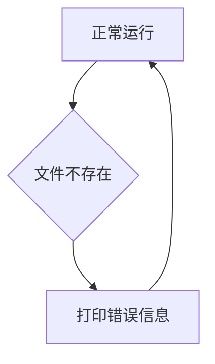

## 1. 背景介绍
### 1.1  问题的由来
在软件开发的世界里，错误是不可避免的。从简单的语法错误到复杂的逻辑缺陷，各种错误都会潜伏在代码中，等待着机会爆发。一旦错误发生，可能会导致程序崩溃、数据丢失、甚至安全漏洞，给用户带来极坏的体验，甚至造成严重的后果。因此，设计有效的错误处理机制，对于保证软件的稳定性和可靠性至关重要。

### 1.2  研究现状
传统的错误处理机制主要依赖于异常处理机制，例如 try-catch 块。这种机制能够捕获和处理程序运行时发生的异常，但它往往只能处理已知的异常类型，对于未知的错误类型则显得力不从心。此外，传统的异常处理机制也存在一些局限性，例如：

* **错误信息不足:** 捕获到的异常信息往往过于简短，难以定位错误的根源。
* **错误处理逻辑复杂:**  复杂的错误处理逻辑可能会导致代码难以阅读和维护。
* **错误传播问题:**  异常的传播可能会导致程序崩溃，无法进行有效的恢复。

近年来，随着软件系统复杂度的不断提高，对错误处理机制的需求也越来越高。一些新的错误处理机制和技术开始涌现，例如：

* **断言机制:**  通过断言语句来检查程序运行过程中的假设是否成立，一旦假设不成立，则抛出断言错误，帮助开发者发现逻辑错误。
* **日志记录机制:**  记录程序运行过程中的关键信息，包括错误信息、堆栈跟踪等，方便开发者进行故障诊断和分析。
* **监控和报警机制:**  实时监控程序运行状态，一旦发现异常情况，则触发报警，及时通知相关人员。

### 1.3  研究意义
设计高效、可靠的错误处理机制对于软件的稳定性和可靠性至关重要。本文将深入探讨错误处理机制的设计原则、核心算法原理、具体操作步骤以及实际应用场景，旨在为开发者提供一个全面的错误处理指南。

### 1.4  本文结构
本文结构如下：

* 第2章介绍错误处理机制的核心概念和联系。
* 第3章详细阐述错误处理机制的核心算法原理和具体操作步骤。
* 第4章构建数学模型，并推导公式，以深入分析错误处理机制的性能和效率。
* 第5章通过代码实例，展示错误处理机制的实际应用。
* 第6章介绍错误处理机制在实际应用场景中的应用，并展望未来应用趋势。
* 第7章推荐一些学习资源、开发工具和相关论文，方便读者进一步学习和研究。
* 第8章总结本文的研究成果，并展望未来发展趋势和挑战。
* 第9章列出常见问题和解答，帮助读者解决实际问题。

## 2. 核心概念与联系
### 2.1  错误类型
错误可以分为以下几种类型：

* **语法错误:**  代码语法不符合语言规范，例如缺少分号、拼写错误等。
* **逻辑错误:**  代码逻辑存在缺陷，导致程序运行结果不符合预期，例如条件判断错误、循环错误等。
* **运行时错误:**  程序在运行过程中发生的错误，例如内存溢出、文件访问错误等。
* **用户错误:**  用户操作错误导致的错误，例如输入错误数据、选择错误选项等。

### 2.2  错误处理流程
错误处理流程通常包括以下几个步骤：

* **错误检测:**  程序在运行过程中检测到错误。
* **错误捕获:**  程序捕获到错误信息。
* **错误处理:**  程序根据错误信息采取相应的处理措施。
* **错误恢复:**  程序尝试恢复到正常运行状态。
* **错误记录:**  记录错误信息，方便后续分析和调试。

### 2.3  错误处理策略
常见的错误处理策略包括：

* **忽略错误:**  对于一些不影响程序正常运行的错误，可以忽略不处理。
* **终止程序:**  对于一些严重错误，可以终止程序运行，避免造成更大的损失。
* **回滚操作:**  对于一些可恢复的错误，可以回滚到之前的状态，尝试重新执行操作。
* **重试操作:**  对于一些暂时性错误，可以尝试多次重试，直到成功执行操作。
* **通知用户:**  对于一些需要用户干预的错误，可以通知用户并提示解决方法。

## 3. 核心算法原理 & 具体操作步骤
### 3.1  算法原理概述
本文将介绍一种基于状态机和事件驱动的错误处理算法。该算法将错误处理过程抽象为一个状态机，每个状态代表程序运行的某个阶段，每个事件代表程序运行过程中发生的错误或其他事件。状态机根据事件触发，跳转到不同的状态，并执行相应的处理逻辑。

### 3.2  算法步骤详解
1. **定义状态机:**  首先，需要定义一个状态机，其中每个状态代表程序运行的某个阶段，例如：正常运行状态、错误检测状态、错误处理状态、错误恢复状态等。
2. **定义事件:**  然后，需要定义一些事件，例如：语法错误、逻辑错误、运行时错误、用户错误等。
3. **构建状态转移图:**  根据状态机和事件，构建一个状态转移图，描述不同状态之间的转换关系。
4. **实现状态处理逻辑:**  为每个状态定义相应的处理逻辑，例如：在错误检测状态，需要检测程序运行过程中发生的错误；在错误处理状态，需要根据错误类型采取相应的处理措施；在错误恢复状态，需要尝试恢复到正常运行状态等。
5. **触发事件处理:**  当程序运行过程中发生事件时，状态机根据事件触发，跳转到相应的状态，并执行相应的处理逻辑。

### 3.3  算法优缺点
**优点:**

* **结构清晰:**  状态机模型能够清晰地描述错误处理流程。
* **可扩展性强:**  可以根据需要添加新的状态和事件，扩展错误处理功能。
* **可维护性好:**  状态机模型使得错误处理逻辑更加模块化，易于维护和修改。

**缺点:**

* **复杂度较高:**  对于复杂的错误处理场景，状态机模型可能会变得非常复杂。
* **调试难度大:**  调试状态机模型可能会比较困难。

### 3.4  算法应用领域
该算法适用于各种软件系统，例如：

* **Web 应用:**  处理用户输入错误、数据库连接错误等。
* **移动应用:**  处理网络连接错误、设备权限错误等。
* **嵌入式系统:**  处理硬件故障、传感器错误等。

## 4. 数学模型和公式 & 详细讲解 & 举例说明
### 4.1  数学模型构建
我们可以用一个状态转移图来表示错误处理机制的状态和事件之间的关系。

状态转移图中，每个状态代表程序运行的某个阶段，每个事件代表程序运行过程中发生的错误或其他事件。状态之间的转换关系由事件触发，每个状态都有相应的处理逻辑。

### 4.2  公式推导过程
我们可以用概率论来分析错误处理机制的性能。例如，我们可以计算出程序在不同状态下发生错误的概率，以及程序在不同状态下恢复到正常运行状态的概率。

### 4.3  案例分析与讲解
假设我们有一个简单的程序，它需要读取一个文件并打印文件内容。如果文件不存在，程序会抛出文件不存在错误。我们可以用状态转移图来表示这个程序的错误处理机制：



在这个状态转移图中，A代表正常运行状态，B代表文件不存在状态，C代表打印错误信息状态。当程序运行到B状态时，会触发文件不存在事件，跳转到C状态，并打印错误信息。然后，程序会返回到A状态，继续正常运行。

### 4.4  常见问题解答
* **如何选择合适的错误处理策略？**

选择合适的错误处理策略需要根据具体的应用场景和错误类型来决定。例如，对于一些不影响程序正常运行的错误，可以忽略不处理；对于一些严重错误，可以终止程序运行；对于一些可恢复的错误，可以回滚操作或重试操作。

* **如何设计高效的错误处理机制？**

设计高效的错误处理机制需要考虑以下几个方面：

* **错误检测:**  尽可能早地检测到错误，避免错误传播。
* **错误捕获:**  捕获到尽可能多的错误信息，方便定位错误根源。
* **错误处理:**  根据错误类型采取相应的处理措施，尽量恢复到正常运行状态。
* **错误记录:**  记录错误信息，方便后续分析和调试。

## 5. 项目实践：代码实例和详细解释说明
### 5.1  开发环境搭建
本示例使用 Python 语言进行开发，开发环境搭建如下：

* 操作系统：Windows 10
* Python 版本：3.8.10
* IDE：PyCharm

### 5.2  源代码详细实现
```python
class FileProcessor:
    def __init__(self, filename):
        self.filename = filename

    def process_file(self):
        try:
            with open(self.filename, 'r') as f:
                content = f.read()
                print(content)
        except FileNotFoundError:
            print(f"Error: File '{self.filename}' not found.")
        except Exception as e:
            print(f"Error: An unexpected error occurred: {e}")

# 使用示例
processor = FileProcessor("example.txt")
processor.process_file()
```

### 5.3  代码解读与分析
代码中定义了一个 `FileProcessor` 类，用于处理文件。该类包含一个 `process_file` 方法，用于读取文件并打印文件内容。

在 `process_file` 方法中，我们使用 `try-except` 块来捕获可能发生的错误。

* `try` 块中包含文件读取操作。
* `except FileNotFoundError` 块捕获文件不存在错误，并打印相应的错误信息。
* `except Exception as e` 块捕获其他类型的异常，并打印异常信息。

### 5.4  运行结果展示
如果文件 `example.txt` 存在，则程序会打印文件内容。如果文件不存在，则程序会打印 `Error: File 'example.txt' not found.` 错误信息。如果发生其他类型的异常，则程序会打印相应的异常信息。

## 6. 实际应用场景
### 6.1  Web 应用
在 Web 应用中，错误处理机制用于处理用户输入错误、数据库连接错误、网络连接错误等。例如，当用户输入错误的用户名或密码时，系统会捕获错误，并提示用户输入正确的用户名或密码。

### 6.2  移动应用
在移动应用中，错误处理机制用于处理网络连接错误、设备权限错误、存储空间不足等。例如，当网络连接中断时，系统会捕获错误，并提示用户检查网络连接。

### 6.3  嵌入式系统
在嵌入式系统中，错误处理机制用于处理硬件故障、传感器错误、软件崩溃等。例如，当传感器数据异常时，系统会捕获错误，并采取相应的措施，例如关闭传感器或报警。

### 6.4  未来应用展望
随着软件系统复杂度的不断提高，对错误处理机制的需求也越来越高。未来，错误处理机制可能会更加智能化、自动化，能够自动分析错误原因，并采取相应的修复措施。

## 7. 工具和资源推荐
### 7.1  学习资源推荐
* **书籍:**
    * 《软件工程》
    * 《程序员的自我修养》
    * 《设计模式》
* **在线课程:**
    * Coursera: Software Engineering
    * Udemy: Software Development Fundamentals
* **博客:**
    * Martin Fowler: https://martinfowler.com/
    * Joel on Software: https://www.joelonsoftware.com/

### 7.2  开发工具推荐
* **IDE:**
    * PyCharm
    * Visual Studio Code
    * Eclipse
* **调试工具:**
    * GDB
    * pdb
* **日志工具:**
    * Log4j
    * NLog

### 7.3  相关论文推荐
* **论文:**
    * "A Survey of Error Handling Techniques in Software Engineering"
    * "Fault Tolerance in Distributed Systems"
    * "Software Reliability Engineering"

### 7.4  其他资源推荐
* **开源项目:**
    * Apache Kafka
    * Kubernetes
    * Spring Boot

## 8. 总结：未来发展趋势与挑战
### 8.1  研究成果总结
本文深入探讨了错误处理机制的设计原则、核心算法原理、具体操作步骤以及实际应用场景。

### 8.2  未来发展趋势
未来，错误处理机制可能会更加智能化、自动化，能够自动分析错误原因，并采取相应的修复措施。

### 8.3  面临的挑战
* **复杂性:**  随着软件系统复杂度的不断提高，错误处理机制的设计和实现越来越复杂。
* **可维护性:**  随着软件系统的不断更新和维护，错误处理机制也需要不断更新和维护，这可能会带来一定的挑战。
* **安全性:**  错误处理机制的设计需要考虑安全性问题，避免错误处理过程导致安全漏洞。

### 8.4  研究展望
未来，我们需要继续研究更智能、更自动化、更安全的错误处理机制，以满足软件系统不断发展的需求。


## 9. 附录：常见问题与解答
### 9.1  常见问题
* **如何避免程序崩溃？**

可以通过使用异常处理机制、断言机制、日志记录机制等手段来避免程序崩溃。

* **如何定位错误根源？**

可以通过查看错误信息、堆栈跟踪、日志记录等信息来定位错误根源。

* **如何测试错误处理机制？**

可以通过设计测试用例，模拟各种错误场景，来测试错误处理机制的有效性。


<end_of_turn>