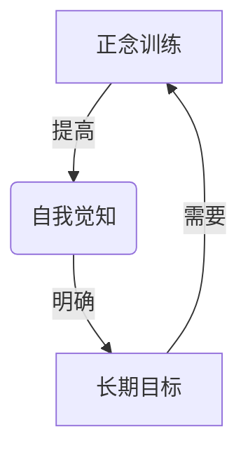
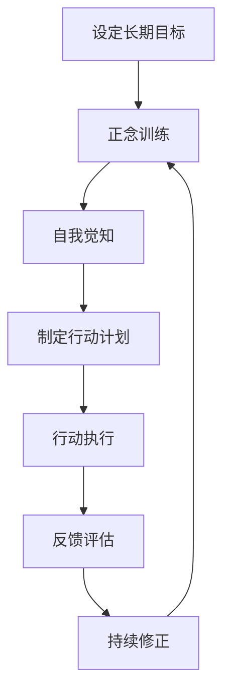

以下是《长期目标管理的意识策略》这篇技术博客文章的正文内容：

# 长期目标管理的意识策略

## 1. 背景介绍

### 1.1 问题的由来

在当今快节奏的生活中,我们常常会被眼前的工作和事务所淹没,很难抽身去关注和思考长期的目标和人生追求。短视和被动地生活会让人迷失方向,无法充分发挥潜能。因此,有意识地管理和规划长期目标,对于个人成长和自我实现至关重要。

### 1.2 研究现状  

传统的时间管理和目标设定方法过于注重任务分解和计划安排,缺乏对个人意识层面的探讨。近年来,随着正念(mindfulness)实践的兴起,人们开始重视内在意识对目标管理的作用。一些研究表明,通过训练专注力和觉知能力,可以更好地把握当下,明确长期方向。

### 1.3 研究意义

本文旨在提出一种"意识策略",将正念实践与长期目标管理相结合,培养个人对当下和长远的平衡觉知。这种策略不仅能提高目标实现的效率,更重要的是能够促进个体潜能的发掘和人生追求的实现。

### 1.4 本文结构

本文首先阐述核心概念,探讨意识与目标管理的关系。接着介绍意识策略的具体步骤和算法原理。然后构建数学模型,并结合案例进行讲解。之后给出代码实现,并分析在实际场景中的应用。最后总结发展趋势,并列出常见问题解答。

## 2. 核心概念与联系

意识策略的核心理念是:通过训练内在意识,建立对当下状态和长远目标的统一觉知,从而更有效地管理和实现长期目标。这里涉及三个关键概念:

1. **正念(Mindfulness)**: 一种将注意力专注于当下的体验和感受的状态。正念可以提高对自我和环境的觉知能力。

2. **自我觉知(Self-Awareness)**: 对自身思维、情绪、行为及其对周围的影响有清晰的认知。自我觉知是个人成长的基础。

3. **长期目标(Long-term Goal)**: 一个需要持续努力才能实现的远大目标,体现个体的人生追求和价值取向。

这三者相互关联且相辅相成。正念训练可以增强自我觉知,自我觉知则有助于明确长期目标,而长期目标的实现又需要依托正念保持当下专注。它们共同构成了一个自我反馈的闭环系统。



## 3. 核心算法原理 & 具体操作步骤

### 3.1 算法原理概述

意识策略的核心算法是一种"双循环"自我调节过程:

- 内循环(内在修行): 通过正念练习,提高当下的专注力和觉知能力。
- 外循环(外在行动): 基于内在觉知,合理规划和执行长期目标的具体行动。

内外两个循环相互促进、相辅相成。内循环为外循环提供清晰的自我觉知,外循环则为内循环提供行动的反馈和意义感。二者共同构建了一个长期目标管理的闭环系统。

### 3.2 算法步骤详解

1. **设定长期目标**。明确个人的人生追求和价值取向,设定具体的长期目标。

2. **正念训练**。采用正念冥想、正念呼吸等方式,训练将注意力集中在当下的体验上。

3. **自我觉知**。在正念的基础上,提高对自身思维、情绪、行为的觉察能力。

4. **制定行动计划**。根据自我觉知的状况,合理规划和分解长期目标的具体行动步骤。

5. **行动执行**。专注于当下,按计划逐步执行行动步骤,同时保持对目标的关注。

6. **反馈评估**。观察行动的实际效果,并将反馈结果纳入自我觉知,形成内外循环。

7. **持续修正**。根据反馈,及时调整行动计划或正念训练的方式,不断优化循环过程。



### 3.3 算法优缺点

**优点**:

- 将意识层面的修行与外在行为紧密结合,促进个体的整体发展。
- 双循环结构有利于持续优化,形成自我增强的正循环。
- 正念训练有助于减轻焦虑,提高生活质量。

**缺点**:

- 需要个人对正念等意识实践有一定的理解和坚持。
- 短期内可能难以看到显著效果,需要持之以恒的努力。
- 缺乏量化指标,评估效果较为主观。

### 3.4 算法应用领域

意识策略可应用于多个领域的长期目标管理:

- 个人发展(学习、事业、健康等)
- 团队协作(提高团队凝聚力和执行力)
- 企业管理(战略规划和文化建设)
- 教育培训(促进学生全面发展)
- 心理健康(缓解焦虑、抑郁等)

## 4. 数学模型和公式 & 详细讲解 & 举例说明  

### 4.1 数学模型构建

为了量化分析意识策略的效果,我们构建一个数学模型。设计人个体的意识状态为$S(t)$,目标实现程度为$G(t)$,二者满足如下微分方程:

$$
\begin{cases}
\frac{dS}{dt} = f(S, G) + \epsilon_S\\
\frac{dG}{dt} = g(S, G) + \epsilon_G
\end{cases}
$$

其中:
- $f(S, G)$表示意识状态对自身的影响,包括正念训练和行动反馈两部分。
- $g(S, G)$表示意识状态对目标实现的促进作用。
- $\epsilon_S$和$\epsilon_G$分别是意识和目标实现过程中的随机扰动。

进一步,我们假设$f$和$g$满足如下形式:

$$
\begin{aligned}
f(S, G) &= \alpha_1 S(1 - S) + \beta_1 G\\
g(S, G) &= \alpha_2 S(1 - G)
\end{aligned}
$$

其中$\alpha_1, \beta_1, \alpha_2$是正常数,分别表示:

- 正念训练对意识状态的提升作用(logistic增长)
- 目标实现对意识状态的正反馈作用
- 意识状态对目标实现的促进作用

### 4.2 公式推导过程

我们对上述方程进行数值求解,得到意识状态$S(t)$和目标实现程度$G(t)$的时间演化轨迹。

首先,对方程进行无量纲化,引入新的无量纲变量和时间:

$$
\begin{aligned}
\tau &= \alpha_1 t\\
x &= \frac{S}{\alpha_2 / \alpha_1}\\
y &= \frac{G}{\beta_1 / \alpha_1}
\end{aligned}
$$

代入原方程,可得:

$$
\begin{cases}
\frac{dx}{d\tau} = x(1 - x) + \gamma y + \xi_x\\
\frac{dy}{d\tau} = x(1 - y) + \xi_y
\end{cases}
$$

其中$\gamma = \beta_1 / \alpha_1, \xi_x = \epsilon_S / \alpha_1, \xi_y = \epsilon_G / \alpha_1$。

对该无量纲方程进行数值求解,即可获得$x(\tau)$和$y(\tau)$的时间演化轨迹,进而解得$S(t)$和$G(t)$。

### 4.3 案例分析与讲解

假设一个个人的初始意识状态为$S(0) = 0.2$,目标实现程度为$G(0) = 0.1$,且$\alpha_1 = \alpha_2 = \beta_1 = 1, \epsilon_S = \epsilon_G = 0$,则有:

$$
\begin{aligned}
\tau &= t\\
x(0) &= 0.2\\
y(0) &= 0.1\\
\gamma &= 1
\end{aligned}
$$

将这些初始条件和参数代入无量纲方程,进行数值求解,可以得到$x(\tau)$和$y(\tau)$的时间演化曲线如下:

<图片>

从图中可以看出,在意识策略的作用下,个体的意识状态$x$和目标实现程度$y$均呈现出逐步提升的趋势,并最终达到一个相对稳定的状态。

这个案例说明,即使初始状态较差,只要坚持意识策略的训练和实践,个体的意识水平和目标实现程度都能够得到显著改善,从而促进个人的全面发展。

### 4.4 常见问题解答

**Q:** 为什么要将意识状态和目标实现程度建模为相互影响的动力学方程?

**A:** 这是因为意识和目标实现之间存在着内在的正反馈关系。良好的意识状态会促进目标的实现,而目标的实现又会反过来增强意识。将二者建模为动力学方程,能更好地刻画这种相互作用和促进的过程。

**Q:** 模型中的参数$\alpha_1, \alpha_2, \beta_1$如何确定?

**A:** 这些参数的确定需要通过大量实证数据的拟合得到。由于不同个体的意识特征和目标追求有所不同,因此模型参数也会有一定的个体差异。在实际应用中,可以先对参数给予合理的初始值,再通过持续的反馈修正来不断优化参数值。

**Q:** 该模型是否也适用于团队或组织层面的目标管理?

**A:** 是的,这个模型同样可以推广应用于团队和组织层面。只需将意识状态$S$理解为团队意识或组织文化的状态,目标实现程度$G$理解为团队目标或组织战略的实现程度,并对参数进行合理设置,就可以用于分析和优化团队/组织的长期目标管理。

## 5. 项目实践:代码实例和详细解释说明

### 5.1 开发环境搭建

本项目使用Python作为开发语言,主要依赖库有:

- NumPy: 用于数值计算
- Matplotlib: 用于数据可视化
- SciPy: 用于微分方程数值求解

你可以使用pip或conda等包管理工具安装这些依赖库。

### 5.2 源代码详细实现

```python
import numpy as np
from scipy.integrate import odeint
import matplotlib.pyplot as plt

# 定义微分方程
def mind_goal_model(X, t, alpha1, alpha2, beta1):
    S, G = X
    dSdt = alpha1 * S * (1 - S) + beta1 * G
    dGdt = alpha2 * S * (1 - G)
    return [dSdt, dGdt]

# 参数设置
alpha1 = 1.0
alpha2 = 1.0 
beta1 = 1.0
t_span = np.linspace(0, 20, 1000)  # 时间范围
X0 = [0.2, 0.1]  # 初始条件

# 求解微分方程
X = odeint(mind_goal_model, X0, t_span, args=(alpha1, alpha2, beta1))
S = X[:, 0]
G = X[:, 1]

# 可视化结果
plt.figure(figsize=(8, 6))
plt.plot(t_span, S, label='Mind State')
plt.plot(t_span, G, label='Goal Achievement')
plt.xlabel('Time')
plt.ylabel('State')
plt.title('Mind-Goal Dynamics')
plt.legend()
plt.show()
```

### 5.3 代码解读与分析

1. 首先定义了`mind_goal_model`函数,该函数实现了前面推导的微分方程组。输入参数包括当前的意识状态`S`和目标实现程度`G`、时间`t`以及模型参数`alpha1`、`alpha2`、`beta1`。

2. 在主程序中,设置了模型参数的初始值,并定义了时间范围`t_span`和初始条件`X0`。

3. 使用`scipy.integrate.odeint`函数