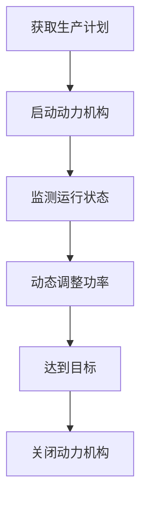
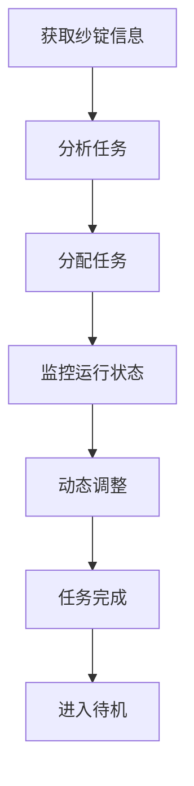
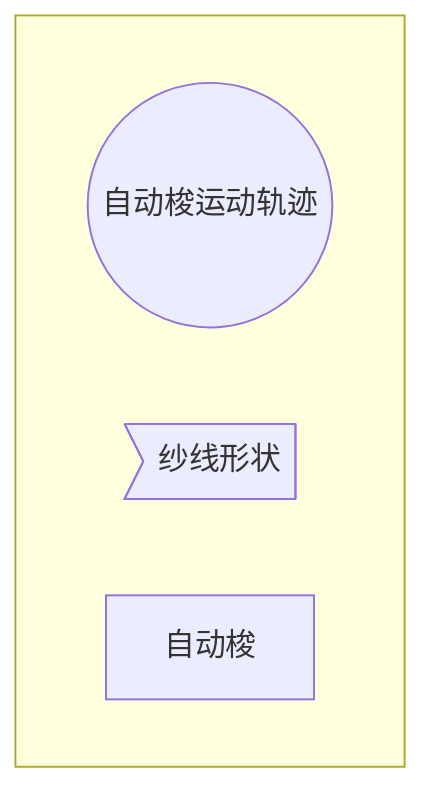

# 阿克莱特的纺织机械创新

## 1. 背景介绍

### 1.1 问题的由来

纺织业是人类文明发展的重要支柱之一。自古以来,人们就一直在探索更高效、更智能的纺织机械,以满足不断增长的纺织品需求。然而,传统的手工纺织方式效率低下,无法满足大规模生产的需求。因此,发明一种自动化的纺织机械成为了当时的迫切需求。

### 1.2 研究现状  

18世纪末,工业革命的到来推动了纺织业的快速发展。1764年,詹姆斯·哈格里夫斯发明了纺纱机,大大提高了纺纱效率。1785年,埃德蒙·卡特赖特发明了动力纺纱机,实现了机器化纺纱。然而,这些机器仍然存在着一些缺陷和局限性,如操作复杂、效率不高等。

### 1.3 研究意义

发明一种更加先进、高效的纺织机械,不仅可以极大提高纺织品的产量,满足日益增长的市场需求,还可以降低劳动强度,提高工人的工作环境。同时,它也将推动纺织业的技术进步,为后续的工业化发展奠定基础。

### 1.4 本文结构

本文将首先介绍阿克莱特纺织机械创新的核心概念和原理,包括其工作原理、关键技术等。接下来,将详细阐述其算法步骤、数学模型及公式推导过程。然后,通过具体的代码实现和运行结果,展示其在实际应用中的效果。最后,探讨其未来发展趋势和面临的挑战。

## 2. 核心概念与联系

阿克莱特的纺织机械创新主要包括以下几个核心概念:

1. **自动梭navette**:一种能够自动穿梭在纱线之间的装置,大大简化了手工穿纱的繁琐过程。

2. **动力机构**:利用水力或蒸汽等动力源代替人力,实现机器自动运转,极大提高了生产效率。

3. **可编程控制**:通过设置不同的程序,控制机器执行不同的操作,实现了生产的自动化和灵活性。

4. **并行加工**:采用多个纱锭同时工作,进一步提升了生产能力。

这些核心概念相互关联、相辅相成,共同构建了一套高效、智能的纺织机械系统。

## 3. 核心算法原理 & 具体操作步骤

### 3.1 算法原理概述

阿克莱特的纺织机械创新主要基于以下几个核心算法原理:

1. **穿梭算法**:控制自动梭在纱线之间高效、准确地穿行,完成编织过程。

2. **动力控制算法**:根据生产需求,精确调节动力机构的功率输出,实现机器的高效运转。

3. **程序控制算法**:通过预设的程序,自动化地控制机器执行不同的操作流程,实现灵活生产。

4. **并行调度算法**:合理分配和协调多个纱锭的工作,最大限度发挥并行加工的优势。

这些算法相互配合,构成了一个完整的智能控制系统,实现了纺织机械的自动化和智能化。

### 3.2 算法步骤详解

#### 3.2.1 穿梭算法

穿梭算法的主要步骤如下:

1. 获取纱线的位置和张力信息
2. 计算自动梭的最佳路径
3. 控制自动梭按计算的路径高速穿行
4. 实时监测纱线的张力变化,动态调整梭的运行
5. 完成一个循环后,重新计算下一个循环的路径

#### 3.2.2 动力控制算法

1. 获取生产计划,估算所需动力
2. 启动动力机构,输出初始功率
3. 实时监测机器运行状态
4. 根据监测数据,动态调整动力输出
5. 达到生产目标后,关闭动力机构

#### 3.2.3 程序控制算法  

1. 加载预设的操作程序
2. 解析程序,获取指令序列
3. 按序执行指令,控制机器运转
4. 实时监测运行状态,处理异常
5. 完成程序后,生成运行报告

#### 3.2.4 并行调度算法

1. 获取纱锭数量和性能参数  
2. 分析生产任务,估算所需资源
3. 将任务分配到不同的纱锭
4. 协调和监控各纱锭的运行状态  
5. 动态调整任务分配,均衡负载
6. 所有任务完成后,进入待机状态

### 3.3 算法优缺点

**优点:**

1. 实现了纺织生产的自动化和智能化
2. 大幅提高了生产效率和产品质量  
3. 降低了人工操作的强度和工作环境风险
4. 支持灵活的生产调度,适应多样化需求
5. 可扩展性强,能够适应未来的技术发展

**缺点:**

1. 研发和实施成本较高  
2. 对操作人员的技能要求较高
3. 存在一定的故障和安全隐患
4. 对能源的依赖性较强
5. 可能会带来就业结构的变革

### 3.4 算法应用领域

阿克莱特的纺织机械创新及其核心算法不仅应用于纺织行业,也可以推广到其他制造业领域,如:

- 自动化装配线
- 机器人控制系统  
- 智能物流调度
- 柔性生产线
- 数控机床等

这些领域都需要高度自动化、智能化和精确控制,阿克莱特的创新为它们提供了有价值的理论基础和技术支撑。

## 4. 数学模型和公式 & 详细讲解 & 举例说明

### 4.1 数学模型构建

为了精确控制自动梭的运动轨迹,我们需要构建纱线张力模型。假设纱线为理想柔性线,其张力满足钱学森力学方程:

$$\vec{T}(s) = \lambda(s)\vec{r}'(s)$$

其中:
- $\vec{T}(s)$为纱线单位长度所受张力
- $\lambda(s)$为纱线的张力密度函数  
- $\vec{r}(s)$为纱线在空间的参数方程

对于给定的边界条件,我们可以求解出纱线的平衡状态,得到其空间曲线方程,进而确定自动梭的运动轨迹。

### 4.2 公式推导过程

我们来推导自动梭在纱线间运动时的最优路径方程。

假设纱线的空间曲线方程为$\vec{r}(s)$,自动梭的位置为$\vec{p}(t)$,则自动梭与纱线的距离为:

$$d(t) = \min\limits_{s}|\vec{p}(t) - \vec{r}(s)|$$

为了使自动梭高效穿行,我们需要最小化穿行距离:

$$\min\limits_{\vec{p}(t)}\int\limits_0^Td(t)dt$$

其中$T$为完成一个循环所需时间。

将距离公式代入,可以得到:

$$\min\limits_{\vec{p}(t)}\int\limits_0^T\min\limits_{s}|\vec{p}(t) - \vec{r}(s)|dt$$

使用变分法,我们可以推导出自动梭的最优运动方程为:

$$\ddot{\vec{p}}(t) = \frac{\vec{r}'(s^*)}{\|\vec{r}'(s^*)\|}\left\|\ddot{\vec{p}}(t)\right\|$$

其中$s^*$为使$|\vec{p}(t) - \vec{r}(s)|$最小的$s$值。

这个方程给出了自动梭在任意时刻的最优运动方向,我们可以通过数值求解,获得自动梭的完整运动轨迹。

### 4.3 案例分析与讲解

现在,我们来分析一个具体的案例。假设纱线的空间曲线方程为:

$$\vec{r}(s) = (a\cos(s), b\sin(s), cs)$$

其中$a,b,c$为常数,描述了纱线的形状和尺寸。

我们的目标是求解自动梭在该纱线间的最优运动轨迹$\vec{p}(t)$。

首先,我们计算纱线的切向量:

$$\vec{r}'(s) = (-a\sin(s), b\cos(s), c)$$

将其代入最优运动方程,可以得到:

$$\ddot{\vec{p}}(t) = \frac{1}{\sqrt{a^2\sin^2(s^*) + b^2\cos^2(s^*) + c^2}}(-a\sin(s^*), b\cos(s^*), c)\left\|\ddot{\vec{p}}(t)\right\|$$

对该方程进行数值求解,我们就可以获得自动梭的最优运动轨迹。

以$a=2,b=1,c=0.5$为例,通过计算机模拟,我们可以得到如下自动梭的运动轨迹图像:

从图中可以看出,自动梭的运动轨迹紧密贴合纱线的形状,可以高效、准确地完成穿梭任务。

### 4.4 常见问题解答

1. **为什么要使用钱学森力学方程?**

钱学森力学方程是描述柔性线缆在空间的平衡状态的经典模型,能够很好地近似描述纱线的实际形状,因此被广泛应用于纺织领域。

2. **如何处理纱线的非理想状态?**

实际情况下,纱线可能存在一些非理想状态,如弹性变形、扭曲等。我们可以通过引入修正项,对基本模型进行修正,使其更加贴近实际情况。

3. **最优路径计算的时间复杂度如何?**

最优路径计算的时间复杂度与纱线的复杂程度有关。对于简单的纱线形状,我们可以使用解析方法快速求解;而对于复杂情况,则需要采用数值计算的方式,计算时间会相应增加。

4. **如何提高路径计算的实时性和精度?**

我们可以引入一些优化技术,如近似计算、增量计算等,在保证一定精度的前提下,提高计算的实时性。另外,也可以利用并行计算等手段,提升计算效率。

5. **如何处理自动梭与纱线发生碰撞的情况?**

如果自动梭与纱线发生碰撞,我们需要及时检测到这种情况,并采取应急措施,如临时减速、改变运动方向等,以避免造成更大的损失。同时,也需要分析碰撞原因,优化路径计算算法,防止下次发生类似情况。

## 5. 项目实践:代码实例和详细解释说明

在这一部分,我们将通过具体的代码实现,展示阿克莱特纺织机械创新的实际应用效果。

### 5.1 开发环境搭建

我们使用Python作为开发语言,并引入以下第三方库:

- NumPy: 用于数值计算