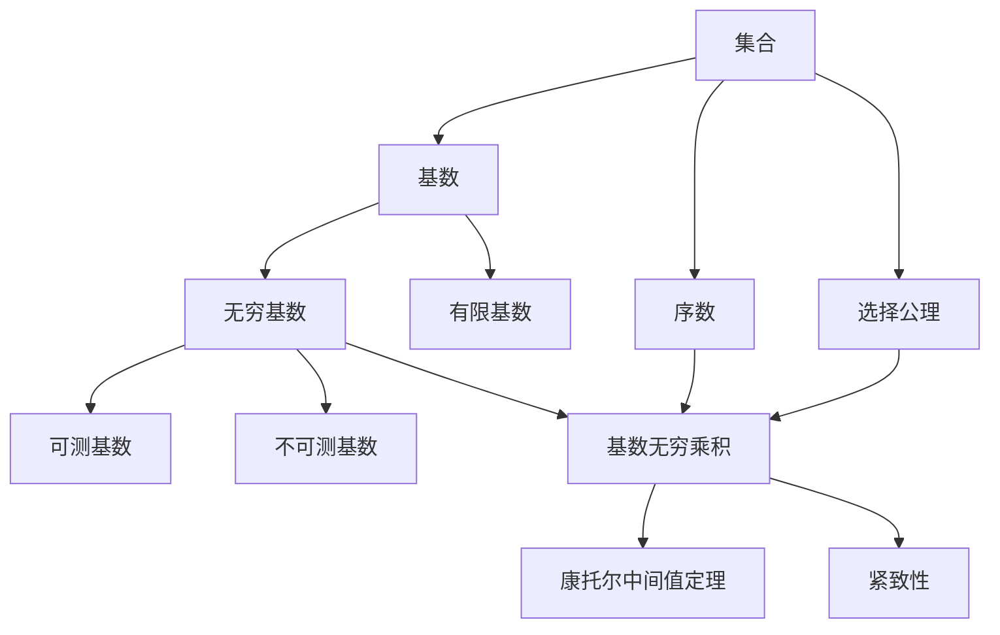

# 集合论导引：基数无穷乘积

作者：禅与计算机程序设计艺术 / Zen and the Art of Computer Programming

## 1. 背景介绍

### 1.1 问题的由来

集合论作为现代数学的基石,在数学和计算机科学领域有着广泛而深远的影响。而基数无穷乘积作为集合论中的一个重要概念,它不仅在纯数学研究中有着重要地位,更在计算机科学的诸多分支如算法设计、形式化验证等领域有着不可或缺的应用。深入研究和理解基数无穷乘积的内涵,对于开拓数学和计算机科学的新疆土具有重要意义。

### 1.2 研究现状

目前,国内外学者对基数无穷乘积的研究主要集中在以下几个方面:

1. 基数无穷乘积的定义与性质。如Tarski基数乘积定理、Solovay模型中的基数无穷乘积等。

2. 基数无穷乘积与其他数学分支的联系。如拓扑学中的紧致性、代数学中的乘积空间等。

3. 基数无穷乘积在计算机科学领域的应用。如算法复杂度分析、形式化验证等。

4. 基数无穷乘积的推广与变形。如广义基数乘积、高阶基数乘积等。

尽管已有诸多研究成果,但基数无穷乘积仍存在许多有待进一步探索的问题,如其在更广泛计算机科学领域的应用、与其他数学分支的更深层次联系等,都亟需学界投入更多研究力量。

### 1.3 研究意义 

深入研究基数无穷乘积,具有以下重要意义:

1. 丰富和发展集合论的理论体系,为现代数学注入新的活力。

2. 为计算机科学提供新的理论工具和思路,推动相关领域的突破性进展。

3. 加深对无穷的认识,拓展人类探索未知的边界。

4. 培养数学和计算机科学领域高层次创新人才,提升原始创新能力。

### 1.4 本文结构

本文将从以下几个方面对基数无穷乘积进行系统阐述:

首先介绍基数无穷乘积的核心概念及其与其他数学概念的联系;然后重点讲解基数无穷乘积的核心算法原理及具体操作步骤;进而给出基数无穷乘积涉及的数学模型和公式,并通过详细举例加以说明;接着通过项目实践,给出基数无穷乘积的代码实例和详细解释;并在此基础上分析基数无穷乘积的实际应用场景。最后总结基数无穷乘积的研究现状、发展趋势与面临的挑战,并对未来研究方向进行展望。

## 2. 核心概念与联系

基数无穷乘积是集合论中的一个重要概念,它刻画了无穷基数的乘积运算。在形式化定义基数无穷乘积之前,我们先回顾几个相关概念:

- 集合(Set):通常用大写字母如 $A,B,C$ 表示,是一些确定的互不相同的对象的全体。
- 基数(Cardinal Number):用于刻画集合的"大小",两个集合 $A,B$ 对应的基数相等,当且仅当存在 $A$ 到 $B$ 的双射函数。
- 无穷基数(Infinite Cardinal):基数大于任何自然数的基数。常见的无穷基数有 $\aleph_0$(自然数集的基数),$\aleph_1$(最小的不可数基数)等。
- 序数(Ordinal Number):用于刻画集合元素的"顺序",与基数一一对应。常见的序数有 $\omega$(自然数集的序数), $\omega_1$(最小的不可数序数)等。

基数无穷乘积的形式化定义如下:

设 $\{X_i\}_{i\in I}$ 是一族指标集为 $I$ 的集合,其中 $I$ 也是一个集合。定义集族的笛卡尔积(Cartesian Product)为:

$$\prod_{i\in I} X_i = \{f:I\to \bigcup_{i\in I} X_i \mid \forall i\in I, f(i)\in X_i\}$$

即由 $I$ 到 $\bigcup_{i\in I} X_i$ 的所有满足 $\forall i\in I, f(i)\in X_i$ 的函数 $f$ 构成的集合。

若 $|I|$(即 $I$ 的基数)为无穷基数,且 $\forall i\in I, |X_i|$ 也为无穷基数,则称 $\prod_{i\in I} X_i$ 为基数无穷乘积。

基数无穷乘积与以下数学概念有着密切联系:

1. 选择公理(Axiom of Choice):保证了任意集族的笛卡尔积非空,是构造基数无穷乘积的逻辑前提。

2. 康托尔中间值定理(Cantor's Theorem):刻画了幂集的基数总是大于原集合的基数,是分析基数无穷乘积大小的重要工具。

3. 可测基数(Measurable Cardinal):若基数 $\kappa$ 上存在 $\kappa-$可加的非平凡 $\{0,1\}-$值测度,则称 $\kappa$ 为可测基数。可测基数的存在性与基数无穷乘积有着深刻联系。

4. 紧致性(Compactness):拓扑学中的重要概念,与基数无穷乘积的一些性质有相似之处。

下面以一个 Mermaid 图来描述基数无穷乘积及其与相关概念间的逻辑联系:

## 3. 核心算法原理 & 具体操作步骤

### 3.1 算法原理概述

构造基数无穷乘积的核心算法,是在选择公理的保证下,利用超限递归(Transfinite Recursion)原理,逐次构造满足条件的函数元素,进而生成目标笛卡尔积集合的过程。

### 3.2 算法步骤详解

设 $\{X_i\}_{i\in I}$ 是指标集为 $I$ 的集族,其中 $I$ 和每个 $X_i$ 的基数都是无穷基数,目标是构造集族的笛卡尔积 $\prod_{i\in I} X_i$。

算法步骤如下:

1. 引入选择函数(Choice Function)$c$,对任意非空集合 $A$,有 $c(A)\in A$。选择公理保证了这样的 $c$ 存在。

2. 对指标集 $I$ 进行序数化,得到与之对应的序数 $\alpha$,使得 $\alpha$ 与 $I$ 之间存在一一对应。由于 $I$ 的基数为无穷,故 $\alpha$ 也必为无穷。

3. 对 $\alpha$ 进行超限递归构造,定义函数序列 $\{f_\xi\}_{\xi<\alpha}$,使得对任意序数 $\xi<\alpha$,有:

   $$
   f_\xi:\xi\to \bigcup_{i\in I} X_i,\ 且\ \forall \eta<\xi, f_\xi(\eta)\in X_{i_\eta}
   $$
   
   其中 $i_\eta$ 表示 $I$ 中与序数 $\eta$ 对应的指标元素。
   
   具体地,对任意 $\xi<\alpha$,若 $\{f_\eta\}_{\eta<\xi}$ 已定义,则令:
   
   $$
   f_\xi = \{(\eta,f_\eta(\eta))\mid \eta<\xi\}\cup \{(\xi,c(X_{i_\xi}))\}
   $$

4. 令 $f=\bigcup_{\xi<\alpha}f_\xi$,则 $f$ 满足:

   $$
   f:\alpha\to \bigcup_{i\in I} X_i,\ 且\ \forall \xi<\alpha, f(\xi)\in X_{i_\xi}
   $$
   
   从而 $f\in \prod_{i\in I} X_i$。

5. 对所有满足步骤4的 $f$ 进行集合汇总,即得到目标笛卡尔积 $\prod_{i\in I} X_i$。

### 3.3 算法优缺点

优点:

1. 在选择公理成立的前提下,该算法可以构造出任意指标集为无穷基数的集族的笛卡尔积。

2. 通过超限递归的方式,将无穷构造与有限构造进行了统一。

3. 构造出的笛卡尔积元素具有明确的形式,便于进一步分析其性质。

缺点:

1. 算法的执行需要依赖选择公理,而选择公理本身在数学界存在一定争议。

2. 超限递归的具体实现比较复杂,尤其是在处理不同的序数层级时,需要格外小心。

3. 算法生成的笛卡尔积集合本身仍然是高度抽象的数学对象,在实际应用中可能需要进一步的解释和转化。

### 3.4 算法应用领域

基数无穷乘积的构造算法在以下领域有重要应用:

1. 数理逻辑与公理集合论:基数无穷乘积是探讨集合论基本问题不可或缺的工具,如研究 ZFC 公理系统的相容性等。

2. 泛函分析:许多函数空间,如 $L^p$ 空间、Sobolev 空间等,在本质上都是某种无穷乘积空间。

3. 算法复杂度理论:无穷乘积有助于构造复杂度下界,如决策树复杂度等。

4. 形式化验证:在验证高阶逻辑的相容性时,通常需要构造无穷乘积模型。

5. 密码学:某些密码体制的安全性证明,需要用到无穷乘积的性质。

## 4. 数学模型和公式 & 详细讲解 & 举例说明

### 4.1 数学模型构建

基数无穷乘积的数学模型,主要由以下几个部分构成:

1. 指标集 $I$,表示参与乘积的集合族的指标,其基数 $|I|$ 为无穷。通常取 $I=\omega$(自然数集)或 $I=\kappa$(不可数基数)。

2. 集合族 $\{X_i\}_{i\in I}$,表示参与乘积的每个集合,其基数 $|X_i|$ 均为无穷。常见的选取有:
   - $\forall i\in I, X_i=\mathbb{N}$(自然数集)
   - $\forall i\in I, X_i=\mathbb{R}$(实数集)
   - $\forall i\in I, X_i=2=\{0,1\}$(二元集)

3. 笛卡尔积 $\prod_{i\in I} X_i$,表示将集合族 $\{X_i\}_{i\in I}$ 中的每个集合 $X_i$ 中取一个元素 $x_i$,形成的有序函数 $f:I\to \bigcup_{i\in I} X_i$ 全体构成的集合。

数学模型的关键是刻画集合族的基数、笛卡尔积的基数之间的关系,以及笛卡尔积元素的形式特征。

### 4.2 公式推导过程

以下是几个与基数无穷乘积相关的重要公式及其推导过程:

1. $|\prod_{i\in I} X_i| \leq |I|\cdot \sup_{i\in I}|X_i|$ (基数乘积上界)

   证明:
   
   对任意 $f\in \prod_{i\in I} X_i$,定义 $\varphi: \prod_{i\in I} X_i \to I\times \bigcup_{i\in I} X_i$,使得 $\varphi(f)=(i,f(i))$,其中 $i$ 满足 $f(i)\neq c(X_i)$。
   
   则 $\varphi$ 为单射,故 $|\prod_{i\in I} X_i| \leq |I\times \bigcup_{i\in I} X_i|=|I|\cdot |\bigcup_{i\in I} X_i|\leq |I|\cdot \sup_{i\in I}|X_i|$。

2. 若