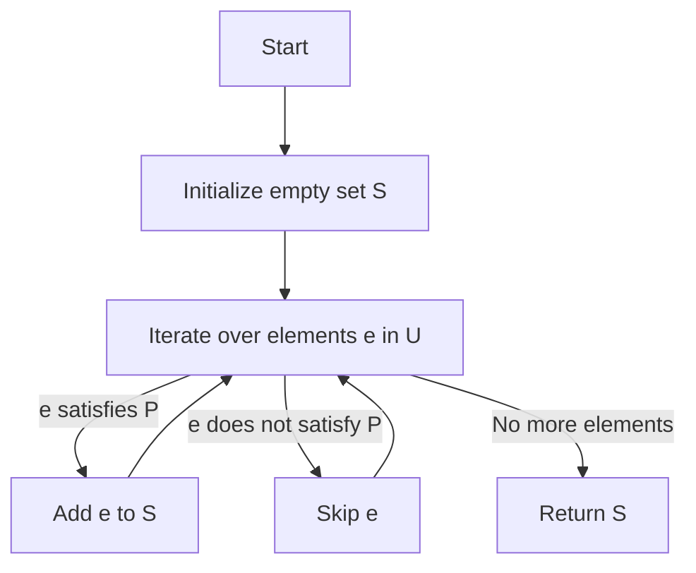
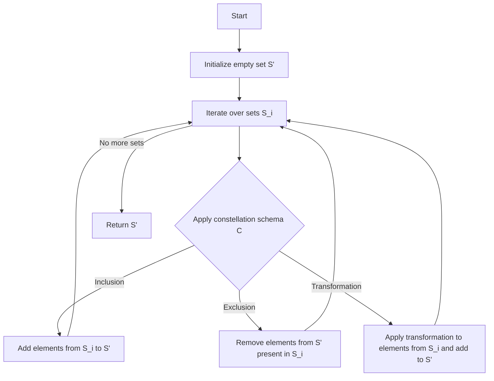

以下是题为《集合论导引：投影荟萃集光影原理》的技术博客文章正文:

# 集合论导引：投影荟萃集光影原理

## 1. 背景介绍

### 1.1 问题的由来

在数学和计算机科学领域,集合论是一门研究集合及其运算的基础理论。集合是构成现代数学的基石,几乎所有的数学概念和定理都可以用集合论来表述和证明。集合论在计算机科学中也有着广泛的应用,如关系数据库、编译原理、形式化方法等领域都与集合论密切相关。

然而,传统的集合论存在一些局限性,难以有效描述和处理一些复杂的集合运算和关系。例如,在大数据时代,我们常常需要处理海量的、动态变化的数据集,传统集合论的表示和操作方式显得力有未逮。因此,发展新的集合论分支和扩展理论以满足实际需求,成为当前数学和计算机科学研究的重要课题。

### 1.2 研究现状  

近年来,一些新兴的集合论分支和扩展理论应运而生,试图突破传统集合论的局限性。其中,投影集合论(Projection Set Theory)是一种新兴的集合论分支,它引入了"投影"和"荟萃"的概念,赋予集合以新的表达能力和操作语义。

投影集合论的核心思想是将集合看作是对底层"宇宙"(Universe)的一种投影,通过不同的投影方式,可以从同一个宇宙中导出不同的集合视角。而荟萃则是对投影集合的一种高阶运算,允许动态组合和转换不同的投影集合,形成新的集合表示和语义。

投影集合论为表达和操作复杂的集合关系提供了新的工具和视角,在大数据处理、形式化方法、程序语言语义等领域展现出巨大的应用潜力。但目前该理论尚处于发展的初级阶段,许多核心概念和原理有待进一步深入探讨和完善。

### 1.3 研究意义

投影集合论的发展将为数学和计算机科学带来以下重要意义:

1. 丰富集合论的表达能力,使其能够更好地描述和操作复杂的数据集和关系。
2. 为大数据处理、形式化方法等领域提供新的理论工具和分析视角。
3. 为程序语言设计注入新的语义概念,有助于开发更高级、更精确的程序语言。
4. 推动集合论在应用数学和理论计算机科学等领域的创新发展。

总的来说,投影集合论是一个极具潜力的新兴理论分支,值得学术界和工业界予以高度重视和深入研究。

### 1.4 本文结构  

本文将对投影集合论的核心概念、数学基础、算法原理和应用场景进行全面而深入的阐述。

文章首先介绍投影集合论的核心概念,如投影、荟萃、集合光影等,并分析它们与传统集合论的关联;接着揭示投影集合论的数学模型,推导出一系列定义、公理和定理;然后探讨投影集合论的核心算法,如投影生成算法、荟萃合成算法等,并给出具体的操作步骤;再者通过实例分析,将理论付诸实践,展示在大数据处理、形式化方法等领域的应用;最后总结投影集合论的发展趋势和面临的挑战,并对未来的研究方向进行展望。

## 2. 核心概念与联系

投影集合论的核心概念主要有投影(Projection)、荟萃(Constellations)和集合光影(Set Shadows)三个层次。

### 2.1 投影

投影是投影集合论的基础概念。在传统集合论中,一个集合是对某个给定宇宙(Universe)的子集构造。而在投影集合论中,集合是由底层宇宙根据某种投影方式(Projection Schema)生成的"影子"。

更精确地说,给定一个宇宙 U 和一个投影模式 P,通过将 U 的元素根据 P 进行"映射",就能导出一个投影集合 S。数学表示为:

$$S = P(U)$$

其中不同的投影模式 P 会产生不同的投影集合 S,捕捉到 U 的不同层面。

投影的思想使集合不再是简单的元素集,而是对底层宇宙的一种"视角"或"窗口"。这赋予了集合以新的表达力和灵活性,能更好地描述和操作复杂的数据集和关系。

### 2.2 荟萃

如果说投影为集合赋予了新的语义,那么荟萃(Constellations)则为集合注入了新的运算能力。

荟萃是对投影集合的一种高阶运算,它将多个投影集合作为输入,通过某种荟萃模式(Constellation Schema)的转换和组合,生成一个新的投影集合。数学表示为:

$$S' = C(S_1, S_2, ..., S_n)$$

其中 C 是荟萃模式, $S_1, S_2, ..., S_n$ 是输入的投影集合,经过 C 的转换和组合,产生一个新的投影集合 $S'$。

荟萃运算赋予了投影集合以动态构造的能力,使其不再是静态的集合,而是可以根据需要在多个投影集合之间转换和组合。这极大地扩展了集合论的表达力和应用范围。

### 2.3 集合光影

集合光影(Set Shadows)是投影集合论中一个极为重要但又易被忽视的概念。

在现实世界中,一个物体会由于不同的光线投射而产生不同的影子。同理,在投影集合论中,一个宇宙 U 在不同的投影模式 P 下,会生成不同的投影集合 S,我们可以将这些投影集合 S 看作是 U 在 P 下的"影子"。

集合光影的概念揭示了投影集合与底层宇宙之间的内在联系:一个投影集合 S 实际上是对底层宇宙 U 的一种"解释",而 U 本身是所有投影集合的"本源"。

投影集合论之所以具有强大的表达力和应用潜能,正是因为它能够灵活地在不同的集合光影之间转换和操作,从而揭示和利用底层宇宙的不同层面。

### 2.4 与传统集合论的关联

投影集合论并非是与传统集合论完全割裂的全新理论体系,两者之间存在内在的联系:

1. 传统集合论可以看作是投影集合论的一个特例,其中只有一种单一的"恒等投影"。
2. 投影集合论中的基本集合运算如并、交、补等都可以在传统集合论的基础上自然推广。
3. 投影集合论的公理和推理规则大多继承和扩展了传统集合论的框架。

总的来说,投影集合论是对传统集合论的一种扩展和拓展,使集合论的表达力和应用范围得到极大提升,但两者并非对立,而是相辅相成的关系。

## 3. 核心算法原理与具体操作步骤

### 3.1 算法原理概述

投影集合论的核心算法主要包括两大类:投影生成算法和荟萃合成算法。

**投影生成算法**的目标是根据给定的宇宙 U 和投影模式 P,计算出对应的投影集合 S。这是投影集合论的基础算法,是实现投影概念的关键。

**荟萃合成算法**则是在多个投影集合的基础上,根据给定的荟萃模式 C,计算新的投影集合 S'。这是投影集合论的高阶算法,体现了其动态组合和转换投影集合的能力。

两大类算法有着内在的联系:投影生成是构造投影集合的基础,而荟萃合成则是对投影集合进行进一步的转换和运算。两者的高效实现是投影集合论理论在实践中落地的关键。

### 3.2 算法步骤详解

#### 3.2.1 投影生成算法

假设给定一个宇宙 U 和一个投影模式 P,要计算生成投影集合 S,算法步骤如下:

算法从一个空集合 S 开始,遍历宇宙 U 中的每个元素 e。对于满足投影模式 P 的元素 e,将其加入集合 S;对于不满足 P 的元素,则跳过。遍历完所有元素后,返回结果集合 S。

该算法的时间复杂度为 O(n),其中 n 是宇宙 U 的元素个数。在最坏情况下,需要遍历所有元素。

#### 3.2.2 荟萃合成算法

假设有 n 个输入投影集合 $S_1, S_2, ..., S_n$,以及一个荟萃模式 C,要计算生成新的投影集合 S',算法步骤如下:

算法从一个空集合 S'开始,遍历每个输入投影集合 $S_i$。对于每个 $S_i$,根据荟萃模式 C 的语义,执行以下操作之一:

1. Inclusion: 将 $S_i$ 中的元素添加到结果集 S'
2. Exclusion: 从 S' 中移除在 $S_i$ 中也存在的元素  
3. Transformation: 对 $S_i$ 中的元素进行某种转换,再将转换后的元素加入 S'

遍历完所有输入集合后,返回结果集合 S'。

该算法的时间复杂度取决于输入集合的大小、荟萃模式的复杂度,以及具体的操作(包括可能的元素转换)。在最坏情况下,时间复杂度为 O(m*n),其中 m 是输入集合的最大元素个数,n 是输入集合的数量。

### 3.3 算法优缺点

#### 优点

1. **表达力强大**: 投影生成和荟萃合成算法为投影集合论提供了极大的表达力,能够高效构造和操作各种复杂的投影集合。

2. **可扩展性好**: 算法的设计思路清晰,易于根据具体需求进行扩展和优化,如引入并行计算、增量计算等。

3. **与传统集合论兼容**: 这些算法可以自然地退化为传统集合论的基本算法,因此能够无缝对接现有的集合运算库和系统。

#### 缺点

1. **计算复杂度高**: 特别是在处理大规模数据集或复杂荟萃模式时,算法的计算复杂度可能会成为瓶颈。

2. **系统开销大**: 由于需要在底层维护宇宙 U 和投影模式 P 等元数据,会带来额外的系统开销。

3. **语义缺陷**: 目前的算法在处理某些特殊情况(如自引用、无限循环等)时可能存在语义缺陷,需要进一步完善。

总的来说,这些核心算法为投影集合论奠定了坚实的计算基础,但在算法复杂度、系统开销和语义完备性等方面仍有待进一步优化和改进。

### 3.4 算法应用领域

投影集合论的核心算法在诸多领域都有广泛的应用前景:

1. **大数据处理**
   - 投影集合论为高维数据集提供了新的表示和操作方式
   - 荟萃合成算法可用于数据集的动态转换和组合
   - 投影生成算法可支持对海量数据的高效投影和子集抽取

2. **形式化方法**
   - 投影集合论为建模复杂系统提供了新的数