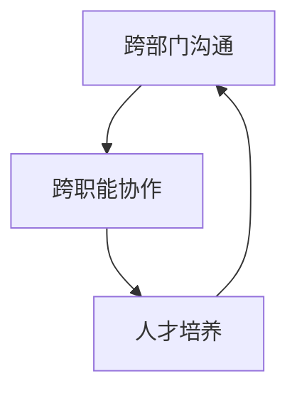

# 领导力培养：跨部门、跨职能沟通，并能够有效培养和管理下属

关键词：领导力、跨部门沟通、跨职能协作、人才培养、团队管理

## 1. 背景介绍
### 1.1 问题的由来
随着组织规模的不断扩大和业务复杂度的提升,跨部门和跨职能的协作沟通已成为现代企业管理中不可或缺的一部分。高效的跨界沟通不仅能够提升组织效率,更是组织创新和变革的重要推动力。然而,由于部门间目标差异、专业领域隔阂等因素,实现有效的跨界沟通并非易事。同时,领导者在带领团队时,还需要重视下属的成长,通过有效的人才培养机制,提升团队战斗力。因此,如何跨越部门藩篱,打破职能壁垒,凝聚团队力量,已成为管理者亟需掌握的领导力技能。

### 1.2 研究现状
近年来,学术界和商界对于跨界领导力的研究日益深入。哈佛商学院教授 Amy Edmondson 在其著作《Teaming: How Organizations Learn, Innovate, and Compete in the Knowledge Economy》中指出,在知识经济时代,组织需要通过跨界团队合作来应对不确定性,领导者需要营造心理安全的氛围,促进团队学习。麻省理工学院教授 Deborah Ancona 提出"X-Team"理论,认为高绩效的跨界团队需要内外兼修,对内形成凝聚力,对外主动链接资源。管理学大师 Peter Drucker 也强调,21世纪的领导者需要具备跨界整合的能力,通过有效沟通协调,让各方智慧碰撞,激发团队活力。

### 1.3 研究意义
IT 行业作为知识密集型产业,跨界协作已成为常态。产品、研发、运营、市场等部门需要紧密配合,才能实现业务目标。作为技术领导者,不仅要具备专业能力,更需要跨界领导力,推动组织在变革中成长。因此,研究 IT 领域的跨界领导力,对于提升技术管理水平,具有重要意义。同时,作为团队领导,培养下属也是不可忽视的使命。通过总结跨界领导和人才培养的方法,帮助更多的 IT 管理者提升带团队的能力,为行业发展贡献力量。

### 1.4 本文结构
本文将从跨部门沟通、跨职能协作、人才培养三个维度,系统阐述 IT 领域的跨界领导力。第一部分介绍了研究背景和意义。第二部分梳理了跨界领导力的核心概念。第三部分总结了跨部门沟通的原则和方法。第四部分探讨了跨职能协作的机制和案例。第五部分介绍了人才培养的模型和实践。第六部分展望了跨界领导力的发展趋势。第七部分推荐了相关的工具和资源。第八部分对全文进行了总结,并分析了未来的挑战和机遇。

## 2. 核心概念与联系
跨界领导力是指领导者跨越组织边界,整合内外资源,推动团队协作,实现目标的能力。其核心要素包括:

1. 跨部门沟通:跨部门沟通是跨界领导力的基础。领导者需要了解不同部门的目标、文化和语言,通过换位思考,找到沟通的切入点,搭建部门间的桥梁。

2. 跨职能协作:跨职能协作是跨界领导力的重点。领导者需要明确跨职能项目的目标和里程碑,梳理各方资源和诉求,通过谈判协调,达成共识,形成合力。

3. 人才培养:人才培养是跨界领导力的根本。领导者需要甄别和发掘团队中的潜力人才,因材施教,搭建成长平台,并以身作则,营造学习氛围,激发团队活力。

跨部门沟通是基础,为跨职能协作提供了信息和资源的流动;跨职能协作是重点,通过整合各方力量,形成组织合力;人才培养是根本,为组织注入源源不断的创新活力。三者相辅相成,构成了跨界领导力的内在逻辑。

## 3. 核心算法原理 & 具体操作步骤
### 3.1 算法原理概述
跨界领导力的本质是一种组织算法,通过优化组织沟通协作的流程,提升组织绩效。其核心原理可总结为 STAR 法则:

- Situation(态势感知):领导者需要洞察组织所处的内外部环境,评估不同部门和职能的现状和诉求。
- Target(目标引领):领导者需要提出明确的跨界协作目标,并将其分解为可执行的里程碑和任务。
- Action(行动协同):领导者需要搭建跨部门和跨职能的沟通协作机制,并通过谈判、授权等方式,调动各方资源,推进目标达成。
- Reflection(复盘学习):领导者需要引导团队对跨界协作的过程和结果进行复盘,总结经验教训,并将其转化为组织学习,推动持续改进。

### 3.2 算法步骤详解
基于 STAR 法则,跨界领导力的具体实践步骤如下:

1. 态势感知:
   - 梳理组织架构,了解各部门职能
   - 调研各部门业务现状和目标
   - 访谈各部门负责人,了解诉求和痛点
   - 汇总分析,形成态势地图

2. 目标引领:
   - 结合公司战略,提出跨界协作目标
   - 与各部门负责人沟通,获得认可
   - 分解目标,制定里程碑和任务
   - 明确责任人和时间节点,形成任务书

3. 行动协同:
   - 搭建跨部门协作机制,建立定期会议
   - 明确信息共享原则,搭建协作平台
   - 开展针对性培训,提升跨界协作技能
   - 授权项目负责人,调动资源支持
   - 跟进项目进展,协调化解矛盾冲突

4. 复盘学习:
   - 回顾跨界协作过程,总结经验教训
   - 评估目标达成情况,分析偏差原因
   - 识别优秀案例,提炼最佳实践
   - 更新协作机制,优化流程工具
   - 宣导项目成果,营造协作文化

### 3.3 算法优缺点
跨界领导力算法的优点在于:
1. 全局视角:通过态势感知,领导者能够俯瞰全局,平衡部门利益,凝聚组织共识。
2. 目标牵引:通过目标引领,领导者能够聚焦资源,形成组织合力,提升协作效率。
3. 赋能协同:通过搭建机制、授权支持,领导者能够激发团队潜能,促进跨界协作。
4. 学习进化:通过复盘学习,领导者能够带领团队持续改进,提升组织智商。

同时,跨界领导力算法也存在一些局限:
1. 高阶技能:跨界领导力是一项复合型技能,需要领导者在专业、管理、沟通等方面都有较高的综合素质,培养周期较长。
2. 文化融合:不同部门往往有不同的文化和习惯,跨界协作需要领导者在尊重差异的同时,推动文化融合,需要较好的情商和耐心。
3. 权责平衡:跨界协作涉及多方利益诉求,领导者需要平衡各方权责,防止责任推诿和内耗,对领导智慧提出较高要求。

### 3.4 算法应用领域
跨界领导力算法可广泛应用于以下领域:
1. 企业管理:跨部门协作是大型企业常态,跨界领导力是中高层管理者的核心技能。
2. 项目管理:复杂项目往往涉及多个职能部门,需要项目经理具备跨界领导力,协调各方资源。
3. 创新管理:创新往往需要打破部门边界,跨界整合资源,需要创新领导者引领协作。
4. 变革管理:组织变革涉及方方面面,需要变革领导者运用跨界领导力,调和利益冲突,推动变革落地。

## 4. 数学模型和公式 & 详细讲解 & 举例说明
### 4.1 数学模型构建
跨界领导力可以用函数来表示:

$F(x) = C(x) * A(x) * T(x)$

其中:
- $F(x)$ 表示跨界领导力
- $C(x)$ 表示跨部门沟通能力
- $A(x)$ 表示跨职能协作能力
- $T(x)$ 表示人才培养能力
- $x$ 表示领导者个人

可见,跨界领导力是沟通、协作、培养三种能力的乘积,三者缺一不可。

### 4.2 公式推导过程
1. 假设某领导者的跨部门沟通能力为 $C(x) = 0.8$,即可以很好地与80%的部门进行有效沟通。
2. 假设其跨职能协作能力为 $A(x) = 0.6$,即可以调动60%的跨职能资源完成协作。
3. 假设其人才培养能力为 $T(x) = 0.5$,即可以在任期内培养出50%的优秀人才。
4. 则该领导者的跨界领导力为:

$$
F(x) = C(x) * A(x) * T(x) = 0.8 * 0.6 * 0.5 = 0.24
$$

这意味着,该领导者的跨界领导力发挥了24%,还有较大的提升空间。

### 4.3 案例分析与讲解
以某大型互联网公司的一个跨部门项目为例。该项目涉及产品、研发、运营、市场四个部门,由一位技术总监 A 牵头负责。

在项目初期,A 与各部门负责人充分沟通,了解各自的目标和诉求,对齐了项目目标,并明确了各自的分工,沟通能力 $C(A) = 0.9$。

在项目中期,A 搭建了跨部门协作机制,包括周例会、需求评审会、进度会等,同时在内部协作平台上搭建了项目专区,促进信息共享和同步,调动了各部门资源支持项目,协作能力 $A(A) = 0.8$。

在项目后期,A 注重发掘和培养优秀人才,对项目骨干进行赋能,给予更大的责任和发展空间,同时营造了积极向上、互帮互助的团队氛围,培养能力 $T(A) = 0.7$。

综合评估,该项目在跨界领导力方面表现出色:

$$
F(A) = C(A) * A(A) * T(A) = 0.9 * 0.8 * 0.7 = 0.504
$$

在 A 的跨界领导下,项目如期完成,并创造了良好的业绩,被公司评为优秀项目。

### 4.4 常见问题解答
1. 问:不同部门的 KPI 不一致,如何统一目标?
   答:要充分沟通,找到各部门的共同利益点,并提出一个更高层次的目标,让各部门的 KPI 成为子目标,为共同目标服务。

2. 问:跨部门沟通有隔阂,如何打破?
   答:要多换位思考,用对方听得懂的语言沟通;多创造非正式交流机会,增进彼此了解;必要时寻求更高层领导的支持。

3. 问:跨职能协作分工不清,如何厘清?
   答:要基于项目目标,明确任务分解和交付节点;做好项目章程,明确各方角色权责;同时灵活调整,及时响应变化。

4. 问:如何在跨界协作中培养人才?
   答:要给予项目成员更多锻炼机会,让其承担更多责任;对优秀者给予奖励激励;营造持续学习的团队氛围,促进知识共享。

## 