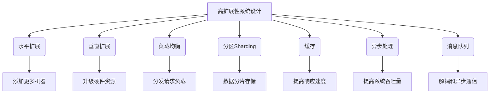

# 高扩展性系统设计的实例分析

## 1. 背景介绍

### 1.1 问题的由来

在当今快速发展的数字时代，系统的高扩展性设计已成为构建高性能、可靠和可维护应用程序的关键因素。随着用户数量和数据量的不断增长,传统的系统架构往往难以满足日益增长的需求,导致性能下降、可用性降低,并增加了维护和升级的复杂性。因此,高扩展性系统设计旨在解决这些挑战,确保系统能够无缝地扩展以适应不断变化的负载,同时保持高性能和可靠性。

### 1.2 研究现状

近年来,高扩展性系统设计已成为学术界和工业界的研究热点。许多知名公司,如 Netflix、Amazon 和 Google,都在积极探索和实践高扩展性架构,以支持其大规模的在线服务。同时,开源社区也在不断推出新的框架、工具和最佳实践,促进了高扩展性系统设计的发展。

### 1.3 研究意义

高扩展性系统设计对于构建现代化的、面向未来的应用程序至关重要。通过适当的设计和实现,系统可以更好地应对突发的流量高峰,提高可用性和响应能力。此外,高扩展性架构还可以降低运营成本,提高资源利用率,并简化系统的维护和升级过程。

### 1.4 本文结构

本文将深入探讨高扩展性系统设计的核心概念、算法原理、数学模型、实践案例和实际应用场景。我们将从背景介绍开始,逐步深入探讨高扩展性系统设计的各个方面,包括核心概念、算法原理、数学模型、项目实践、应用场景、工具和资源推荐,以及未来发展趋势和挑战。文章的最后,我们还将总结常见问题和解答,为读者提供更全面的理解。

## 2. 核心概念与联系

高扩展性系统设计涉及多个核心概念,包括水平扩展、垂直扩展、负载均衡、分区(Sharding)、缓存、异步处理和消息队列等。这些概念相互关联,共同构建了一个高度可扩展的系统架构。



1. **水平扩展**：通过添加更多的机器(服务器或节点)来提高系统的处理能力,是高扩展性系统设计的核心策略之一。它允许系统在需要时无缝地扩展,以满足不断增长的需求。

2. **垂直扩展**：通过升级单个机器的硬件资源(如CPU、内存、存储等)来提高系统的处理能力。垂直扩展相对简单,但存在硬件资源的上限,因此通常与水平扩展相结合使用。

3. **负载均衡**：将传入的请求合理分发到多个服务器或节点上,以平衡系统负载,提高响应速度和可用性。负载均衡是实现高扩展性系统的关键组件之一。

4. **分区(Sharding)**：将数据分散存储在多个节点或数据库实例中,每个节点只负责处理一部分数据。分区可以显著提高数据的读写性能,并支持更大规模的数据存储。

5. **缓存**：通过在内存或其他高速存储介质中缓存频繁访问的数据,可以显著提高系统的响应速度和吞吐量。缓存是优化系统性能的重要手段之一。

6. **异步处理**：将耗时的操作(如数据处理、文件上传/下载等)异步执行,避免阻塞主线程,从而提高系统的吞吐量和响应能力。

7. **消息队列**：通过消息队列实现系统组件之间的解耦和异步通信,提高系统的灵活性、可扩展性和容错能力。

这些核心概念相互关联,共同构建了一个高度可扩展的系统架构。在后续章节中,我们将详细探讨它们的原理、实现方式和实际应用。

## 3. 核心算法原理 & 具体操作步骤

### 3.1 算法原理概述

高扩展性系统设计中涉及多种算法和技术,包括负载均衡算法、分区算法、缓存算法、异步处理算法等。这些算法旨在优化系统的性能、可扩展性和可用性。

1. **负载均衡算法**:
   - 原理: 将传入的请求合理分发到多个服务器或节点上,以平衡系统负载。常见的负载均衡算法包括轮询(Round Robin)、最小连接(Least Connections)、源IP哈希(Source IP Hash)等。
   - 优点: 提高系统的响应速度和可用性,避免单点故障。
   -缺点: 增加了系统复杂性,需要额外的负载均衡器组件。

2. **分区(Sharding)算法**:
   - 原理: 将数据分散存储在多个节点或数据库实例中,每个节点只负责处理一部分数据。常见的分区策略包括范围分区(Range Sharding)、哈希分区(Hash Sharding)和目录分区(Directory Sharding)等。
   - 优点: 支持更大规模的数据存储,提高数据的读写性能。
   - 缺点: 增加了数据一致性和事务处理的复杂性。

3. **缓存算法**:
   - 原理: 将频繁访问的数据缓存在内存或其他高速存储介质中,以提高系统的响应速度和吞吐量。常见的缓存算法包括LRU(最近最少使用)、LFU(最少使用)和FIFO(先进先出)等。
   - 优点: 显著提高系统的响应速度和吞吐量。
   - 缺点: 需要额外的内存或存储资源,并且缓存失效和一致性问题需要特别处理。

4. **异步处理算法**:
   - 原理: 将耗时的操作(如数据处理、文件上传/下载等)异步执行,避免阻塞主线程。常见的异步处理技术包括线程池、事件驱动、Actor模型等。
   - 优点: 提高系统的吞吐量和响应能力。
   - 缺点: 增加了编程复杂性,需要处理并发和同步问题。

这些算法原理为高扩展性系统设计提供了理论基础和实现方式。在后续章节中,我们将详细介绍它们的具体操作步骤和实现细节。

### 3.2 算法步骤详解

#### 3.2.1 负载均衡算法步骤

以轮询(Round Robin)负载均衡算法为例,其具体步骤如下:

1. 维护一个服务器列表,并使用一个计数器变量记录当前所指向的服务器索引。
2. 每次有新的请求到来时,将请求发送到当前计数器所指向的服务器。
3. 计数器值加1,并对服务器列表长度取模,以确保计数器值在服务器列表范围内循环。
4. 重复步骤2和3,持续分发请求到不同的服务器。

以下是轮询负载均衡算法的伪代码:

```
servers = [server1, server2, server3, ...]  # 服务器列表
counter = 0  # 计数器初始化为0

def load_balance(request):
    server = servers[counter]  # 获取当前计数器所指向的服务器
    send_request_to(server, request)  # 将请求发送到该服务器
    counter = (counter + 1) % len(servers)  # 更新计数器值
```

#### 3.2.2 分区(Sharding)算法步骤

以哈希分区(Hash Sharding)算法为例,其具体步骤如下:

1. 定义一个哈希函数,用于将数据映射到不同的分区(或节点)上。
2. 对于每条数据记录,使用哈希函数计算其哈希值。
3. 根据哈希值将数据记录存储到对应的分区或节点上。
4. 在查询数据时,先计算数据记录的哈希值,然后从对应的分区或节点中查找数据。

以下是哈希分区算法的伪代码:

```
num_partitions = 4  # 分区数量
partitions = [[] for _ in range(num_partitions)]  # 初始化分区列表

def hash_function(key):
    # 实现一个哈希函数,将键映射到[0, num_partitions-1]范围内
    return hash(key) % num_partitions

def store_data(key, value):
    partition_index = hash_function(key)
    partitions[partition_index].append((key, value))

def retrieve_data(key):
    partition_index = hash_function(key)
    partition = partitions[partition_index]
    for k, v in partition:
        if k == key:
            return v
    return None
```

#### 3.2.3 缓存算法步骤

以LRU(最近最少使用)缓存算法为例,其具体步骤如下:

1. 维护一个有限大小的缓存,可以使用哈希表或链表等数据结构实现。
2. 每次访问数据时,先检查缓存中是否存在该数据。
3. 如果存在,则将该数据移动到缓存的最前面(最近使用)。
4. 如果不存在,则从底层存储(如数据库)中加载数据,并将其插入到缓存的最前面。
5. 如果缓存已满,则将缓存的最后一个数据(最近最少使用)移除。

以下是LRU缓存算法的伪代码:

```
cache = OrderedDict()  # 使用有序字典实现LRU缓存
cache_capacity = 3  # 缓存容量

def get(key):
    if key not in cache:
        # 从底层存储加载数据
        value = load_data(key)
        # 插入到缓存最前面
        cache[key] = value
        # 如果缓存已满,移除最后一个数据
        if len(cache) > cache_capacity:
            cache.popitem(last=False)
    else:
        # 将数据移动到最前面
        cache.move_to_end(key)
    return cache[key]
```

#### 3.2.4 异步处理算法步骤

以线程池异步处理算法为例,其具体步骤如下:

1. 创建一个线程池,包含固定数量的工作线程。
2. 将需要异步执行的任务提交到线程池的任务队列中。
3. 工作线程从任务队列中获取任务并执行。
4. 任务执行完毕后,将结果返回给主线程或进行后续处理。
5. 如果任务队列已满,新提交的任务将被阻塞或拒绝。

以下是线程池异步处理算法的伪代码:

```
import threading

thread_pool = []  # 线程池
task_queue = Queue()  # 任务队列
num_threads = 4  # 线程数量

# 工作线程函数
def worker():
    while True:
        task = task_queue.get()
        try:
            result = task()
            # 处理结果
        finally:
            task_queue.task_done()

# 初始化线程池
for _ in range(num_threads):
    thread = threading.Thread(target=worker)
    thread.start()
    thread_pool.append(thread)

# 提交异步任务
def async_task(func, *args, **kwargs):
    task = lambda: func(*args, **kwargs)
    task_queue.put(task)

# 等待所有任务完成
task_queue.join()
```

上述算法步骤详解了负载均衡、分区、缓存和异步处理等核心算法的具体实现方式。这些算法为高扩展性系统设计提供了强有力的支持,确保了系统的高性能、可扩展性和可用性。

### 3.3 算法优缺点

每种算法都有其优缺点,需要根据具体场景和需求进行权衡选择。

1. **负载均衡算法**:
   - 优点: 提高系统的响应速度和可用性,避免单点故障。
   - 缺点: 增加了系统复杂性,需要额外的负载均衡器组件。

2.