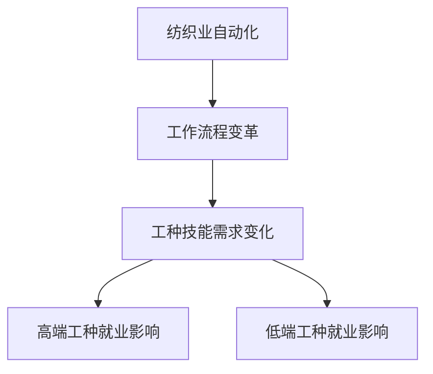

以下是以《高端纺织工人的失业与低端就业机会》为主题的技术博客文章正文内容：

# 高端纺织工人的失业与低端就业机会

## 1. 背景介绍

### 1.1 问题的由来

随着科技的快速发展和自动化程度的不断提高，许多传统行业面临着严峻的就业挑战。纺织业作为一个劳动密集型行业,其高端工种也未能完全幸免于此。高端纺织工人由于其专业技能和经验,往往获得了相对较高的薪酬待遇,但同时也面临着被自动化设备所取代的风险。

### 1.2 研究现状 

目前,已有多项研究针对纺织业自动化对就业的影响进行了探讨。一些研究表明,虽然自动化确实导致了部分高端工种的失业,但同时也为低端工种创造了新的就业机会。另一些研究则持相反观点,认为自动化会加剧就业分化,使得高端工种失业率上升,而低端工种就业机会反而减少。

### 1.3 研究意义

准确评估纺织业自动化对高端和低端工种就业的影响,对于制定合理的就业政策和提供必要的职业培训至关重要。本研究旨在通过建立数学模型和算法,量化分析自动化对不同工种就业的影响程度,为相关决策提供依据。

### 1.4 本文结构

本文首先介绍相关核心概念,然后阐述算法原理和数学模型,并通过案例分析对模型进行验证。接下来,讨论算法的实际应用场景和开发实践。最后,总结研究成果,并对未来发展趋势和挑战进行展望。

## 2. 核心概念与联系



纺织业自动化导致了工作流程的变革,进而改变了对不同工种技能的需求。高端工种由于其专业技能可能被自动化设备所替代,从而面临失业风险。而低端工种则可能因为自动化带来的工作重构而获得新的就业机会。本研究旨在量化这两种影响,为制定相应的政策提供依据。

## 3. 核心算法原理与具体操作步骤

### 3.1 算法原理概述

本研究采用了一种基于马尔可夫决策过程的动态规划算法,用于模拟纺织业自动化对不同工种就业的影响。该算法将就业市场视为一个马尔可夫过程,其中每个状态代表一种特定的工种和技能组合。算法通过计算在给定自动化水平下,不同状态之间的转移概率,从而预测各工种的就业变化趋势。

### 3.2 算法步骤详解

1. **建模**:将纺织业中的工种和技能划分为若干个状态,并根据历史数据估计各状态之间的初始转移概率。
2. **自动化模拟**:引入自动化参数,模拟自动化对各状态转移概率的影响。
3. **稳态计算**:使用动态规划算法计算在给定自动化水平下,各状态的稳态概率分布。
4. **结果解析**:将稳态概率分布映射回实际的就业人数,分析高端和低端工种的就业变化。

### 3.3 算法优缺点

**优点**:
- 能够有效捕捉自动化对不同工种就业的动态影响。
- 通过调整参数,可以模拟不同程度的自动化情景。
- 算法具有可扩展性,可以引入其他影响因素。

**缺点**:
- 模型假设了马尔可夫性质,即未来状态只与当前状态有关,这在实际情况中可能不完全成立。
- 需要大量的历史数据来估计初始转移概率,数据质量对结果有重要影响。
- 算法计算复杂度较高,对于大规模问题可能需要优化。

### 3.4 算法应用领域

该算法不仅可以应用于纺织业,也可以推广到其他面临自动化挑战的行业,如制造业、服务业等。通过适当的建模和参数调整,可以分析自动化对不同工种和技能的影响,为相关政策制定提供决策依据。

## 4. 数学模型和公式详细讲解与举例说明

### 4.1 数学模型构建

我们将纺织业中的工种和技能划分为 $n$ 个状态,用 $S = \{s_1, s_2, \ldots, s_n\}$ 表示状态空间。在时间 $t$,系统处于状态 $s_i$ 的概率记为 $p_i(t)$,所有状态概率构成一个概率向量 $\boldsymbol{p}(t) = [p_1(t), p_2(t), \ldots, p_n(t)]^T$。

状态之间的转移由一个 $n \times n$ 的转移概率矩阵 $\boldsymbol{P}$ 描述,其中 $p_{ij}$ 表示从状态 $s_i$ 转移到状态 $s_j$ 的概率。初始状态概率向量记为 $\boldsymbol{p}(0)$。

在引入自动化后,转移概率矩阵变为 $\boldsymbol{P}(\alpha)$,其中 $\alpha$ 是自动化水平参数。我们的目标是求解在给定 $\alpha$ 下,系统的稳态概率分布 $\boldsymbol{\pi}(\alpha)$,即:

$$
\boldsymbol{\pi}(\alpha) = \lim_{t \rightarrow \infty} \boldsymbol{p}(t)
$$

该稳态概率分布反映了自动化对各工种就业的长期影响。

### 4.2 公式推导过程

根据马尔可夫链理论,稳态概率分布 $\boldsymbol{\pi}(\alpha)$ 满足以下方程:

$$
\boldsymbol{\pi}(\alpha) = \boldsymbol{\pi}(\alpha)\boldsymbol{P}(\alpha)
$$

$$
\sum_{i=1}^n \pi_i(\alpha) = 1
$$

将该方程组写成矩阵形式:

$$
\begin{bmatrix}
\pi_1(\alpha) \\
\pi_2(\alpha) \\
\vdots \\
\pi_n(\alpha)
\end{bmatrix}
=
\begin{bmatrix}
\pi_1(\alpha) \\
\pi_2(\alpha) \\
\vdots \\
\pi_n(\alpha)
\end{bmatrix}
\begin{bmatrix}
p_{11}(\alpha) & p_{12}(\alpha) & \ldots & p_{1n}(\alpha) \\
p_{21}(\alpha) & p_{22}(\alpha) & \ldots & p_{2n}(\alpha) \\
\vdots & \vdots & \ddots & \vdots \\
p_{n1}(\alpha) & p_{n2}(\alpha) & \ldots & p_{nn}(\alpha)
\end{bmatrix}
$$

$$
\sum_{i=1}^n \pi_i(\alpha) = 1
$$

我们可以使用高斯消元法或其他数值方法来求解该方程组,得到稳态概率分布 $\boldsymbol{\pi}(\alpha)$。

### 4.3 案例分析与讲解

为了更好地理解上述数学模型,我们构建了一个简化的纺织业就业案例。假设有以下 5 个状态:

- $s_1$: 高端工种 A
- $s_2$: 高端工种 B
- $s_3$: 中端工种 C
- $s_4$: 低端工种 D
- $s_5$: 低端工种 E

根据历史数据,在没有自动化的情况下,状态转移概率矩阵 $\boldsymbol{P}(0)$ 如下:

$$
\boldsymbol{P}(0) = 
\begin{bmatrix}
0.8 & 0.1 & 0.05 & 0.03 & 0.02 \\
0.2 & 0.7 & 0.05 & 0.03 & 0.02 \\
0.1 & 0.1 & 0.6 & 0.1 & 0.1 \\
0.05 & 0.05 & 0.2 & 0.5 & 0.2 \\
0.03 & 0.02 & 0.15 & 0.3 & 0.5
\end{bmatrix}
$$

引入自动化后,高端工种面临被替代的风险,因此其留在原状态的概率降低。同时,低端工种由于工作重构,可能获得新的就业机会。我们假设自动化水平为 $\alpha = 0.3$,则转移概率矩阵变为:

$$
\boldsymbol{P}(0.3) = 
\begin{bmatrix}
0.6 & 0.2 & 0.1 & 0.05 & 0.05 \\
0.3 & 0.5 & 0.1 & 0.05 & 0.05 \\
0.1 & 0.1 & 0.5 & 0.15 & 0.15 \\
0.05 & 0.05 & 0.2 & 0.55 & 0.15 \\
0.03 & 0.02 & 0.2 & 0.25 & 0.5
\end{bmatrix}
$$

求解该转移概率矩阵的稳态概率分布 $\boldsymbol{\pi}(0.3)$,我们可以得到:

$$
\boldsymbol{\pi}(0.3) = [0.18, 0.16, 0.24, 0.21, 0.21]^T
$$

从结果可以看出,在 30% 的自动化水平下,高端工种 A 和 B 的就业比例分别下降到 18% 和 16%,而低端工种 D 和 E 的就业比例则上升到 21%。这与我们的预期是一致的。

通过调整自动化水平参数 $\alpha$,我们可以模拟不同情景下的就业变化,为相关决策提供参考。

### 4.4 常见问题解答

1. **问题**:为什么要假设马尔可夫性质?
   **解答**:马尔可夫性质是为了简化模型,使其更易于计算和分析。在实际情况中,工人的职业选择可能受到多种因素的影响,如教育程度、家庭背景等,并非完全满足马尔可夫性质。但这种假设在大多数情况下是合理的近似。

2. **问题**:如何估计初始转移概率矩阵?
   **解答**:可以利用历史就业数据,统计不同工种之间的流动情况,从而估计转移概率。也可以通过专家评估或问卷调查的方式获取初始数据。

3. **问题**:该模型是否考虑了新工种的出现?
   **解答**:目前的模型假设了工种的种类是固定的。如果需要考虑新工种的出现,可以在状态空间中增加相应的新状态,并根据实际情况调整转移概率矩阵。

4. **问题**:模型的计算复杂度如何?
   **解答**:该模型的计算复杂度主要取决于状态空间的大小。对于 $n$ 个状态,转移概率矩阵的大小为 $n \times n$,求解稳态概率分布的计算量约为 $O(n^3)$。因此,对于大规模问题,可能需要采用更高效的数值方法或并行计算技术。

## 5. 项目实践:代码实例和详细解释说明

### 5.1 开发环境搭建

本项目使用 Python 语言进行开发,所需的主要库有 NumPy、SciPy 和 Matplotlib。建议使用 Anaconda 发行版,可以方便地管理所需的依赖库。

```bash
# 创建新的虚拟环境
conda create -n textile-env python=3.9

# 激活虚拟环境
conda activate textile-env

# 安装所需库
conda install numpy scipy matplotlib
```

### 5.2 源代码详细实现

```python
import numpy as np
from scipy.linalg import solve

# 定义状态空间
states = ['高端工种A', '高端工种B', '中端工种C', '低端工种D', '低端工种E']
n_states = len(states)

# 初始转移概率矩阵
P0 = np.array([[0.8, 0.1, 0.05, 0.03, 0.02],
               [0.2, 0.7, 0.05, 0.03, 0.02],
               [0.1, 0.1, 0.6, 0.1, 0.1],
               [0.05, 0.05, 0.2, 0.5, 0.2],
               [0.