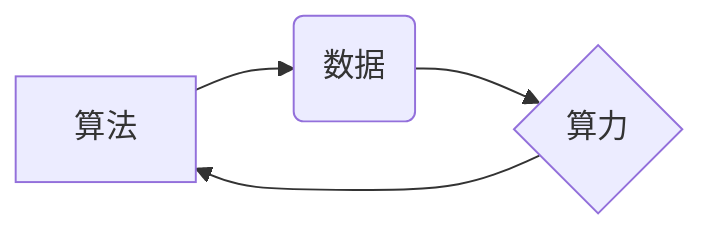

> 人工智能 (AI)
> 算法
> 算力
> 数据
> 深度学习
> 机器学习
> 自然语言处理

## 1. 背景介绍

人工智能 (AI) 作为一项前沿科技，近年来发展迅速，已渗透到各个领域，深刻地改变着人们的生活方式和工作模式。从自动驾驶汽车到智能语音助手，从医疗诊断到金融风险控制，AI 的应用场景日益广泛。

AI 的发展离不开三大支柱：算法、算力和数据。这三大要素相互依存、相互促进，共同推动着 AI 技术的进步。

## 2. 核心概念与联系

**2.1 算法**

算法是 AI 系统的核心，它定义了 AI 系统如何从数据中学习、推理和做出决策。不同的算法适用于不同的任务，例如：

* **监督学习算法:** 利用标记数据训练模型，例如分类、回归等。
* **无监督学习算法:** 从未标记数据中发现模式和结构，例如聚类、降维等。
* **强化学习算法:** 通过试错学习，在环境中获得最大奖励，例如游戏 AI、机器人控制等。

**2.2 算力**

算力是指计算机处理数据的速度和能力。AI 算法的训练和推理都需要大量的计算资源，因此算力是 AI 发展的重要保障。随着摩尔定律的放缓，传统 CPU 的计算能力已经难以满足 AI 需求，GPU、TPU 等专用芯片应运而生，大幅提升了 AI 训练和推理的速度。

**2.3 数据**

数据是 AI 发展的基石，是算法训练和优化的燃料。高质量的数据可以帮助 AI 模型更好地理解世界，提高预测和决策的准确性。数据类型包括文本、图像、音频、视频等，需要经过清洗、预处理等步骤才能用于 AI 训练。

**2.4 三大支柱的联系**

算法、算力和数据相互依存，共同构成了 AI 的发展基础。

* 算法需要数据进行训练和优化，而数据需要算法进行分析和处理。
* 算力是算法训练和推理的执行引擎，数据量越大，算力需求越高。
* 数据质量直接影响算法的性能，高质量的数据可以训练出更准确、更可靠的 AI 模型。

**Mermaid 流程图**



## 3. 核心算法原理 & 具体操作步骤

### 3.1  算法原理概述

深度学习算法是一种基于多层神经网络的机器学习算法，能够自动从数据中学习特征，并进行复杂的模式识别和预测。

深度学习算法的核心是神经网络，它由多个层级的神经元组成，每个神经元接收来自上一层的输入，并通过激活函数进行处理，输出到下一层。通过多层神经网络的叠加，深度学习算法能够学习到数据中的抽象特征，从而实现更复杂的模式识别和预测。

### 3.2  算法步骤详解

1. **数据预处理:** 将原始数据进行清洗、转换、归一化等处理，使其适合深度学习算法的训练。
2. **网络结构设计:** 根据任务需求设计神经网络的结构，包括层数、神经元数量、激活函数等。
3. **模型训练:** 使用训练数据训练神经网络模型，通过反向传播算法调整模型参数，使模型的预测结果与真实值尽可能接近。
4. **模型评估:** 使用测试数据评估模型的性能，例如准确率、召回率、F1-score等。
5. **模型调优:** 根据评估结果，调整模型参数或网络结构，进一步提高模型性能。
6. **模型部署:** 将训练好的模型部署到实际应用场景中，用于预测和决策。

### 3.3  算法优缺点

**优点:**

* 能够自动学习数据中的特征，无需人工特征工程。
* 能够处理复杂的数据模式，实现更准确的预测和决策。
* 在图像识别、自然语言处理等领域取得了突破性进展。

**缺点:**

* 训练深度学习模型需要大量的计算资源和时间。
* 深度学习模型的解释性较差，难以理解模型的决策过程。
* 深度学习模型对数据质量要求较高，数据偏差会影响模型性能。

### 3.4  算法应用领域

深度学习算法已广泛应用于各个领域，例如：

* **计算机视觉:** 图像识别、目标检测、图像分割、人脸识别等。
* **自然语言处理:** 文本分类、情感分析、机器翻译、对话系统等。
* **语音识别:** 语音转文本、语音助手等。
* **医疗诊断:** 病理图像分析、疾病预测等。
* **金融风险控制:** 欺诈检测、信用评分等。

## 4. 数学模型和公式 & 详细讲解 & 举例说明

### 4.1  数学模型构建

深度学习算法的核心是神经网络，其数学模型可以表示为多层感知机 (MLP)。

**MLP 模型结构:**

```
输入层 -> 隐藏层1 -> 隐藏层2 -> ... -> 隐藏层n -> 输出层
```

每个神经元接收来自上一层的输入，并通过激活函数进行处理，输出到下一层。

**激活函数:**

激活函数的作用是引入非线性，使神经网络能够学习复杂的模式。常见的激活函数包括 sigmoid 函数、ReLU 函数、tanh 函数等。

### 4.2  公式推导过程

**损失函数:**

损失函数用于衡量模型预测结果与真实值的差距。常见的损失函数包括均方误差 (MSE)、交叉熵损失 (Cross-Entropy Loss) 等。

**反向传播算法:**

反向传播算法用于更新模型参数，使其能够最小化损失函数。

**梯度下降:**

梯度下降是一种优化算法，用于更新模型参数。

### 4.3  案例分析与讲解

**举例说明:**

假设我们有一个二分类问题，需要判断图像是否包含猫。我们可以使用深度学习算法训练一个分类模型。

1. **数据预处理:** 将图像数据进行裁剪、缩放、归一化等处理。
2. **网络结构设计:** 设计一个包含多层神经网络的分类模型。
3. **模型训练:** 使用训练数据训练模型，并使用交叉熵损失函数和梯度下降算法更新模型参数。
4. **模型评估:** 使用测试数据评估模型的准确率。
5. **模型调优:** 根据评估结果，调整模型参数或网络结构，进一步提高模型性能。

## 5. 项目实践：代码实例和详细解释说明

### 5.1  开发环境搭建

* **操作系统:** Ubuntu 20.04
* **编程语言:** Python 3.8
* **深度学习框架:** TensorFlow 2.0
* **GPU:** NVIDIA GeForce RTX 3080

### 5.2  源代码详细实现

```python
import tensorflow as tf

# 定义模型结构
model = tf.keras.models.Sequential([
    tf.keras.layers.Conv2D(32, (3, 3), activation='relu', input_shape=(28, 28, 1)),
    tf.keras.layers.MaxPooling2D((2, 2)),
    tf.keras.layers.Conv2D(64, (3, 3), activation='relu'),
    tf.keras.layers.MaxPooling2D((2, 2)),
    tf.keras.layers.Flatten(),
    tf.keras.layers.Dense(10, activation='softmax')
])

# 定义损失函数和优化器
model.compile(loss='sparse_categorical_crossentropy',
              optimizer='adam',
              metrics=['accuracy'])

# 训练模型
model.fit(x_train, y_train, epochs=10)

# 评估模型
loss, accuracy = model.evaluate(x_test, y_test)
print('Test loss:', loss)
print('Test accuracy:', accuracy)
```

### 5.3  代码解读与分析

* **模型结构:** 代码定义了一个包含卷积层、池化层和全连接层的深度学习模型。卷积层用于提取图像特征，池化层用于降低特征维度，全连接层用于分类。
* **损失函数和优化器:** 使用交叉熵损失函数和 Adam 优化器训练模型。交叉熵损失函数用于二分类问题，Adam 优化器是一种常用的优化算法。
* **训练模型:** 使用训练数据训练模型，并设置训练轮数为 10。
* **评估模型:** 使用测试数据评估模型的性能，并打印测试损失和准确率。

### 5.4  运行结果展示

训练完成后，模型的准确率通常会达到较高的水平。

## 6. 实际应用场景

### 6.1  图像识别

深度学习算法在图像识别领域取得了突破性进展，例如：

* **人脸识别:** 用于身份验证、人脸搜索等应用。
* **物体检测:** 用于自动驾驶、安防监控等应用。
* **图像分类:** 用于医疗诊断、产品分类等应用。

### 6.2  自然语言处理

深度学习算法在自然语言处理领域也取得了显著成果，例如：

* **机器翻译:** 将一种语言翻译成另一种语言。
* **文本摘要:** 自动生成文本的摘要。
* **情感分析:** 分析文本的情感倾向。

### 6.3  语音识别

深度学习算法在语音识别领域也取得了重要进展，例如：

* **语音转文本:** 将语音转换为文本。
* **语音助手:** 例如 Siri、Alexa 等。

### 6.4  未来应用展望

随着 AI 技术的不断发展，深度学习算法将在更多领域得到应用，例如：

* **个性化推荐:** 根据用户的兴趣和行为推荐个性化内容。
* **自动写作:** 自动生成文章、故事等文本内容。
* **医疗诊断辅助:** 辅助医生进行疾病诊断。

## 7. 工具和资源推荐

### 7.1  学习资源推荐

* **书籍:**
    * 深度学习 (Deep Learning) - Ian Goodfellow, Yoshua Bengio, Aaron Courville
    * 构建深度学习模型 (Hands-On Machine Learning with Scikit-Learn, Keras & TensorFlow) - Aurélien Géron
* **在线课程:**
    * Coursera: 深度学习 Specialization
    * Udacity: 深度学习 Nanodegree
    * fast.ai: 深度学习课程

### 7.2  开发工具推荐

* **深度学习框架:** TensorFlow, PyTorch, Keras
* **数据处理工具:** Pandas, NumPy
* **可视化工具:** Matplotlib, Seaborn

### 7.3  相关论文推荐

* **ImageNet Classification with Deep Convolutional Neural Networks** - Alex Krizhevsky, Ilya Sutskever, Geoffrey E. Hinton
* **Attention Is All You Need** - Ashish Vaswani, Noam Shazeer, Niki Parmar, Jakob Uszkoreit, Llion Jones, Aidan N. Gomez, Łukasz Kaiser, Illia Polosukhin

## 8. 总结：未来发展趋势与挑战

### 8.1  研究成果总结

深度学习算法取得了显著的成果，在图像识别、自然语言处理、语音识别等领域取得了突破性进展。

### 8.2  未来发展趋势

* **模型规模和效率:** 继续追求更大规模、更高效的深度学习模型。
* **数据增强和泛化能力:** 研究新的数据增强方法，提高模型的泛化能力。
* **解释性和可解释性:** 研究深度学习模型的解释性和可解释性，提高模型的透明度和信任度。
* **边缘计算和部署:** 将深度学习模型部署到边缘设备，实现更低延迟和更高效率的应用。

### 8.3  面临的挑战

* **数据获取和隐私保护:** 深度学习算法对数据依赖性强，数据获取和隐私保护是重要的挑战。
* **计算资源和能源消耗:** 训练大型深度学习模型需要大量的计算资源和能源，如何降低能源消耗是重要的研究方向。
* **模型安全性与鲁棒性:** 深度学习模型容易受到攻击和对抗样本的影响，如何提高模型的安全性与鲁棒性是重要的挑战。

### 8.4  研究展望

未来，深度学习算法将继续发展，在更多领域发挥重要作用。研究人员将继续探索新的算法、模型和应用场景，推动 AI 技术的进步。

## 9. 附录：常见问题与解答

**常见问题:**

* **什么是深度学习？**

深度学习是一种基于多层神经网络的机器学习算法，能够自动学习数据中的特征，并进行复杂的模式识别和预测。

* **深度学习算法有哪些？**

常见的深度学习算法包括卷积神经网络 (CNN)、循环神经网络 (RNN)、生成对抗网络 (GAN) 等。

* **如何训练深度学习模型？**

训练深度学习模型需要使用训练数据，并使用反向传播算法更新模型参数，使其能够最小化损失函数。

* **如何评估深度学习模型的性能？**

可以使用测试数据评估模型的性能，常用的指标包括准确率、召回率、F1-score 等。

**解答:**

* **深度学习是一种强大的机器学习算法，能够解决许多复杂问题，但它也需要大量的计算资源和数据。**
* **选择合适的深度学习算法和模型结构取决于具体的应用场景。**
* **训练深度学习模型是一个迭代的过程，需要不断调整模型参数和训练策略。**
* **评估深度学习模型的性能需要使用合适的指标，并进行综合分析。**


作者：禅与计算机程序设计艺术 / Zen and the Art of Computer Programming 
<end_of_turn>