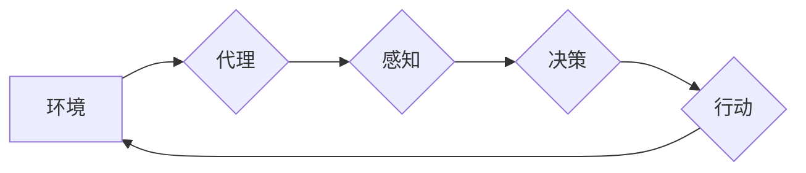

> AI系统,代理技术,智能体,决策,环境交互,多智能体系统,强化学习

## 1. 背景介绍

在人工智能 (AI) 的快速发展过程中，代理技术作为一种重要的技术手段，在构建智能系统中扮演着越来越重要的角色。代理技术旨在模拟人类或其他智能体的行为，使其能够感知环境、做出决策并与环境进行交互。随着 AI 系统的复杂性不断提高，代理技术也逐渐成为构建复杂智能系统的关键技术之一。

传统的 AI 系统通常以规则或模型驱动的形式进行设计，但这种方式在面对复杂、动态的环境时往往表现出局限性。代理技术则提供了一种更加灵活和适应性的解决方案。通过将 AI 系统分解为多个独立的代理，每个代理都拥有自己的感知、决策和行动能力，可以更好地应对复杂环境的挑战。

## 2. 核心概念与联系

**2.1 代理的概念**

在代理技术中，代理是指能够感知环境、做出决策并与环境交互的软件实体。代理可以是独立的个体，也可以是多个代理组成的群体。代理的目标通常是最大化自身的利益或完成特定的任务。

**2.2 环境的概念**

环境是指代理所处的外部世界，包括代理可以感知到的信息和代理可以采取行动的影响范围。环境可以是物理世界，也可以是虚拟世界，例如游戏环境或网络环境。

**2.3 代理与环境的交互**

代理与环境的交互是代理技术的核心环节。代理通过感知环境中的信息，并根据自己的目标和策略做出决策，然后采取行动影响环境。这种交互过程是循环往复的，代理不断地感知、决策和行动，从而与环境进行动态的交互。

**2.4 代理的类型**

代理可以根据不同的分类标准进行划分，例如：

* **根据代理的感知能力:** 
    * **完全感知代理:** 可以感知环境中所有相关信息。
    * **部分感知代理:** 只能感知环境中的一部分信息。
* **根据代理的决策能力:**
    * **确定性代理:** 对于给定的环境状态，总是做出相同的决策。
    * **随机代理:** 对于给定的环境状态，可能会做出不同的决策。
* **根据代理的行动能力:**
    * **有限行动代理:** 只能采取有限数量的行动。
    * **无限行动代理:** 可以采取无限数量的行动。

**2.5 代理技术与其他技术的联系**

代理技术与许多其他 AI 技术密切相关，例如：

* **机器学习:** 代理可以利用机器学习算法从环境中学习，不断改进自己的决策策略。
* **强化学习:** 强化学习是一种专门用于训练代理的机器学习算法，代理通过与环境交互，获得奖励或惩罚，从而学习最优的行动策略。
* **多智能体系统:** 多智能体系统由多个代理组成，代理之间可以相互通信和合作，共同完成任务。

**2.6 Mermaid 流程图**



## 3. 核心算法原理 & 具体操作步骤

### 3.1 算法原理概述

代理技术的核心算法原理是基于**状态机**和**决策策略**的。状态机描述了代理在不同环境状态下的行为，决策策略则决定了代理在每个状态下应该采取的行动。

**状态机:** 状态机是一种用于描述系统状态和状态转换的模型。代理的状态机包含多个状态和状态转换规则。每个状态代表代理在环境中的一种特定状态，状态转换规则则描述了代理在不同状态下如何根据环境信息做出决策并进行状态转换。

**决策策略:** 决策策略是代理做出决策的规则。决策策略可以是基于规则的，也可以是基于机器学习的。规则驱动的决策策略是事先定义好的规则，根据环境信息判断并选择相应的行动。机器学习驱动的决策策略则通过训练学习环境中的模式，并根据学习到的模式做出决策。

### 3.2 算法步骤详解

1. **环境感知:** 代理首先感知环境中的信息，例如传感器数据、网络流量等。
2. **状态转换:** 代理根据感知到的环境信息，将当前状态转换为下一个状态。
3. **决策选择:** 代理根据当前状态和决策策略，选择最优的行动。
4. **行动执行:** 代理执行选择的行动，并影响环境。
5. **反馈接收:** 代理接收环境的反馈信息，例如奖励或惩罚。
6. **学习更新:** 如果代理使用机器学习算法，则根据反馈信息更新决策策略。

### 3.3 算法优缺点

**优点:**

* **灵活性和适应性:** 代理技术可以灵活地适应不同的环境和任务需求。
* **可扩展性:** 代理可以独立运行，并且可以轻松地扩展成多智能体系统。
* **鲁棒性:** 代理可以容忍部分信息缺失或环境变化。

**缺点:**

* **复杂性:** 设计和实现代理系统可能比较复杂。
* **资源消耗:** 代理系统可能需要消耗大量的计算资源。
* **安全性:** 代理系统可能存在安全风险，例如被恶意攻击或滥用。

### 3.4 算法应用领域

代理技术在许多领域都有广泛的应用，例如：

* **机器人:** 代理技术可以用于控制机器人，使其能够感知环境、做出决策并执行任务。
* **游戏:** 代理技术可以用于开发游戏中的 AI 敌人，使其能够表现出更智能的行为。
* **金融:** 代理技术可以用于金融交易，例如自动交易和风险管理。
* **医疗:** 代理技术可以用于辅助医生诊断疾病和制定治疗方案。

## 4. 数学模型和公式 & 详细讲解 & 举例说明

### 4.1 数学模型构建

代理系统的行为可以抽象为一个马尔可夫决策过程 (MDP)。MDP 由以下几个要素组成：

* **状态空间 S:** 代理可能处于的所有状态的集合。
* **动作空间 A:** 代理在每个状态下可以采取的所有动作的集合。
* **转移概率 P(s', r | s, a):** 从状态 s 执行动作 a 到状态 s' 的概率，以及在该状态转移过程中获得的奖励 r。
* **奖励函数 R(s, a):** 代理在状态 s 执行动作 a 时获得的奖励。

### 4.2 公式推导过程

代理的目标是找到一个最优的策略 π(s)，该策略可以最大化代理在长期的奖励总和。最优策略可以通过动态规划算法或强化学习算法来求解。

**动态规划算法:**

动态规划算法可以用来求解 MDP 的最优策略。动态规划算法的基本思想是通过递归地计算每个状态的最优价值函数，然后根据最优价值函数来确定最优策略。

**强化学习算法:**

强化学习算法是一种基于试错的学习方法，代理通过与环境交互，获得奖励或惩罚，并根据这些奖励或惩罚来更新自己的策略。常见的强化学习算法包括 Q 学习算法和 SARSA 算法。

### 4.3 案例分析与讲解

**案例:** 一个机器人需要在迷宫中找到出口。

* **状态空间 S:** 迷宫中的所有位置。
* **动作空间 A:** 向上、向下、向左、向右四个方向移动。
* **转移概率 P(s', r | s, a):** 根据机器人执行的动作和迷宫的结构，计算机器人移动到下一个位置的概率，以及在该位置获得的奖励 (例如，到达出口获得最大奖励)。
* **奖励函数 R(s, a):** 如果机器人到达出口，则获得最大奖励；否则，获得较小的奖励。

可以使用强化学习算法训练机器人，使其能够学习最优的路径找到出口。

## 5. 项目实践：代码实例和详细解释说明

### 5.1 开发环境搭建

* **操作系统:** Linux 或 macOS
* **编程语言:** Python
* **库:** OpenAI Gym, TensorFlow 或 PyTorch

### 5.2 源代码详细实现

```python
import gym
import numpy as np
from tensorflow.keras.models import Sequential
from tensorflow.keras.layers import Dense, Flatten

# 创建环境
env = gym.make('CartPole-v1')

# 定义神经网络模型
model = Sequential()
model.add(Flatten(input_shape=env.observation_space.shape))
model.add(Dense(128, activation='relu'))
model.add(Dense(2, activation='softmax'))

# 编译模型
model.compile(loss='categorical_crossentropy', optimizer='adam')

# 训练模型
for episode in range(1000):
    state = env.reset()
    done = False
    total_reward = 0

    while not done:
        env.render()
        action = np.argmax(model.predict(state.reshape(1, -1)))
        next_state, reward, done, _ = env.step(action)
        total_reward += reward
        state = next_state

    print(f'Episode {episode+1}, Total Reward: {total_reward}')

# 保存模型
model.save('cartpole_model.h5')
```

### 5.3 代码解读与分析

* **环境创建:** 使用 OpenAI Gym 库创建 CartPole-v1 环境。
* **神经网络模型定义:** 使用 TensorFlow 库定义一个简单的深度神经网络模型，用于预测最佳动作。
* **模型编译:** 使用交叉熵损失函数和 Adam 优化器编译模型。
* **模型训练:** 使用强化学习算法训练模型，通过与环境交互，学习最优的策略。
* **模型保存:** 保存训练好的模型。

### 5.4 运行结果展示

训练完成后，模型能够控制 CartPole 持续一段时间，并获得较高的奖励。

## 6. 实际应用场景

### 6.1 智能机器人

代理技术可以用于控制智能机器人，使其能够感知环境、做出决策并执行任务。例如，在物流行业，代理技术可以用于控制自动导引车，使其能够在仓库中自动运输货物。

### 6.2 自动驾驶汽车

代理技术可以用于开发自动驾驶汽车，使其能够感知道路环境、做出驾驶决策并控制车辆行驶。

### 6.3 金融交易

代理技术可以用于金融交易，例如自动交易和风险管理。代理可以根据市场数据和交易策略，自动执行交易，并根据风险评估调整投资组合。

### 6.4 游戏 AI

代理技术可以用于开发游戏中的 AI 敌人，使其能够表现出更智能的行为。例如，在策略游戏，代理可以学习对手的策略，并制定相应的应对策略。

### 6.5 未来应用展望

随着人工智能技术的不断发展，代理技术将在更多领域得到应用，例如：

* **医疗保健:** 代理可以辅助医生诊断疾病、制定治疗方案和提供个性化医疗服务。
* **教育:** 代理可以作为个性化学习助手，根据学生的学习进度和需求提供定制化的学习内容和指导。
* **城市管理:** 代理可以用于优化交通流量、管理能源消耗和提高城市安全。

## 7. 工具和资源推荐

### 7.1 学习资源推荐

* **书籍:**
    * 《Reinforcement Learning: An Introduction》 by Richard S. Sutton and Andrew G. Barto
    * 《Artificial Intelligence: A Modern Approach》 by Stuart Russell and Peter Norvig
* **在线课程:**
    * Coursera: Reinforcement Learning Specialization
    * Udacity: Artificial Intelligence Nanodegree

### 7.2 开发工具推荐

* **OpenAI Gym:** 用于开发和测试强化学习算法的开源库。
* **TensorFlow:** 用于深度学习的开源库。
* **PyTorch:** 用于深度学习的开源库。

### 7.3 相关论文推荐

* **Deep Reinforcement Learning with Double Q-learning** by Hasselt et al. (2015)
* **Proximal Policy Optimization Algorithms** by Schulman et al. (2017)
* **Asynchronous Methods for Deep Reinforcement Learning** by Mnih et al. (2016)

## 8. 总结：未来发展趋势与挑战

### 8.1 研究成果总结

代理技术在人工智能领域取得了显著的进展，例如：

* 强化学习算法的不断发展，使得代理能够学习更复杂的策略。
* 多智能体系统的研究取得了突破，