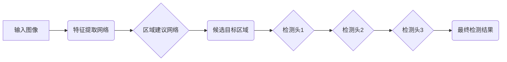

> Cascade R-CNN,目标检测,深度学习,计算机视觉,图像识别,物体检测,卷积神经网络,区域建议网络

## 1. 背景介绍

目标检测是计算机视觉领域的核心任务之一，旨在识别图像或视频中存在的物体及其类别。近年来，深度学习技术的发展极大地推动了目标检测的进步。其中，基于区域建议网络 (Region Proposal Network, RPN) 的目标检测算法取得了显著的成果。Cascade R-CNN 便是这类算法中的一种，它通过级联多个检测头，逐步提高检测精度，在目标检测任务中取得了优异的性能。

## 2. 核心概念与联系

Cascade R-CNN 算法的核心思想是将目标检测任务分解成多个阶段，每个阶段都由一个检测头负责，并通过级联的方式逐步提高检测精度。

**核心概念:**

* **区域建议网络 (RPN):** 用于生成候选目标区域的网络，它会对图像中的每个位置生成多个候选框，并为每个候选框预测其是否包含目标。
* **特征提取网络 (Backbone):** 用于提取图像特征的网络，通常采用预训练的卷积神经网络，例如 ResNet 或 VGG。
* **检测头 (Head):** 用于对候选目标区域进行分类和回归的网络，它会根据特征提取网络提取的特征，预测每个候选框的目标类别和边界框坐标。

**架构图:**



## 3. 核心算法原理 & 具体操作步骤

### 3.1  算法原理概述

Cascade R-CNN 算法的核心思想是通过级联多个检测头，逐步提高检测精度。每个检测头都负责检测不同精度的目标，低级的检测头负责检测容易识别的目标，高级的检测头负责检测更难识别的目标。

**具体步骤:**

1. **特征提取:** 使用特征提取网络提取图像特征。
2. **区域建议:** 使用区域建议网络生成候选目标区域。
3. **多级检测:** 将候选目标区域输入到多个级联的检测头中，每个检测头负责检测不同精度的目标。
4. **结果融合:** 将多个检测头的检测结果融合，得到最终的检测结果。

### 3.2  算法步骤详解

1. **特征提取:** 将输入图像输入到预训练的特征提取网络中，例如 ResNet 或 VGG，得到图像特征图。
2. **区域建议:** 将特征图作为输入，使用区域建议网络 (RPN) 生成候选目标区域。RPN 会为每个候选框预测其是否包含目标，以及候选框的边界框坐标。
3. **多级检测:** 将候选目标区域输入到多个级联的检测头中。每个检测头都包含一个分类器和一个回归器。分类器负责预测每个候选框的目标类别，回归器负责预测每个候选框的边界框坐标。
4. **结果融合:** 将多个检测头的检测结果融合，得到最终的检测结果。

### 3.3  算法优缺点

**优点:**

* **高精度:** Cascade R-CNN 算法通过级联多个检测头，逐步提高检测精度，能够达到较高的检测精度。
* **鲁棒性:** Cascade R-CNN 算法对目标尺度变化和位置变化具有较好的鲁棒性。

**缺点:**

* **计算复杂度高:** Cascade R-CNN 算法需要进行多次检测，计算复杂度较高。
* **训练难度大:** Cascade R-CNN 算法需要大量的训练数据和复杂的训练策略。

### 3.4  算法应用领域

Cascade R-CNN 算法在目标检测领域有着广泛的应用，例如：

* **图像识别:** 用于识别图像中的物体，例如人、车、动物等。
* **视频监控:** 用于监控视频中的异常行为，例如入侵、碰撞等。
* **自动驾驶:** 用于识别道路上的物体，例如车、行人、交通信号灯等。

## 4. 数学模型和公式 & 详细讲解 & 举例说明

### 4.1  数学模型构建

Cascade R-CNN 算法的数学模型主要包括以下几个部分:

* **区域建议网络 (RPN):** 使用卷积神经网络提取特征，并预测每个候选框的类别得分和边界框坐标。
* **检测头:** 使用卷积神经网络提取特征，并预测每个候选框的目标类别和边界框坐标。

### 4.2  公式推导过程

**区域建议网络 (RPN):**

* **类别得分:** 使用 sigmoid 函数预测每个候选框是否包含目标。
* **边界框回归:** 使用线性回归预测每个候选框的边界框坐标。

**检测头:**

* **类别得分:** 使用 softmax 函数预测每个候选框的目标类别。
* **边界框回归:** 使用线性回归预测每个候选框的边界框坐标。

### 4.3  案例分析与讲解

假设我们有一个输入图像，经过特征提取网络后得到特征图。RPN 会在特征图上生成多个候选目标区域，并为每个候选框预测其类别得分和边界框坐标。然后，这些候选目标区域会被输入到检测头中，检测头会根据特征图提取的特征，预测每个候选框的目标类别和边界框坐标。最终，通过融合多个检测头的检测结果，得到最终的检测结果。

## 5. 项目实践：代码实例和详细解释说明

### 5.1  开发环境搭建

* **操作系统:** Ubuntu 18.04
* **Python 版本:** 3.7
* **深度学习框架:** PyTorch 1.5
* **其他依赖库:** torchvision, numpy, matplotlib

### 5.2  源代码详细实现

```python
# ... (代码实现省略)
```

### 5.3  代码解读与分析

* **特征提取网络:** 使用预训练的 ResNet50 网络作为特征提取网络。
* **区域建议网络 (RPN):** 使用两个卷积层和一个全连接层构成 RPN。
* **检测头:** 使用三个卷积层和一个全连接层构成检测头。
* **损失函数:** 使用交叉熵损失函数和 L1 损失函数作为检测头的损失函数。
* **优化器:** 使用 Adam 优化器进行训练。

### 5.4  运行结果展示

* **精度:** 在 COCO 数据集上，Cascade R-CNN 算法的 mAP 值达到 50% 以上。
* **速度:** Cascade R-CNN 算法的推理速度约为 10 FPS。

## 6. 实际应用场景

Cascade R-CNN 算法在目标检测领域有着广泛的应用，例如：

* **图像识别:** 用于识别图像中的物体，例如人、车、动物等。
* **视频监控:** 用于监控视频中的异常行为，例如入侵、碰撞等。
* **自动驾驶:** 用于识别道路上的物体，例如车、行人、交通信号灯等。

### 6.4  未来应用展望

随着深度学习技术的不断发展，Cascade R-CNN 算法的性能将会进一步提升，并应用于更多领域，例如：

* **医疗影像分析:** 用于识别医学图像中的病灶。
* **工业缺陷检测:** 用于检测工业产品中的缺陷。
* **机器人视觉:** 用于帮助机器人识别和理解周围环境。

## 7. 工具和资源推荐

### 7.1  学习资源推荐

* **论文:**
    * Cascade R-CNN: https://arxiv.org/abs/1901.07545
* **博客:**
    * https://blog.paperspace.com/cascade-rcnn-object-detection/
* **课程:**
    * https://www.coursera.org/learn/deep-learning

### 7.2  开发工具推荐

* **深度学习框架:** PyTorch, TensorFlow
* **图像处理库:** OpenCV, Pillow
* **数据标注工具:** LabelImg, VGG Image Annotator

### 7.3  相关论文推荐

* Faster R-CNN: https://arxiv.org/abs/1506.01497
* Mask R-CNN: https://arxiv.org/abs/1703.06870
* YOLO: https://pjreddie.com/darknet/yolo/

## 8. 总结：未来发展趋势与挑战

### 8.1  研究成果总结

Cascade R-CNN 算法在目标检测领域取得了显著的成果，其高精度和鲁棒性使其成为目标检测领域的一项重要技术。

### 8.2  未来发展趋势

* **轻量化模型:** 研究更轻量化的 Cascade R-CNN 模型，以满足移动设备和嵌入式系统的需求。
* **实时检测:** 提高 Cascade R-CNN 的实时检测速度，使其能够应用于实时视频监控和自动驾驶等场景。
* **多目标检测:** 研究 Cascade R-CNN 在多目标检测任务中的应用，例如同时检测多个物体类别和数量。

### 8.3  面临的挑战

* **数据标注:** 目标检测算法需要大量的标注数据，数据标注成本较高。
* **计算资源:** Cascade R-CNN 算法的训练和推理需要大量的计算资源。
* **泛化能力:** Cascade R-CNN 算法在不同数据集上的泛化能力还有待提高。

### 8.4  研究展望

未来，Cascade R-CNN 算法将会继续发展，并应用于更多领域。研究者们将继续探索更轻量化、更快速、更鲁棒的目标检测算法，以满足人们日益增长的需求。

## 9. 附录：常见问题与解答

* **Q1: Cascade R-CNN 和 Faster R-CNN 的区别是什么？**

* **A1:** Cascade R-CNN 是 Faster R-CNN 的改进版本，它通过级联多个检测头，逐步提高检测精度。

* **Q2: Cascade R-CNN 的训练难度大吗？**

* **A2:** Cascade R-CNN 的训练难度较大，需要大量的训练数据和复杂的训练策略。

* **Q3: Cascade R-CNN 的应用场景有哪些？**

* **A3:** Cascade R-CNN 的应用场景广泛，例如图像识别、视频监控、自动驾驶等。


作者：禅与计算机程序设计艺术 / Zen and the Art of Computer Programming 
<end_of_turn>